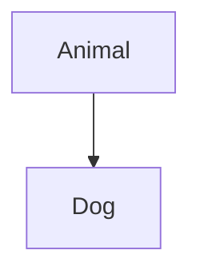
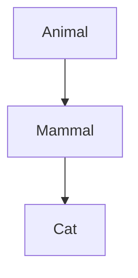
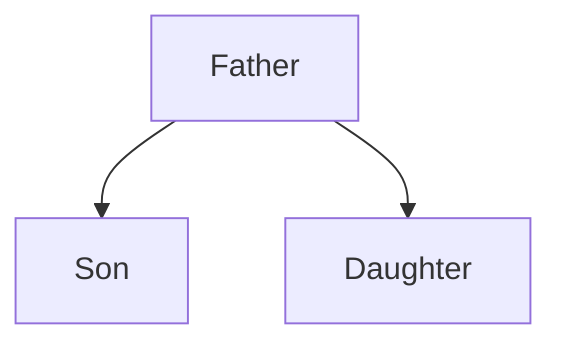

<div class="flex flex-col justify-center items-center h-full" style="background: #ffffff;">
  <p style="color: #5eada0; font-size: 1rem; font-weight: 600; letter-spacing: 0.2em; text-transform: uppercase; margin-bottom: 1.2rem;">
    Java Programming Masterclass
  </p>
  <h1 style="color: #1a5c5c; font-size: 3.8rem; font-weight: 900; line-height: 1.15; margin-bottom: 1.5rem;">
    繼承與多型
  </h1>
  <div style="height: 4px; width: 320px; background: linear-gradient(90deg, #5eada0, #a7d9d0); border-radius: 2px; margin-bottom: 1.5rem;"></div>
  <p style="color: #4a7c7c; font-size: 1.15rem; font-style: italic;">
    「程式碼的重生與演化」
  </p>
  <Link to="home" style="color: #9dc4c4; font-size: 0.85rem; margin-top: 2rem; text-decoration: none; letter-spacing: 0.05em;">← 返回目錄</Link>
</div>

---
layout: default
---

# Outline

- **第一部分：繼承 (Inheritance) 的深層機制**
- **第二部分：存取控制與成員管理 (protected & super)**
- **第三部分：繼承結構與類型 (Hierarchy)**
- **第四部分：IS-A 與 HAS-A 關係分析**
- **第五部分：方法改寫 (Override) 的嚴格定義**
- **第六部分：多型 (Polymorphism) 與動態繫結**
- **第七部分：類型轉換 (Casting) 的風險與實踐**
- **第八部分：巢狀類別 (Nested Classes) 的三種形式**

---
layout: section
class: flex flex-col justify-center items-center text-center
---

# 第一部分
# 繼承的基本概念

---
layout: default
---

# 什麼是繼承 (Inheritance)？

繼承允許子類別獲得父類別的屬性與方法，避免重複開發。

- **父類別 (Super class)**：定義共通特徵。
- **子類別 (Subclass)**：繼承並擴充父類別。

```java
class Animal {
    String name;
    void eat() { System.out.println(name + " 正在吃東西..."); }
}

class Dog extends Animal {
    void bark() { System.out.println(name + " 正在叫..."); }
}
```

---

# 繼承的語法與規則

| 規則項目 | 內容說明 |
| --- | --- |
| 關鍵字 | 使用 `extends` 連接父類別。 |
| 成員繼承 | 子類別自動獲得父類別的非 `private` 成員。 |
| 重用性 | 直接引用已有的屬性與方法，減少錯誤。 |

```java
public class Main {
    public static void main(String[] args) {
        Dog dog = new Dog();
        dog.name = "Haly";
        dog.eat();  // 繼承自 Animal
        dog.bark(); // Dog 自有方法
    }
}
```

---

# 觀察父類別建構子的啟動

當建立子類別物件時，Java 會先執行父類別的建構子。

```java
class Animal {
    Animal() { System.out.println("執行 Animal 建構方法..."); }
}

class Dog extends Animal {
    Dog() { System.out.println("執行 Dog 建構方法..."); }
}

// 輸出順序：
// 1. 執行 Animal 建構方法...
// 2. 執行 Dog 建構方法...
```

---
layout: section
class: flex flex-col justify-center items-center text-center
---

# 第二部分
# 存取控制與成員管理

---
layout: default
---

# 存取修飾符：protected

`protected` 是專門為繼承設計的存取等級。

| 存取權限 | 同類別 | 同套件 | 子類別 | 其他套件 |
| --- | --- | --- | --- | --- |
| `public` | ✅ | ✅ | ✅ | ✅ |
| `protected` | ✅ | ✅ | ✅ | ❌ |
| `private` | ✅ | ❌ | ❌ | ❌ |

<div class="mt-4 p-3 bg-blue-50 border-l-4 border-blue-400 text-gray-700 text-sm text-left">
💡 <b>核心價值：</b> 允許子類別直接存取父類別成員，而不必對外開放 (public)。
</div>

---

# super 關鍵字的使用

`super` 用於指涉直接父類別的成員。

| 用法 | 說明 |
| --- | --- |
| `super()` | 呼叫父類別建構子（必須在子類別建構子第一行）。 |
| `super.member` | 存取父類別的變數或方法。 |

```java
class Dog extends Animal {
    Dog(String name) {
        super(name); // 呼叫父類別有參建構子
    }
}
```

---

# 成員變數的遮蔽 (Shadowing)

如果子類別定義了與父類別同名的變數，父類別變數會被遮蔽。

```java
class Father { protected int x = 50; }

class Son extends Father {
    protected int x = 100;
    
    void printX() {
        System.out.println("子類別 x : " + x);        // 100
        System.out.println("父類別 x : " + super.x);  // 50
    }
}
```

---
layout: section
class: flex flex-col justify-center items-center text-center
---

# 第三部分
# 繼承結構與類型

---
layout: default
---

# 單一繼承 (Single Inheritance)

Java **不支援多重繼承** (即一個類別同時繼承多個父類別)，以避免複雜性。



```java
// 正確
class Dog extends Animal { ... }

// 錯誤！Java 不支援
// class Dog extends Animal, Mammal { ... }
```

---

# 多層次繼承 (Multi-Level Inheritance)

子類別可以作為另一個類別的父類別。



```java
class Animal { ... }
class Mammal extends Animal { ... }
class Cat extends Mammal { ... }
```

---

# 多層次繼承 — 範例

```java
class Animal { void eat() { ... } }
class Mammal extends Animal { String favoriteFood; }
class Cat extends Mammal {
    void jumping() { 
        System.out.println(name + " 繼承了 Animal 和 Mammal 的內容");
    }
}
```

---

# 分層繼承 (Hierarchical Inheritance)

一個父類別擁有複數個子類別。



```java
class Father { ... }
class Son extends Father { ... }
class Daughter extends Father { ... }
```

---
layout: section
class: flex flex-col justify-center items-center text-center
---

# 第四部分
# IS-A 與 HAS-A 關係分析

---
layout: default
---

# IS-A 關係與 instanceof

IS-A 代表「是一種 (is a kind of)」的繼承關係。

- **檢測**：使用 `instanceof` 運算子。
- **語法**：`物件 instanceof 類別`。

```java
Animal a = new Bird();
System.out.println(a instanceof Bird);   // true
System.out.println(a instanceof Animal); // true
System.out.println(a instanceof Dog);    // false
```

---

# HAS-A 關係 (聚合與組合)

HAS-A 代表「擁有一個」，通常發生在類別包含另一個類別作為成員時。

- **聚合 (Aggregation)**：成員物件可獨立存在 (例如 Employee HAS-A HomeTown)。
- **組合 (Composition)**：成員物件生命週期受控於主體 (例如 Car HAS-A Engine)。

```java
class Car {
    private Engine engine = new Engine(); // 組合
}
```

---

# HAS-A 關係 — 範例

```java
class HomeTown {
    String city, state, country;
    // ... 建構子
}

class Employee {
    int id;
    String name;
    HomeTown hometown; // HAS-A 關係
    
    // 將 HomeTown 物件傳入作為成員
    Employee(int id, String name, HomeTown ht) {
        this.id = id;
        this.name = name;
        this.hometown = ht;
    }
}
```

---
layout: section
class: flex flex-col justify-center items-center text-center
---

# 第五部分
# 方法改寫 (Override)

---
layout: default
---

# 什麼是重新定義 (Override)？

子類別提供一個與父類別名稱、參數、回傳型別完全相同的方法。

| 檢查清單 | 規則 |
| --- | --- |
| 名稱與參數 | 必須完全一致。 |
| 回傳型別 | 必須相同或是其子類別 (Covariant Return Type)。 |
| 存取權限 | 子類別不得比父類別更嚴格 (例如 父 public 子不得為 protected)。 |

---

# @Override 註解

這是給編譯器的指令，用於確認該方法是否正確改寫了父類別方法。

```java
class Animal {
    void move() { System.out.println("動物可以活動"); }
}

class Cat extends Animal {
    @Override
    void move() { 
        System.out.println("貓可以走路和跳躍"); 
    }
}
```

---

# 不能重新定義的情境

某些方法被限制無法被子類別改寫。

| 限制關鍵字 | 原因說明 |
| --- | --- |
| `static` | 屬於類別而非物件，無法參與多型。 |
| `final` | 明確宣告該方法已是最終版本，不可更動。 |
| `private` | 子類別根本看不到，自然無法改寫。 |

---

# 不能重新定義 — 範例

```java
class Animal {
    public final void moving() {
        System.out.println("動物可以活動");
    }
}

class Cat extends Animal {
    // 錯誤！編譯失敗
    // public void moving() { ... } 
}
```

---
layout: section
class: flex flex-col justify-center items-center text-center
---

# 第六部分
# 多型 (Polymorphism)

---
layout: default
---

# 多型的核心概念

「一個介面，多種實現」。同一個方法呼叫會根據實際物件類型產生不同行為。

- **編譯時期多型**：方法多載 (Overload)。
- **執行時期多型**：方法改寫 (Override) + 向上轉型。

<div class="mt-4 p-3 bg-blue-50 border-l-4 border-blue-400 text-gray-700 text-sm text-left">
💡 <b>關鍵：</b> 使用父類別變數參考子類別物件。
</div>

---

# 多型範例：Bank 利率計算

```java
class Bank { double getRate() { return 0; } }

class FirstBank extends Bank { 
    double getRate() { return 1.05; } 
}

class SecondBank extends Bank { 
    double getRate() { return 1.1; } 
}

public class Main {
    public static void main(String[] args) {
        Bank b1 = new FirstBank();
        Bank b2 = new SecondBank();
        System.out.println(b1.getRate()); // 1.05
        System.out.println(b2.getRate()); // 1.1
    }
}
```

---

# 靜態繫結 vs 動態繫結

Java 決定呼叫哪個方法的連結過程稱為繫結 (Binding)。

| 繫結類型 | 時機 | 對象 |
| --- | --- | --- |
| 靜態繫結 (Early Binding) | 編譯期 | `static`, `final`, `private` 方法 |
| 動態繫結 (Late Binding) | 執行期 | 可改寫的虛擬方法 (Override) |

---
layout: section
class: flex flex-col justify-center items-center text-center
---

# 第七部分
# 類型轉換 (Casting)

---
layout: default
---

# 向上轉型 (Upcasting)

將子類別物件視為父類別物件。這是自動且安全的。

- **特性**：只能使用父類別中定義過的成員。
- **風險**：子類別特有的方法會被遮蔽。

```java
Animal a = new Dog(); // 自動轉型
a.eat(); // 可以執行
// a.bark(); // 錯誤！Animal 沒定義 bark()
```

---

# 向下轉型 (Downcasting)

將父類別參考轉回子類別。這是顯式且具風險的。

- **目的**：為了找回子類別被遮蔽的特有功能。
- **風險**：可能拋出 `ClassCastException`。

```java
Animal a = new Dog();
// ... 某個時間點需要讓它叫
if (a instanceof Dog) {
    Dog d = (Dog) a; // 強制轉型
    d.bark();
}
```

---
layout: section
class: flex flex-col justify-center items-center text-center
---

# 第八部分
# 巢狀類別 (Nested Classes)

---
layout: default
---

# 巢狀類別的分類

將類別定義在另一個類別內部，以加強邏輯整合。

| 類型名稱 | 定義位置 | 特性說明 |
| --- | --- | --- |
| 內部類別 (Inner Class) | 類別層級 | 可直接存取外部類別的私有成員。 |
| 方法內部類別 | 方法內部 | 僅在該方法執行期間有效。 |
| 匿名內部類別 | 運算式中 | 沒有名稱，即時實作介面或繼承類別。 |

---

# 內部類別 (Inner Class) — 範例

```java
class Outer {
    private int secret = 100;
    class Inner {
        void show() { System.out.println("秘密數字：" + secret); }
    }
}

public class Main {
    public static void main(String[] args) {
        Outer.Inner in = new Outer().new Inner();
        in.show();
    }
}
```

---

# 匿名內部類別 (Anonymous Inner Class)

在宣告物件的同時，立即實作其內容。常用於事件處理或臨時改寫。

```java
abstract class Printer { abstract void print(); }

public class Main {
    public static void main(String[] args) {
        Printer p = new Printer() {
            @Override
            void print() { System.out.println("匿名列印中..."); }
        };
        p.print();
    }
}
```

---
layout: end
---

# 課程結束
### 第 14 章 繼承與多型 完
