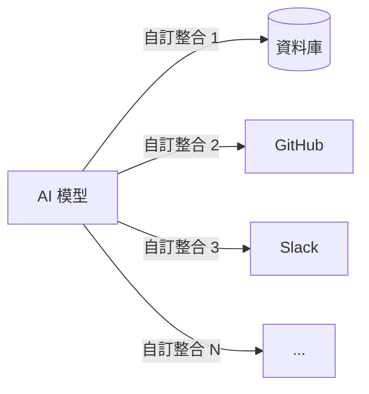
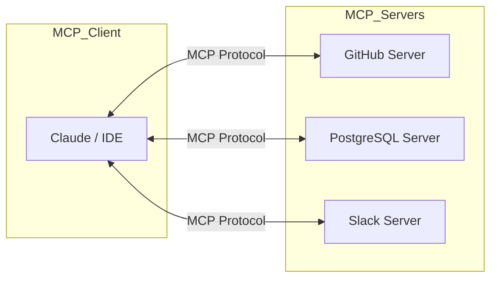
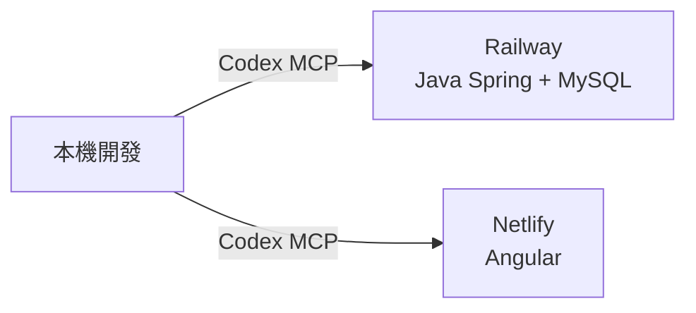

<div class="flex flex-col justify-center items-center h-full" style="background: #ffffff;">
  <p style="color: #5eada0; font-size: 1rem; font-weight: 600; letter-spacing: 0.2em; text-transform: uppercase; margin-bottom: 1.2rem;">Developer Tools Deep Dive</p>
  <h1 style="color: #1a5c5c; font-size: 3.8rem; font-weight: 900; line-height: 1.15; margin-bottom: 1.5rem;">Codex CLI、MCP 與 Skills</h1>
  <div style="height: 4px; width: 320px; background: linear-gradient(90deg, #5eada0, #a7d9d0); border-radius: 2px; margin-bottom: 1.5rem;"></div>
  <p style="color: #4a7c7c; font-size: 1.15rem; font-style: italic;">
    「掌握 AI 開發三器：CLI 指令、協定標準與技能擴充」
  </p>
  <Link to="home" style="color: #9dc4c4; font-size: 0.85rem; margin-top: 2rem; text-decoration: none; letter-spacing: 0.05em;">← 返回目錄</Link>
</div>

---
layout: default
---

# Outline

- **第一部分：Codex CLI**
  - 定義、安裝與核心功能
  - 互動模式與使用情境
- **第二部分：MCP（Model Context Protocol）**
  - MCP 定義與解決的問題
  - 架構、三大核心原語與預建伺服器
- **第三部分：Claude Code Skills**
  - Skills 與 Slash Commands 的差異
  - 建立自訂 Skills 與進階功能
- **實作練習**

---
layout: section
class: flex flex-col justify-center items-center text-center
---

# 第一部分
# Codex CLI

---
layout: default
---

# 什麼是 Codex CLI？

| 特性 | 說明 |
| --- | --- |
| **定義** | OpenAI 的終端機 AI 編碼代理（Coding Agent）|
| **底層技術** | 以 Rust 撰寫，執行效能快速 |
| **核心能力** | 閱讀、修改並執行本機目錄中的程式碼 |
| **互動介面** | 全螢幕 TUI（終端機 UI），即時互動審查 |

<div class="mt-4 p-3 bg-blue-50 border-l-4 border-blue-400 text-gray-700 text-sm text-left">
💡 <b>需求：</b> ChatGPT Plus 以上方案。支援 macOS、Windows（WSL2）、Linux。
</div>

---

# Codex CLI 安裝

```bash
# 方法一：npm 全域安裝
npm i -g @openai/codex

# 方法二：Homebrew（macOS）
brew install --cask codex

# 啟動互動式 TUI 介面
codex
```

---

# Codex CLI 核心功能 (一)

| 功能 | 說明 |
| --- | --- |
| **模型選擇** | 支援 GPT-5.4（推薦）等多種 OpenAI 模型 |
| **截圖附件** | 可上傳設計稿或截圖提供視覺上下文 |
| **網路搜尋** | 整合外部資訊搜尋功能 |
| **子代理支援** | 可平行執行多個子任務，加速複雜工作 |
| **MCP 整合** | 支援第三方工具透過 MCP 協定連接 |

---

# Codex CLI 核心功能 (二)

| 功能 | 說明 |
| --- | --- |
| **沙箱模式** | 隔離執行環境，防止意外修改本機檔案 |
| **審批模式** | 每個動作需人工確認，保持人工監督 |
| **倉庫推理** | 支援大型儲存庫的跨檔案推理與重構 |
| **自動化腳本** | 支援可重複執行的自動化工作模式 |

---

# Codex CLI 使用情境

| 情境 | 說明 |
| --- | --- |
| **對話式編碼** | 提出需求後，逐步審查 Codex 的每個動作 |
| **大規模重構** | 跨多個檔案的功能開發或架構重構 |
| **自動化任務** | 在人工監督模式下執行自動化編碼工作 |

```bash
# 啟動後，在互動介面中輸入需求
$ codex
> Refactor auth.js to use JWT and add unit tests
```

---
layout: section
class: flex flex-col justify-center items-center text-center
---

# 第二部分
# MCP（Model Context Protocol）

---
layout: default
---

# 什麼是 MCP？

| 面向 | 說明 |
| --- | --- |
| **全名** | Model Context Protocol |
| **開發者** | Anthropic，2024 年發布，開源標準 |
| **核心定位** | 連接 AI 應用與外部系統的通用介面 |
| **常見比喻** | 如同「AI 的 USB-C」── 統一插拔標準 |

<div class="mt-4 p-3 bg-blue-50 border-l-4 border-blue-400 text-gray-700 text-sm text-left">
💡 MCP 使 AI 模型（Claude、ChatGPT 等）能安全雙向地存取資料來源、工具與工作流程
</div>

---

# MCP 解決的問題

沒有 MCP 前，AI 與每個系統都需要獨立的自訂整合：

<div class="flex justify-center mt-4">



</div>

<div class="mt-4 p-3 bg-blue-50 border-l-4 border-blue-400 text-gray-700 text-sm text-left">
💡 有了 MCP：<b>Build once, integrate everywhere</b> —— 一個協定，整合所有系統
</div>

---

# MCP 架構：Client-Server 模型

<div class="flex justify-center mt-4">



</div>

- **MCP Client**：AI 應用（如 Claude Desktop、VS Code、Cursor）
- **MCP Server**：暴露資料或工具的服務端程式

---

# 預建 MCP 伺服器

| 伺服器 | 提供的能力 |
| --- | --- |
| **Google Drive** | 讀取、搜尋雲端硬碟檔案 |
| **GitHub** | 查詢 Repo、PR、Issue、程式碼 |
| **PostgreSQL** | 查詢資料庫、執行 SQL 指令 |
| **Slack** | 讀取頻道訊息、發送通知 |
| **Puppeteer** | 控制瀏覽器執行自動化測試 |
| **Git** | 讀取版本歷史、分支資訊 |

<div class="mt-4 p-3 bg-blue-50 border-l-4 border-blue-400 text-gray-700 text-sm text-left">
💡 <b>支援平台：</b> Claude、ChatGPT、VS Code、Cursor、VS Code Copilot 均已原生支援 MCP
</div>

---

# MCP 實際應用場景

| 情境 | 應用方式 |
| --- | --- |
| **電商 AI 助理** | 連接商品 DB + 訂單 API，即時回答客戶問題 |
| **設計轉程式碼** | Claude Code 讀取 Figma 設計稿，生成 Web App |
| **企業智能客服** | 同時連接多個資料庫，進行跨系統分析 |
| **個人助理** | 存取 Google Calendar + Notion，自動排程管理 |

---
layout: section
class: flex flex-col justify-center items-center text-center
---

# 第三部分
# Skills

---
layout: default
---

# Skills 與 Slash Commands 的差異

| 面向 | Slash Commands（內建）| Skills（自訂）|
| --- | --- | --- |
| **定義位置** | 硬編碼於 CLI 核心 |  Markdown 檔 |
| **AI 推理** | 無 | 完整 AI 推理能力 |
| **工作流程** | 單一特定任務 | 多步驟複雜工作流程 |
| **子代理** | 不支援 | 支援 |
| **可擴充性** | 有限 | 高度客製化 |

---

# 內建 Slash Commands

| 指令 | 說明 |
| --- | --- |
| `/clear` | 清除目前的對話歷史 |
| `/compact` | 摘要舊訊息，縮減 context 使用量 |
| `/help` | 顯示所有可用指令清單 |
| `/model` | 切換 AI 模型（Opus、Sonnet 等）|
| `/cost` | 顯示 token 與費用使用量統計 |
| `/context` | 列出目前的 context 使用情況 |

---

# 建立自訂 Skills

| 類型 | 存放路徑 | 適用範圍 |
| --- | --- | --- |
| **個人 Skills** | `~/.codex/skills/` | 所有專案皆可使用 |
| **專案 Skills** | `.codex/skills/` | 僅限此專案使用 |

```bash
# 建立專案 skill 目錄與檔案
mkdir -p .codex/skills/pr-summary
touch .codex/skills/pr-summary/SKILL.md
```

---

# Skill 檔案結構

```markdown
---
name: code-review
description: 程式碼安全與品質審查
allowed-tools: Read, Grep, Bash
model: claude-opus-4-7
---
請審查 $1，重點檢查：
1. 安全漏洞（XSS、SQL Injection）
2. 效能問題與記憶體洩漏
```

<div class="mt-4 p-3 bg-blue-50 border-l-4 border-blue-400 text-gray-700 text-sm text-left">
💡 <b>呼叫方式：</b> 在 AI CLI 中輸入 <code>/code-review src/auth.js</code> 即可執行
</div>

---

# Skills 常見應用場景

| 情境 | 建議 Skill 名稱 |
| --- | --- |
| **程式碼審查** | `/review` |
| **安全漏洞掃描** | `/security-review` |
| **PR 描述生成** | `/pr-summary` |
| **Git 提交建立** | `/commit` |
| **測試執行與修復** | `/test-fix` |
| **設定檔分析** | `/config-check` |

---
layout: section
class: flex flex-col justify-center items-center text-center
---

# 實戰部署
# Railway × Netlify × Codex MCP

---
layout: default
---

# 部署架構總覽

<div class="flex justify-center mt-4">



</div>

| 平台 | 部署目標 | 角色 |
| --- | --- | --- |
| **Railway** | Java Spring Boot + MySQL | 後端 API + 資料庫 |
| **Netlify** | Angular | 靜態前端 |
| **Codex MCP** | 銜接兩平台 | 自動化部署指令代理 |

---

# Railway — 後端部署平台

| 面向 | 說明 |
| --- | --- |
| **定位** | 全託管 PaaS，支援多種後端語言與資料庫 |
| **免費方案** | 註冊即贈 **$5 美元額度**（30 天試用） |
| **信用卡** | 需填寫信用卡，試用期內不扣款 |
| **Spring Boot** | 自動偵測框架，無需撰寫 Dockerfile |
| **MySQL** | 一鍵新增 MySQL Plugin，自動注入連線變數 |

<div class="mt-4 p-3 bg-blue-50 border-l-4 border-blue-400 text-gray-700 text-sm text-left">
💡 試用期結束後可升級至 Hobby 方案（$5/月），適合小型專案長期維運
</div>

---

# Netlify — 前端部署平台

| 面向 | 說明 |
| --- | --- |
| **定位** | 靜態網站與前端框架的全球 CDN 部署平台 |
| **免費方案** | 永久免費，100 GB 頻寬 / 月、300 建置分鐘 / 月 |
| **信用卡** | **完全不需要**，直接以 GitHub 帳號登入即可 |
| **Angular** | 自動偵測 Angular 專案，一鍵設定 build 指令與輸出目錄 |
| **其他功能** | 自訂網域 + 免費 SSL、全球 CDN、SPA routing 支援 |

<div class="mt-4 p-3 bg-blue-50 border-l-4 border-blue-400 text-gray-700 text-sm text-left">
💡 免費額度對課堂 Demo 與個人作品集完全足夠，無需擔心意外費用
</div>

---
layout: center
class: text-center
---

# Demo

---
layout: section
class: flex flex-col justify-center items-center text-center
---

# Q & A

---
layout: end
---

# 課程結束
### 掌握 AI 開發三器，讓工具為你所用！
如有課後疑問，歡迎來信討論。
