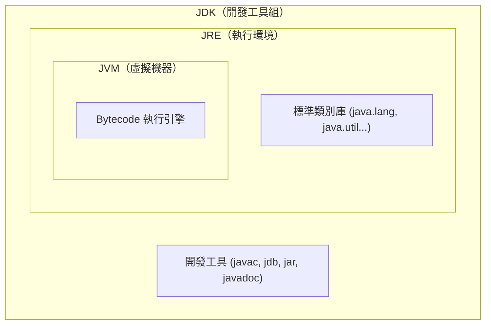
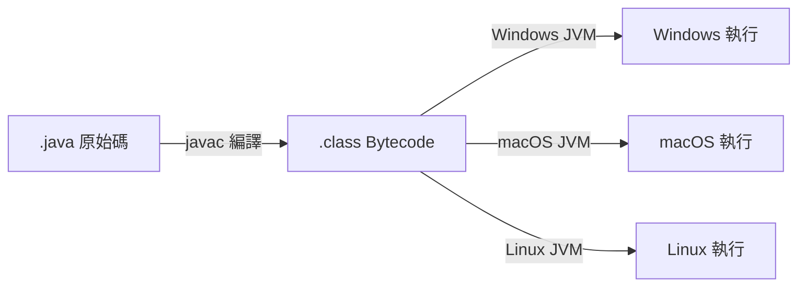

<div class="flex flex-col justify-center items-center h-full" style="background: #ffffff;">
  <p style="color: #5eada0; font-size: 1rem; font-weight: 600; letter-spacing: 0.2em; text-transform: uppercase; margin-bottom: 1.2rem;">Java Programming Masterclass</p>
  <h1 style="color: #1a5c5c; font-size: 3.8rem; font-weight: 900; line-height: 1.15; margin-bottom: 1.5rem;">基本觀念</h1>
  <div style="height: 4px; width: 320px; background: linear-gradient(90deg, #5eada0, #a7d9d0); border-radius: 2px; margin-bottom: 1.5rem;"></div>
  <p style="color: #4a7c7c; font-size: 1.15rem; font-style: italic;">
    「認識 Java：從起源到特色的完整旅程」
  </p>
  <Link to="home" style="color: #9dc4c4; font-size: 0.85rem; margin-top: 2rem; text-decoration: none; letter-spacing: 0.05em;">← 返回目錄</Link>
</div>

<!--
【開場白】
歡迎來到 Java 程式設計課程的第一章！在開始寫程式之前，我們先來了解 Java 是什麼、它從哪裡來，以及為什麼它能在全世界佔有一席之地。
-->

---
layout: default
---

# Outline

- **1-1 認識 Java**
- **1-2 Java 的起源**
- **1-3 Java 之父**
- **1-4 Java 發展史**
- **1-5 Java 的三大平台**
- **1-6 認識 Java SE 平台的 JDK / JRE / JVM**
- **1-7 Java 跨平台原理**
- **1-8 Java 語言的特色**

<!--
今天的課程會帶大家把 Java 的「身世」和「特色」全部搞清楚。這些基礎觀念看似理論，但其實對你以後除錯、選擇工具都非常有幫助。
-->

---
layout: section
class: flex flex-col justify-center items-center text-center
---

# 1-1
# 認識 Java

<!--
Java 是目前全球最受歡迎的程式語言之一，讓我們先從它的基本定義開始認識。
-->

---

# 什麼是 Java？

| 面向 | 說明 |
| --- | --- |
| **類型** | 高階、物件導向程式語言 |
| **誕生** | 1995 年，Sun Microsystems |
| **設計理念** | Write Once, Run Anywhere（一次撰寫，到處執行）|
| **現任維護** | Oracle Corporation（2009 年收購 Sun）|

<div class="mt-4 p-3 bg-blue-50 border-l-4 border-blue-400 text-gray-700 text-sm text-left">
💡 Java 目前被廣泛應用於 <b>網路應用程式、企業系統、Android 行動開發、嵌入式裝置</b>，全球超過 1000 萬名開發者使用。
</div>

<!--
Java 是一個多功能的程式語言，你在 Google、Amazon 的後台系統裡、或是你手機的 Android App 裡，都能看到 Java 的影子。

設計理念 WORA（Write Once, Run Anywhere）是 Java 最重要的特色之一，我們後面會詳細說明。
-->

---
layout: section
class: flex flex-col justify-center items-center text-center
---

# 1-2
# Java 的起源

<!--
Java 並不是憑空出現的，它有一段非常有趣的誕生故事。
-->

---

# Green Project（1991）

| 時間 | 事件 |
| --- | --- |
| **1991** | Sun Microsystems 啟動 **Green Project**，目標是為家電設備開發軟體 |
| **原始語言** | James Gosling 設計新語言，最初命名為 **Oak（橡樹）** |
| **1993** | World Wide Web 興起，團隊方向轉向網際網路應用 |
| **1995** | Oak 改名為 **Java**，於 **5 月 23 日**正式公開發表 |

<div class="mt-4 p-3 bg-blue-50 border-l-4 border-blue-400 text-gray-700 text-sm text-left">
💡 <b>Java 名字的由來：</b>Java 是印尼一座以咖啡豆聞名的島嶼，因為 Oak 商標已被他人使用，開發團隊在喝咖啡時討論後改名為 Java！
</div>

<!--
【生活化比喻】
你有沒有想過，如果電視遙控器可以跟電腦互通怎麼辦？這就是 1991 年 Sun 公司工程師在思考的問題。為了解決這個問題，他們開發了一種全新的程式語言。

最一開始這個語言叫做「Oak（橡樹）」，但後來發現名字已經被其他公司用了，才在一次咖啡廳討論中改名為 Java。
-->

---
layout: section
class: flex flex-col justify-center items-center text-center
---

# 1-3
# Java 之父

<!--
每個偉大的發明背後都有一位關鍵人物，Java 的靈魂人物就是 James Gosling。
-->

---

# James Gosling — Java 之父

| 項目 | 說明 |
| --- | --- |
| **全名** | James Arthur Gosling |
| **國籍** | 加拿大 |
| **學歷** | 卡內基梅隆大學 電腦科學博士 |
| **任職** | Sun Microsystems 首席工程師（後轉至 Oracle）|
| **主要貢獻** | 設計並實作 Java 語言規格、JVM 原型、Java 核心類別庫 |
| **外號** | **「Java 之父」（Father of Java）** |

<div class="mt-4 p-3 bg-blue-50 border-l-4 border-blue-400 text-gray-700 text-sm text-left">
💡 Gosling 不只制定語言規格，也親自撰寫了第一版的 <code>javac</code> 編譯器與 JVM 原型，是名副其實的全端創造者。
</div>

<!--
【生活化比喻】
如果把 Java 語言比喻成一棟大樓，那 James Gosling 就是這棟大樓的第一位建築師。他不只畫了設計圖（語言規格），還自己動手把地基（JVM）蓋出來。

現在雖然 Java 的維護由 Oracle 負責，但 Gosling 的設計哲學至今仍深深影響著 Java 的走向。
-->

---
layout: section
class: flex flex-col justify-center items-center text-center
---

# 1-4
# Java 發展史

<!--
從 1995 年到現在，Java 經歷了很多重要的版本更新，讓我們快速瀏覽這段歷史。
-->

---

# Java 版本里程碑（一）

| 年份 | 版本 | 重要事件 |
| --- | --- | --- |
| **1995** | Java 1.0 | 正式公開發表（5 月 23 日）|
| **1998** | Java 1.2（J2SE）| 引入 Collections 框架、Swing GUI |
| **2004** | Java 5 | 泛型（Generics）、Annotations、增強 for 迴圈 |
| **2006** | Java 6 | OpenJDK 開源計畫啟動 |
| **2009** | —— | **Oracle 收購 Sun Microsystems** |
| **2011** | Java 7 | try-with-resources、Diamond 運算子 |

<!--
Java 的版本命名從 1.0、1.1 到 1.4，在 Java 5 時改用大數字命名。

Java 5 是一個非常重大的版本，引入了泛型（ArrayList<String>），在那之前你存進 List 的東西取出來還要手動轉型！

2009 年 Oracle 收購 Sun 是 Java 歷史上的重大轉折，也引發不少社群的討論。
-->

---

# Java 版本里程碑（二）

| 年份 | 版本 | 重要事件 |
| --- | --- | --- |
| **2014** | **Java 8** ⭐ LTS | Lambda 表達式、Stream API、新日期時間 API |
| **2017** | Java 9 | 模組系統（JPMS），改為六個月一版 |
| **2018** | **Java 11** ⭐ LTS | 移除獨立 JRE 封裝 |
| **2021** | **Java 17** ⭐ LTS | Sealed Classes、Pattern Matching（本課程版本）|
| **2023** | **Java 21** ⭐ LTS | Virtual Threads、Record Patterns |

<div class="mt-4 p-3 bg-blue-50 border-l-4 border-blue-400 text-gray-700 text-sm text-left">
💡 <b>LTS（Long-Term Support）</b> 版本提供長期安全性更新，企業首選。本課程以 <b>Java 17</b> 為主。
</div>

<!--
Java 8 是革命性的版本，它引入 Lambda 和 Stream，讓 Java 也能以函數式風格撰寫程式。很多公司到今天仍在使用 Java 8。

從 Java 9 開始，Oracle 改成每六個月發布一個新版本，但只有 LTS 版本（8、11、17、21）才有長達 8 年的安全支援，是企業穩定部署的選擇。

我們課程使用 Java 17，目前最廣泛被採用的 LTS 版本。
-->

---
layout: section
class: flex flex-col justify-center items-center text-center
---

# 1-5
# Java 的三大平台

<!--
Java 根據應用場景的不同，被分成三個主要平台。
-->

---

# Java 三大平台

| 平台 | 全名 | 應用場景 |
| --- | --- | --- |
| **Java SE** | Standard Edition | 桌面應用、一般用途開發，是 EE / ME 的**基礎核心** |
| **Java EE / Jakarta EE** | Enterprise Edition | 企業級 Web 應用、伺服器端服務（Servlet、Spring）|
| **Java ME** | Micro Edition | 嵌入式系統、物聯網（IoT）、早期功能型手機 |

<div class="mt-4 p-3 bg-blue-50 border-l-4 border-blue-400 text-gray-700 text-sm text-left">
💡 <b>現況：</b>Java EE 已於 2019 年移交 Eclipse 基金會，更名為 <b>Jakarta EE</b>。Java ME 隨著 Android 崛起逐漸式微。<b>本課程聚焦 Java SE。</b>
</div>

<!--
【生活化比喻】
可以把 Java SE 想成是「基本配備的車」，日常開車夠用。
Java EE 是「商用貨車」，需要載重、長途，專門幫企業做大事。
Java ME 是「小型電動車」，非常省資源，適合窄小的地方。

打好 Java SE 的基礎，以後要升級到 Jakarta EE 也非常順暢。
-->

---
layout: section
class: flex flex-col justify-center items-center text-center
---

# 1-6
# JDK / JRE / JVM

<!--
很多新手最搞不清楚的就是這三個縮寫。今天我們把它徹底搞懂。
-->

---

# JVM / JRE / JDK 定義

| 縮寫 | 全名 | 主要功能 |
| --- | --- | --- |
| **JVM** | Java Virtual Machine | 虛擬機器，負責**執行** Bytecode |
| **JRE** | Java Runtime Environment | 執行環境 = JVM + 標準類別庫，用來**執行**程式 |
| **JDK** | Java Development Kit | 開發工具組 = JRE + 編譯器等工具，用來**開發**程式 |

<div class="mt-4 p-3 bg-blue-50 border-l-4 border-blue-400 text-gray-700 text-sm text-left">
💡 <b>包含關係：</b>JDK ⊃ JRE ⊃ JVM。安裝 JDK 就自動擁有 JRE 和 JVM。
</div>

<!--
【生活化比喻】
JVM 就像「電影放映機」，負責把電影（Bytecode）播出來。
JRE 就像「電影院」，裡面有放映機（JVM）加上座位、音響（類別庫）。
JDK 就像「完整的電影製作公司」，除了電影院，還有攝影棚、剪接室（編譯器、除錯工具）。

只是要「看電影」→ 裝 JRE
要「拍電影」→ 裝 JDK
-->

---

# JDK / JRE / JVM 包含關係

<div class="flex justify-center mt-4">



</div>

<!--
這張圖清楚呈現了三者的包含關係。

JVM 是最核心的元件，被包在 JRE 裡面。
JRE 裡面除了 JVM 還有標準類別庫，也就是我們呼叫 System.out.println() 時用到那些預先寫好的程式。
JDK 則是在 JRE 外面再加上開發工具，讓我們可以寫程式、編譯、除錯。
-->

---

# JDK 主要工具

| 工具 | 指令 | 功能 |
| --- | --- | --- |
| 編譯器 | `javac` | 將 `.java` 原始碼編譯成 `.class` Bytecode |
| 執行工具 | `java` | 啟動 JVM 並執行 `.class` 檔 |
| 除錯工具 | `jdb` | 互動式除錯 |
| 封裝工具 | `jar` | 將多個 `.class` 封裝成 `.jar` 檔 |
| 文件工具 | `javadoc` | 從原始碼的註解自動產生 API 文件 |

<!--
【業界實務】
現在大家通常不會直接在命令列輸入 javac，而是透過 IDE（如 IntelliJ IDEA、Eclipse）幫我們自動完成這些步驟。但了解背後原理，對理解錯誤訊息和除錯非常有幫助。
-->

---
layout: section
class: flex flex-col justify-center items-center text-center
---

# 1-7
# Java 跨平台原理

<!--
「Write Once, Run Anywhere」是 Java 最引以為傲的特色。它是怎麼做到的？
-->

---

# WORA — 一次撰寫，到處執行

Java 實現跨平台的關鍵：**Bytecode + JVM**

<div class="flex justify-center mt-4">



</div>

<div class="mt-4 p-3 bg-blue-50 border-l-4 border-blue-400 text-gray-700 text-sm text-left">
💡 <b>關鍵：</b>Bytecode 是<b>平台中立</b>的；JVM 是<b>平台相依</b>的。各作業系統安裝對應版本的 JVM，即可執行同一份 Bytecode。
</div>

<!--
【生活化比喻】
想像你用中文寫了一本食譜（.java 原始碼）。
你把它翻譯成一種「世界語」（Bytecode），沒有任何一個國家的人天生就懂，但每個國家都有一個「翻譯機」（JVM）。
所以只要有翻譯機（JVM），不管你在日本、美國、法國，都可以照著食譜煮出一樣的菜。

Bytecode 是與平台無關的（Platform Independent）。
JVM 是與平台有關的（Platform Dependent）— 針對不同作業系統有不同版本的 JVM。
-->

---

# 編譯與執行的完整流程

```java
// Hello.java
public class Hello {
    public static void main(String[] args) {
        System.out.println("Hello, Java!");
    }
}
```

| 步驟 | 指令 | 動作 |
| --- | --- | --- |
| **1. 編譯** | `javac Hello.java` | 產生 `Hello.class`（Bytecode）|
| **2. 執行** | `java Hello` | JVM 載入並執行 Bytecode |

<!--
Step 1：用文字編輯器或 IDE 寫下 Hello.java。
Step 2：執行 javac Hello.java，編譯器把原始碼轉為 Hello.class（Bytecode）。
Step 3：執行 java Hello，JVM 讀取 Hello.class 並在你的電腦上執行。

這個流程就是 Java 開發的基本循環，不管未來你用什麼 IDE，底層都是這樣運作的。
-->

---
layout: section
class: flex flex-col justify-center items-center text-center
---

# 1-8
# Java 語言的特色

<!--
最後，我們來看看 Java 到底有哪些優點，讓它能風靡全球超過 30 年。
-->

---

# Java 核心特色（一）

| 特色 | 說明 |
| --- | --- |
| **簡單（Simple）** | 語法清晰，移除 C++ 的指標、多重繼承等複雜機制 |
| **物件導向（Object-Oriented）** | 支援封裝、繼承、多型，程式碼模組化、可重複使用 |
| **跨平台（Platform Independent）** | Bytecode + JVM，同一份程式碼跨平台執行 |
| **安全（Secure）** | 沙盒機制（Sandbox）、Bytecode 驗證，無法直接存取底層記憶體 |

<!--
【逐點解說】
簡單：如果你學過 C 語言，你會知道指標（pointer）是多少人的噩夢。Java 把這個概念藏起來，讓你專注在解決問題。

物件導向：這是 Java 的核心精神，後續幾章我們都會深入學習。

跨平台：就是我們剛才說的 WORA。

安全：JVM 就像沙盒，程式不能任意存取系統記憶體，大幅降低被惡意程式攻擊的風險。
-->

---

# Java 核心特色（二）

| 特色 | 說明 |
| --- | --- |
| **強健（Robust）** | 強型別、例外處理（Exception Handling）、自動垃圾回收（GC）|
| **多執行緒（Multithreaded）** | 內建支援多執行緒，提升程式並發效能 |
| **高效能（High Performance）** | JIT（Just-In-Time）即時編譯，熱點程式碼直接轉為機器碼 |
| **分散式（Distributed）** | 內建網路支援（Socket、RMI），適合分散式系統開發 |

<div class="mt-4 p-3 bg-blue-50 border-l-4 border-blue-400 text-gray-700 text-sm text-left">
💡 <b>Garbage Collection（GC）：</b>JVM 自動回收不再使用的物件記憶體，開發者無需手動 <code>free()</code>，大幅降低記憶體洩漏風險。
</div>

<!--
強健：Java 很嚴格，型別不對就不讓你過。這讓 Bug 在撰寫程式時就被抓出來，而不是等到上線才爆炸。

多執行緒：現代電腦都是多核心，Java 原生支援多執行緒，讓你可以同時做很多事。

高效能：Java 一開始被批評比 C++ 慢，但 JIT 編譯器讓常用的程式碼被直接轉成機器碼，速度大幅提升。

分散式：Java 非常適合寫網路應用，後來的 Spring、Netty 等框架都建立在這個特色上。
-->

---
layout: section
class: flex flex-col justify-center items-center text-center
---

# Q & A

<!--
今天我們走過了 Java 從誕生到現在的完整旅程，包括它的起源、Java 之父 James Gosling、三大平台、JDK/JRE/JVM 的差別、跨平台原理，以及語言的八大核心特色。

大家有什麼問題嗎？
-->
