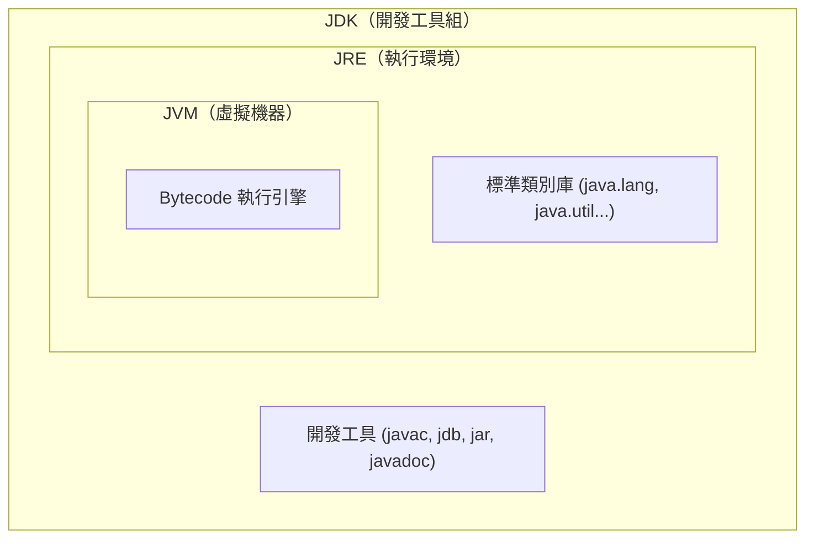
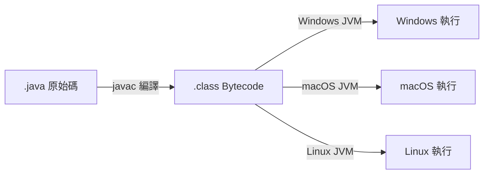

<div class="flex flex-col justify-center items-center h-full" style="background: #ffffff;">
  <p style="color: #5eada0; font-size: 1rem; font-weight: 600; letter-spacing: 0.2em; text-transform: uppercase; margin-bottom: 1.2rem;">Java Programming Masterclass</p>
  <h1 style="color: #1a5c5c; font-size: 3.8rem; font-weight: 900; line-height: 1.15; margin-bottom: 1.5rem;">基本觀念</h1>
  <div style="height: 4px; width: 320px; background: linear-gradient(90deg, #5eada0, #a7d9d0); border-radius: 2px; margin-bottom: 1.5rem;"></div>
  <p style="color: #4a7c7c; font-size: 1.15rem; font-style: italic;">
    「認識 Java：從起源到特色的完整旅程」
  </p>
  <Link to="home" style="color: #9dc4c4; font-size: 0.85rem; margin-top: 2rem; text-decoration: none; letter-spacing: 0.05em;">← 返回目錄</Link>
</div>

<!--
【開場白】
各位未來的肝苦同胞們，大家好！歡迎來到 Java 程式設計的第一章。在我們開始把頭髮賣給編譯器之前，得先搞清楚 Java 到底是何方神聖。

【為什麼要學這個？】
別以為學 Java 只是為了找工作。學了 Java，你會發現它比你的前任還穩定，比你的主管還講道理（大部分時候）。它是目前全球最強大的「老大哥」，不管是手機 App 還是大公司的後台，到處都是它的地盤。

【今天學完你會能做什麼】
今天結束後，你雖然還不能寫出下一個 Google，但至少你能跟別人臭彈說你懂什麼叫 JVM，還能告訴他們為什麼 Java 叫 Java 而不叫 Coffee。
-->

---
layout: default
---

# Outline

- **1-1 認識 Java**
- **1-2 Java 的起源**
- **1-3 Java 之父**
- **1-4 Java 發展史**
- **1-5 Java 的三大平台**
- **1-6 認識 Java SE 平台的 JDK / JRE / JVM**
- **1-7 Java 跨平台原理**
- **1-8 Java 語言的特色**

<!--
【核心說明】
今天我們要來一場 Java 的「身世大調查」。別覺得這很像在讀族譜很無聊，這可是關乎到你以後 Debug 時是會對著電腦哭，還是能優雅地喝咖啡的關鍵。

【生活化比喻】
這就像你玩遊戲要先看「世界觀設定」一樣。如果你不知道這遊戲的重力規則，你怎麼指望你的角色能跳過懸崖？
-->

---
layout: section
class: flex flex-col justify-center items-center text-center
---

# 1-1
# 認識 Java

<!--
【開場白】
好啦，暖身結束。我們直接進入 1-1：認識 Java。這部分我們會用最直白的方式告訴你，這東西為什麼能紅三十年。
-->

---

# 什麼是 Java？

| 面向 | 說明 |
| --- | --- |
| **類型** | 高階、物件導向程式語言 |
| **誕生** | 1995 年，Sun Microsystems |
| **設計理念** | Write Once, Run Anywhere（一次撰寫，到處執行）|
| **現任維護** | Oracle Corporation（2009 年收購 Sun）|

<div class="mt-4 p-3 bg-blue-50 border-l-4 border-blue-400 text-gray-700 text-sm text-left">
💡 Java 目前被廣泛應用於 <b>網路應用程式、企業系統、Android 行動開發、嵌入式裝置</b>，全球超過 1000 萬名開發者使用。
</div>

<!--
【核心說明】
Java 就是程式界的「萬金油」。不管是雲端大數據，還是你的 Android 手機，甚至你的大同電鍋（如果它夠高級的話），裡面可能都有 Java 在跑。

【生活化比喻】
Java 的設計理念叫「WORA」。翻譯成白話就是：你寫好一份合約，不管是去美國、日本還是火星，這份合約都有效。這在以前可是神蹟，以前的程式換個電腦跑就直接罷工給你看。

💼 業界實務：
在業界，Java 意味著「穩定」。雖然它看起來沒那麼潮，但當你要處理幾億筆金流的時候，你絕對會選這個老古董，而不是那些剛出生兩年、隨時會斷氣的新語言。
-->

---
layout: section
class: flex flex-col justify-center items-center text-center
---

# 1-2
# Java 的起源

<!--
【開場白】
接下來，我們聊聊 Java 的起源。這故事告訴我們：有時候你本來想做 A，最後卻做成了 B，而且 B 還比 A 賺得多。
-->

---

# Green Project（1991）

| 時間 | 事件 |
| --- | --- |
| **1991** | Sun Microsystems 啟動 **Green Project**，目標是為家電設備開發軟體 |
| **原始語言** | James Gosling 設計新語言，最初命名為 **Oak（橡樹）** |
| **1993** | World Wide Web 興起，團隊方向轉向網際網路應用 |
| **1995** | Oak 改名為 **Java**，於 **5 月 23 日**正式公開發表 |

<div class="mt-4 p-3 bg-blue-50 border-l-4 border-blue-400 text-gray-700 text-sm text-left">
💡 <b>Java 名字的由來：</b>Java 是印尼一座以咖啡豆聞名的島嶼，因為 Oak 商標已被他人使用，開發團隊在喝咖啡時討論後改名為 Java！
</div>

<!--
【核心說明】
Java 一開始其實不是為了寫網頁，而是為了「智慧家電」。沒錯，他們本來想讓你的烤麵包機變得跟電腦一樣聰明。這就是 1991 年的「Green Project」。

【生活化比喻】
就像你本來想發明一種能摺衣服的機器人，結果最後做出來的是一台能幫你報稅的電腦。開發團隊原本給它取名叫「Oak」（橡樹），結果發現這名字被佔走了，大家一臉絕望去喝咖啡，結果看著杯子裡的爪哇咖啡，靈光一閃：就叫 Java 吧！

⚠️ 學生常見誤解：
很多人以為 Java 跟 JavaScript 有血緣關係。這誤會可大了！這就像「雷神」跟「雷神巧克力」的關係一樣，除了名字都有個「雷」，其他完全沒關係。別被騙了！
-->

---
layout: section
class: flex flex-col justify-center items-center text-center
---

# 1-3
# Java 之父

<!--
【開場白】
英雄莫問出處，但總得認識一下創始人。讓我們請出 Java 的親爹：James Gosling。
-->

---

# James Gosling — Java 之父

| 項目 | 說明 |
| --- | --- |
| **全名** | James Arthur Gosling |
| **國籍** | 加拿大 |
| **學歷** | 卡內基梅隆大學 電腦科學博士 |
| **任職** | Sun Microsystems 首席工程師（後轉至 Oracle）|
| **主要貢獻** | 設計並實作 Java 語言規格、JVM 原型、Java 核心類別庫 |
| **外號** | **「Java 之父」（Father of Java）** |

<div class="mt-4 p-3 bg-blue-50 border-l-4 border-blue-400 text-gray-700 text-sm text-left">
💡 Gosling 不只制定語言規格，也親自撰寫了第一版的 <code>javac</code> 編譯器與 JVM 原型，是名副其實的全端創造者。
</div>

<!--
【核心說明】
James Gosling 就是 Java 的親爹。他不只是坐在辦公室畫設計圖，他連工地裡的每一塊磚（編譯器）都是自己搬的。

【生活化比喻】
這老兄厲害的地方在於，他預見了未來的電腦會有很多種「脾氣」（作業系統），所以他設計了一種能搞定所有脾氣的「萬能語音」。

💼 業界實務：
在開發圈，看到這種滿頭白髮、看起來很像聖誕老人的人，千萬要尊敬。他們寫的一行程式碼，可能比你寫的一萬行 Bug 還要有價值。
-->

---
layout: section
class: flex flex-col justify-center items-center text-center
---

# 1-4
# Java 發展史

<!--
【開場白】
Java 從出生到現在，版本多到可以寫一本史詩。我們來快速掃一下它的「成魔之路」。
-->

---

# Java 版本里程碑（一）

| 年份 | 版本 | 重要事件 |
| --- | --- | --- |
| **1995** | Java 1.0 | 正式公開發表（5 月 23 日）|
| **1998** | Java 1.2（J2SE）| 引入 Collections 框架、Swing GUI |
| **2004** | Java 5 | 泛型（Generics）、Annotations、增強 for 迴圈 |
| **2006** | Java 6 | OpenJDK 開源計畫啟動 |
| **2009** | —— | **Oracle 收購 Sun Microsystems** |
| **2011** | Java 7 | try-with-resources、Diamond 運算子 |

<!--
【核心說明】
早期 Java 很笨重。特別是 Java 5 之前，你用個清單（ArrayList）存東西，拿出來還要像在開盲盒一樣手動轉型，轉錯了程式就直接炸給你看。

【生活化比喻】
Java 5 就像是幫清單裝了「感應器」。你放進去的是蘋果，它就保證出來的是蘋果。這讓工程師的肝臟壓力少了一半。

💼 業界實務：
2009 年 Oracle 收購 Sun，這就像是你的溫柔鄰居阿姨（Sun）把房子賣給了一個嚴厲的包租公（Oracle）。大家一開始都很怕 Java 會變收費軟體，但還好它現在依然是免費開發者的好朋友。
-->

---

# Java 版本里程碑（二）

| 年份 | 版本 | 重要事件 |
| --- | --- | --- |
| **2014** | **Java 8** ⭐ LTS | Lambda 表達式、Stream API、新日期時間 API |
| **2017** | Java 9 | 模組系統（JPMS），改為六個月一版 |
| **2018** | **Java 11** ⭐ LTS | 移除獨立 JRE 封裝 |
| **2021** | **Java 17** ⭐ LTS | Sealed Classes、Pattern Matching（本課程版本）|
| **2023** | **Java 21** ⭐ LTS | Virtual Threads、Record Patterns |

<div class="mt-4 p-3 bg-blue-50 border-l-4 border-blue-400 text-gray-700 text-sm text-left">
💡 <b>LTS（Long-Term Support）</b> 版本提供長期安全性更新，企業首選。本課程以 <b>Java 17</b> 為主。
</div>

<!--
【核心說明】
Java 8 是所有工程師心中的神作。它引進了 Lambda 和 Stream，讓 Java 從「囉唆的老頭」變成了「簡練的型男」。

【生活化比喻】
以前叫 Java 算 1 加到 100，它要寫一整面黑板；現在只要一句話就搞定。這就是 Java 8 的魅力。

💼 業界實務：
記住 LTS 這個詞。在公司裡，千萬別衝動去用那些剛出的、沒有 LTS 的版本，除非你想在半夜兩點被緊急電話叫起來修 Bug。LTS 就是「老大哥幫你保固 8 年」的意思。本課程用 Java 17，就是因為它最穩、最好用。
-->

---
layout: section
class: flex flex-col justify-center items-center text-center
---

# 1-5
# Java 的三大平台

<!--
【開場白】
Java 為了應對不同的戰場，分成了三種「套裝」。我們來看看哪一套適合你。
-->

---

# Java 三大平台

| 平台 | 全名 | 應用場景 |
| --- | --- | --- |
| **Java SE** | Standard Edition | 桌面應用、一般用途開發，是 EE / ME 的**基礎核心** |
| **Java EE / Jakarta EE** | Enterprise Edition | 企業級 Web 應用、伺服器端服務（Servlet、Spring）|
| **Java ME** | Micro Edition | 嵌入式系統、物聯網（IoT）、早期功能型手機 |

<div class="mt-4 p-3 bg-blue-50 border-l-4 border-blue-400 text-gray-700 text-sm text-left">
💡 <b>現況：</b>Java EE 已於 2019 年移交 Eclipse 基金會，更名為 <b>Jakarta EE</b>。Java ME 隨著 Android 崛起逐漸式微。<b>本課程聚焦 Java SE。</b>
</div>

<!--
【核心說明】
Java 分成 SE（標準版）、EE（企業版）跟 ME（微型版）。

【生活化比喻】
Java SE 就像是「一般房車」，日常代步最強。
Java EE 就像是「裝甲運鈔車」，專門處理大公司的機密和金流。
Java ME 就像是「小摺腳踏車」，專門塞進那些沒什麼記憶體的小機器裡。

💼 業界實務：
新手請死心塌地學好 Java SE。它是所有進階技術的「地基」。地基不穩，你之後想學 Spring Boot 或是微服務，蓋上去也只是蓋海市蜃樓。
-->

---
layout: section
class: flex flex-col justify-center items-center text-center
---

# 1-6
# JDK / JRE / JVM

<!--
【開場白】
來了，新手最容易腦霧的地方：JDK、JRE、JVM。這三個縮寫如果你分不清楚，出去會被笑的。
-->

---

# JVM / JRE / JDK 定義

| 縮寫 | 全名 | 主要功能 |
| --- | --- | --- |
| **JVM** | Java Virtual Machine | 虛擬機器，負責**執行** Bytecode |
| **JRE** | Java Runtime Environment | 執行環境 = JVM + 標準類別庫，用來**執行**程式 |
| **JDK** | Java Development Kit | 開發工具組 = JRE + 編譯器等工具，用來**開發**程式 |

<div class="mt-4 p-3 bg-blue-50 border-l-4 border-blue-400 text-gray-700 text-sm text-left">
💡 <b>包含關係：</b>JDK ⊃ JRE ⊃ JVM。安裝 JDK 就自動擁有 JRE 和 JVM。
</div>

<!--
【核心說明】
別被這些 J 開頭的縮寫搞瘋了。它們其實就是一組「俄羅斯娃娃」。

【生活化比喻】
JVM 就像是「萬能翻譯機」，它負責把你寫的奇怪語言翻成電腦聽得懂的電波。
JRE 就像是「翻譯機 + 工具箱」，讓你可以帶著它到處跑。
JDK 就像是「翻譯機 + 工具箱 + 武器庫」，是給開發者（也就是你們）用的。

⚠️ 學生常見誤解：
以前很多教程叫你只裝 JRE，結果你發現你寫完程式沒辦法跑（因為沒編譯器）。記住，身為開發者，你永遠、絕對、必須安裝 JDK。
-->

---

# JDK / JRE / JVM 包含關係

<div class="flex justify-center mt-4">



</div>

<!--
【看圖前的引導】
這張圖就是剛剛那個「俄羅斯娃娃」的平面圖。

【逐步帶著看】
最核心的小紅點就是 JVM。沒有它，你的程式就是一堆廢紙。
外面那一圈是 JRE，它給了 JVM 很多「補給品」（類別庫）。
最外面那個大圈圈就是 JDK，它幫你準備了「屠龍刀」（編譯器），讓你把程式碼砍成電腦看得懂的形狀。

💼 業界實務：
如果你去面試，面試官問你 JVM 是幹嘛的，你只要回答「跨平台的靈魂」，這格基本分就拿到了。
-->

---

# JDK 主要工具

| 工具 | 指令 | 功能 |
| --- | --- | --- |
| 編譯器 | `javac` | 將 `.java` 原始碼編譯成 `.class` Bytecode |
| 執行工具 | `java` | 啟動 JVM 並執行 `.class` 檔 |
| 除錯工具 | `jdb` | 互動式除錯 |
| 封裝工具 | `jar` | 將多個 `.class` 封裝成 `.jar` 檔 |
| 文件工具 | `javadoc` | 從原始碼的註解自動產生 API 文件 |

<!--
【核心說明】
JDK 裡面有很多小工具。最重要的兩位主角是 `javac`（編譯器）和 `java`（執行器）。

【生活化比喻】
`javac` 就像是「翻譯官」，把你寫的人話翻譯成外星語（Bytecode）。
`java` 就像是「點火器」，負責啟動外星語程式。

💼 業界實務：
雖然現在我們都用高級的 IDE（像 IntelliJ），只要按個綠色播放鍵就搞定，但如果你哪天要去 Server 上修東西，發現沒圖形介面，你就得靠這些原始指令救命了。
-->

---
layout: section
class: flex flex-col justify-center items-center text-center
---

# 1-7
# Java 跨平台原理

<!--
【開場白】
接下來我們要揭曉 Java 的終極神技：它是怎麼做到「一次寫完，到處跑」的？
-->

---

# WORA — 一次撰寫，到處執行

Java 實現跨平台的關鍵：**Bytecode + JVM**

<div class="flex justify-center mt-4">



</div>

<div class="mt-4 p-3 bg-blue-50 border-l-4 border-blue-400 text-gray-700 text-sm text-left">
💡 <b>關鍵：</b>Bytecode 是<b>平台中立</b>的；JVM 是<b>平台相依</b>的。各作業系統安裝對應版本的 JVM，即可執行同一份 Bytecode。
</div>

<!--
【核心說明】
這就是著名的 WORA 原理。關鍵就在那個「Bytecode」。

【生活化比喻】
想像你寫了一份「萬用樂譜」。這份樂譜不管是鋼琴家、吉他手還是吹喇叭的，大家都看得懂。但問題是，你需要不同國家的「翻譯機」（JVM）來把這份樂譜轉成當地的樂器聲音。
翻譯官（JVM）雖然每個國家版本不同，但讀的樂譜（Bytecode）卻是同一份。

💼 業界實務：
以前工程師為了讓程式在 Windows 和 Mac 上都能跑，要寫兩份完全不同的程式，簡直是肝的火葬場。Java 救了大家的命。
-->

---

# 編譯與執行的完整流程

```java
// Hello.java
public class Hello {
    public static void main(String[] args) {
        System.out.println("Hello, Java!");
    }
}
```

| 步驟 | 指令 | 動作 |
| --- | --- | --- |
| **1. 編譯** | `javac Hello.java` | 產生 `Hello.class`（Bytecode）|
| **2. 執行** | `java Hello` | JVM 載入並執行 Bytecode |

<!--
【帶讀程式碼前的鋪陳】
我們來看看這段程式碼是怎麼從「人話」變成「電腦話」的。

【逐步解說】
首先，你寫了 `Hello.java`。這時候它還只是一段你想對世界打招呼的廢話。
接著，你叫 `javac` 來，它會吐出一個 `Hello.class`。這就是剛才說的「萬用樂譜」。
最後，你叫 `java` 來跑，JVM 就會在你螢幕上噴出 "Hello, Java!"。

⚠️ 學生常見誤解：
注意檔名！`Hello.java` 的 H 要大寫，因為裡面的類別叫 `Hello`。Java 是個很「傲嬌」的語言，大小寫錯一個它就翻臉。
-->

---
layout: section
class: flex flex-col justify-center items-center text-center
---

# 1-8
# Java 語言的特色

<!--
【開場白】
最後，我們來細數 Java 的八大優點。聽完之後，你就會覺得學 Java 是人生中最正確的決定。
-->

---

# Java 核心特色（一）

| 特色 | 說明 |
| --- | --- |
| **簡單（Simple）** | 語法清晰，移除 C++ 的指標、多重繼承等複雜機制 |
| **物件導向（Object-Oriented）** | 支援封裝、繼承、多型，程式碼模組化、可重複使用 |
| **跨平台（Platform Independent）** | Bytecode + JVM，同一份程式碼跨平台執行 |
| **安全（Secure）** | 沙盒機制（Sandbox）、Bytecode 驗證，無法直接存取底層記憶體 |

<!--
【核心說明】
Java 的前四個特色：簡單、物件導向、跨平台、安全。

【生活化比喻】
「簡單」：它把 C++ 裡面那些會讓你掉頭髮的「指標」給藏起來了。
「安全」：它像是一個「透明玻璃房」（沙盒）。你可以在裡面玩，但你沒辦法打破玻璃去偷主人的存摺（系統記憶體）。

💼 業界實務：
「物件導向」聽起來很玄，其實就是把程式碼變成像「樂高積木」。你不用每次都從塑膠原料開始做，直接拿現成的積木拼起來就好。
-->

---

# Java 核心特色（二）

| 特色 | 說明 |
| --- | --- |
| **強健（Robust）** | 強型別、例外處理（Exception Handling）、自動垃圾回收（GC）|
| **多執行緒（Multithreaded）** | 內建支援多執行緒，提升程式並發效能 |
| **高效能（High Performance）** | JIT（Just-In-Time）即時編譯，熱點程式碼直接轉為機器碼 |
| **分散式（Distributed）** | 內建網路支援（Socket、RMI），適合分散式系統開發 |

<div class="mt-4 p-3 bg-blue-50 border-l-4 border-blue-400 text-gray-700 text-sm text-left">
💡 <b>Garbage Collection（GC）：</b>JVM 自動回收不再使用的物件記憶體，開發者無需手動 <code>free()</code>，大幅降低記憶體洩漏風險。
</div>

<!--
【核心說明】
後四個特色：強健、多執行緒、高效能、分散式。

【生活化比喻】
「強健」：Java 有個功能叫「自動垃圾回收」（GC）。它會在你程式跑完後，自動幫你把不再需要的垃圾清理乾淨，不用你親自動手拿掃帚（`free()`）。這救了多少工程師的肝啊！

💼 業界實務：
別聽別人說 Java 很慢。現代的 JIT 技術讓 Java 跑起來跟飛的一樣。它就像是個「會自我進化的跑車」，開越久，跑越快。
-->

---
layout: section
class: flex flex-col justify-center items-center text-center
---

# Q & A

<!--
【結語】
好啦，Java 的身世大揭秘到此結束。我們從它的咖啡豆起源，講到了它是怎麼拯救工程師肝臟的。

現在，如果你有任何問題，不管是關於 Java 的未來，還是你想問我頭髮哪裡剪的比較不會掉，都可以提問。沒問題的話，我們就準備正式開始寫程式囉！
-->
