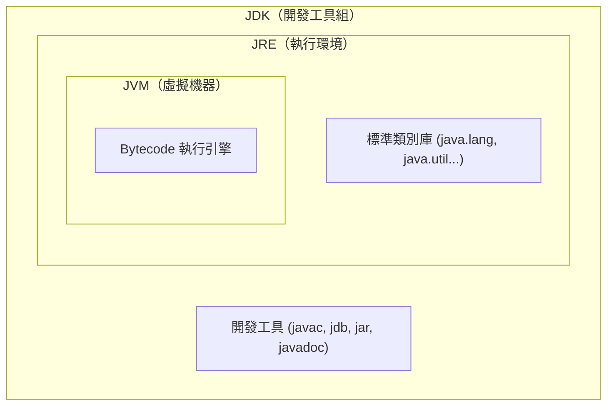
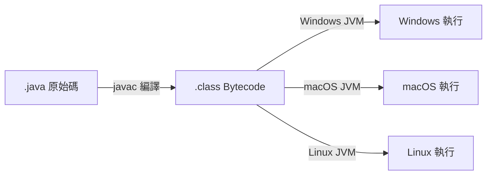

<div class="flex flex-col justify-center items-center h-full" style="background: #ffffff;">
  <p style="color: #5eada0; font-size: 1rem; font-weight: 600; letter-spacing: 0.2em; text-transform: uppercase; margin-bottom: 1.2rem;">Java Programming Masterclass</p>
  <h1 style="color: #1a5c5c; font-size: 3.8rem; font-weight: 900; line-height: 1.15; margin-bottom: 1.5rem;">基本觀念</h1>
  <div style="height: 4px; width: 320px; background: linear-gradient(90deg, #5eada0, #a7d9d0); border-radius: 2px; margin-bottom: 1.5rem;"></div>
  <p style="color: #4a7c7c; font-size: 1.15rem; font-style: italic;">
    「認識 Java：從起源到特色的完整旅程」
  </p>
  <Link to="home" style="color: #9dc4c4; font-size: 0.85rem; margin-top: 2rem; text-decoration: none; letter-spacing: 0.05em;">← 返回目錄</Link>
</div>

<!--
歡迎大家來到這門課的第一章。在我們動手寫第一行程式碼之前，先花一點時間認識一下 Java 這個語言——它從哪裡來、為什麼會紅這麼久，還有它跟其他語言比起來特別的地方在哪。

為什麼要先了解這些？因為等我們之後遇到一些「為什麼 Java 要這樣設計」的疑問時，回頭想想它的歷史背景，常常就能恍然大悟。而且這些也是面試時很常被問到的基本概念，先建立起來，之後學習新東西時心裡會更有底。

這一章結束之後，我們會知道 Java 是什麼、它的起源故事、誰是 Java 之父、它經歷過哪些重要版本、SE/EE/ME 三大平台的差異，還有 JDK、JRE、JVM 這幾個常讓人搞混的縮寫到底分別在做什麼。
-->

---
layout: default
---

# Outline

- **認識 Java**
- **Java 的起源**
- **Java 之父**
- **Java 發展史**
- **Java 的三大平台**
- **認識 Java SE 平台的 JDK / JRE / JVM**
- **Java 跨平台原理**
- **Java 語言的特色**

<!--
這一頁列出了我們這一章會走過的八個小節，從「Java 是什麼」一路講到「Java 語言的特色」。整體來說，就是一場 Java 的身世調查——它從哪裡誕生、經歷過哪些重要的版本演進、現在又是怎麼運作的。

這些內容看起來像是在讀歷史，但其實很實用。就好像玩一款新遊戲之前，先看一下「世界觀設定」——了解這個世界的規則，之後操作起來才不會處處碰壁、一頭霧水。
-->

---
layout: section
class: flex flex-col justify-center items-center text-center
---

# 認識 Java

<!--
我們先從最基本的問題開始：Java 到底是什麼？接下來這幾頁，我們會用最直白的方式，帶大家認識這個語言的基本身分，還有它為什麼能夠紅超過三十年，至今仍然是業界主流。
-->

---

# 什麼是 Java？

| 面向 | 說明 |
| --- | --- |
| **類型** | 高階、物件導向程式語言 |
| **誕生** | 1995 年，Sun Microsystems |
| **設計理念** | Write Once, Run Anywhere（一次撰寫，到處執行）|
| **現任維護** | Oracle Corporation（2009 年收購 Sun）|

<div class="mt-4 p-3 bg-blue-50 border-l-4 border-blue-400 text-gray-700 text-sm text-left">
💡 Java 目前被廣泛應用於 <b>網路應用程式、企業系統、Android 行動開發、嵌入式裝置</b>，全球超過 1000 萬名開發者使用。
</div>

<!--
這張表格幫我們快速建立 Java 的基本身分：它是一個誕生於 1995 年的高階、物件導向程式語言，現在由 Oracle 維護。

表格裡最關鍵的一句是設計理念那一行——「Write Once, Run Anywhere（一次撰寫，到處執行）」。這句話的意思是，我們寫好一份程式碼，不管拿到 Windows、macOS 還是 Linux 上都能跑，不需要為每個系統重新寫一份。在整個概念出現之前，程式換一台機器就常常要大改一遍，所以這在當年算是滿大的突破，後面「Java 跨平台原理」我們會仔細講它是怎麼做到的。

至於業界實務，Java 給人的印象就是「穩」。它可能不是最潮的語言，但銀行、電商、企業後台這些需要長期維運、處理大量交易的系統，Java 一直是很常見的選擇。下方那個小提示框也說了，目前全球有超過一千萬名開發者在用它，從網頁應用、企業系統到 Android 開發都看得到它的身影。
-->

---
layout: default
---

# 練習 1：認識 Java
### 認證模擬題（單選）

關於 Java 這個程式語言，下列敘述何者**正確**？

- A. Java 由 Microsoft 於 1995 年發表，設計理念是 Write Once, Run Anywhere
- B. Java 的設計理念是「一次撰寫，到處執行」，目前由 Oracle 負責維護
- C. Java 是一種低階組合語言，主要用於嵌入式裝置
- D. Java 自發表以來從未更新版本，目前仍是 1.0

<!--
【出題動機】
這題把「認識 Java」那頁表格裡的幾個關鍵字（誕生年份、設計理念、維護者）混在一起，考大家有沒有把對應關係記清楚。

【解題引導】
四個選項裡，B 跟 A 的內容很像，差別在「發表公司」跟「現任維護者」——這正是表格裡最容易搞混的兩件事，回頭對照一下表格就能分辨。
-->

---
layout: default
---

# 練習 1：認識 Java
### 解析

**正確答案：B**

- A. ❌ Java 是 **Sun Microsystems** 於 1995 年發表，不是 Microsoft
- B. ✅ 「Write Once, Run Anywhere」是 Java 的核心設計理念，現由 **Oracle** 維護
- C. ❌ Java 是**高階、物件導向**語言，並非低階組合語言
- D. ❌ Java 已演進到 Java 21（LTS），版本持續更新中

<!--
【帶讀解法】
這題的關鍵是把「誕生」「設計理念」「現任維護」三個欄位對應到正確的選項。A 選項故意把公司名稱換成 Microsoft，是最常見的混淆來源；D 選項則是測試大家是否記得 Java 持續在演進。
-->

---
layout: section
class: flex flex-col justify-center items-center text-center
---

# Java 的起源

<!--
接下來我們來看 Java 的起源故事。這個故事有趣的地方在於，它一開始的目標跟最後變成的樣子完全不一樣——本來想做一件事，結果做出了另一件更厲害的事。
-->

---

# Green Project（1991）

| 時間 | 事件 |
| --- | --- |
| **1991** | Sun Microsystems 啟動 **Green Project**，目標是為家電設備開發軟體 |
| **原始語言** | James Gosling 設計新語言，最初命名為 **Oak（橡樹）** |
| **1993** | World Wide Web 興起，團隊方向轉向網際網路應用 |
| **1995** | Oak 改名為 **Java**，於 **5 月 23 日**正式公開發表 |

<div class="mt-4 p-3 bg-blue-50 border-l-4 border-blue-400 text-gray-700 text-sm text-left">
💡 <b>Java 名字的由來：</b>Java 是印尼一座以咖啡豆聞名的島嶼，因為 Oak 商標已被他人使用，開發團隊在喝咖啡時討論後改名為 Java！
</div>

<!--
想像一下，1991 年的 Sun Microsystems 啟動了一個叫做「Green Project」的計畫，目標其實不是寫網頁程式，而是想讓家電設備也能跑軟體——有點像是現在的智慧家電的概念，只是早了快二十年。

負責設計新語言的是 James Gosling，他一開始把這個語言取名叫「Oak（橡樹）」。後來到了 1993 年，World Wide Web 開始興起，團隊發現這個語言其實更適合用在網際網路應用上，方向就轉了過去。1995 年，因為 Oak 這個名字已經被別人註冊走了，團隊在討論改名的時候喝著咖啡，看著杯子裡的爪哇咖啡，就決定改名叫「Java」——這就是名字的由來，下方提示框也補充了這段小故事。

⚠️ 這裡有個常見的誤解要提醒大家：Java 跟 JavaScript 雖然名字很像，但兩者幾乎沒有關係，是完全不同的語言、不同的設計團隊。聽到「Java」跟「JavaScript」的時候，記得它們是兩個獨立的東西，不要把它們混為一談。
-->

---
layout: default
---

# 練習 2：Java 的起源
### 認證模擬題（單選）

關於 Java 名稱與起源的敘述，下列何者**正確**？

- A. Java 最初命名為「Oak」，因商標已被註冊而改名為 Java
- B. Green Project 的最初目標是開發 Web 瀏覽器
- C. Java 與 JavaScript 是由同一個團隊在同一時期設計的同一種語言
- D. Java 這個名字來自 James Gosling 的姓氏縮寫

<!--
【出題動機】
這題針對新手最常見的兩個誤解：「Java 跟 JavaScript 是不是同一個東西」、「Java 這名字怎麼來的」。

【解題引導】
回想「Java 的起源」的時間軸：Green Project 最初的目標是什麼？1993 年發生了什麼事，讓方向轉變？名字又是在哪個時間點、因為什麼原因改的？
-->

---
layout: default
---

# 練習 2：Java 的起源
### 解析

**正確答案：A**

- A. ✅ Oak 因商標已被他人使用，1995 年改名為 Java（印尼咖啡產地）
- B. ❌ Green Project 最初目標是**家電設備軟體**，1993 年才轉向網際網路應用
- C. ❌ Java 與 JavaScript **名字相似但毫無關係**，是不同團隊、不同語言
- D. ❌ Java 的名字來自印尼**爪哇島**（咖啡產地），與 Gosling 姓氏無關

<!--
【帶讀解法】
這題在驗收「Java 不是 JavaScript」這個最重要的觀念，以及 Green Project → Oak → Java 這條時間線的因果關係：先有家電目標，後轉向網路，最後才因商標問題改名。
-->

---
layout: section
class: flex flex-col justify-center items-center text-center
---

# Java 之父

<!--
剛才提到了設計這個語言的人，我們花一點時間認識一下他——James Gosling，也就是被稱為「Java 之父」的人。
-->

---

# James Gosling — Java 之父

| 項目 | 說明 |
| --- | --- |
| **全名** | James Arthur Gosling |
| **國籍** | 加拿大 |
| **學歷** | 卡內基梅隆大學 電腦科學博士 |
| **任職** | Sun Microsystems 首席工程師（後轉至 Oracle）|
| **主要貢獻** | 設計並實作 Java 語言規格、JVM 原型、Java 核心類別庫 |
| **外號** | **「Java 之父」（Father of Java）** |

<div class="mt-4 p-3 bg-blue-50 border-l-4 border-blue-400 text-gray-700 text-sm text-left">
💡 Gosling 不只制定語言規格，也親自撰寫了第一版的 <code>javac</code> 編譯器與 JVM 原型，是名副其實的全端創造者。
</div>

<!--
James Gosling 不只是負責設計語言規格，他還親自參與了第一版 `javac` 編譯器和 JVM 原型的開發，下方提示框特別強調了這一點——他是真正從規格到實作都有經手的人。

他厲害的地方在於，當年就預見了未來的電腦會出現各種不同的作業系統環境，所以設計了一套能夠跨越這些差異的語言。這個「能適應各種環境」的想法，後來就演變成 Java 最有名的跨平台特性，我們在「Java 跨平台原理」會詳細看它怎麼實現。

業界裡，這種從語言設計到底層實作都參與過的工程師非常受到敬重——因為他們寫的程式碼，往往是整個語言生態系運作的基礎。
-->

---
layout: default
---

# 練習 3：Java 之父
### 認證模擬題（單選）

下列關於 James Gosling 的敘述，何者**正確**？

- A. 他是 Oracle 公司的創辦人，於 2009 年收購 Sun Microsystems
- B. 他被稱為「Java 之父」，曾親自撰寫第一版 javac 編譯器與 JVM 原型
- C. 他主要的貢獻是設計 JDK 工具中的 jar 封裝工具
- D. 他從未參與 Java 語言規格的制定，僅負責行銷推廣

<!--
【出題動機】
這題確認大家記得 Gosling 的「身分」與「具體貢獻」，避免把他跟「Oracle 收購 Sun」這個事件搞混。

【解題引導】
「Java 之父」那頁的提示框特別強調了 Gosling 不只是設計規格，還親自寫了哪些東西？
-->

---
layout: default
---

# 練習 3：Java 之父
### 解析

**正確答案：B**

- A. ❌ 收購 Sun 的是 **Oracle 公司**（2009 年），與 Gosling 個人無關
- B. ✅ Gosling 設計 Java 語言規格，並親自撰寫第一版 javac 編譯器與 JVM 原型
- C. ❌ jar 只是 JDK 眾多工具之一，並非 Gosling 的代表性貢獻
- D. ❌ 他正是 Java 語言規格、JVM 原型與核心類別庫的設計者

<!--
【帶讀解法】
A 選項把「Java 之父」跟「Oracle 收購 Sun」兩個不同時間點、不同主體的事件混在一起，是常見的誤導陷阱；正確答案呼應「Java 之父」提示框「全端創造者」的描述。
-->

---
layout: section
class: flex flex-col justify-center items-center text-center
---

# Java 發展史

<!--
Java 從 1995 年發表到現在，已經經歷了二十幾個版本的演進。我們不會逐一細看每個版本，而是快速掃過幾個對我們學習路徑來說比較關鍵的時間點。
-->

---

# Java 版本里程碑（一）

| 年份 | 版本 | 重要事件 |
| --- | --- | --- |
| **1995** | Java 1.0 | 正式公開發表（5 月 23 日）|
| **1998** | Java 1.2（J2SE）| 引入 Collections 框架、Swing GUI |
| **2004** | Java 5 | 泛型（Generics）、Annotations、增強 for 迴圈 |
| **2006** | Java 6 | OpenJDK 開源計畫啟動 |
| **2009** | —— | **Oracle 收購 Sun Microsystems** |
| **2011** | Java 7 | try-with-resources、Diamond 運算子 |

<!--
這一頁列出了 1995 到 2011 年之間幾個重要的里程碑。其中比較值得留意的是 2004 年的 Java 5，它引入了 Generics（泛型）。

在 Generics 出現之前，像 ArrayList 這種集合（collection）存東西的時候，取出來的資料型態是不確定的，每次都要手動轉型（cast），萬一型態不對，程式執行時就會直接出錯。Generics 出現之後，我們可以在宣告集合的時候就指定「這裡面只能放某種型態」，例如只放 String，之後取出來就保證是 String，不用再手動轉型，也不會因為型態不對而出問題。

另外要注意的是 2009 年 Oracle 收購 Sun Microsystems 這件事，這也是為什麼現在 Java 的官方維護者是 Oracle，而不是當初發表 Java 的 Sun。
-->

---

# Java 版本里程碑（二）

| 年份 | 版本 | 重要事件 |
| --- | --- | --- |
| **2014** | **Java 8** ⭐ LTS | Lambda 表達式、Stream API、新日期時間 API |
| **2017** | Java 9 | 模組系統（JPMS），改為六個月一版 |
| **2018** | **Java 11** ⭐ LTS | 移除獨立 JRE 封裝 |
| **2021** | **Java 17** ⭐ LTS | Sealed Classes、Pattern Matching（本課程版本）|
| **2023** | **Java 21** ⭐ LTS | Virtual Threads、Record Patterns |

<div class="mt-4 p-3 bg-blue-50 border-l-4 border-blue-400 text-gray-700 text-sm text-left">
💡 <b>LTS（Long-Term Support）</b> 版本提供長期安全性更新，企業首選。本課程以 <b>Java 17</b> 為主。
</div>

<!--
這一頁延續剛才的時間軸，來到 2014 年之後的版本。2014 年的 Java 8 是公認的重要分水嶺，它帶來了 Lambda 表達式和 Stream API，讓原本要寫很多行程式碼才能完成的操作（例如對一個集合做篩選、轉換），可以用更精簡的方式表達。我們在後面的章節會實際練習這些寫法。

下方提示框特別說明了 LTS（Long-Term Support，長期支援）這個概念。簡單來說，LTS 版本會持續提供安全性更新比較長的時間，企業在選擇要用哪個版本時，通常會優先選 LTS，避免用到剛發布不久、還不夠穩定的版本。表格裡標了星號的 Java 8、11、17、21 都是 LTS 版本，而本課程採用的是 Java 17——目前業界普及度很高、也夠穩定的一個版本。
-->

---
layout: default
---

# 練習 4：Java 發展史
### 認證模擬題（單選）

下列關於 Java 版本演進的敘述，何者**正確**？

- A. Java 5 引入了 Lambda 表達式與 Stream API
- B. Java 8 引入了泛型（Generics）與增強 for 迴圈
- C. Java 8 引入 Lambda 表達式、Stream API 與新日期時間 API，是重要分水嶺
- D. Java 9 是第一個 LTS（長期支援）版本

<!--
【出題動機】
這題考兩個版本里程碑表格中最容易張冠李戴的特性對應：Generics 是哪個版本？Lambda/Stream 又是哪個版本？

【解題引導】
表格（一）跟表格（二）分別列出了 1995~2011 與 2014~2023 的里程碑，把「年份」「版本」「重要事件」三欄對齊看，再判斷選項。
-->

---
layout: default
---

# 練習 4：Java 發展史
### 解析

**正確答案：C**

- A. ❌ 泛型（Generics）是 **Java 5**（2004）引入的，Lambda/Stream 是 Java 8
- B. ❌ Generics 與增強 for 迴圈是 **Java 5**，不是 Java 8
- C. ✅ Java 8（2014，LTS）帶來 Lambda、Stream API、新日期時間 API，是重要分水嶺
- D. ❌ Java 9 **不是** LTS；LTS 版本是 8、11、17、21

<!--
【帶讀解法】
A、B 選項把 Java 5 跟 Java 8 的代表特性互換，這是版本時間線題型最常見的出題手法；D 選項則是測試大家是否記得 LTS 版本的判斷依據（表格裡標星號 ⭐ 的才是）。
-->

---
layout: section
class: flex flex-col justify-center items-center text-center
---

# Java 的三大平台

<!--
接下來我們來看 Java 依照不同的應用場景，分成了哪三種版本，以及我們學習的重點會放在哪一個。
-->

---

# Java 三大平台

| 平台 | 全名 | 應用場景 |
| --- | --- | --- |
| **Java SE** | Standard Edition | 桌面應用、一般用途開發，是 EE / ME 的**基礎核心** |
| **Java EE / Jakarta EE** | Enterprise Edition | 企業級 Web 應用、伺服器端服務（Servlet、Spring）|
| **Java ME** | Micro Edition | 嵌入式系統、物聯網（IoT）、早期功能型手機 |

<div class="mt-4 p-3 bg-blue-50 border-l-4 border-blue-400 text-gray-700 text-sm text-left">
💡 <b>現況：</b>Java EE 已於 2019 年移交 Eclipse 基金會，更名為 <b>Jakarta EE</b>。Java ME 隨著 Android 崛起逐漸式微。<b>本課程聚焦 Java SE。</b>
</div>

<!--
Java 依照應用場景分成三大平台：Java SE、Java EE（現在改名叫 Jakarta EE）、Java ME。

我們可以這樣理解三者的關係：Java SE 是標準版，包含了這個語言最核心、最基本的功能，像是資料型態、流程控制、物件導向這些我們之後會學的內容。Java EE 是建立在 SE 之上的企業級擴充，主要用在 Web 應用、伺服器端服務，例如 Servlet、Spring 這類技術都屬於這個範疇。Java ME 則是針對嵌入式系統和物聯網（IoT）裝置的精簡版本，現在因為手機開發大多被 Android 取代，使用場景已經比較少見。

下方提示框提到，本課程聚焦在 Java SE。這點很重要——SE 是其他兩個平台的基礎，把 SE 的基本功打好，之後要往 Spring Boot 或是其他企業級框架延伸，會順利很多。
-->

---
layout: default
---

# 練習 5：Java 的三大平台
### 認證模擬題（單選）

某公司同時擁有企業內部的 Web 後台系統，以及一套嵌入式控制裝置韌體，兩者都使用 Java 開發。下列敘述何者**正確**？

- A. Java EE 與 Java ME 各自獨立開發，與 Java SE 沒有任何關係
- B. Java SE 是 Java EE 與 Java ME 的基礎核心，兩者皆建立在 SE 之上
- C. Java ME 的功能比 Java SE 更完整，是 SE 的超集
- D. 企業 Web 後台應使用 Java ME，嵌入式裝置應使用 Java EE

<!--
【出題動機】
這題用一個情境，測試大家是否理解三大平台「彼此獨立 vs 彼此基於」的關係，以及哪個平台對應哪種應用場景。

【解題引導】
「Java 的三大平台」那張表格的「應用場景」欄位，以及提示框裡 SE 是「基礎核心」這句話，是這題的關鍵。
-->

---
layout: default
---

# 練習 5：Java 的三大平台
### 解析

**正確答案：B**

- A. ❌ Java SE 是 EE、ME 的**基礎核心**，三者並非完全獨立
- B. ✅ Java SE 提供最核心的語言功能，Java EE（企業 Web）與 Java ME（嵌入式）都建立在 SE 之上
- C. ❌ Java ME 是**精簡版**，功能比 SE 少，不是超集
- D. ❌ 應用場景對調：企業 Web 後台對應 **Java EE**，嵌入式裝置對應 **Java ME**

<!--
【帶讀解法】
這題的核心是「基礎 vs 擴充」的方向：SE 在下面當地基，EE 跟 ME 各自往不同方向（企業服務 / 嵌入式精簡）往上蓋，D 選項則是把兩個應用場景的對應關係左右互換，測試是否真的理解而不是死記表格列順序。
-->

---
layout: section
class: flex flex-col justify-center items-center text-center
---

# JDK / JRE / JVM

<!--
接下來是新手很容易混淆的三個縮寫：JDK、JRE、JVM。它們名字長得很像，但分別代表不同層級的東西，搞清楚這三者的關係，之後設定開發環境時就不會一頭霧水。
-->

---

# JVM / JRE / JDK 定義

| 縮寫 | 全名 | 主要功能 |
| --- | --- | --- |
| **JVM** | Java Virtual Machine | 虛擬機器，負責**執行** Bytecode |
| **JRE** | Java Runtime Environment | 執行環境 = JVM + 標準類別庫，用來**執行**程式 |
| **JDK** | Java Development Kit | 開發工具組 = JRE + 編譯器等工具，用來**開發**程式 |

<div class="mt-4 p-3 bg-blue-50 border-l-4 border-blue-400 text-gray-700 text-sm text-left">
💡 <b>包含關係：</b>JDK ⊃ JRE ⊃ JVM。安裝 JDK 就自動擁有 JRE 和 JVM。
</div>

<!--
這三者其實是一層包著一層的關係，就像俄羅斯娃娃一樣，下方提示框也用 JDK ⊃ JRE ⊃ JVM 來表示這個包含關係。

最內層的 JVM（Java Virtual Machine，虛擬機器）是真正負責「執行」Bytecode 的角色，它把編譯後的程式碼轉換成電腦能理解的指令。JRE（Java Runtime Environment，執行環境）= JVM 加上標準類別庫，是讓程式「能夠執行」所需要的完整環境。最外層的 JDK（Java Development Kit，開發工具組）= JRE 再加上編譯器等開發工具，是給我們開發者用來「開發」程式的工具組。

⚠️ 這裡有個常見誤解要提醒大家：只裝 JRE 是不夠的，因為裡面沒有編譯器，我們寫完的程式碼沒辦法編譯成 Bytecode。身為開發者，我們安裝的一定是 JDK——它已經包含了 JRE 和 JVM，一次到位。
-->

---

# JDK / JRE / JVM 包含關係

<div class="flex justify-center mt-4">



</div>

<!--
這張圖把剛剛說的包含關係畫成了具體的結構圖，我們可以對照著看。

最裡面一層是 JVM，裡面的 Bytecode 執行引擎就是真正在跑程式的部分。往外一層是 JRE，它在 JVM 之外加上了標準類別庫，也就是 `java.lang`、`java.util` 這些我們之後寫程式時會用到的內建功能。最外面一層是 JDK，它在 JRE 之外又加上了開發工具，包括 `javac`、`jdb`、`jar`、`javadoc` 這些指令，下一頁我們會逐一介紹。

如果之後面試被問到「JVM 是做什麼的」，可以記住一個關鍵字：JVM 就是 Java 跨平台特性背後真正在運作的核心角色。
-->

---

# JDK 主要工具

| 工具 | 指令 | 功能 |
| --- | --- | --- |
| 編譯器 | `javac` | 將 `.java` 原始碼編譯成 `.class` Bytecode |
| 執行工具 | `java` | 啟動 JVM 並執行 `.class` 檔 |
| 除錯工具 | `jdb` | 互動式除錯 |
| 封裝工具 | `jar` | 將多個 `.class` 封裝成 `.jar` 檔 |
| 文件工具 | `javadoc` | 從原始碼的註解自動產生 API 文件 |

<!--
JDK 裡面包含了好幾個指令工具，其中最核心的兩個是 `javac` 和 `java`。

`javac` 是編譯器，負責把我們寫的 `.java` 原始碼編譯成 `.class` 的 Bytecode；`java` 則是執行工具，負責啟動 JVM 並執行這個 `.class` 檔。其他像 `jdb`（除錯）、`jar`（封裝）、`javadoc`（產生文件）也都是開發過程中會用到的輔助工具。

平常我們在 IDE（像 IntelliJ）裡面寫程式，按一個按鈕就能編譯加執行，背後其實就是幫我們呼叫了 `javac` 和 `java`。但如果之後遇到沒有圖形介面的伺服器環境，要手動編譯、執行程式，這些指令就是我們的基本工具。
-->

---
layout: default
---

# 練習 6：JDK / JRE / JVM
### 認證模擬題（單選）

小華在一台新電腦上只安裝了 JRE，撰寫好 `Hello.java` 後，執行 `javac Hello.java` 卻出現「找不到指令」的錯誤。下列說明何者**正確**？

- A. JRE = JVM + 標準類別庫，但不含 javac 等開發工具，需安裝 JDK 才能編譯
- B. javac 是作業系統內建指令，與 JDK/JRE/JVM 都無關，需另外下載
- C. JRE 已經包含 javac，問題出在檔名大小寫不一致
- D. 只要安裝 JVM，就能使用 javac 編譯程式

<!--
【出題動機】
這題用一個生活化的「裝錯軟體」情境，檢驗大家是否記得 JDK ⊃ JRE ⊃ JVM 的包含關係，以及「開發」跟「執行」分別需要哪一層。

【解題引導】
「認識 Java SE 平台的 JDK / JRE / JVM」提示框直接寫出了包含關係，以及哪一層才有編譯器；對照「JDK 主要工具」那張表，javac 屬於哪一層？
-->

---
layout: default
---

# 練習 6：JDK / JRE / JVM
### 解析

**正確答案：A**

- A. ✅ JRE = JVM + 標準類別庫，用於**執行**；JDK = JRE + 開發工具（含 javac），用於**開發**
- B. ❌ javac 是 **JDK** 提供的編譯工具，不是作業系統內建指令
- C. ❌ JRE **不包含** javac，這跟檔名大小寫無關
- D. ❌ JVM 只負責**執行** Bytecode，不含編譯器；javac 屬於 JDK 才有的工具

<!--
【帶讀解法】
這題對應「認識 Java SE 平台的 JDK / JRE / JVM」的⚠️提醒：身為開發者一定要安裝 JDK，因為它才包含 javac。三個錯誤選項分別測試「包含關係搞反」「來源搞錯」「跟無關因素掛勾」三種常見誤解。
-->

---
layout: section
class: flex flex-col justify-center items-center text-center
---

# Java 跨平台原理

<!--
接下來我們要解開一開始提到的「Write Once, Run Anywhere」之謎——Java 到底是怎麼做到同一份程式碼可以在不同作業系統上執行的？
-->

---

# WORA — 一次撰寫，到處執行

Java 實現跨平台的關鍵：**Bytecode + JVM**

<div class="flex justify-center mt-4">



</div>

<div class="mt-4 p-3 bg-blue-50 border-l-4 border-blue-400 text-gray-700 text-sm text-left">
💡 <b>關鍵：</b>Bytecode 是<b>平台中立</b>的；JVM 是<b>平台相依</b>的。各作業系統安裝對應版本的 JVM，即可執行同一份 Bytecode。
</div>

<!--
這張圖解開了 WORA 的關鍵：我們寫的 `.java` 原始碼，先透過 `javac` 編譯成 `.class` Bytecode，這份 Bytecode 是「平台中立」的，也就是同一份檔案不管放到哪個系統都一樣。

接下來，不同作業系統各自安裝對應版本的 JVM——Windows 上有 Windows 版的 JVM，macOS、Linux 也各有自己的版本。這些 JVM 本身是「平台相依」的，但它們讀的都是同一份 Bytecode，然後各自轉換成該系統能執行的指令。

也就是說，我們只需要維護一份原始碼跟一份 Bytecode，剩下的「適配工作」就交給各平台的 JVM 去處理。這在 Java 出現之前，是工程師需要自己手動處理的麻煩事——同一個程式要在不同系統上跑，往往得寫好幾個版本。
-->

---

# 編譯與執行的完整流程

```java
// Hello.java
public class Hello {
    public static void main(String[] args) {
        System.out.println("Hello, Java!");
    }
}
```

| 步驟 | 指令 | 動作 |
| --- | --- | --- |
| **1. 編譯** | `javac Hello.java` | 產生 `Hello.class`（Bytecode）|
| **2. 執行** | `java Hello` | JVM 載入並執行 Bytecode |

<!--
這個範例的目的，是讓我們實際看一次「原始碼變成可執行程式」的完整流程，把前面講的編譯跟執行串起來。

我們先寫好 `Hello.java`，裡面定義了一個叫 `Hello` 的類別，`main` 方法裡用 `System.out.println` 印出一行文字。接著執行 `javac Hello.java`，會產生 `Hello.class`，也就是 Bytecode。最後執行 `java Hello`，JVM 就會載入這個 Bytecode 並執行，畫面上會印出 "Hello, Java!"。

⚠️ 這裡有個容易出錯的地方：檔名 `Hello.java` 的大小寫要跟裡面的類別名稱 `Hello` 完全一致，因為 Java 對檔名跟類別名稱是有嚴格對應規則的，大小寫不一致會直接編譯失敗。之後我們自己建立檔案時，記得檢查這一點。
-->

---
layout: default
---

# 練習 7：Java 跨平台原理
### 認證模擬題（單選）

關於 Java 的「Write Once, Run Anywhere」(WORA) 原理，下列敘述何者**正確**？

- A. `.java` 原始碼可以直接在各作業系統上執行，不需要編譯
- B. `.class` Bytecode 是平台中立的，但需要各平台安裝對應版本的 JVM 才能執行
- C. `.class` Bytecode 是平台相依的，必須針對 Windows、macOS、Linux 各自編譯一份
- D. JVM 是平台中立的，因此同一個 JVM 可以直接安裝在任何作業系統上執行

<!--
【出題動機】
這題的核心在分辨「Bytecode」跟「JVM」誰是「平台中立」、誰是「平台相依」——這兩者剛好相反，是最容易答錯的地方。

【解題引導】
「Java 跨平台原理」提示框用了一句話精確定義這個關係，回頭找找看「中立」跟「相依」分別形容的是哪一個。
-->

---
layout: default
---

# 練習 7：Java 跨平台原理
### 解析

**正確答案：B**

- A. ❌ `.java` 必須先經過 `javac` **編譯**成 `.class` Bytecode 才能執行
- B. ✅ Bytecode 平台中立、JVM 平台相依：同一份 Bytecode 搭配不同平台的 JVM 即可執行
- C. ❌ 方向相反：Bytecode 是**平台中立**的，不需要針對各平台分別編譯
- D. ❌ 方向相反：**JVM 才是平台相依**的，需要各平台安裝對應版本

<!--
【帶讀解法】
C、D 選項都是把「中立」跟「相依」的角色對調，這是這個概念最常見的出題陷阱。記住口訣：「Bytecode 走到哪都一樣，JVM 各地裝各地的版本」。
-->

---
layout: section
class: flex flex-col justify-center items-center text-center
---

# Java 語言的特色

<!--
最後一個小節，我們來整理 Java 的八個核心特色。這些特色其實前面幾節都已經陸陸續續提到一些，這裡我們做個總結，把它們連成一個完整的概念。
-->

---

# Java 核心特色（一）

| 特色 | 說明 |
| --- | --- |
| **簡單（Simple）** | 語法清晰，移除 C++ 的指標、多重繼承等複雜機制 |
| **物件導向（Object-Oriented）** | 支援封裝、繼承、多型，程式碼模組化、可重複使用 |
| **跨平台（Platform Independent）** | Bytecode + JVM，同一份程式碼跨平台執行 |
| **安全（Secure）** | 沙盒機制（Sandbox）、Bytecode 驗證，無法直接存取底層記憶體 |

<!--
這一頁是前四個特色：簡單、物件導向、跨平台、安全。

「簡單」指的是 Java 把 C++ 裡面比較容易出錯、複雜的機制（像是指標、多重繼承）拿掉了，讓語法相對清楚好讀。「跨平台」就是我們剛剛在「Java 跨平台原理」詳細看過的 Bytecode + JVM 機制，這裡再次呼應。

「物件導向（Object-Oriented）」是這門課接下來會花很多時間建立的核心概念，簡單來說就是把程式拆成一個個物件，每個物件有自己的資料和行為，可以重複使用、組合起來——有點像是用現成的樂高積木拼出新的作品，而不是每次都從零開始做。

「安全（Secure）」則是透過 sandbox（沙盒）機制和 Bytecode 驗證，限制程式不能直接存取底層系統記憶體，避免惡意程式碼造成傷害。
-->

---

# Java 核心特色（二）

| 特色 | 說明 |
| --- | --- |
| **強健（Robust）** | 強型別、例外處理（Exception Handling）、自動垃圾回收（GC）|
| **多執行緒（Multithreaded）** | 內建支援多執行緒，提升程式並發效能 |
| **高效能（High Performance）** | JIT（Just-In-Time）即時編譯，熱點程式碼直接轉為機器碼 |
| **分散式（Distributed）** | 內建網路支援（Socket、RMI），適合分散式系統開發 |

<div class="mt-4 p-3 bg-blue-50 border-l-4 border-blue-400 text-gray-700 text-sm text-left">
💡 <b>Garbage Collection（GC）：</b>JVM 自動回收不再使用的物件記憶體，開發者無需手動 <code>free()</code>，大幅降低記憶體洩漏風險。
</div>

<!--
這一頁是後四個特色：強健、多執行緒、高效能、分散式。

「強健（Robust）」結合了強型別、exception handling（例外處理）以及自動垃圾回收（Garbage Collection，GC）。其中 GC 特別值得留意——JVM 會自動回收程式中不再使用的物件記憶體，我們不需要像某些語言那樣手動呼叫 `free()` 釋放記憶體，這大幅降低了記憶體洩漏的風險，下方提示框也特別說明了這一點。

「多執行緒（Multithreaded）」是 Java 內建支援的特性，可以讓程式同時處理多項工作，提升並發效能，這部分我們後面章節會深入討論。「高效能（High Performance）」靠的是 JIT（Just-In-Time）即時編譯技術，會把常被執行的熱點程式碼直接轉換成機器碼，執行效率隨著程式運行會越來越好。「分散式（Distributed）」則是指 Java 內建了 Socket、RMI 這類網路相關的支援，適合用來開發分散式系統。

整體來看，這八個特色其實彼此都有關聯——簡單好讀的語法、物件導向的設計、跨平台的執行方式，再加上安全和高效能的保障，這些就是 Java 能在業界站穩三十年的原因。
-->

---
layout: default
---

# 練習 8：Java 語言的特色
### 認證模擬題（單選）

下列關於 Java 語言特色的敘述，何者**正確**？

- A. Java 採用手動記憶體管理，開發者需自行呼叫 free() 釋放物件
- B. JIT（Just-In-Time）編譯技術會將常執行的熱點程式碼即時轉換為機器碼，提升效能
- C. Java 為了簡化語法，移除了強型別檢查
- D. Java 不支援多執行緒，需透過第三方函式庫才能並發處理

<!--
【出題動機】
這題針對「Robust」「高效能」這兩個特色裡最容易誤解的細節：記憶體管理由誰負責？JIT 在做什麼？

【解題引導】
「Java 語言的特色」第二頁的提示框特別解釋了 GC 跟手動 free() 的差異；JIT 那一格的說明則點出「熱點程式碼」這個關鍵字。
-->

---
layout: default
---

# 練習 8：Java 語言的特色
### 解析

**正確答案：B**

- A. ❌ Java 由 JVM **自動垃圾回收（GC）**，開發者不需手動呼叫 free()
- B. ✅ JIT 會將熱點程式碼即時編譯為機器碼，是 Java「高效能」特色的關鍵
- C. ❌ Java 是**強型別**語言，型別檢查是其「強健（Robust）」特色的一部分
- D. ❌ Java **內建支援多執行緒**，是其八大特色之一

<!--
【帶讀解法】
這題把「強健」「高效能」兩個特色的具體機制（GC、JIT）跟錯誤的反向描述放在一起，測試是否記得「Java 自動處理、不需手動介入」這個共通脈絡。
-->

---
layout: section
class: flex flex-col justify-center items-center text-center
---

# 課堂練習
# Practice

<!--
【段落轉換】
這一章的八個小節都走過一遍了，最後用一題綜合題，把版本、平台、JDK/JRE/JVM 這幾個概念串在一起。
-->

---
layout: default
---

# 練習 9 (綜合)：新進工程師的環境設置
### 認證模擬題（單選）

公司要求新進工程師在一台全新電腦上，安裝可以「開發並執行」Java 程式的環境，並指定使用具有長期支援（LTS）的版本。下列做法何者**最合適**？

- A. 只安裝 JRE，並選用 Java 9（六個月一版的最新版本）
- B. 安裝 JDK，並選用具 LTS 標記的版本（如 Java 17），因 JDK 已包含編譯與執行所需的完整工具
- C. 安裝 JVM 即可，因為 JVM 已內含編譯器與標準類別庫
- D. 安裝 Java EE，因為 EE 是 SE 的進階版，功能比 SE 更完整

<!--
【任務鋪陳】
這一題串連了三個小節的概念：JDK/JRE/JVM 的包含關係（JDK / JRE / JVM）、LTS 版本的判斷（Java 發展史），以及 SE/EE/ME 三大平台的定位（Java 的三大平台）。

【引導思考】
「開發」這個動作需要哪一層工具？「具有 LTS 標記」要從哪張表格裡找？Java EE 跟 Java SE 之間，是「取代」還是「建立在...之上」的關係？

【等待與觀察】
給大家 3 分鐘。如果卡住，建議先把 A、C、D 三個選項裡「明顯違反包含關係」的部分圈出來，剩下的就是答案。
-->

---
layout: default
---

# 練習 9 (綜合)：新進工程師的環境設置
### 解析

**正確答案：B**

- A. ❌ 只裝 JRE **無法編譯**程式（缺 javac）；且 Java 9 **不是** LTS 版本
- B. ✅ JDK = JRE + 開發工具（含 javac），具備「開發＋執行」完整能力；Java 17 是 LTS 版本
- C. ❌ JVM 只負責執行 Bytecode，**不含**編譯器與完整標準類別庫（那是 JRE 才有的）
- D. ❌ Java EE 是建立在 Java SE **之上**的企業擴充，並非 SE 的「進階版」，也無法取代 SE 開發環境

<!--
【帶讀解法】
這題把整章的核心知識點收斂成一個實務情境：選 B 的理由同時涉及「JDK ⊃ JRE ⊃ JVM」的包含關係，以及「LTS 版本怎麼判斷」兩個知識點；A、C、D 則分別違反了這兩條規則的其中一條，或是把 SE/EE 的關係搞反。

💼 業界實務：
新環境設置時，「裝 JDK、選 LTS 版本」幾乎是業界的標準動作——這也是為什麼本課程一開頭就把這幾個概念講清楚的原因。
-->

---
layout: section
class: flex flex-col justify-center items-center text-center
---

# Q & A

<!--
這一章我們從 Java 的起源故事，一路走到它的三大平台、JDK/JRE/JVM 的關係、跨平台原理，再到八個核心特色，算是把 Java 的「身分背景」建立起來了。

如果對這些內容還有任何疑問，這是個很好的提問時機。接下來我們就要正式進入動手寫程式的階段了，準備好的話我們就開始吧！
-->
