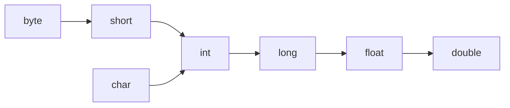

<div class="flex flex-col justify-center items-center h-full" style="background: #ffffff;">
  <p style="color: #5eada0; font-size: 1rem; font-weight: 600; letter-spacing: 0.2em; text-transform: uppercase; margin-bottom: 1.2rem;">Java Programming Masterclass</p>
  <h1 style="color: #1a5c5c; font-size: 3.4rem; font-weight: 900; line-height: 1.15; margin-bottom: 1.5rem;">Java 語言基礎</h1>
  <div style="height: 4px; width: 320px; background: linear-gradient(90deg, #5eada0, #a7d9d0); border-radius: 2px; margin-bottom: 1.5rem;"></div>
  <p style="color: #4a7c7c; font-size: 1.15rem; font-style: italic;">
    「從變數到輸出格式，打好每一塊程式設計的地基」
  </p>
  <Link to="home" style="color: #9dc4c4; font-size: 0.85rem; margin-top: 2rem; text-decoration: none; letter-spacing: 0.05em;">← 返回目錄</Link>
</div>

<!--
【開場白】
嘿，歡迎回來！上一章我們學會了怎麼跟 Java 打招呼，今天我們要來學「怎麼說話」。寫程式如果不存資料，就像是去餐廳吃飯卻不給餐具一樣尷尬。今天我們要聊變數、資料型態，還有怎麼把輸出印得整齊好看。

【為什麼要學這個？】
這就像是你要開始玩一款角色扮演遊戲，你得先知道角色的血量（HP）、魔力（MP）是用什麼方式存的——是數字？還是「真/假」？搞錯了型態，角色可能連怪都打不到就出問題了。

【今天學完你會能做什麼】
學完這章，我們就能精準控制程式要用多少記憶體，還能寫出一個看起來很專業的「成績單產生器」。
-->

---
layout: default
---

# Outline

- **3-1 認識變數（Variable）**
- **3-2 基本資料型態（Primitive Data Types）**
- **3-3 字串（String）資料型態**
- **3-4 常數（Constant）的觀念**
- **3-5 精準控制格式化的輸出**

<!--
【核心說明】
今天的課程，可以想成是在學怎麼「分類物品」。

【生活化比喻】
想像我們正在搬家：書要放進書箱，易碎品要放進防護箱。這幾個主題，就是我們在 Java 這個大房子裡搬家時的必備技巧。每個小節都環環相扣，漏掉一塊地基，後面就會跟著歪掉。
-->

---
layout: section
class: flex flex-col justify-center items-center text-center
---

# 3-1
# 認識變數

<!--
【開場白】
我們先來認識「變數（variable）」。這個名字聽起來有點抽象，但其實它就是一個暫時存放資料的「容器」而已。
-->

---

# 什麼是變數？

```java
int age = 25;
```

| 部分 | 說明 |
| --- | --- |
| `int` | **資料型態**：告訴 Java 要存什麼種類的資料 |
| `age` | **變數名稱**：你替這塊記憶體空間取的名字 |
| `= 25` | **初始值**：變數第一次存入的值（可省略）|
| `;` | **敘述結尾**：每行 Java 敘述必須以分號結束 |

<!--
【核心說明】
想像我們去租了一個收納櫃，櫃子外面要貼標籤、決定大小，還要把東西放進去——這就是宣告一個變數的過程。

【生活化比喻】
`int age = 25;` 這行程式碼可以拆成四個動作：先決定「要租一個整數規格的櫃子」（`int`），接著「貼上標籤 age」（變數名稱），再「把 25 放進去」（初始值），最後「關上櫃門」（分號結尾）。

⚠️ 易錯點提醒：
Java 是個很「死腦筋」的語言：如果我們租了 `int` 規格的櫃子，卻想塞一個字串進去，編譯器會直接報錯。這叫「靜態型別」——型態一旦決定，這個櫃子就只能裝這種資料。

💼 業界實務：
這也是為什麼宣告變數時，型態要先想清楚。型態選錯，後面要改可能要動到一大片程式碼。
-->

---

# 變數命名規則

| 規則 | 說明 | 範例 |
| --- | --- | --- |
| **合法字元** | 字母、數字、`$`、`_`；**不能**以數字開頭 | `name`, `_id`, `$val` |
| **大小寫區分** | `age` 和 `Age` 是不同的變數 | — |
| **不能用關鍵字** | `int`, `class`, `for` 等保留字不能當名稱 | — |
| **camelCase** | 多個單字時：第一字小寫，後續字首大寫 | `userName`, `totalScore` |

<div class="mt-4 p-3 bg-blue-50 border-l-4 border-blue-400 text-gray-700 text-sm text-left">
💡 名稱要有意義，用完整單字而非縮寫。<code>userName</code> 遠比 <code>un</code> 更易讀。
</div>

<!--
【核心說明】
變數的命名其實分成兩種層次：一種是「語法規定」，不遵守程式就編譯不過；另一種是「命名慣例」，不遵守程式照樣能跑，但會變得很難讀。

【生活化比喻】
語法規定就像是法律，違反了會直接被擋下來（編譯錯誤）；命名慣例則像是穿著禮儀，不照做不會被抓，但大家會覺得這個人不太專業。

💼 業界實務：
如果我們把變數取名為 `a1`、`a2`、`temp_val`，同事看到程式碼時可能完全猜不到它的用途。改用 `userName`、`totalPrice` 這種一看就懂的「小駝峰命名法（camelCase）」，團隊合作時會省下很多溝通成本。
-->

---

# 變數的三種分類

| 類別 | 位置 | 特性 | 預設值 |
| --- | --- | --- | --- |
| **區域變數** | 方法（method）內 | 只在宣告的方法內有效，**無預設值** | 無（必須初始化）|
| **實例變數** | 類別內，方法外 | 每個物件各有獨立一份 | 有（int → 0）|
| **類別變數** | 加上 `static` | 所有物件共用同一份 | 有（int → 0）|

```java
public class Demo {
    int score = 0;          // 實例變數
    static int count = 0;   // 類別變數（static）

    void method() {
        int local = 10;     // 區域變數，必須初始化
    }
}
```

<!--
【核心說明】
變數宣告的「位置」會決定它的生命週期跟可見範圍，這三種分類就是依位置區分的。

【生活化比喻】
「區域變數」就像是私房錢，只有自己（方法內）知道，而且要自己記得裡面有多少（必須初始化），不然就沒得用。「實例變數」像是每個房間各自的冷氣遙控器——每個物件（房間）都有自己獨立的一份。「類別變數」則像是客廳的電視機，全家人（所有物件）共用同一台。

⚠️ 易錯點提醒：
初學者最常犯的錯，就是宣告了區域變數 `int x;` 卻不賦值就想拿來用。這時候 Java 會直接報錯：「都還沒存值，要拿什麼？」區域變數沒有預設值，這點跟實例變數、類別變數不一樣。
-->

---

# var 型態推斷（Java 10+）

```java
// 傳統寫法
String name = "炭治郎";
int score = 100;

// var：讓編譯器自動推斷型態
var name = "炭治郎";  // 推斷為 String
var score = 100;      // 推斷為 int
var list = new ArrayList<String>(); // 推斷為 ArrayList<String>
```

<div class="mt-4 p-3 bg-blue-50 border-l-4 border-blue-400 text-gray-700 text-sm text-left">
💡 <code>var</code> 只能用在<b>區域變數</b>，且必須在宣告時同時賦值，讓編譯器有足夠資訊推斷型態。型態在編譯後是固定的，不是動態型別。
</div>

<!--
【核心說明】
`var` 是 Java 10 開始提供的「型態推斷」語法，重點是：它不是動態型別，型態在編譯後還是固定的，只是讓我們少打一些字。

【生活化比喻】
這就像我們拿著一瓶飲料去結帳，店員（編譯器）看一眼就知道那是什麼，不需要我們特別說明。但前提是手上要有東西（賦值）——如果兩手空空只說「`var x;`」，店員（編譯器）會完全搞不清楚這是什麼，直接報錯。

💼 業界實務：
`var` 在處理很長、很複雜的型態名稱（例如泛型容器）時特別好用，可以讓程式碼清爽不少。但不建議濫用：像 `var score = 100;` 這種一看就懂的簡單型態，直接寫 `int` 反而更清楚。

⚠️ 易錯點提醒：
`var` 只能用在區域變數，而且宣告時必須同時賦值，否則編譯器沒辦法推斷型態。
-->

---
layout: default
---

# 練習：變數分類與初始化
### 任務說明

觀察下面這個類別，回答兩個問題：

```java
public class Player {
    int level = 1;
    static int playerCount = 0;

    void levelUp() {
        int bonus;
        level = level + 1;
        System.out.println(level + bonus);
    }
}
```

1. 分別指出 `level`、`playerCount`、`bonus` 屬於哪一種變數（區域 / 實例 / 類別）？
2. 這段程式碼**無法編譯**，問題出在哪一行？為什麼？

<!--
【任務鋪陳】
這題把三種變數分類放進同一個類別裡，讓大家練習「看宣告位置判斷分類」，再加上一個刻意藏的編譯錯誤。

【引導思考】
`level` 宣告在類別裡、方法外；`playerCount` 多了 `static`；`bonus` 宣告在方法內。對照「變數的三種分類」那張表，分別屬於哪一種？再想想：哪一種變數沒有預設值？

【等待與觀察】
給大家 4 分鐘。提示：錯誤跟 `bonus` 有關。
-->

---
layout: default
---

# 練習：變數分類與初始化
### 解題提示

| 變數 | 分類 | 原因 |
| --- | --- | --- |
| `level` | 實例變數 | 宣告在類別內、方法外，沒有 `static` |
| `playerCount` | 類別變數 | 有 `static`，所有物件共用 |
| `bonus` | 區域變數 | 宣告在方法內 |

**編譯錯誤在哪？**
`System.out.println(level + bonus)` 這一行——`bonus` 是區域變數，**沒有預設值**，宣告後沒有賦值就直接使用，編譯器會報錯「variable bonus might not have been initialized」。

**修正：** 補上 `int bonus = 0;`（或在使用前賦值）。

<!--
【帶讀解法】
這題呼應「變數的三種分類」表格裡的最後一欄——只有區域變數沒有預設值，這也是初學者最常踩到的編譯錯誤之一。記住：區域變數「宣告」跟「賦值」缺一不可。
-->

---
layout: section
class: flex flex-col justify-center items-center text-center
---

# 3-2
# 基本資料型態

<!--
【開場白】
接下來進入「基本資料型態（primitive data types）」。Java 準備了 8 種不同大小的「房間」來存資料，它們是語言中最基本的單位，直接存在記憶體的 stack（堆疊）上。
-->

---

# 8 種基本資料型態

| 型態 | 大小 | 範圍 | 預設值 | 包裝類別 |
| --- | --- | --- | --- | --- |
| `byte` | 8 bit | -128 ~ 127 | `0` | `Byte` |
| `short` | 16 bit | -32,768 ~ 32,767 | `0` | `Short` |
| `int` | 32 bit | -2³¹ ~ 2³¹-1（約 ±21 億）| `0` | `Integer` |
| `long` | 64 bit | -2⁶³ ~ 2⁶³-1 | `0L` | `Long` |
| `float` | 32 bit | IEEE 754 單精度 | `0.0f` | `Float` |
| `double` | 64 bit | IEEE 754 雙精度 | `0.0` | `Double` |
| `boolean` | 1 bit | `true` / `false` | `false` | `Boolean` |
| `char` | 16 bit | `` ~ `￿`（0~65535）| `` | `Character` |

<!--
【核心說明】
這 8 種型態就像是 8 種不同尺寸的收納盒，依照要放的東西大小來挑選。這張表先記兩個重點：整數的預設型態是 `int`，小數的預設型態是 `double`。

【生活化比喻】
`byte` 像是小小的火柴盒，只能放極少量的東西；`int` 是最常用的標準收納箱，幾乎萬用；`double` 像是一個精密的天平，能量出很細的小數；`boolean` 則像電燈開關，只有開／關兩種狀態。

⚠️ 易錯點提醒：
很多人會分不清 `int` 和 `Integer`。小寫的 `int` 是 primitive（基本型態）；大寫的 `Integer` 是包裝類別（物件）。我們先從 primitive 開始熟悉，包裝類別會在後面章節介紹。
-->

---

# 整數型態 — 範例

```java
byte b = 127;          // 最大 127
short s = 32_000;      // 底線是合法的數字分隔符（Java 7+）
int population = 23_570_000;
long bigNum = 9_876_543_210L; // L 或 l 結尾代表 long
```

<div class="mt-4 p-3 bg-blue-50 border-l-4 border-blue-400 text-gray-700 text-sm text-left">
💡 <b>注意：</b>long 字面值必須加 <code>L</code> 後綴，否則超出 int 範圍時會編譯錯誤。數字中間可以用 <code>_</code> 分隔提高可讀性，不影響值。
</div>

<!--
【範例目的】
這個範例示範整數型態怎麼宣告，以及數字較大時要注意什麼。

【帶讀關鍵行】
如果要存到幾十億以上的數字，`int` 就裝不下了，這時候要用 `long`，而且必須在數字後面加上大寫的 `L`。

⚠️ 易錯點提醒：
`long` 字面值忘記加 `L`，當數字超出 `int` 的範圍時會直接編譯錯誤。另外，數字中間的底線 `_` 只是方便閱讀用的分隔符，不會影響實際的值。

【預期結果】
這幾行程式碼都會正常編譯、賦值成功；`bigNum` 因為加了 `L`，可以存到超過 int 範圍的大數字。
-->

---

# 浮點數型態 — 範例

```java
float f = 3.14f;        // f 或 F 結尾
double d = 3.14159265;  // 預設是 double（不用後綴）
double sci = 1.5E10;    // 科學記號：1.5 × 10¹⁰
```

<div class="mt-4 p-3 bg-blue-50 border-l-4 border-blue-400 text-gray-700 text-sm text-left">
⚠️ <b>精度警告：</b>浮點數無法精確表示所有小數。<code>0.1 + 0.2</code> 在 Java 中並不等於 <code>0.3</code>。需要精確計算（如金融）請使用 <code>BigDecimal</code>。
</div>

<!--
【範例目的】
這個範例示範 `float`、`double` 的宣告方式，以及科學記號的寫法。

【帶讀關鍵行】
`float` 的後綴 `f` 不能省略，否則 Java 會把這個數字當成 `double`，硬塞進 `float` 變數時會編譯錯誤。`double` 不需要後綴，因為它本身就是小數的預設型態。

⚠️ 易錯點提醒：
浮點數無法精確表示所有小數，`0.1 + 0.2` 在 Java 裡並不等於 `0.3`。如果是金額計算這種需要精確到小數點的場景，務必不要用 `float` 或 `double`，要改用 `BigDecimal`，否則累積的誤差可能會讓帳務對不上。

【預期結果】
三行都會正常編譯；`sci` 的值是 1.5 × 10¹⁰，也就是 15000000000.0。
-->

---

# boolean 與 char — 範例

```java
boolean isLoggedIn = true;
boolean hasPassed = (score >= 60); // 運算式結果

char grade = 'A';
char unicode = '彎'; // 弓字，Unicode 表示法
char next = (char)('A' + 1); // 'B'，char 可做算術
```

<!--
【範例目的】
這個範例示範 `boolean` 跟 `char` 的基本用法，以及 `char` 一個比較特別的小知識。

【帶讀關鍵行】
`boolean` 只有 `true` / `false` 兩種值，常常拿來存運算式的結果，例如 `score >= 60` 的結果就是一個 boolean。`char` 用單引號包住單一字元，跟字串的雙引號不一樣。

⚠️ 易錯點提醒：
`char` 只能放「一個」字元，塞兩個字元進去會編譯錯誤，而且一定要用單引號。最後一行比較特別：`char` 其實是用 16 位元的數字表示字元的，所以 `'A' + 1` 會變成 `'B'`，因為它們在底層是相鄰的數字編碼。

【預期結果】
`grade` 會是 `'A'`，`next` 經過轉型後會是 `'B'`。
-->

---

# 型態轉換 — 擴大轉換（Widening）

自動發生，從小型態轉大型態，不會遺失資料：

```java
byte b = 10;
int i = b;      // byte → int，自動轉換
long l = i;     // int → long，自動轉換
double d = l;   // long → double，自動轉換
```

<div class="flex justify-center mt-4">



</div>

<!--
【核心說明】
擴大轉換（widening）是指把小範圍的型態，自動轉成大範圍的型態，因為資料量變大不會造成任何遺失，所以 Java 會自動幫我們完成。

【生活化比喻】
這就像是把小杯飲料倒進大杯子裡，完全不會溢出來。這種「安全」的轉換，Java 不需要我們特別寫轉型語法，會自動處理。圖裡的箭頭方向，就是型態可以自動升級的路線。

💼 業界實務：
理解這張圖，有助於我們判斷哪些賦值是安全的、哪些需要額外的轉型語法。下一頁會講「反過來」的情況。
-->

---

# 型態轉換 — 縮小轉換（Narrowing）

必須手動加上轉型語法 `(目標型態)`，可能遺失資料：

```java
double d = 100.99;
int i = (int) d;   // 強制轉型：小數部分直接截掉 → 100

int big = 257;
byte b = (byte) big; // 257 % 256 = 1（溢位截斷）
```

<div class="mt-4 p-3 bg-blue-50 border-l-4 border-blue-400 text-gray-700 text-sm text-left">
⚠️ <b>資料遺失：</b>縮小轉換不是四捨五入，是直接截斷。<code>100.99</code> 轉成 int 會變成 <code>100</code>，而非 <code>101</code>。
</div>

<!--
【核心說明】
縮小轉換（narrowing）是把大範圍的型態，轉成小範圍的型態，因為資料可能裝不下，所以 Java 要求我們手動加上 `(目標型態)` 這個轉型語法，等於是明確告訴編譯器：「我知道可能有資料會被截掉，這是我自己的決定」。

【生活化比喻】
這就像是要把一大箱東西塞進小箱子，多出來的部分就會被切掉。`(int)` 這種寫法，就是我們主動簽下的「切結書」。

⚠️ 易錯點提醒：
轉型不是四捨五入！`100.99` 轉成 `int` 會直接變成 `100`，小數部分被整個截掉，不是進位也不是捨去到最接近的整數。`int` 轉 `byte` 如果超出範圍，則會用「溢位截斷」的方式處理（例如 257 變成 1）。
-->

---

# Autoboxing — 自動裝箱

```java
// Autoboxing：primitive → 包裝類別（自動）
int score = 95;
Integer boxed = score; // 等同 Integer.valueOf(95)

// Unboxing：包裝類別 → primitive（自動）
Integer wrapped = Integer.valueOf(100);
int plain = wrapped;   // 等同 wrapped.intValue()
```

<div class="mt-4 p-3 bg-blue-50 border-l-4 border-blue-400 text-gray-700 text-sm text-left">
💡 <b>何時需要包裝類別？</b>泛型容器（如 <code>ArrayList&lt;Integer&gt;</code>）只能存物件，不能存 primitive，這時就需要 <code>Integer</code> 而非 <code>int</code>。
</div>

<!--
【核心說明】
Autoboxing（自動裝箱）跟 Unboxing（自動拆箱）是 Java 在 primitive 型態和包裝類別之間建立的自動轉換機制。

【生活化比喻】
當我們需要把 `int` 放進只能裝物件的容器（例如 `ArrayList`）時，Java 會自動幫它「穿上外套」變成 `Integer`；取出來要用的時候，又會自動「脫掉外套」變回 `int`，整個過程不需要我們手動呼叫轉換方法。

💼 業界實務：
這個機制雖然方便，但在大量迴圈中頻繁地裝箱、拆箱會有效能耗損。如果程式碼對效能要求很高，我們會盡量直接使用 primitive 型態，避免不必要的裝箱。
-->

---
layout: default
---

# 練習：型態轉換與溢位
### 任務說明

請寫出以下程式碼執行後，每個變數的值，並說明原因：

```java
double price = 99.99;
int rounded = (int) price;

int big = 130;
byte small = (byte) big;

int score = 100;
long total = score * 1_000_000_000L;
```

<!--
【任務鋪陳】
這題把「縮小轉換」「溢位截斷」「字面值後綴」三個觀念放在一起，每個變數對應一個重點。

【引導思考】
`(int) price` 是四捨五入還是直接砍掉小數？`byte` 的範圍是 -128~127，130 超出範圍會發生什麼事？`score * 1_000_000_000L` 裡，`L` 加在哪個數字上會影響計算過程嗎？
-->

---
layout: default
---

# 練習：型態轉換與溢位
### 解題提示

| 變數 | 值 | 原因 |
| --- | --- | --- |
| `rounded` | `99` | `(int)` 縮小轉換是**直接截斷**小數，不是四捨五入 |
| `small` | `-126` | `130` 超出 `byte`（-128~127）範圍，溢位後從負數重新計算（130 - 256 = -126） |
| `total` | `100000000000` | `1_000_000_000L` 已是 `long`，運算時 `score` 會自動 widening 成 `long`，不會在 `int` 階段就溢位 |

<!--
【帶讀解法】
這題最容易答錯的是 `small`：很多人會以為超出範圍會出現編譯錯誤或變成 127，但實際上 Java 會做「溢位截斷」，用二進位的角度重新解讀這個數字。`total` 則是測試大家是否注意到 `L` 後綴的位置——只要算式裡有一個運算元是 `long`，整個運算式就會以 `long` 進行，避免中間結果先在 `int` 溢位。
-->

---
layout: section
class: flex flex-col justify-center items-center text-center
---

# 3-3
# 字串（String）資料型態

<!--
【開場白】
接下來聊聊 `String`（字串）。`String` 幾乎出現在每一個 Java 程式裡，但要注意，它不是 primitive，而是一個 class（類別）。
-->

---

# String 的宣告與特性

```java
String name = "炭治郎";      // 字面值宣告（推薦）
String empty = "";           // 空字串
String nullStr = null;       // null：不指向任何物件
```

| 特性 | 說明 |
| --- | --- |
| **不可變（Immutable）** | 字串一旦建立就不能修改，任何操作都產生新字串 |
| **類別型態** | `String` 是類別，首字大寫；primitive 都是小寫 |
| **字串池（String Pool）** | 相同字面值會指向同一個物件，節省記憶體 |

<!--
【核心說明】
`String` 最重要的特性是「不可變（immutable）」——一旦建立，內容就不能被修改。

【生活化比喻】
字串一旦建立，就像刻在石頭上的字。我們說要「修改」它，其實是拿了一塊新石頭重新刻字，再把舊的丟掉。原來那塊石頭內容永遠不會變。

⚠️ 易錯點提醒：
`String` 開頭是大寫的 `S`，代表它是一個 class，不是 primitive。另外要注意「字串池（String Pool）」的存在：相同字面值的字串會指向同一個物件，這跟下一頁要講的字串比較有直接關係。
-->

---

# String 常用操作（基本篇）

| 方法 | 說明 |
| --- | --- |
| `str.length()` | 字串長度（字元數）|
| `str.charAt(i)` | 取得索引 i 的字元 |
| `str.substring(begin, end)` | 擷取子字串 [begin, end-1] |
| `str.toUpperCase()` | 轉大寫 |
| `str.toLowerCase()` | 转小寫 |

```java
String s = "Hello";
System.out.println(s.length());      // 5
System.out.println(s.charAt(0));     // 'H'
System.out.println(s.substring(1, 4)); // "ell"
```

<div class="mt-4 p-3 bg-blue-50 border-l-4 border-blue-400 text-gray-700 text-sm text-left">
💡 String 完整的方法庫在 <b>Ch12 字元與字串類別</b> 中詳細介紹。
</div>

<!--
【範例目的】
這個範例示範幾個最常用的 `String` 方法：取得長度、取出某個位置的字元、擷取子字串。

【帶讀關鍵行】
`charAt(0)` 取出的是「第 0 個」字元，`substring(1, 4)` 擷取的範圍是索引 1 到 3（不包含索引 4）。

⚠️ 易錯點提醒：
Java 的索引是從 0 開始算的，這跟我們平常數東西「從 1 開始」的習慣不一樣，剛開始很容易差一位。

【預期結果】
依序印出 `5`、`H`、`ell`。
-->

---

# String 的串接與比較

```java
String first = "炭";
String last = "治郎";

// 串接
String full = first + last;           // "炭治郎"
String full2 = first.concat(last);    // 同上

// 比較（重要！）
String a = "Java";
String b = new String("Java");
System.out.println(a == b);           // false（位址不同）
System.out.println(a.equals(b));      // true（內容相同）
```

<div class="mt-4 p-3 bg-blue-50 border-l-4 border-blue-400 text-gray-700 text-sm text-left">
⚠️ <b>比較字串內容一律用 <code>equals()</code></b>，不能用 <code>==</code>。<code>==</code> 比的是記憶體位址，不是內容。
</div>

<!--
【範例目的】
這個範例示範字串的串接，以及最重要的「字串比較」陷阱。

【帶讀關鍵行】
`a == b` 比較的是「兩個變數是不是指向同一個物件」；`a.equals(b)` 比較的才是「兩個字串的內容是否相同」。

⚠️ 易錯點提醒：
這是 Java 最常見的地雷之一：比較字串內容一律要用 `equals()`，絕對不要用 `==`。`==` 比的是記憶體位址，就像問「你們住在同一個地址嗎」；`equals()` 才是問「你們長得一樣嗎」。兩個內容相同的字串，住址未必相同，用 `==` 就會得到意外的 `false`。

【預期結果】
`a == b` 印出 `false`；`a.equals(b)` 印出 `true`。
-->

---
layout: default
---

# 練習：字串比較與不可變性
### 任務說明

請寫出以下程式碼每一行的輸出結果：

```java
String a = "Java17";
String b = "Java17";
String c = new String("Java17");

System.out.println(a == b);
System.out.println(a == c);
System.out.println(a.equals(c));

String d = a.concat(" 課程");
System.out.println(a);
System.out.println(d);
```

<!--
【任務鋪陳】
這題把「字串池」「== vs equals」「不可變性」三個重點放在一起，每一行輸出都對應一個關鍵概念。

【引導思考】
`a` 和 `b` 是兩個字面值，會不會指向字串池裡的同一個物件？`c` 用 `new` 建立，跟 `a` 是同一個物件嗎？最後 `a.concat(" 課程")` 執行之後，`a` 本身的內容變了嗎？
-->

---
layout: default
---

# 練習：字串比較與不可變性
### 解題提示

```
true    // a == b：字面值相同，字串池中是同一個物件
false   // a == c：c 用 new 建立，是不同物件（不同位址）
true    // a.equals(c)：內容相同
Java17  // a 沒有改變——concat() 不會修改原字串
Java17 課程  // d 是 concat() 產生的新字串
```

<!--
【帶讀解法】
這題的核心是「不可變性（immutable）」：`a.concat(" 課程")` 並不會修改 `a` 本身，而是**回傳一個新的字串**，所以一定要用 `d` 接住結果，`a` 印出來仍然是原本的內容。前三行則驗收字串池與 `==`/`equals()` 的差異——`new String(...)` 是唯一會強制建立新物件、讓 `==` 變成 `false` 的寫法。
-->

---
layout: section
class: flex flex-col justify-center items-center text-center
---

# 3-4
# 常數（Constant）的觀念

<!--
【開場白】
有些值從建立之後就不應該再被改變，例如圓周率。Java 提供了 `final` 關鍵字，讓我們可以「鎖住」這些值。
-->

---

# final 關鍵字

```java
final int MAX_SCORE = 100;
MAX_SCORE = 200; // ❌ 編譯錯誤：無法重新賦值
```

| 項目 | 說明 |
| --- | --- |
| `final` | 讓變數在第一次賦值後就不可再更改 |
| 命名慣例 | 全大寫，多字以底線分隔（`MAX_SIZE`、`PI`）|
| 賦值時機 | 宣告時或建構子內（擇一），之後不能再改 |

<!--
【核心說明】
`final` 的意思是「第一次賦值之後就不能再改」，常用來定義常數（constant）。

【生活化比喻】
這就像是幫變數裝上一個防護罩：第一次賦值之後，這個值就被鎖住了，之後再嘗試修改，編譯器會直接擋下來。

💼 業界實務：
常數命名習慣全大寫、多字以底線分隔，例如 `MAX_RETRY_COUNT`。如果寫成 `final int a = 10;`，雖然程式能跑，但完全看不出這個值的意義，團隊合作時很容易讓人困惑。
-->

---

# static final — 類別層級的常數

```java
public class MathConstants {
    public static final double PI = 3.14159265358979;
    public static final int EARTH_RADIUS_KM = 6371;
}

// 使用（不需要建立物件）
System.out.println(MathConstants.PI);
```

<div class="mt-4 p-3 bg-blue-50 border-l-4 border-blue-400 text-gray-700 text-sm text-left">
💡 <b>static final 組合</b> 是定義「類別常數」的標準寫法。<code>static</code> 讓所有物件共用同一份，<code>final</code> 確保值不被修改。JDK 的 <code>Math.PI</code>、<code>Integer.MAX_VALUE</code> 都是這樣定義的。
</div>

<!--
【核心說明】
`static final` 組合是定義「類別常數」的標準寫法：`static` 讓所有物件共用同一份，`final` 確保這份值不會被修改。

【生活化比喻】
`static` 就像是全家共用的同一份東西，不會每個人各自有一份；`final` 則是規定這份東西不能被更動。把常用的設定值（網址、上限值等）寫成 `static final`，之後要修改時只需要改一個地方，就能套用到整個程式。

💼 業界實務：
JDK 裡的 `Math.PI`、`Integer.MAX_VALUE` 都是用這種方式定義的，是 Java 中非常標準的常數寫法。
-->

---

# 常數的好處

```java
// ❌ 神秘數字（Magic Number）— 難以維護
if (score >= 60) { ... }
double area = 3.14159 * r * r;

// ✅ 使用常數 — 意圖清晰，易於維護
final int PASS_SCORE = 60;
final double PI = 3.14159265;

if (score >= PASS_SCORE) { ... }
double area = PI * r * r;
```

<!--
【核心說明】
程式碼裡直接出現的數字（像 `60`、`3.14159`）稱為「神秘數字（magic number）」，閱讀的人完全看不出它的意義。

【生活化比喻】
想像我們看到一段程式碼寫 `if (status == 4) ...`，4 到底代表什麼意思？但如果寫成 `if (status == STATUS_SUCCESS) ...`，意思就一目了然。

💼 業界實務：
用常數取代神秘數字，是程式碼可讀性與可維護性的基本功——之後要調整及格線、稅率這類數值時，只需要改常數的定義，不用在整份程式碼裡到處找數字。
-->

---
layout: default
---

# 練習：消除神秘數字
### 任務說明

下面這段程式碼可以正確執行，但裡面有 3 個「神秘數字」。請把它們改成符合命名慣例的常數（`static final`）：

```java
public class Order {
    public static void main(String[] args) {
        int quantity = 5;
        double total = quantity * 99.5;

        if (total > 1000) {
            total = total * 0.9;
        }
        System.out.println(total);
    }
}
```

<!--
【任務鋪陳】
這段程式碼裡的 `99.5`（單價）、`1000`（折扣門檻）、`0.9`（折扣係數），對閱讀的人來說都是「看不出意義的數字」。

【引導思考】
這三個數字分別代表什麼意義？依照命名慣例，常數名稱應該怎麼取（全大寫、底線分隔）？要宣告成類別層級的常數，需要加哪兩個關鍵字？
-->

---
layout: default
---

# 練習：消除神秘數字
### 解題提示

```java
public class Order {
    static final double UNIT_PRICE = 99.5;
    static final double DISCOUNT_THRESHOLD = 1000;
    static final double DISCOUNT_RATE = 0.9;

    public static void main(String[] args) {
        int quantity = 5;
        double total = quantity * UNIT_PRICE;

        if (total > DISCOUNT_THRESHOLD) {
            total = total * DISCOUNT_RATE;
        }
        System.out.println(total);
    }
}
```

<!--
【帶讀解法】
重構之後，`if (total > DISCOUNT_THRESHOLD)` 比 `if (total > 1000)` 更容易看出「這是在比較折扣門檻」，之後如果單價或折扣率調整，只需要改常數宣告那一行，不用在程式裡到處找數字。
-->

---
layout: section
class: flex flex-col justify-center items-center text-center
---

# 3-5
# 精準控制格式化的輸出

<!--
【開場白】
最後，我們要學怎麼把輸出印得更整齊。`System.out.println` 已經不夠用了，我們需要更精準的工具——`printf`。
-->

---

# printf 格式語法

`System.out.printf(格式字串, 引數1, 引數2, ...)`

格式規範語法：`%[旗標][寬度][.精確度]轉換字元`

| 轉換字元 | 說明 | 範例輸入 | 輸出 |
| --- | --- | --- | --- |
| `%d` | 十進位整數 | `printf("%d", 100)` | `100` |
| `%f` | 浮點數（預設 6 位小數）| `printf("%f", 3.14)` | `3.140000` |
| `%s` | 字串 | `printf("%s", "Java")` | `Java` |
| `%c` | 單一字元 | `printf("%c", 'A')` | `A` |
| `%b` | 布林值 | `printf("%b", true)` | `true` |
| `%n` | 平台換行符（推薦取代 `\n`）| — | 換行 |

<div class="mt-4 p-3 bg-blue-50 border-l-4 border-blue-400 text-gray-700 text-sm text-left">
💡 <b>進階格式：</b>寬度、精確度、千分位、正負號等進階旗標的組合用法，收錄在「進階／自學」內容中，有興趣可以延伸學習。
</div>

<!--
【核心說明】
`printf` 可以想成是一種「填空」的輸出方式：格式字串裡的每個 `%X` 都是一個空格，後面的引數會依序填進去。

【生活化比喻】
`%d` 是留給整數的空格，`%f` 是留給小數的空格，`%s` 是留給字串的空格。`%n` 則是換行符號，它會依照作業系統自動決定怎麼換行，比 `\n` 更穩妥。

⚠️ 易錯點提醒：
`%` 後面的轉換字元要跟引數的型態對應，例如把字串傳給 `%d` 會在執行時噴出例外。引數的數量跟順序也要跟格式字串裡 `%X` 的數量、順序一致。

【預期結果】
這幾個範例分別會印出 `100`、`3.140000`、`Java`、`A`、`true`。
-->

---
layout: default
---

# 練習一：個人資料卡
### 任務說明

宣告以下變數，並用 `printf` 整齊排版輸出：

| 資料 | 型態 | 值 |
| --- | --- | --- |
| 姓名 | `String` | 任意 |
| 年齡 | `int` | 任意 |
| 身高 | `double` | 任意（含小數）|
| 是否在學 | `boolean` | 任意 |

**預期格式：**

```
姓名：炭治郎
年齡：16
身高：165.5 cm
在學：true
```

<!--
【任務鋪陳】
我們剛剛學了 `printf` 的基本轉換字元，現在來實際應用一次。

【引導思考】
試著幫自己做一張數位名片：姓名、年齡、身高、是否在學。想想看，這四種資料分別要用哪個轉換字元？身高是含小數的數字，跟年齡的轉換字元會一樣嗎？
-->

---

# 練習一：解題提示
### 提示說明

1. 宣告四個不同型態的變數並賦值
2. 用 `System.out.printf` 搭配對應的轉換字元：
   - 姓名用 `%s`
   - 年齡用 `%d`
   - 身高用 `%f`（預設會印出 6 位小數）
   - 是否在學用 `%b`

```java
System.out.printf("姓名：%s%n", name);
System.out.printf("年齡：%d%n", age);
System.out.printf("身高：%.1f cm%n", height);
System.out.printf("在學：%b%n", isStudent);
```

<!--
【逐步解說】
注意每行末尾的 `%n` 用來換行。身高如果用 `%f` 會印出一長串小數（例如 165.500000），這裡先用 `%.1f` 取 1 位小數，讓畫面乾淨一點——這個 `.1` 屬於「精確度」的用法，後面在進階內容會有更完整的介紹。
-->

---
layout: section
class: flex flex-col justify-center items-center text-center
---

# 課堂練習
# Practice

<!--
【段落轉換】
這一章學了變數、8 種基本資料型態、String、常數、printf，最後用一個綜合練習把它們全部串起來。
-->

---
layout: default
---

# 綜合練習：書籍訂單計算
### 任務說明

請撰寫一個程式 `BookOrder.java`，完成以下需求：

1. 宣告常數 `TAX_RATE`（稅率，`static final double`，值為 `0.05`）
2. 宣告變數：書名（`String`）、單價（`double`）、數量（`int`）
3. 計算未稅小計 `subtotal = 單價 * 數量`
4. 計算含稅總價 `total = subtotal * (1 + TAX_RATE)`
5. 用 `printf` 輸出書名、小計、總價（總價取小數點後 2 位）

**預期輸出範例：**
```
書名：Java 程式設計
小計：1500.0
總價：1575.00
```

<!--
【任務鋪陳】
這是這一章的綜合練習，會用到：常數（`TAX_RATE`）、不同型態的變數（`String`/`double`/`int`）、算術運算與型態互動、以及 `printf` 格式化輸出。

【引導思考】
`TAX_RATE` 要宣告在哪裡，才能在 `main` 裡直接用？小計跟總價的型態應該是什麼？`printf` 的書名、小計、總價分別要用哪個轉換字元？

【等待與觀察】
給大家 8 分鐘。如果卡住，先把四個變數（含常數）都宣告好，再一步一步算出 `subtotal` 跟 `total`。
-->

---
layout: default
---

# 綜合練習：書籍訂單計算
### 解題提示

```java
public class BookOrder {
    static final double TAX_RATE = 0.05;

    public static void main(String[] args) {
        String title = "Java 程式設計";
        double price = 300.0;
        int quantity = 5;

        double subtotal = price * quantity;
        double total = subtotal * (1 + TAX_RATE);

        System.out.printf("書名：%s%n", title);
        System.out.printf("小計：%.1f%n", subtotal);
        System.out.printf("總價：%.2f%n", total);
    }
}
```

<!--
【帶讀解法】
`TAX_RATE` 宣告成 `static final`，跟 `main` 一樣是類別層級的成員，所以可以直接在 `main` 裡使用，不需要建立物件。`subtotal` 跟 `total` 都宣告成 `double`，因為含稅之後幾乎一定會出現小數。最後用 `printf` 搭配 `%.2f` 控制總價只顯示 2 位小數，呼應 3-5 學過的格式化輸出。

💼 業界實務：
像稅率這種「全公司都要一致」的數值，幾乎一定會定義成常數（甚至寫在設定檔裡），絕對不會直接寫死在計算的那一行程式碼中。
-->

---
layout: section
class: flex flex-col justify-center items-center text-center
---

# Q & A

<!--
【開場白】
今天我們打好了 Java 的地基：變數、資料型態、String、常數、格式化輸出。

【總結提問】
這個「置物櫃」已經準備好了，大家想往裡面塞什麼？關於變數的型態選擇、`String` 的比較方式，或是 `printf` 的格式語法，都歡迎提出來一起討論。
-->
