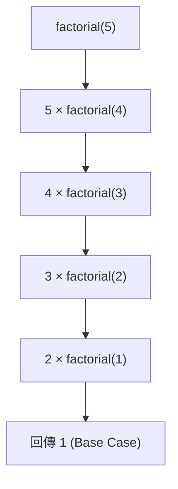
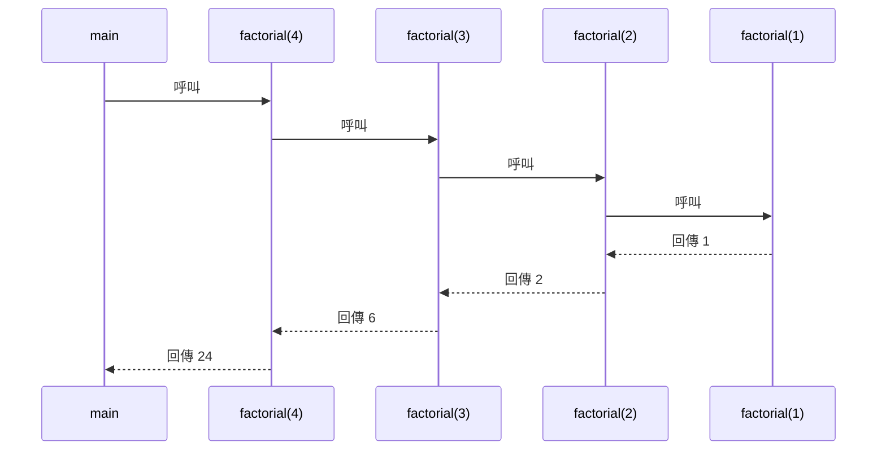
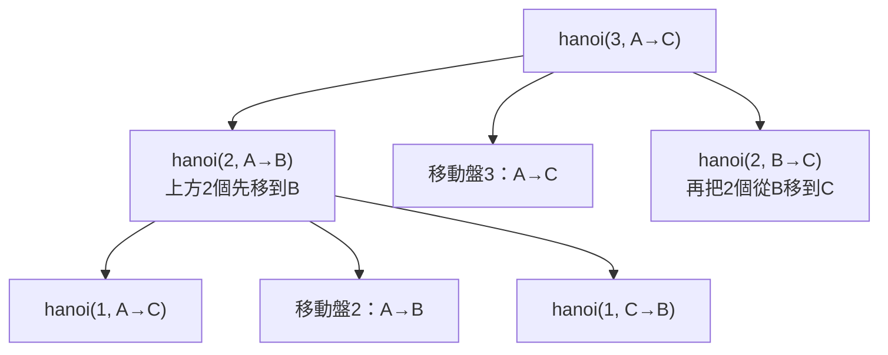

<div class="flex flex-col justify-center items-center h-full" style="background: #ffffff;">
  <p style="color: #5eada0; font-size: 1rem; font-weight: 600; letter-spacing: 0.2em; text-transform: uppercase; margin-bottom: 1.2rem;">Java Programming Masterclass</p>
  <h1 style="color: #1a5c5c; font-size: 3.4rem; font-weight: 900; line-height: 1.15; margin-bottom: 1.5rem;">類別與物件</h1>
  <div style="height: 4px; width: 320px; background: linear-gradient(90deg, #5eada0, #a7d9d0); border-radius: 2px; margin-bottom: 1.5rem;"></div>
  <p style="color: #4a7c7c; font-size: 1.15rem; font-style: italic;">進階自學內容</p>
  <Link to="home" style="color:#9dc4c4;font-size:0.85rem;margin-top:2rem;text-decoration:none;letter-spacing:0.05em;">← 返回目錄</Link>
</div>

<!--
哈囉大家，歡迎來到「類別與物件」的進階自學篇！基礎版我們已經學會怎麼定義 class、建立物件、操作欄位與方法，這份自學內容會帶我們往兩個方向延伸：一個是「用更簡潔的方式建立陣列資料」，另一個是「用程式自己呼叫自己」來解決問題。

為什麼要學這些？因為實務上常常會遇到「只用一次的資料」，每次都宣告變數很麻煩；而遞迴雖然一開始比較抽象，但它是後面學習樹狀結構、檔案系統走訪、演算法的基礎。

學完這份自學內容，我們會知道什麼是匿名陣列、什麼是遞迴、以及如何用遞迴解出經典的河內塔問題。準備好就開始吧！
-->

---
layout: default
---

# Outline

- **匿名陣列（Anonymous Array）**：不需命名、建立後立即傳入方法的陣列寫法
- **遞迴式方法設計**：Base Case 與 Recursive Case、Call Stack 概念
- **河內塔問題（Tower of Hanoi）**：經典遞迴範例與移動次數分析

<!--
這份自學內容分成三個主題，循序漸進：先看一個小技巧（匿名陣列），讓我們的程式碼更精簡；接著進入主菜——遞迴的基本概念；最後用河內塔這個經典問題，把遞迴的威力完整展示出來。

如果大家還記得基礎版教過的陣列和方法呼叫，這份內容會非常順。準備好的話，我們開始吧！
-->

---
layout: section
class: flex flex-col justify-center items-center text-center
---

# 第一部分
# 匿名陣列

<!--
想像一下，我們寫了一個方法 printSum，專門用來計算陣列裡所有數字的總和。如果這個陣列只會用這一次，之後完全不會再用到，那我們還需要特地宣告一個變數來裝它嗎？

這就是「匿名陣列」要解決的問題——讓我們可以「建立陣列的同時直接把它傳出去」，不用多一行宣告。這個小技巧在實務上很常見，尤其是在呼叫只接受陣列參數的方法時，可以讓程式碼更精簡、更聚焦在邏輯本身。
-->

---
layout: default
---

# 匿名陣列（Anonymous Array）

| 概念 | 說明 |
| --- | --- |
| 定義 | 沒有名稱的陣列，建立後立即使用 |
| 語法 | `new 型別[]{ 值1, 值2, ... }` |
| 用途 | 直接傳入方法，不需暫存變數 |

```java
// 一般寫法（有名稱）
int[] nums = {1, 2, 3};
printSum(nums);

// 匿名陣列（直接傳入）
printSum(new int[]{1, 2, 3});
```

<!--
我們先看上面這個對照表：匿名陣列就是「沒有名字的陣列」，語法是 `new 型別[]{...}`，建立完馬上用，不用先存到變數裡。

帶大家看一下程式碼。一般寫法要先宣告 `int[] nums = {1, 2, 3}`，再把 nums 傳進 printSum；匿名陣列版本則是直接把 `new int[]{1, 2, 3}` 寫在呼叫括號裡，省掉中間那行宣告。

⚠️ 易錯點：匿名陣列前面一定要有 `new 型別[]`，不能只寫 `{1, 2, 3}`——只有在「宣告陣列變數的同時」才能省略 `new`。
-->

---

# 匿名陣列範例

```java
static void printSum(int[] arr) {
    int total = 0;
    for (int n : arr) total += n;
    System.out.println("總和：" + total);
}

public static void main(String[] args) {
    // 直接傳入，不需宣告暫存變數
    printSum(new int[]{10, 20, 30});
    // 輸出：總和：60
}
```

<div class="mt-4 p-3 bg-blue-50 border-l-4 border-blue-400 text-gray-700 text-sm text-left">
💡 <b>適用時機：</b>當陣列只需使用一次，不需要在後續程式中再度存取時，使用匿名陣列可讓程式碼更簡潔。
</div>

<!--
這個範例的目標是：示範匿名陣列怎麼搭配方法呼叫使用。

帶大家看關鍵的那一行：`printSum(new int[]{10, 20, 30})`——我們在呼叫的瞬間建立了一個包含 10、20、30 的陣列，直接交給 printSum 處理，總和算完之後這個陣列就「用完即丟」，不會留下任何變數。

執行結果會印出「總和：60」。下面的提示也說明了使用時機：只用一次、不需要之後再存取的資料，就很適合用匿名陣列。
-->

---
layout: section
class: flex flex-col justify-center items-center text-center
---

# 第二部分
# 遞迴式方法設計

<!--
接下來進入今天的主菜——遞迴（Recursion）。

想像一下，我們要計算 5 的階乘：5! = 5 × 4 × 3 × 2 × 1。如果我們發現「5! = 5 × 4!」、「4! = 4 × 3!」……這種「用自己解決縮小版的自己」的模式，就是遞迴的核心概念。

業界實務上，遞迴常用在樹狀結構走訪（例如檔案目錄、組織架構）、分治演算法（像排序、搜尋）等場景。雖然一開始會覺得有點繞，但掌握 Base Case 和 Recursive Case 這兩個關鍵概念之後，遞迴其實沒有想像中可怕。
-->

---
layout: default
---

# 遞迴的基本概念

| 元素 | 說明 |
| --- | --- |
| **Base Case（終止條件）** | 不再遞迴、直接回傳結果 |
| **Recursive Case（遞迴步驟）** | 呼叫自己，並縮小問題規模 |
| **Call Stack（呼叫堆疊）** | 每次呼叫都會在 stack 新增一層 |

<div class="mt-4 p-3 bg-blue-50 border-l-4 border-blue-400 text-gray-700 text-sm text-left">
💡 <b>關鍵規則：</b>遞迴必須保證每次呼叫都「往 Base Case 靠近」，否則會無限遞迴，最終拋出 <code>StackOverflowError</code>。
</div>

<!--
遞迴方法（recursive method）有兩個必要元素：Base Case 和 Recursive Case。

Base Case 就像樂高積木拆到只剩一塊的時候——不能再拆了，直接給答案。Recursive Case 則是「先拆掉一塊，剩下的部分交給自己處理」。

每次呼叫自己，Java 會在 Call Stack（呼叫堆疊）上多疊一層，就像疊盤子一樣，疊到 Base Case 才開始一層一層收回去。

⚠️ 易錯點：如果忘了寫 Base Case，或者 Recursive Case 沒有讓問題變小，遞迴就會一直疊盤子疊到溢出，拋出 `StackOverflowError`。
-->

---

# Factorial 階乘範例

```java
static int factorial(int n) {
    if (n <= 1) return 1;       // Base Case
    return n * factorial(n - 1); // Recursive Case
}

System.out.println(factorial(5)); // 120
```

呼叫堆疊展開示意：



<!--
這個範例的目標是：用最經典的階乘問題，把 Base Case 和 Recursive Case 對應到實際程式碼。

帶大家看關鍵行：`if (n <= 1) return 1;` 就是 Base Case——當 n 小到 1 或以下，直接回傳 1，不再往下遞迴。`return n * factorial(n - 1);` 則是 Recursive Case——把問題縮小成 factorial(n-1)，自己乘上縮小後的結果。

下方的圖把 factorial(5) 一路展開到 factorial(1) 的過程畫出來，可以看到每一層都在「等待」下一層的結果。

執行結果：`factorial(5)` 會輸出 120。
-->

---

# 遞迴呼叫堆疊展開

以 `factorial(4)` 為例，呼叫與回傳過程：



<!--
這張圖把上一頁的概念再用「時間軸」的角度呈現一次。我們可以看到 main 呼叫 factorial(4)，factorial(4) 又呼叫 factorial(3)……一路往下呼叫，直到 factorial(1) 觸發 Base Case 回傳 1。

然後結果開始「往回傳」：factorial(2) 拿到 1 算出 2，factorial(3) 拿到 2 算出 6，factorial(4) 拿到 6 算出 24，最後回到 main。

這種「先一路往下呼叫，再一路往上回傳」的模式，就是 Call Stack 運作的具體樣子。理解這張圖，之後看到任何遞迴程式，都可以用這個「先下後上」的思維去拆解。
-->

---
layout: default
---

# 練習：遞迴計算次方
### 任務說明

仿照 `factorial` 的寫法，設計一個遞迴方法 `power(int base, int exp)`，計算 `base` 的 `exp` 次方：

- Base Case：當 `exp == 0` 時，回傳 `1`
- Recursive Case：回傳 `base * power(base, exp - 1)`

在 `main` 方法中呼叫 `power(2, 5)`，並印出結果（應為 `32`）。

<!--
【任務鋪陳】
這題完全照搬 `factorial` 的結構，只是把「`n!` = `n × (n-1)!`」換成「`baseᵉˣᵖ` = `base × baseᵉˣᵖ⁻¹`」。目的是讓我們確認自己真的理解 Base Case 和 Recursive Case 的「套路」，而不是死記 `factorial` 這一題。

【引導思考】
想一想：`factorial` 的 Base Case 是 `n <= 1` 回傳 `1`；這題的 Base Case 應該是「exp 等於多少」回傳 `1`？為什麼 `power(2, 5)` 最終會等於 `2 * power(2, 4)`？
-->

---
layout: default
---

# 練習：遞迴計算次方
### 解題提示

```java
static int power(int base, int exp) {
    if (exp == 0) return 1;          // Base Case
    return base * power(base, exp - 1); // Recursive Case
}

public static void main(String[] args) {
    System.out.println(power(2, 5)); // 32
}
```

呼叫堆疊展開：
```
power(2,5) = 2 * power(2,4)
           = 2 * (2 * power(2,3))
           = 2 * (2 * (2 * power(2,2)))
           = ... 
           = 2 * 2 * 2 * 2 * 2 * power(2,0)
           = 2 * 2 * 2 * 2 * 2 * 1 = 32
```

<!--
【帶讀解法】
這題的結構跟 `factorial` 幾乎一模一樣：`if (exp == 0) return 1;` 是 Base Case（任何數的 0 次方都是 1），`base * power(base, exp - 1)` 是 Recursive Case（把指數縮小 1，問題交給自己）。

提醒大家：如果呼叫 `power(2, 5)`，遞迴會一路呼叫到 `power(2, 0)` 才觸發 Base Case，然後一層一層把 `2` 乘回去，總共乘了 5 次 `2`，等於 `32`。能看懂這個展開過程，代表我們已經抓到遞迴的「套路」了。
-->

---
layout: section
class: flex flex-col justify-center items-center text-center
---

# 第三部分
# 河內塔問題

<!--
河內塔（Tower of Hanoi）是遞迴最經典的示範題之一。傳說中有三根柱子和一疊圓盤，僧侶們要把整疊圓盤從一根柱子搬到另一根，但規則是「大盤不能壓在小盤上面」，而且每次只能移動一個盤子。

聽起來像個益智玩具對吧？但它完美展示了遞迴的威力——只要我們相信「把 n-1 個盤子搬到另一根柱子」這件事情，遞迴呼叫自己就能搞定，整個問題就能用短短幾行程式碼解決。

業界實務上，河內塔本身不常直接出現在工作中，但它是訓練「遞迴思維」的最佳教材，理解了它之後，再看其他遞迴演算法會輕鬆很多。
-->

---
layout: default
---

# 河內塔問題說明

| 規則 | 說明 |
| --- | --- |
| 三根柱子 | 起點(A)、中轉(B)、終點(C) |
| n 個圓盤 | 從大到小疊放在 A 上 |
| 目標 | 將所有圓盤移到 C |
| 限制 | 大盤不可壓在小盤上 |

```java
static void hanoi(int n, char from, char aux, char to) {
    if (n == 1) {
        System.out.println("移動盤 1：" + from + " → " + to);
        return;
    }
    hanoi(n - 1, from, to, aux);
    System.out.println("移動盤 " + n + "：" + from + " → " + to);
    hanoi(n - 1, aux, from, to);
}
```

<!--
先看規則：三根柱子 A（起點）、B（中轉）、C（終點），n 個圓盤從大到小疊在 A 上，目標是全部搬到 C，限制是大盤不能壓在小盤上面。

帶大家看程式碼的結構：Base Case 是 `if (n == 1)`——只有一個盤子的時候，直接從 from 移到 to。Recursive Case 則拆成三步：先把上面 n-1 個盤子從 from 移到 aux（借用中轉柱）、再把第 n 個盤子從 from 移到 to、最後把那 n-1 個盤子從 aux 移到 to。

⚠️ 易錯點：這三個步驟的「順序」和「柱子角色（from/aux/to）」很容易搞混，下一頁我們會用圖解把這個邏輯拆開來看。
-->

---

# 河內塔遞迴邏輯

以 n=3 為例，遞迴思維：



<div class="mt-4 p-3 bg-blue-50 border-l-4 border-blue-400 text-gray-700 text-sm text-left">
💡 <b>移動次數：</b>n 個盤子需要 2ⁿ - 1 次移動。n=3 需 7 次，n=10 需 1023 次。
</div>

<!--
這張圖把 hanoi(3, A→C) 拆解成三個子任務：先把上面 2 個盤子搬到 B（暫存）、接著把最大的第 3 個盤子直接搬到 C、最後把暫存在 B 的 2 個盤子搬到 C。而「搬 2 個盤子」這件事，又會繼續往下拆成「搬 1 個盤子」的 Base Case。

可以看到，每一層呼叫都把問題「縮小一個盤子」，直到剩 1 個盤子就直接移動，完全符合我們前面講的 Base Case／Recursive Case 模式。

下方提示告訴我們移動總次數的公式：2ⁿ - 1。n=3 是 7 次，n=10 就要 1023 次——盤子數量每多 1 個，移動次數就會「倍增再加一」，成長速度非常快。
-->

---

# 執行 hanoi(3) 的輸出

```java
hanoi(3, 'A', 'B', 'C');
```

輸出結果：
```
移動盤 1：A → C
移動盤 2：A → B
移動盤 1：C → B
移動盤 3：A → C
移動盤 1：B → A
移動盤 2：B → C
移動盤 1：A → C
```

共 7 次（2³ - 1 = 7）

<!--
這個範例的目標是：把前面的邏輯串起來，看看 hanoi(3, 'A', 'B', 'C') 實際執行會印出什麼。

帶大家對照輸出結果：總共印出 7 行移動紀錄，正好符合 2³ - 1 = 7 的公式。如果我們把每一行的「盤 X：from → to」對照前一頁的圖，會發現順序完全吻合——先處理上面 2 個盤子（移到 B 再移到 C 的過程穿插在中間），再移動最大的盤 3，最後把另外 2 個盤子也歸位到 C。

⚠️ 易錯點：第一次看這個輸出可能會覺得順序很「跳」，建議搭配上一頁的圖一步一步對照，會比死記順序更容易理解。
-->

---
layout: default
---

# 練習：計算河內塔移動次數
### 任務說明

延伸 `hanoi` 方法，設計一個遞迴方法 `countMoves(int n)`，回傳「搬移 n 個盤子總共需要的移動次數」，**不要**用 `2ⁿ - 1` 的公式直接計算，而是用遞迴的方式推導：

- Base Case：當 `n == 1` 時，回傳 `1`（只需移動 1 次）
- Recursive Case：搬 `n` 個盤子 = 搬 `n-1` 個盤子（到中轉柱）+ 移動第 `n` 個盤子（1 次）+ 搬 `n-1` 個盤子（到目標柱）

在 `main` 方法中呼叫 `countMoves(4)`，並印出結果（應為 `15`），同時驗證是否等於 `2⁴ - 1`。

<!--
【任務鋪陳】
這題不是要我們重寫 `hanoi` 的列印邏輯，而是把「河內塔遞迴邏輯」那一頁的三步驟（搬 n-1 個 → 移動第 n 個 → 再搬 n-1 個），轉換成「計算次數」的遞迴關係式。

【引導思考】
想一想：如果搬 `n-1` 個盤子需要 `countMoves(n-1)` 次，那「搬 n 個盤子」的三個步驟裡，前後兩個步驟各需要幾次？中間移動第 n 個盤子又算幾次？把這三個數字加起來會是什麼式子？
-->

---
layout: default
---

# 練習：計算河內塔移動次數
### 解題提示

```java
static int countMoves(int n) {
    if (n == 1) return 1;                     // Base Case
    return countMoves(n - 1)      // 先搬 n-1 個到中轉柱
         + 1                       // 移動第 n 個盤子
         + countMoves(n - 1);      // 再搬 n-1 個到目標柱
}

public static void main(String[] args) {
    int n = 4;
    System.out.println(countMoves(n));        // 15
    System.out.println((int) Math.pow(2, n) - 1); // 15
}
```

<!--
【帶讀解法】
這題的 Recursive Case 直接對應「河內塔遞迴邏輯」那張圖的三個區塊：`countMoves(n-1)` 出現了兩次（先搬到中轉柱、再搬到目標柱），中間的 `+ 1` 就是移動最大的那個盤子。

這個遞迴關係式其實就是數學上的 `T(n) = 2 * T(n-1) + 1`，展開之後正好等於 `2ⁿ - 1`——這也是為什麼前面的提示會說「移動次數是 2ⁿ - 1」。透過這題，我們可以親眼驗證這個公式不是憑空冒出來的，而是從遞迴結構自然推導出來的。
-->

---
layout: section
class: flex flex-col justify-center items-center text-center
---

# 自學練習

<!--
學完匿名陣列和遞迴的概念，我們來做兩題練習，分別練習這兩個主題的應用。
-->

---
layout: default
---

# 練習一：陣列總和與最大值

### 任務說明

延伸匿名陣列的用法，設計兩個方法：

- `sum(int[] arr)` — 回傳陣列所有元素的總和
- `max(int[] arr)` — 回傳陣列中的最大值

在 `main` 方法中，分別使用**匿名陣列**呼叫這兩個方法，傳入 `{4, 8, 15, 16, 23, 42}`，並印出結果。

<!--
回顧一下，我們剛剛學到匿名陣列可以「建立後立即傳入方法」，不需要先宣告變數。這題請大家延伸這個寫法，並多寫一個找最大值的方法。

引導思考：找最大值的時候，要怎麼設定一個「初始最大值」？如果直接設成 0，遇到全部都是負數的陣列會發生什麼問題？
-->

---
layout: default
---

# 練習一：解題提示

### 提示說明

1. `sum` 方法可以參考之前 `printSum` 的寫法，改成 `return total;`：
   ```java
   static int sum(int[] arr) {
       int total = 0;
       for (int n : arr) total += n;
       return total;
   }
   ```
2. `max` 方法可以先把第一個元素當作初始最大值，再逐一比較：
   ```java
   static int max(int[] arr) {
       int m = arr[0];
       for (int n : arr) if (n > m) m = n;
       return m;
   }
   ```
3. 在 `main` 中直接傳入匿名陣列：
   ```java
   System.out.println(sum(new int[]{4, 8, 15, 16, 23, 42}));
   System.out.println(max(new int[]{4, 8, 15, 16, 23, 42}));
   ```

<!--
這題的關鍵在第 2 點：用 `arr[0]` 當作初始最大值，就不會有「初始值該設多少」的困擾，無論陣列裡是正數還是負數都適用。

提醒大家，這題的重點其實不在演算法本身（這在陣列章節就學過了），而是練習「用匿名陣列呼叫方法」這個語法習慣。
-->

---
layout: default
---

# 綜合練習：遞迴計算陣列總和

### 任務說明

請設計一個**遞迴版本**的陣列總和方法 `recursiveSum(int[] arr, int index)`：

- 當 `index` 等於陣列長度時，回傳 0（Base Case）
- 否則回傳 `arr[index] + recursiveSum(arr, index + 1)`（Recursive Case）

在 `main` 方法中，使用匿名陣列 `{1, 2, 3, 4, 5}` 呼叫 `recursiveSum(arr, 0)`，並印出結果（應為 15）。

<!--
這是這份自學內容的綜合練習，把「匿名陣列」和「遞迴」兩個主題結合在一起。

回顧一下，我們在 factorial 範例中看到，遞迴是「用自己解決縮小版的自己」；河內塔則是把一個大問題拆成幾個子任務。這題請大家把同樣的思維套用到「陣列加總」這個我們很熟悉的問題上。

引導思考：為什麼這裡的 Base Case 是「index 等於陣列長度」而不是「index 等於 0」？如果把 `index + 1` 改成 `index - 1`，遞迴的方向會變成怎樣？
-->

---
layout: default
---

# 綜合練習：解題提示

### 提示說明

1. Base Case：當 `index == arr.length` 時，表示已經走訪完所有元素，回傳 0：
   ```java
   static int recursiveSum(int[] arr, int index) {
       if (index == arr.length) return 0;
       return arr[index] + recursiveSum(arr, index + 1);
   }
   ```
2. 呼叫方式：從 `index = 0` 開始，搭配匿名陣列：
   ```java
   System.out.println(recursiveSum(new int[]{1, 2, 3, 4, 5}, 0));
   // 輸出：15
   ```
3. 可以試著畫出類似 factorial 的呼叫堆疊圖，觀察 `recursiveSum` 從 `index=0` 一路呼叫到 `index=5` 觸發 Base Case，再一層一層把數字加總回傳的過程。

<!--
這題的結構跟 factorial 幾乎一樣，只是把「乘法」換成「加法」，把「n-1」換成「index+1」。

提醒大家，遞迴的方向（往大走還是往小走）取決於 Base Case 怎麼設計——這題是「index 從 0 數到 arr.length 就停」，跟 factorial「n 從大數到 1 就停」剛好是相反的方向，但本質上都是「逐步逼近 Base Case」。

如果這題能順利寫出來，就代表我們已經掌握遞迴的核心思維了！
-->

---
layout: end
---
