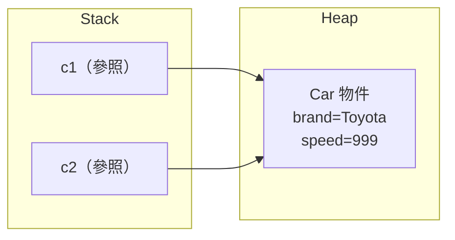

<div class="flex flex-col justify-center items-center h-full" style="background: #ffffff;">
  <p style="color: #5eada0; font-size: 1rem; font-weight: 600; letter-spacing: 0.2em; text-transform: uppercase; margin-bottom: 1.2rem;">Java Programming Masterclass</p>
  <h1 style="color: #1a5c5c; font-size: 3.4rem; font-weight: 900; line-height: 1.15; margin-bottom: 1.5rem;">類別與物件</h1>
  <div style="height: 4px; width: 320px; background: linear-gradient(90deg, #5eada0, #a7d9d0); border-radius: 2px; margin-bottom: 1.5rem;"></div>
  <p style="color: #4a7c7c; font-size: 1.15rem; font-style: italic;">「用類別定義世界，用物件描述個體」</p>
  <Link to="home" style="color: #9dc4c4; font-size: 0.85rem; margin-top: 2rem; text-decoration: none; letter-spacing: 0.05em;">← 返回目錄</Link>
</div>

<!--
哈囉大家，歡迎來到第 8 章「類別與物件」！這是我們正式進入物件導向程式設計（OOP）的第一步。

想想我們之前寫程式的方式：變數、迴圈、陣列，全部都是「散裝」的資料和邏輯。但真實世界的東西——一台車、一個學生、一個帳戶——都同時具備「狀態」和「行為」。如果沒有 class 這個工具，我們很難把這些資料和邏輯包成一個整體來管理。

這一章我們會學到：什麼是類別、什麼是物件、怎麼定義欄位和方法、怎麼建立並操作多個物件，以及物件在記憶體中是怎麼運作的。學完之後，我們就具備了「用 OOP 思維設計程式」的基本能力！
-->

---
layout: default
---

# Outline

- **8-1 認識物件與類別**：類別是藍圖、物件是實例
- **8-2 定義類別與物件**：class 語法、欄位、方法、new 建立物件
- **8-3 類別的基本實例**：完整 Car 類別範例
- **8-4 多個物件的應用**：物件陣列與遍歷
- **8-5 參照資料型態**：複製參照、null 參照
- **8-6 再談方法**：pass by value、多載、this 關鍵字
- **8-7 變數的有效範圍**：local vs instance scope

<!--
這一章我們會分成七個小節循序漸進：先建立「類別 vs 物件」的基本概念，接著學習怎麼定義 class、建立物件；然後透過完整的 Car 範例和多物件應用，把語法練熟；最後談談物件在記憶體中如何運作（參照），以及方法呼叫和變數範圍的一些細節。

每個小節結束都會搭配練習，章節最後也有一題綜合練習，把整章內容串起來。準備好了嗎，我們開始吧！
-->

---
layout: section
class: flex flex-col justify-center items-center text-center
---

# 第一部分
# 認識物件與類別

<!--
想像一下，我們要在程式裡管理「很多台車」的資訊：每台車有品牌、顏色、時速，還能加速、顯示資訊。如果每台車都要分別宣告一堆獨立的變數（car1Brand、car1Speed、car2Brand、car2Speed...），程式會變得又亂又難維護。

這就是物件導向（OOP）要解決的問題：把「同類型的東西」用一張藍圖描述清楚，之後要做幾台車，就照著藍圖「印」出幾個物件，每個物件各自擁有自己的狀態，但共用相同的行為。

這一節我們先建立「類別」和「物件」這兩個核心詞彙的概念，後面所有內容都會建立在這個基礎上。
-->

---
layout: default
---

# 8-1 類別與物件的關係

物件導向程式設計（OOP）的核心思維：

| 概念 | 說明 | 現實比喻 |
| --- | --- | --- |
| **類別 (Class)** | 物件的藍圖／設計圖 | 汽車設計圖 |
| **物件 (Object)** | 類別建立出來的實例 | 根據設計圖製造的汽車 |
| **欄位 (Field)** | 物件的「狀態」（資料） | 顏色、品牌、時速 |
| **方法 (Method)** | 物件的「行為」（動作） | 加速、煞車、開燈 |

<div class="mt-4 p-3 bg-blue-50 border-l-4 border-blue-400 text-gray-700 text-sm text-left">
💡 <b>核心觀念：</b>同一張藍圖可以建造出多台汽車，每台都是獨立的物件，各自擁有不同的狀態（顏色、里程），但行為相同（方法共用）。
</div>

<!--
這張表格把 OOP 最核心的四個詞彙對應到大家熟悉的「汽車」概念：類別（Class）就像汽車的設計圖，物件（Object）就是照著設計圖做出來的實車；欄位（Field）是車子的狀態，像顏色、時速；方法（Method）是車子能做的動作，像加速、煞車。

生活比喻一下：設計圖只有一張，但工廠可以照著它生產出無數台車，每台車的顏色、里程數可能不同（狀態各自獨立），但每台車「加速」的方式都一樣（行為共用）。這就是類別和物件的關係——一個藍圖，多個實例。

業界實務上，幾乎所有 Java 程式都是由大大小小的類別組成，理解這個對應關係，是後面所有 OOP 內容的地基。
-->

---

# 8-1 現實世界比喻

以「學生」為例：

| 面向 | 類別 (Student) | 物件 (s1, s2) |
| --- | --- | --- |
| **是什麼** | 定義「學生」的設計圖 | 具體的某一位學生 |
| **欄位** | `name`, `id`, `grade` | s1: "小明", 1001, 90 |
| **方法** | `study()`, `getGrade()` | s1.study() 讓小明讀書 |

```java
// 類別 = 設計圖
class Student { ... }

// 物件 = 根據設計圖建立的實例
Student s1 = new Student();
Student s2 = new Student();
```

<!--
我們再換一個更貼近教育場景的例子：學生。Student 這個類別定義了「學生」應該具備什麼欄位（姓名、學號、成績）和方法（讀書、查詢成績），但它本身不是任何一個具體的人。

當我們執行 `new Student()`，就像「註冊」了一位新學生，s1 和 s2 是兩個不同的物件，各自有自己的姓名、學號、成績，但都遵循同一套 Student 的設計。

⚠️ 易錯點：類別名稱只是「定義」，不能直接拿來用（例如不能寫 `Student.study()`），一定要先用 `new` 建立出物件，才能透過物件去存取欄位、呼叫方法。
-->

---
layout: section
class: flex flex-col justify-center items-center text-center
---

# 第二部分
# 定義類別與物件

<!--
上一節我們建立了「類別是藍圖、物件是實例」的概念，這一節要來看「藍圖到底怎麼畫」——也就是 class 的語法結構。

我們會學到怎麼宣告一個 class、裡面放欄位（資料）和方法（行為），以及怎麼用 `new` 把藍圖變成真正可以操作的物件。這是寫出任何 Java 物件導向程式的第一步技能。
-->

---
layout: default
---

# 8-2 class 語法結構

| 語法元素 | 說明 |
| --- | --- |
| `class 類別名稱` | 宣告類別（名稱首字大寫） |
| 欄位宣告 | 類別內的成員變數（instance variables） |
| 方法定義 | 類別內的行為描述 |
| `new 類別名稱()` | 建立物件實例，回傳參照 |

```java
class Car {
    String brand;   // 欄位：品牌
    int speed;      // 欄位：時速

    void accelerate() {   // 方法：加速
        speed += 10;
    }
}
```

<!--
這張表格列出 class 語法的四個基本元素。我們直接看程式碼：`class Car { ... }` 宣告了一個叫 Car 的類別，裡面有兩個欄位 `brand`、`speed`（記錄車子的狀態），還有一個方法 `accelerate()`（描述車子的行為）。

可以把這個 class 想成一張「表格範本」：欄位就是表格的欄位名稱（品牌、時速），方法就是這張表格「會做的事」（加速）。但範本本身不是資料，要實際填入資料，就要靠下一頁的 `new`。

⚠️ 易錯點：類別名稱（Car）首字要大寫，欄位和方法名稱（brand、accelerate）首字小寫——這是 Java 的命名慣例，雖然不寫也能編譯，但會讓程式碼難以閱讀。
-->

---

# 8-2 建立物件與存取成員

```java
// 宣告參照變數並建立物件
Car myCar = new Car();

// 透過「.」存取欄位
myCar.brand = "Toyota";
myCar.speed = 0;

// 透過「.」呼叫方法
myCar.accelerate();
System.out.println(myCar.speed); // 10
```

<div class="mt-4 p-3 bg-blue-50 border-l-4 border-blue-400 text-gray-700 text-sm text-left">
💡 <b>new 的作用：</b>在 Heap 記憶體中配置空間、將欄位初始化為預設值（數值為 0、boolean 為 false、物件為 null），並回傳該物件的參照（記憶體位址）。
</div>

<!--
這段程式碼示範了「從藍圖到實際操作」的完整過程。`Car myCar = new Car();` 這一行是關鍵——`new Car()` 會在記憶體（Heap）中真正建立一個 Car 物件，並把它的位址交給 myCar 這個變數保存。

接下來用「.」這個點運算子，就可以存取物件的欄位（`myCar.brand = "Toyota"`）或呼叫方法（`myCar.accelerate()`）。可以把「.」想成「打開這個物件，取用裡面的東西」。

⚠️ 易錯點：欄位如果沒有手動設定初始值，數值型態會是 0、布林是 false、物件參照是 null——下方的提示就是在說明這個「預設值」的規則，這個概念在後面章節會反覆用到。
-->

---
layout: section
class: flex flex-col justify-center items-center text-center
---

# 第三部分
# 類別的基本實例

<!--
前兩節我們學會了 class 的基本語法和 new 的作用，但範例都比較零散。這一節要把所有東西串成一個「完整可執行」的 Car 類別範例，讓我們看到「定義類別」和「使用類別」是怎麼搭配在一起的。

這也是大家之後寫程式的標準流程：先設計好類別（欄位+方法），再到 main 方法裡建立物件、操作它。
-->

---
layout: default
---

# 8-3 完整 Car 類別（欄位 + 方法）

```java
class Car {
    String brand;
    String color;
    int speed;

    void accelerate(int amount) {
        speed += amount;
    }

    void displayInfo() {
        System.out.println(brand + " / " + color
            + " / 時速：" + speed + " km/h");
    }
}
```

<!--
這次的 Car 類別比之前的範例多了 color 欄位，也多了一個 `displayInfo()` 方法，專門負責「把這台車的狀態印出來」。

可以注意到 `accelerate(int amount)` 現在接受一個參數，代表「要增加多少時速」，比之前固定加 10 更有彈性。`displayInfo()` 則把 brand、color、speed 三個欄位組合成一句話印出來——這是物件導向常見的寫法：把「顯示自己狀態」這件事，包裝成物件自己的方法。

下一頁我們就來看怎麼真正建立這個 Car 物件並使用它。
-->

---

# 8-3 建立 Car 物件並操作

```java
public class Main {
    public static void main(String[] args) {
        Car c1 = new Car();
        c1.brand = "Toyota";
        c1.color = "紅色";
        c1.speed = 0;

        c1.accelerate(60);
        c1.displayInfo();
        // 輸出：Toyota / 紅色 / 時速：60 km/h
    }
}
```

<div class="mt-4 p-3 bg-blue-50 border-l-4 border-blue-400 text-gray-700 text-sm text-left">
💡 <b>慣例：</b>類別名稱使用 PascalCase（首字大寫），欄位與方法名稱使用 camelCase（首字小寫）。
</div>

<!--
這個範例的目標是：完整走一遍「建立物件 → 設定欄位 → 呼叫方法」的流程，這是我們之後寫每一個物件導向程式都會用到的固定套路。

帶大家看關鍵行：`Car c1 = new Car();` 建立物件；接著三行用「.」設定 brand、color、speed 三個欄位；`c1.accelerate(60)` 呼叫方法讓時速增加 60；最後 `c1.displayInfo()` 把結果印出來。

執行結果會印出「Toyota / 紅色 / 時速：60 km/h」。下方提示也提醒了命名慣例：類別用 PascalCase（如 Car），欄位和方法用 camelCase（如 brand、accelerate）。
-->

---
layout: section
class: flex flex-col justify-center items-center text-center
---

# 第四部分
# 類別含多個物件的應用

<!--
前面我們都只操作一個 Car 物件，但實際應用中，我們常常需要同時管理「很多台車」、「很多個學生」、「很多筆訂單」。

這一節要學兩件事：第一是「同一個類別可以建立多個獨立物件」，第二是「當數量很多時，可以用物件陣列來統一管理」，搭配迴圈批次處理。
-->

---
layout: default
---

# 8-4 建立多個物件

每次呼叫 `new` 都會在記憶體中建立一個獨立的物件：

```java
Car c1 = new Car();
c1.brand = "Toyota";
c1.speed = 80;

Car c2 = new Car();
c2.brand = "Honda";
c2.speed = 100;

c1.displayInfo(); // Toyota / 時速 80
c2.displayInfo(); // Honda / 時速 100
```

<div class="mt-4 p-3 bg-blue-50 border-l-4 border-blue-400 text-gray-700 text-sm text-left">
💡 <b>獨立性：</b>c1 和 c2 是兩個獨立的物件，修改 c1 的欄位不會影響 c2。
</div>

<!--
這段程式碼示範了「同一個類別，建立兩個獨立的物件」。c1 和 c2 都是 Car 類別的物件，但它們是各自獨立的——c1 的 brand 是 Toyota、speed 是 80；c2 的 brand 是 Honda、speed 是 100，互不影響。

可以把這想成「同一張設計圖，工廠生產出兩台不同顏色、不同設定的車」，每台車開出工廠後就是獨立的個體，改裝 c1 不會讓 c2 也跟著變。

下方提示也再次強調這個獨立性：修改 c1 的欄位，c2 完全不受影響。這跟我們下一節要學的「參照」概念會有一些對比，先記住這個直覺。
-->

---

# 8-4 物件陣列：宣告與初始化

| 步驟 | 說明 |
| --- | --- |
| 1. 宣告陣列 | `Car[] cars = new Car[3];` |
| 2. 建立每個物件 | `cars[0] = new Car();` |
| 3. 設定欄位 | `cars[0].brand = "Toyota";` |

```java
Car[] cars = new Car[3];

cars[0] = new Car();
cars[0].brand = "Toyota";
cars[0].speed = 80;

cars[1] = new Car();
cars[1].brand = "Honda";
cars[1].speed = 100;
```

<!--
當物件數量變多（例如十台車、一百個學生），逐一宣告 c1、c2、c3...會非常麻煩。這時可以用「物件陣列」來統一管理，做法跟之前學過的陣列很類似，只是陣列裡裝的是「物件」而不是數字。

表格列出三個步驟：先宣告陣列（像準備一排停車格）、再逐一 `new Car()` 建立每個物件（把車開進停車格）、最後設定各自的欄位。

⚠️ 易錯點：`new Car[3]` 只是建立「可以放 3 個 Car 的陣列」，陣列裡每個位置一開始都是 null，還沒有真正的物件——這個概念下一頁會更詳細說明。
-->

---

# 8-4 物件陣列遍歷

```java
Car[] cars = new Car[3];
// ... 初始化三台車 ...

for (int i = 0; i < cars.length; i++) {
    cars[i].displayInfo();
}

// 使用 for-each（更簡潔）
for (Car c : cars) {
    c.displayInfo();
}
```

<div class="mt-4 p-3 bg-blue-50 border-l-4 border-blue-400 text-gray-700 text-sm text-left">
💡 <b>注意：</b>宣告 <code>new Car[3]</code> 只是建立「放車的停車場」，每個停車格預設為 null。還需要逐一 <code>new Car()</code> 才算真正建立車輛物件。
</div>

<!--
這個範例的目標是：示範怎麼用迴圈批次處理物件陣列裡的每一個物件，而不用一個一個手動呼叫。

帶大家看兩種寫法：第一種用傳統 for 迴圈搭配索引 `cars[i].displayInfo()`；第二種用 for-each 寫法 `for (Car c : cars)`，更簡潔，直接拿到陣列中的每個物件。兩種寫法效果一樣，建議大家熟悉 for-each 這種更現代的寫法。

⚠️ 易錯點：如上一頁提到的，如果陣列裡有某個位置還是 null（還沒 new），對它呼叫 `displayInfo()` 會拋出 `NullPointerException`——下一節我們會更深入討論這個 null 參照的問題。
-->

---
layout: section
class: flex flex-col justify-center items-center text-center
---

# 第五部分
# 類別的參照資料型態

<!--
上一節結尾我們提到，陣列裡的物件如果還是 null，呼叫方法會出錯。這引出一個更根本的問題：物件變數裡到底存的是什麼？

這一節要打開「物件變數」的黑盒子——它存的不是物件本身，而是物件在記憶體中的「位址」（參照）。理解這件事，對於避免一些常見的 bug 非常重要，也是後面學集合、繼承等主題的基礎概念。
-->

---
layout: default
---

# 8-5 物件賦值 = 複製參照

物件變數儲存的是**記憶體位址（參照）**，不是物件本身：

```java
Car c1 = new Car();
c1.brand = "Toyota";
c1.speed = 80;

Car c2 = c1;  // c2 複製的是「位址」，不是物件
c2.speed = 999;

System.out.println(c1.speed); // 999（c1 也被改了！）
```

<div class="mt-4 p-3 bg-blue-50 border-l-4 border-blue-400 text-gray-700 text-sm text-left">
💡 <b>關鍵：</b>c1 和 c2 指向同一個物件。透過 c2 修改欄位，c1 看到的也會改變，因為它們是同一塊記憶體。
</div>

<!--
這段範例是這一節最重要的觀念。`Car c2 = c1;` 這一行，c2 並沒有「複製一台新車」，而是「複製了 c1 手上那張地址」——也就是說 c1 和 c2 現在指向記憶體中同一個 Car 物件。

帶大家看結果：當我們透過 c2 把 speed 改成 999，印出 c1.speed 也會變成 999——因為 c1 和 c2 根本是看著同一個物件。

生活比喻：想像 c1 和 c2 是兩張寫著同一間房子地址的紙條，c2 修改房子裡的家具，c1 去看那間房子，家具當然也變了——因為它們指的是同一間房子，不是兩間一樣的房子。

⚠️ 易錯點：這跟上一節「c1、c2 是兩個獨立物件」的情境不同——這裡 c2 是「等於」c1（賦值），而不是各自 `new` 出來的新物件。
-->

---

# 8-5 參照賦值的記憶體圖解



`c2 = c1` 讓 c2 也指向同一個 Car 物件，任一方修改欄位，另一方都會感受到。

<!--
這張圖把上一頁的文字說明畫成圖：左邊 Stack 區域放的是變數 c1、c2，它們各自存著一個「參照」（地址），兩個箭頭都指向右邊 Heap 區域裡同一個 Car 物件。

這張圖建議大家記下來——之後遇到任何「物件賦值」的情境，都可以畫一張類似的圖來確認自己的理解：變數在 Stack，物件本體在 Heap，變數只是「指向」物件，不是物件本身。

業界實務上，這個概念也是後面學集合（List、Map）存放物件、方法傳遞物件參數時，判斷「會不會互相影響」的關鍵依據。
-->

---

# 8-5 null 參照

| 狀態 | 說明 |
| --- | --- |
| `Car c = null;` | c 不指向任何物件 |
| `c.brand` | 拋出 `NullPointerException` |
| `c == null` | 判斷是否為 null 的安全寫法 |

```java
Car c = null;

if (c != null) {
    c.displayInfo();   // 安全
} else {
    System.out.println("尚未建立車輛");
}
```

<!--
null 代表「這個變數目前沒有指向任何物件」，可以把它想成一張「空白的地址紙條」——上面什麼地址都沒寫。

表格列出三個重點：宣告 `Car c = null` 之後，c 不指向任何東西；如果直接用 `c.brand` 存取欄位，會拋出 `NullPointerException`（簡稱 NPE，Java 最常見的錯誤之一）；安全的做法是先用 `c != null` 檢查。

帶大家看程式碼：先判斷 `c != null` 才呼叫 `displayInfo()`，否則印出提示訊息。⚠️ 易錯點：忘記做 null 檢查、直接對 null 變數呼叫方法，是初學者最常遇到的執行期錯誤之一，務必養成檢查的習慣。
-->

---
layout: section
class: flex flex-col justify-center items-center text-center
---

# 第六部分
# 再談方法

<!--
前面幾節我們已經會寫方法、呼叫方法了，但還有幾個跟方法相關的重要細節：方法的參數到底是怎麼傳遞的？同一個方法名稱可以重複定義嗎？`this` 又是什麼？

這一節就是要把這些「進階一點」但非常實用的方法知識補齊，避免大家之後寫程式時對某些行為感到困惑。
-->

---
layout: default
---

# 8-6 方法參數：Pass by Value（一）

Java 的方法參數傳遞**永遠是「複製值」**：

| 傳入型態 | 傳遞內容 | 方法內修改是否影響外部 |
| --- | --- | --- |
| 基本型態 (int/double) | 複製數值 | **否** |
| 物件參照 | 複製位址 | 修改欄位：**是**；重新賦值：**否** |

```java
static void addTen(int x) {
    x += 10;
}
int n = 5;
addTen(n);
System.out.println(n); // 5（不受影響）
```

<!--
這一頁要建立一個核心觀念：「Java 的方法參數傳遞，永遠是複製值」，不管傳的是基本型態還是物件。

先看基本型態的情況：`addTen(n)` 把 n 的「值」5 複製一份給參數 x，方法內 `x += 10` 改的是 x 自己的副本，跟外面的 n 完全無關。所以印出 n 還是 5。

生活比喻：這就像把一份文件「影印」一份給對方，對方在影印本上塗改，不會影響到我們手上的正本。下一頁我們來看「傳物件」的情況會不會有差別。
-->

---

# 8-6 方法參數：Pass by Value（二）

```java
static void changeSpeed(Car c) {
    c.speed = 999;   // 修改欄位：有影響
}

static void reassign(Car c) {
    c = new Car();   // 重新賦值：無影響
    c.speed = 0;
}

Car myCar = new Car();
myCar.speed = 80;

changeSpeed(myCar);
System.out.println(myCar.speed); // 999

reassign(myCar);
System.out.println(myCar.speed); // 999（未受影響）
```

<!--
傳物件的時候，複製的是「參照」（地址），不是物件本身——但這個「複製地址」的行為，會造成兩種看起來不一樣的結果，我們分開來看。

`changeSpeed(myCar)`：方法內的 c 和外面的 myCar 指向同一個物件，所以 `c.speed = 999` 透過「.」修改的是同一個物件的欄位，外面看到的 myCar.speed 也會變成 999。

`reassign(myCar)`：`c = new Car()` 是「把 c 這個參照改指向一個全新的物件」，這個動作只發生在方法內部，外面的 myCar 仍然指向原本的物件，完全不受影響。

⚠️ 易錯點：「修改欄位」和「重新賦值」是兩種完全不同的操作，前者會影響外部物件，後者只是把方法內的「複本地址」換掉，外部變數不受影響。這是初學者最容易搞混的地方，建議多看幾次這個範例。
-->

---

# 8-6 方法多載（Overloading）

| 規則 | 說明 |
| --- | --- |
| 方法名稱相同 | 多個方法共用同一名稱 |
| 參數**數量**不同 | 可區分為不同方法 |
| 參數**型別**不同 | 可區分為不同方法 |
| 僅回傳型別不同 | **不算**多載，編譯錯誤 |

```java
class Multiplier {
    int multiply(int a, int b) { return a * b; }
    int multiply(int a, int b, int c) { return a * b * c; }
    double multiply(double a, double b) { return a * b; }
}
```

<!--
想像一下，我們想寫一個 multiply 方法，但有時候要乘兩個數、有時候要乘三個數、有時候參數是小數——如果每種情況都要取不同名字（multiplyTwoInts、multiplyThreeInts...），會很難記。

`方法多載`（overloading）就是解決這個問題：「同一個方法名稱，定義多個版本，靠參數的數量或型別來區分」。Java 編譯器在呼叫時，會自動依照傳入的參數選擇正確的版本。

⚠️ 易錯點：表格最後一列特別提醒——如果兩個方法名稱、參數完全相同，只有回傳型別不同，這「不算」多載，會直接編譯錯誤。多載一定要在參數的數量或型別上有差異。
-->

---

# 8-6 this 關鍵字

`this` 代表「目前這個物件自己」，主要用途：

| 用途 | 說明 |
| --- | --- |
| 區分同名變數 | `this.brand` vs 參數 `brand` |
| 呼叫其他建構子 | `this(...)` |

```java
class Car {
    String brand;
    int speed;

    Car(String brand, int speed) {
        this.brand = brand;  // this.brand = 欄位
        this.speed = speed;  // speed = 參數
    }
}
```

<!--
`this` 代表「目前這個物件自己」。最常見的用途，就是當「方法的參數」和「物件的欄位」同名時，用 `this.欄位名` 來明確指出「我說的是物件的欄位，不是參數」。

帶大家看程式碼：建構子的參數叫 brand、speed，跟欄位名稱一樣。`this.brand = brand` 左邊的 `this.brand` 是欄位、右邊的 `brand` 是參數——這一行的意思是「把參數的值，存到這個物件自己的欄位裡」。

生活比喻：可以把 `this` 想成「我自己的」——當有人喊「brand」，如果不加 this，會以為是在叫旁邊那個叫 brand 的東西（參數）；加上 this，就是明確指「我（這個物件）的 brand」。
-->

---
layout: section
class: flex flex-col justify-center items-center text-center
---

# 第七部分
# 變數的有效範圍

<!--
這一章的最後一個主題，回到一個更基礎但很重要的問題：變數宣告在不同位置，「存活的時間」和「能不能被存取」會不一樣，這就是「變數的有效範圍」（scope）。

我們會看到 instance 變數（欄位）和 local 變數（方法內的暫時變數）的差別，以及前面用過的 `this` 在這裡可以解決什麼問題——這會幫我們把這一章學到的東西串起來。
-->

---
layout: default
---

# 8-7 Local vs Instance 變數

| 變數類型 | 宣告位置 | 生命週期 | 預設值 |
| --- | --- | --- | --- |
| **Instance 變數** | 類別內、方法外 | 物件存在期間 | 有（0/false/null） |
| **Local 變數** | 方法或區塊內 | 方法執行期間 | **無（必須手動初始化）** |

```java
class Counter {
    int count = 0;   // instance 變數

    void increment() {
        int step = 1;  // local 變數
        count += step;
    }
    // step 在此處無法存取
}
```

<!--
表格對比了兩種變數：Instance 變數宣告在「類別內、方法外」（也就是欄位），只要物件還存在就一直存在，而且有預設值；Local 變數宣告在「方法或區塊內」，方法執行完就消失，而且**必須自己手動初始化**，沒有預設值。

帶大家看程式碼：`count` 是 instance 變數，物件建立時就有，預設值是 0；`step` 是 local 變數，只在 `increment()` 執行期間存在，離開方法後就不能再存取它。

⚠️ 易錯點：local 變數沒有初始化就使用，會出現編譯錯誤（提示「可能尚未初始化」）——這跟 instance 變數「自動有預設值 0/false/null」是不一樣的行為，請務必記住這個差異。
-->

---

# 8-7 Scope 遮蔽（Shadowing）

當 local 變數與 instance 變數同名時，local 會遮蔽 instance：

```java
class Car {
    int speed = 100;  // instance 變數

    void setSpeed(int speed) {
        // 這裡的 speed 是參數（local）
        // 需用 this.speed 才能存取 instance 變數
        this.speed = speed;
    }
}
```

<div class="mt-4 p-3 bg-blue-50 border-l-4 border-blue-400 text-gray-700 text-sm text-left">
💡 <b>最佳實踐：</b>建構子或 setter 方法的參數名稱常與欄位同名，此時必須使用 <code>this.欄位名稱</code> 明確指定 instance 變數。
</div>

<!--
這個範例延續上一頁的 local/instance 概念，示範一個常見的情境：當方法的參數名稱跟欄位名稱「故意取一樣」時會發生什麼事。

帶大家看 `setSpeed(int speed)`：方法裡的 `speed` 是參數（local 變數），它會「遮蔽」掉同名的 instance 變數 `speed`——這就是 Scope 遮蔽（Shadowing）。如果只寫 `speed = speed`，等於是參數設定給自己，欄位完全沒被改到。

⚠️ 易錯點：這正是 `this` 的用途登場的地方——`this.speed = speed` 左邊明確指定是「物件的欄位」，右邊是「參數」，這樣才能正確把外部傳入的值存到物件的欄位裡。這跟我們在 8-6 學的 `this` 是同一個概念的延伸應用。
-->

---
layout: section
class: flex flex-col justify-center items-center text-center
---

# 練習題

<!--
這一章我們從「類別 vs 物件」的基本概念，一路學到 class 語法、多個物件的應用、參照、方法的細節，以及變數範圍。接下來安排兩題練習，分別練習「設計一個完整的類別」和「方法多載」這兩個核心技能，最後再來一題綜合練習，把整章內容串起來。
-->

---
layout: default
---

# 練習一：設計 BankAccount 類別
### 任務說明

設計一個 `BankAccount` 類別，包含：

- 欄位：`String owner`（戶主姓名）、`double balance`（餘額）
- 方法：
  - `deposit(double amount)` — 存款，餘額增加
  - `withdraw(double amount)` — 提款，餘額不足時印出警告
  - `displayInfo()` — 印出戶主與餘額

在 `main` 方法中建立兩個帳戶物件，各別進行存款、提款後印出結果。

<!--
回顧一下，前面我們用 Car 類別練習了欄位、方法、`new` 建立物件的完整流程。這題請大家換一個情境——銀行帳戶，自己設計一個 `BankAccount` 類別。

引導思考：`withdraw` 方法在「餘額不足」時應該怎麼處理？是要印出警告訊息、還是直接拒絕扣款？這跟我們之前看到的「方法可以包含邏輯判斷」有什麼關係？
-->

---
layout: default
---

# 練習一：解題提示
### 提示說明

1. 先定義類別與欄位：`class BankAccount { String owner; double balance; ... }`
2. `deposit` 方法：`balance += amount;`
3. `withdraw` 方法：加入 `if (balance >= amount)` 判斷再扣款
4. `displayInfo` 方法：`System.out.println(owner + " 餘額：" + balance);`
5. 在 main 中：
   ```java
   BankAccount a1 = new BankAccount();
   a1.owner = "小明";
   a1.balance = 1000;
   a1.deposit(500);
   a1.withdraw(300);
   a1.displayInfo();
   ```

<!--
這題其實就是把我們在 8-3 學到的「定義類別 → 建立物件 → 操作欄位與方法」的流程，套用到一個新的情境。

提示第 3 點是這題的關鍵：`withdraw` 要先判斷餘額夠不夠，這跟之前學過的 if 判斷邏輯結合在一起，是物件導向程式設計很常見的寫法——把「資料」和「操作這些資料的邏輯」放在同一個類別裡。
-->

---
layout: default
---

# 練習二：多載計算機
### 任務說明

設計一個 `Calculator` 類別，對 `add` 方法進行**多載**：

- `add(int a, int b)` — 兩整數相加
- `add(int a, int b, int c)` — 三整數相加
- `add(double a, double b)` — 兩浮點數相加

在 `main` 中分別呼叫三種版本，並觀察 Java 如何根據參數自動選擇正確的方法。

<!--
回顧一下 8-6 學到的方法多載：同一個方法名稱，可以依參數數量或型別定義多個版本。這題請大家動手寫一個 `Calculator` 類別，實際體驗 Java 編譯器怎麼自動挑選正確的版本。

引導思考：如果呼叫 `add(1, 2)`，Java 會選擇哪一個版本？如果呼叫 `add(1, 2, 3.0)`（混合 int 和 double），又會發生什麼事？
-->

---
layout: default
---

# 練習二：解題提示
### 提示說明

1. 在同一個類別中定義三個名稱都叫 `add` 的方法，只需讓參數不同：
   ```java
   int add(int a, int b) { return a + b; }
   int add(int a, int b, int c) { return a + b + c; }
   double add(double a, double b) { return a + b; }
   ```
2. 在 main 中呼叫時，Java 編譯器會依照傳入的參數**型別與數量**自動挑選對應的方法
3. 嘗試呼叫 `add(1, 2)`、`add(1, 2, 3)`、`add(1.5, 2.5)` 並印出結果
4. 思考：如果只有 `int` 版本而呼叫 `add(1.5, 2.5)` 會發生什麼？

<!--
這題的重點在第 4 點的思考題：如果只定義了 `int` 版本，呼叫 `add(1.5, 2.5)` 時，Java 會嘗試把 1.5、2.5 轉成 int 嗎？答案是不會自動這樣做（因為 double 轉 int 會失去精度），所以編譯器會找不到對應的方法而報錯。

這也呼應了 8-6 表格最後一列提到的：多載必須在參數的數量或型別上有實際差異，Java 才能正確區分要呼叫哪一個版本。
-->

---
layout: default
---

# 綜合練習：學生成績管理

### 任務說明

設計一個 `Student` 類別，包含：

- 欄位：`String name`（姓名）、`int[] scores`（多科成績）
- 方法：
  - `Student(String name, int[] scores)` — 建構子，使用 `this` 設定欄位
  - `average()` — 回傳 `scores` 的平均分數
  - `displayInfo()` — 印出姓名與平均分數

在 `main` 方法中，建立一個 `Student[]` 物件陣列，每位學生用**匿名陣列**或一般陣列傳入成績，最後用迴圈呼叫每位學生的 `displayInfo()`。

<!--
這是本章的綜合練習，把我們學過的幾個重點串在一起：類別與物件（8-1～8-3）、物件陣列與遍歷（8-4）、方法與 `this`（8-6）。

引導思考：`scores` 是一個陣列，它在 Student 物件裡是「參照」還是「值」？如果在 main 裡修改了傳入的陣列內容，Student 物件裡的 `scores` 會不會也跟著變？這跟我們在 8-5 學的參照概念有什麼關係？
-->

---
layout: default
---

# 綜合練習：解題提示

### 提示說明

1. 建構子用 `this` 區分參數與欄位：
   ```java
   class Student {
       String name;
       int[] scores;

       Student(String name, int[] scores) {
           this.name = name;
           this.scores = scores;
       }
   ```
2. `average()` 走訪 `scores` 陣列累加總分再除以長度：
   ```java
       double average() {
           int total = 0;
           for (int s : scores) total += s;
           return (double) total / scores.length;
       }
   ```
3. `displayInfo()` 印出姓名與平均：
   ```java
       void displayInfo() {
           System.out.println(name + " 平均：" + average());
       }
   }
   ```
4. 在 main 中建立物件陣列並遍歷：
   ```java
   Student[] students = new Student[2];
   students[0] = new Student("小明", new int[]{80, 90, 70});
   students[1] = new Student("小華", new int[]{60, 75, 85});
   for (Student s : students) s.displayInfo();
   ```

<!--
這題把整章的概念串成一條線：先用 `this`（8-6）設定建構子的欄位，再用陣列遍歷（8-4）累加成績算平均，最後用物件陣列（8-4）+ for-each 走訪每位學生並顯示資訊。

提示第 4 點也示範了「直接把陣列字面值當引數傳入建構子」的寫法（`new int[]{80, 90, 70}`），這跟一般陣列宣告的差別，以及它在記憶體裡是怎麼被 Student 物件的 `scores` 欄位參照的，都是我們這一章學過的重點，可以藉這題再複習一次。
-->

---
layout: section
class: flex flex-col justify-center items-center text-center
---

# Q & A

有任何問題歡迎提出！

