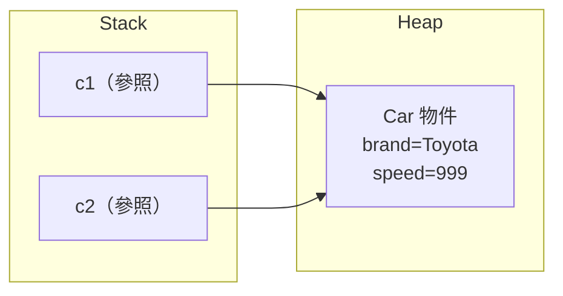
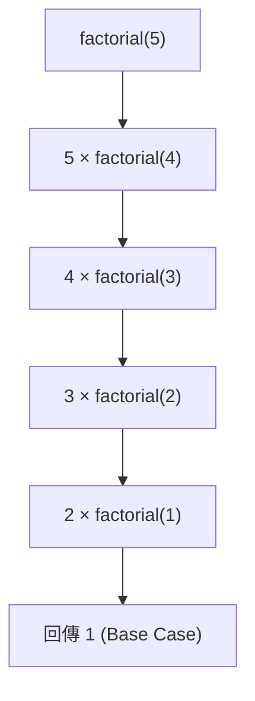
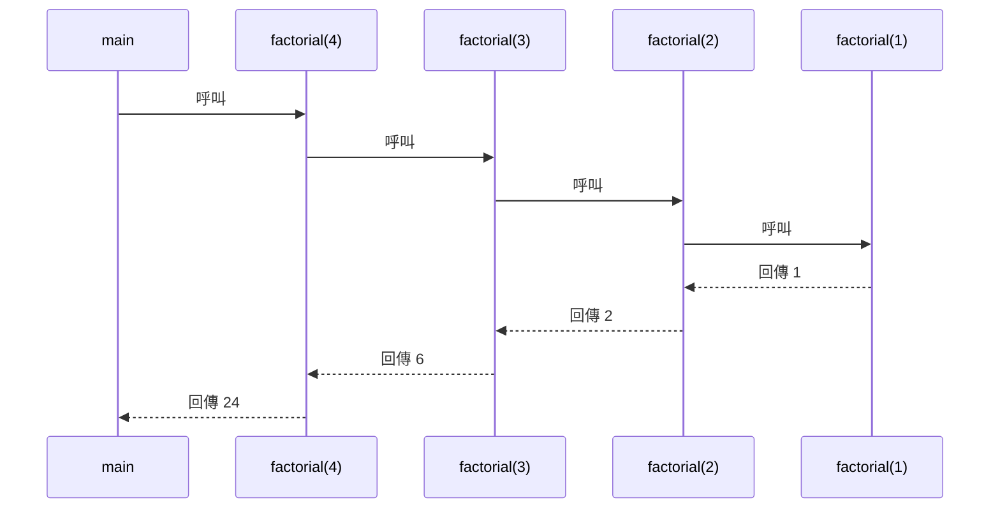
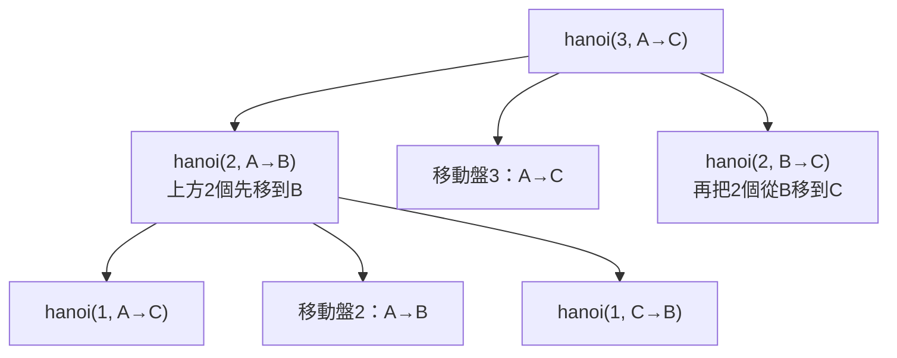

<div class="flex flex-col justify-center items-center h-full" style="background: #ffffff;">
  <p style="color: #5eada0; font-size: 1rem; font-weight: 600; letter-spacing: 0.2em; text-transform: uppercase; margin-bottom: 1.2rem;">Java Programming Masterclass</p>
  <h1 style="color: #1a5c5c; font-size: 3.4rem; font-weight: 900; line-height: 1.15; margin-bottom: 1.5rem;">類別與物件</h1>
  <div style="height: 4px; width: 320px; background: linear-gradient(90deg, #5eada0, #a7d9d0); border-radius: 2px; margin-bottom: 1.5rem;"></div>
  <p style="color: #4a7c7c; font-size: 1.15rem; font-style: italic;">「用類別定義世界，用物件描述個體」</p>
  <Link to="home" style="color: #9dc4c4; font-size: 0.85rem; margin-top: 2rem; text-decoration: none; letter-spacing: 0.05em;">← 返回目錄</Link>
</div>

---
layout: default
---

# Outline

- **8-1 認識物件與類別**：類別是藍圖、物件是實例
- **8-2 定義類別與物件**：class 語法、欄位、方法、new 建立物件
- **8-3 類別的基本實例**：完整 Car 類別範例
- **8-4 多個物件的應用**：物件陣列與遍歷
- **8-5 參照資料型態**：複製參照、null 參照
- **8-6 再談方法**：pass by value、多載、this 關鍵字
- **8-7 變數的有效範圍**：local vs instance scope
- **8-8 匿名陣列**：`new int[]{1,2,3}` 直接傳入方法
- **8-9 遞迴式方法**：base case、factorial
- **8-10 河內塔問題**：遞迴解法

---
layout: section
class: flex flex-col justify-center items-center text-center
---

# 第一部分
# 認識物件與類別

---
layout: default
---

# 8-1 類別與物件的關係

物件導向程式設計（OOP）的核心思維：

| 概念 | 說明 | 現實比喻 |
| --- | --- | --- |
| **類別 (Class)** | 物件的藍圖／設計圖 | 汽車設計圖 |
| **物件 (Object)** | 類別建立出來的實例 | 根據設計圖製造的汽車 |
| **欄位 (Field)** | 物件的「狀態」（資料） | 顏色、品牌、時速 |
| **方法 (Method)** | 物件的「行為」（動作） | 加速、煞車、開燈 |

<div class="mt-4 p-3 bg-blue-50 border-l-4 border-blue-400 text-gray-700 text-sm text-left">
💡 <b>核心觀念：</b>同一張藍圖可以建造出多台汽車，每台都是獨立的物件，各自擁有不同的狀態（顏色、里程），但行為相同（方法共用）。
</div>

---

# 8-1 現實世界比喻

以「學生」為例：

| 面向 | 類別 (Student) | 物件 (s1, s2) |
| --- | --- | --- |
| **是什麼** | 定義「學生」的設計圖 | 具體的某一位學生 |
| **欄位** | `name`, `id`, `grade` | s1: "小明", 1001, 90 |
| **方法** | `study()`, `getGrade()` | s1.study() 讓小明讀書 |

```java
// 類別 = 設計圖
class Student { ... }

// 物件 = 根據設計圖建立的實例
Student s1 = new Student();
Student s2 = new Student();
```

---
layout: section
class: flex flex-col justify-center items-center text-center
---

# 第二部分
# 定義類別與物件

---
layout: default
---

# 8-2 class 語法結構

| 語法元素 | 說明 |
| --- | --- |
| `class 類別名稱` | 宣告類別（名稱首字大寫） |
| 欄位宣告 | 類別內的成員變數（instance variables） |
| 方法定義 | 類別內的行為描述 |
| `new 類別名稱()` | 建立物件實例，回傳參照 |

```java
class Car {
    String brand;   // 欄位：品牌
    int speed;      // 欄位：時速

    void accelerate() {   // 方法：加速
        speed += 10;
    }
}
```

---

# 8-2 建立物件與存取成員

```java
// 宣告參照變數並建立物件
Car myCar = new Car();

// 透過「.」存取欄位
myCar.brand = "Toyota";
myCar.speed = 0;

// 透過「.」呼叫方法
myCar.accelerate();
System.out.println(myCar.speed); // 10
```

<div class="mt-4 p-3 bg-blue-50 border-l-4 border-blue-400 text-gray-700 text-sm text-left">
💡 <b>new 的作用：</b>在 Heap 記憶體中配置空間、將欄位初始化為預設值（數值為 0、boolean 為 false、物件為 null），並回傳該物件的參照（記憶體位址）。
</div>

---
layout: section
class: flex flex-col justify-center items-center text-center
---

# 第三部分
# 類別的基本實例

---
layout: default
---

# 8-3 完整 Car 類別（欄位 + 方法）

```java
class Car {
    String brand;
    String color;
    int speed;

    void accelerate(int amount) {
        speed += amount;
    }

    void displayInfo() {
        System.out.println(brand + " / " + color
            + " / 時速：" + speed + " km/h");
    }
}
```

---

# 8-3 建立 Car 物件並操作

```java
public class Main {
    public static void main(String[] args) {
        Car c1 = new Car();
        c1.brand = "Toyota";
        c1.color = "紅色";
        c1.speed = 0;

        c1.accelerate(60);
        c1.displayInfo();
        // 輸出：Toyota / 紅色 / 時速：60 km/h
    }
}
```

<div class="mt-4 p-3 bg-blue-50 border-l-4 border-blue-400 text-gray-700 text-sm text-left">
💡 <b>慣例：</b>類別名稱使用 PascalCase（首字大寫），欄位與方法名稱使用 camelCase（首字小寫）。
</div>

---
layout: section
class: flex flex-col justify-center items-center text-center
---

# 第四部分
# 類別含多個物件的應用

---
layout: default
---

# 8-4 建立多個物件

每次呼叫 `new` 都會在記憶體中建立一個獨立的物件：

```java
Car c1 = new Car();
c1.brand = "Toyota";
c1.speed = 80;

Car c2 = new Car();
c2.brand = "Honda";
c2.speed = 100;

c1.displayInfo(); // Toyota / 時速 80
c2.displayInfo(); // Honda / 時速 100
```

<div class="mt-4 p-3 bg-blue-50 border-l-4 border-blue-400 text-gray-700 text-sm text-left">
💡 <b>獨立性：</b>c1 和 c2 是兩個獨立的物件，修改 c1 的欄位不會影響 c2。
</div>

---

# 8-4 物件陣列：宣告與初始化

| 步驟 | 說明 |
| --- | --- |
| 1. 宣告陣列 | `Car[] cars = new Car[3];` |
| 2. 建立每個物件 | `cars[0] = new Car();` |
| 3. 設定欄位 | `cars[0].brand = "Toyota";` |

```java
Car[] cars = new Car[3];

cars[0] = new Car();
cars[0].brand = "Toyota";
cars[0].speed = 80;

cars[1] = new Car();
cars[1].brand = "Honda";
cars[1].speed = 100;
```

---

# 8-4 物件陣列遍歷

```java
Car[] cars = new Car[3];
// ... 初始化三台車 ...

for (int i = 0; i < cars.length; i++) {
    cars[i].displayInfo();
}

// 使用 for-each（更簡潔）
for (Car c : cars) {
    c.displayInfo();
}
```

<div class="mt-4 p-3 bg-blue-50 border-l-4 border-blue-400 text-gray-700 text-sm text-left">
💡 <b>注意：</b>宣告 <code>new Car[3]</code> 只是建立「放車的停車場」，每個停車格預設為 null。還需要逐一 <code>new Car()</code> 才算真正建立車輛物件。
</div>

---
layout: section
class: flex flex-col justify-center items-center text-center
---

# 第五部分
# 類別的參照資料型態

---
layout: default
---

# 8-5 物件賦值 = 複製參照

物件變數儲存的是**記憶體位址（參照）**，不是物件本身：

```java
Car c1 = new Car();
c1.brand = "Toyota";
c1.speed = 80;

Car c2 = c1;  // c2 複製的是「位址」，不是物件
c2.speed = 999;

System.out.println(c1.speed); // 999（c1 也被改了！）
```

<div class="mt-4 p-3 bg-blue-50 border-l-4 border-blue-400 text-gray-700 text-sm text-left">
💡 <b>關鍵：</b>c1 和 c2 指向同一個物件。透過 c2 修改欄位，c1 看到的也會改變，因為它們是同一塊記憶體。
</div>

---

# 8-5 參照賦值的記憶體圖解



`c2 = c1` 讓 c2 也指向同一個 Car 物件，任一方修改欄位，另一方都會感受到。

---

# 8-5 null 參照

| 狀態 | 說明 |
| --- | --- |
| `Car c = null;` | c 不指向任何物件 |
| `c.brand` | 拋出 `NullPointerException` |
| `c == null` | 判斷是否為 null 的安全寫法 |

```java
Car c = null;

if (c != null) {
    c.displayInfo();   // 安全
} else {
    System.out.println("尚未建立車輛");
}
```

---
layout: section
class: flex flex-col justify-center items-center text-center
---

# 第六部分
# 再談方法

---
layout: default
---

# 8-6 方法參數：Pass by Value（一）

Java 的方法參數傳遞**永遠是「複製值」**：

| 傳入型態 | 傳遞內容 | 方法內修改是否影響外部 |
| --- | --- | --- |
| 基本型態 (int/double) | 複製數值 | **否** |
| 物件參照 | 複製位址 | 修改欄位：**是**；重新賦值：**否** |

```java
static void addTen(int x) {
    x += 10;
}
int n = 5;
addTen(n);
System.out.println(n); // 5（不受影響）
```

---

# 8-6 方法參數：Pass by Value（二）

```java
static void changeSpeed(Car c) {
    c.speed = 999;   // 修改欄位：有影響
}

static void reassign(Car c) {
    c = new Car();   // 重新賦值：無影響
    c.speed = 0;
}

Car myCar = new Car();
myCar.speed = 80;

changeSpeed(myCar);
System.out.println(myCar.speed); // 999

reassign(myCar);
System.out.println(myCar.speed); // 999（未受影響）
```

---

# 8-6 方法多載（Overloading）

| 規則 | 說明 |
| --- | --- |
| 方法名稱相同 | 多個方法共用同一名稱 |
| 參數**數量**不同 | 可區分為不同方法 |
| 參數**型別**不同 | 可區分為不同方法 |
| 僅回傳型別不同 | **不算**多載，編譯錯誤 |

```java
class Multiplier {
    int multiply(int a, int b) { return a * b; }
    int multiply(int a, int b, int c) { return a * b * c; }
    double multiply(double a, double b) { return a * b; }
}
```

---

# 8-6 this 關鍵字

`this` 代表「目前這個物件自己」，主要用途：

| 用途 | 說明 |
| --- | --- |
| 區分同名變數 | `this.brand` vs 參數 `brand` |
| 呼叫其他建構子 | `this(...)` |

```java
class Car {
    String brand;
    int speed;

    Car(String brand, int speed) {
        this.brand = brand;  // this.brand = 欄位
        this.speed = speed;  // speed = 參數
    }
}
```

---
layout: section
class: flex flex-col justify-center items-center text-center
---

# 第七部分
# 變數的有效範圍

---
layout: default
---

# 8-7 Local vs Instance 變數

| 變數類型 | 宣告位置 | 生命週期 | 預設值 |
| --- | --- | --- | --- |
| **Instance 變數** | 類別內、方法外 | 物件存在期間 | 有（0/false/null） |
| **Local 變數** | 方法或區塊內 | 方法執行期間 | **無（必須手動初始化）** |

```java
class Counter {
    int count = 0;   // instance 變數

    void increment() {
        int step = 1;  // local 變數
        count += step;
    }
    // step 在此處無法存取
}
```

---

# 8-7 Scope 遮蔽（Shadowing）

當 local 變數與 instance 變數同名時，local 會遮蔽 instance：

```java
class Car {
    int speed = 100;  // instance 變數

    void setSpeed(int speed) {
        // 這裡的 speed 是參數（local）
        // 需用 this.speed 才能存取 instance 變數
        this.speed = speed;
    }
}
```

<div class="mt-4 p-3 bg-blue-50 border-l-4 border-blue-400 text-gray-700 text-sm text-left">
💡 <b>最佳實踐：</b>建構子或 setter 方法的參數名稱常與欄位同名，此時必須使用 <code>this.欄位名稱</code> 明確指定 instance 變數。
</div>

---
layout: section
class: flex flex-col justify-center items-center text-center
---

# 第八部分
# 匿名陣列

---
layout: default
---

# 8-8 匿名陣列（Anonymous Array）

| 概念 | 說明 |
| --- | --- |
| 定義 | 沒有名稱的陣列，建立後立即使用 |
| 語法 | `new 型別[]{ 值1, 值2, ... }` |
| 用途 | 直接傳入方法，不需暫存變數 |

```java
// 一般寫法（有名稱）
int[] nums = {1, 2, 3};
printSum(nums);

// 匿名陣列（直接傳入）
printSum(new int[]{1, 2, 3});
```

---

# 8-8 匿名陣列範例

```java
static void printSum(int[] arr) {
    int total = 0;
    for (int n : arr) total += n;
    System.out.println("總和：" + total);
}

public static void main(String[] args) {
    // 直接傳入，不需宣告暫存變數
    printSum(new int[]{10, 20, 30});
    // 輸出：總和：60
}
```

<div class="mt-4 p-3 bg-blue-50 border-l-4 border-blue-400 text-gray-700 text-sm text-left">
💡 <b>適用時機：</b>當陣列只需使用一次，不需要在後續程式中再度存取時，使用匿名陣列可讓程式碼更簡潔。
</div>

---
layout: section
class: flex flex-col justify-center items-center text-center
---

# 第九部分
# 遞迴式方法設計

---
layout: default
---

# 8-9 遞迴的基本概念

| 元素 | 說明 |
| --- | --- |
| **Base Case（終止條件）** | 不再遞迴、直接回傳結果 |
| **Recursive Case（遞迴步驟）** | 呼叫自己，並縮小問題規模 |
| **Call Stack（呼叫堆疊）** | 每次呼叫都會在 stack 新增一層 |

<div class="mt-4 p-3 bg-blue-50 border-l-4 border-blue-400 text-gray-700 text-sm text-left">
💡 <b>關鍵規則：</b>遞迴必須保證每次呼叫都「往 Base Case 靠近」，否則會無限遞迴，最終拋出 <code>StackOverflowError</code>。
</div>

---

# 8-9 Factorial 階乘範例

```java
static int factorial(int n) {
    if (n <= 1) return 1;       // Base Case
    return n * factorial(n - 1); // Recursive Case
}

System.out.println(factorial(5)); // 120
```

呼叫堆疊展開示意：



---

# 8-9 遞迴呼叫堆疊展開

以 `factorial(4)` 為例，呼叫與回傳過程：



---
layout: section
class: flex flex-col justify-center items-center text-center
---

# 第十部分
# 河內塔問題

---
layout: default
---

# 8-10 河內塔問題說明

| 規則 | 說明 |
| --- | --- |
| 三根柱子 | 起點(A)、中轉(B)、終點(C) |
| n 個圓盤 | 從大到小疊放在 A 上 |
| 目標 | 將所有圓盤移到 C |
| 限制 | 大盤不可壓在小盤上 |

```java
static void hanoi(int n, char from, char aux, char to) {
    if (n == 1) {
        System.out.println("移動盤 1：" + from + " → " + to);
        return;
    }
    hanoi(n - 1, from, to, aux);
    System.out.println("移動盤 " + n + "：" + from + " → " + to);
    hanoi(n - 1, aux, from, to);
}
```

---

# 8-10 河內塔遞迴邏輯

以 n=3 為例，遞迴思維：



<div class="mt-4 p-3 bg-blue-50 border-l-4 border-blue-400 text-gray-700 text-sm text-left">
💡 <b>移動次數：</b>n 個盤子需要 2ⁿ - 1 次移動。n=3 需 7 次，n=10 需 1023 次。
</div>

---

# 8-10 執行 hanoi(3) 的輸出

```java
hanoi(3, 'A', 'B', 'C');
```

輸出結果：
```
移動盤 1：A → C
移動盤 2：A → B
移動盤 1：C → B
移動盤 3：A → C
移動盤 1：B → A
移動盤 2：B → C
移動盤 1：A → C
```

共 7 次（2³ - 1 = 7）

---
layout: section
class: flex flex-col justify-center items-center text-center
---

# 練習題

---
layout: default
---

# 練習一：設計 BankAccount 類別
### 任務說明

設計一個 `BankAccount` 類別，包含：

- 欄位：`String owner`（戶主姓名）、`double balance`（餘額）
- 方法：
  - `deposit(double amount)` — 存款，餘額增加
  - `withdraw(double amount)` — 提款，餘額不足時印出警告
  - `displayInfo()` — 印出戶主與餘額

在 `main` 方法中建立兩個帳戶物件，各別進行存款、提款後印出結果。

---
layout: default
---

# 練習一：解題提示
### 提示說明

1. 先定義類別與欄位：`class BankAccount { String owner; double balance; ... }`
2. `deposit` 方法：`balance += amount;`
3. `withdraw` 方法：加入 `if (balance >= amount)` 判斷再扣款
4. `displayInfo` 方法：`System.out.println(owner + " 餘額：" + balance);`
5. 在 main 中：
   ```java
   BankAccount a1 = new BankAccount();
   a1.owner = "小明";
   a1.balance = 1000;
   a1.deposit(500);
   a1.withdraw(300);
   a1.displayInfo();
   ```

---
layout: default
---

# 練習二：多載計算機
### 任務說明

設計一個 `Calculator` 類別，對 `add` 方法進行**多載**：

- `add(int a, int b)` — 兩整數相加
- `add(int a, int b, int c)` — 三整數相加
- `add(double a, double b)` — 兩浮點數相加

在 `main` 中分別呼叫三種版本，並觀察 Java 如何根據參數自動選擇正確的方法。

---
layout: default
---

# 練習二：解題提示
### 提示說明

1. 在同一個類別中定義三個名稱都叫 `add` 的方法，只需讓參數不同：
   ```java
   int add(int a, int b) { return a + b; }
   int add(int a, int b, int c) { return a + b + c; }
   double add(double a, double b) { return a + b; }
   ```
2. 在 main 中呼叫時，Java 編譯器會依照傳入的參數**型別與數量**自動挑選對應的方法
3. 嘗試呼叫 `add(1, 2)`、`add(1, 2, 3)`、`add(1.5, 2.5)` 並印出結果
4. 思考：如果只有 `int` 版本而呼叫 `add(1.5, 2.5)` 會發生什麼？

---
layout: section
class: flex flex-col justify-center items-center text-center
---

# Q & A

有任何問題歡迎提出！

