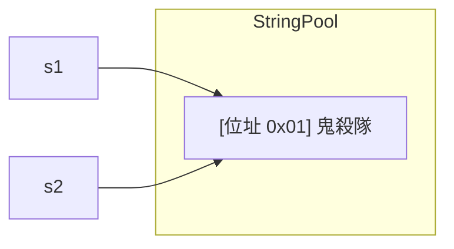
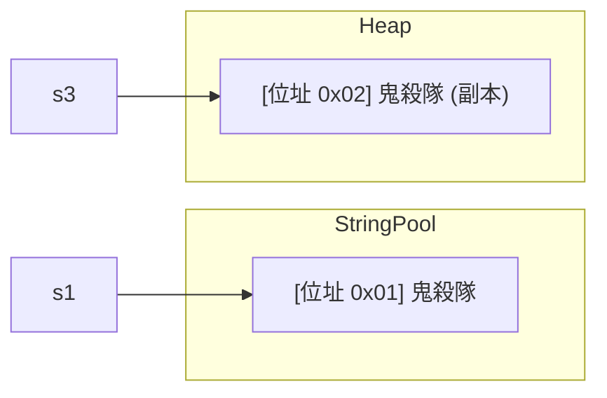
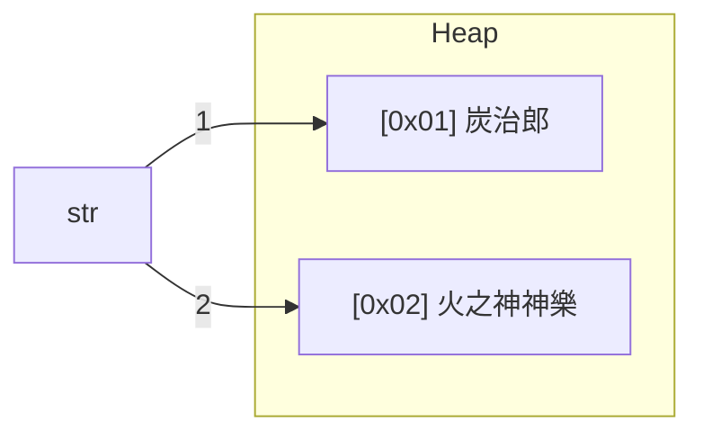
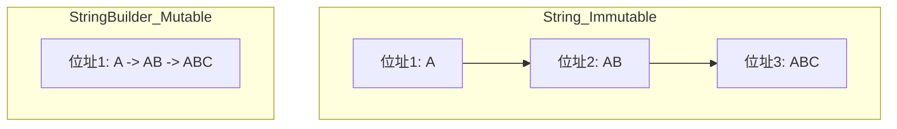

<div class="flex flex-col justify-center items-center h-full" style="background: #ffffff;">
  <p style="color: #5eada0; font-size: 1rem; font-weight: 600; letter-spacing: 0.2em; text-transform: uppercase; margin-bottom: 1.2rem;">Java Programming Masterclass</p>
  <h1 style="color: #1a5c5c; font-size: 3.8rem; font-weight: 900; line-height: 1.15; margin-bottom: 1.5rem;">字元與字串類別</h1>
  <div style="height: 4px; width: 320px; background: linear-gradient(90deg, #5eada0, #a7d9d0); border-radius: 2px; margin-bottom: 1.5rem;"></div>
  <p style="color: #4a7c7c; font-size: 1.15rem; font-style: italic;">
    進階自學內容
  </p>
  <Link to="home" style="color:#9dc4c4;font-size:0.85rem;margin-top:2rem;text-decoration:none;letter-spacing:0.05em;">← 返回目錄</Link>
</div>

<!--
【開場白】
大家好，歡迎來到字元與字串的進階自學區。基礎篇我們已經把 String 的常用方法都摸過一輪了，這裡要帶大家往「底層」再走深一點。

【為什麼要學】
有些同學寫程式時會發現：明明內容一樣的兩個字串，拿去比較卻有不同結果；或是迴圈裡拼字串拼到後面整個程式變很慢。這些現象背後都有原因，搞懂了，你寫出來的程式會更穩、更快。

【學習目標】
學完這份自學內容，我們會知道字串在記憶體裡到底長什麼樣子（字串池）、怎麼用 Text Block 寫多行文字、怎麼用 StringBuilder 大量拼接字串而不拖垮效能，以及幾個進階字串方法的實戰用法。
-->

---
layout: default
---

# Outline

- **字串記憶體與進階語法**：Text Blocks、字串池 (String Pool)
- **進階字串方法**：getChars、StringUtils、transform、lines
- **StringBuffer 與 StringBuilder**
- **綜合練習**

<!--
【核心說明】
這份自學內容分成三大塊。第一塊是「字串在記憶體裡到底怎麼存」，包含字串池的概念，還有 Java 15 之後新增的 Text Block 多行字串寫法。

第二塊是幾個比較少用、但關鍵時刻很好用的方法，像是 getChars、StringUtils、transform、lines。

第三塊是重頭戲：StringBuffer 跟 StringBuilder，這是處理大量字串拼接時的效能神器。

💼 業界實務：
這些內容平時可能用不到，但一旦遇到效能瓶頸或面試考古題，往往就是這幾個概念在考。
-->

---
layout: section
class: flex flex-col justify-center items-center text-center
---

# 字串記憶體與進階語法

<!--
【🎯 章節標題頁】
第一部分，我們來看字串的「進階語法」跟「記憶體觀念」。

【生活化比喻】
如果說基礎篇的 String 方法是「怎麼用」，這部分就是「為什麼可以這樣用」。就像學開車，基礎篇教你怎麼踩油門踩剎車，這部分帶你打開引擎蓋看看裡面長什麼樣。
-->

---

# Text Blocks（多行字串）

以三個雙引號 `"""` 開頭並**換行**，結尾加 `"""`，省去字串拼接與跳脫：

```java
// 傳統字串（需加 \n）
String msg = "Hello\n鬼殺隊\nGoodbye";

// Text Block（直覺可讀）
String tb = """
            Hello
            鬼殺隊
            Goodbye
            """;
```

<div class="mt-4 p-3 bg-blue-50 border-l-4 border-blue-400 text-gray-700 text-sm text-left">
💡 Text Blocks 的型別仍是 <code>String</code>，所有 String 方法都可使用。結尾的 <code>"""</code> 與內容對齊時，公共縮排會被自動移除。
</div>

<!--
【核心說明】
這是 JDK 15 之後新增的語法糖，專門用來解決「多行文字寫起來很醜」的問題。

【生活化比喻】
以前要寫一段多行文字（像 SQL 語法），我們要在每一行後面加 "\n" 再用 + 接下一行，寫到後面整段程式碼擠成一團，像是把好幾張紙硬塞進一個信封。Text Block 就像直接給你一張大信紙，要怎麼排版、換行，照寫就好。

【逐步解說】
你看 tb 這個寫法，三個雙引號開頭後直接換行，裡面想怎麼斷行就怎麼斷行，Java 會照你寫的樣子保留下來。

💼 業界實務：
寫 SQL 查詢字串、HTML 模板、JSON 範例的時候特別好用，程式碼讀起來乾淨很多。
-->

---

# indent( )

| 方法名稱 | 說明 |
| --- | --- |
| `indent(int n)` | n > 0 每行開頭加 n 個空白；n < 0 移除每行開頭最多 \|n\| 個空白；自動補上換行 |

```java
String text = """
        炭治郎
        禰豆子
        """;
System.out.print(text.indent(4));  // n > 0：加縮排
System.out.print(text.indent(-4)); // n < 0：移除縮排
```

<!--
【核心說明】
搭配 Text Block 很常用到的，就是這個 `indent` 方法，用來統一調整每一行開頭的空白數量。

【生活化比喻】
這就像「整段文字一起往右推」或「一起往左收」，正數往右推、負數往左收，不用自己一行一行手動加空格。

【逐步解說】
這在處理從檔案讀進來、或是準備輸出的格式化文字時很方便，省下很多手動補空格的迴圈。

⚠️ 易錯點提醒：
`indent` 執行完會在結尾自動補上一個換行符號，印出來的時候要留意這點，不然排版可能跟預期差一行。
-->

---

# 記憶體觀念：字串池 (String Pool)

直接使用雙引號宣告時，Java 會優先檢查字串池：

```java
String s1 = "鬼殺隊";
String s2 = "鬼殺隊";
System.out.println(s1 == s2); // true
```

<div class="flex justify-center mt-4">

</div>

<!--
【核心說明】
這頁是字串記憶體觀念的核心：字串池（String Pool）。

【生活化比喻】
想像 Java 是個很節儉的管理員，管著一個共用的儲物櫃。當你跟它要一個「鬼殺隊」這個字串，它會先去儲物櫃裡找看看有沒有現成的，有的話就直接把同一個櫃子的鑰匙（位址）交給你。所以 `s1` 跟 `s2` 拿到的其實是同一個櫃子，`s1 == s2` 才會是 `true`。

【逐步解說】
為什麼要這樣設計？因為字串在程式裡太常重複出現了，如果每次都另外開一個新櫃子存放一樣的內容，記憶體很快就被塞滿。

💼 業界實務：
這也是為什麼面試官特別愛問 `==` 跟 `equals` 的差別，因為背後就是這個字串池機制。
-->

---

# 記憶體觀念：使用 new 建立副本

使用 `new` 關鍵字會在 Heap 區建立一個獨立的新物件位址：

```java
String s1 = "鬼殺隊";
String s3 = new String("鬼殺隊");
System.out.println(s1 == s3); // false
System.out.println(s1.equals(s3)); // true
```

<div class="flex justify-center mt-4">

</div>

<!--
【核心說明】
延續上一頁的儲物櫃比喻，如果我們特別要求 `new String(...)`，Java 就不會去共用儲物櫃找了，而是另外幫你開一個一模一樣內容的新櫃子。

【逐步解說】
所以 `s1` 跟 `s3` 雖然內容一樣，但鑰匙（位址）不同，`s1 == s3` 是 `false`；但如果用 `equals` 比內容，兩邊內容相同，結果是 `true`。

⚠️ 易錯點提醒：
這就是「比較字串內容要用 `equals`，不要用 `==`」的根本原因——`==` 比的是位址，你永遠不知道兩個字串是不是來自同一個儲物櫃。
-->

---

# 字串內容不可更改性

String 物件一旦建立就無法改變。修改動作會產生**新位址**。

```java
String str = "炭治郎"; // 原本指向 A
str = "火之神神樂";    // 指向新的位址 B
```

<div class="flex justify-center mt-4 bg-gray-50 p-2 rounded-xl">

</div>

<!--
【核心說明】
這就是 String 的「不可變性（Immutable）」。

【生活化比喻】
當我們把 `str` 從「炭治郎」改成「火之神神樂」時，原本「炭治郎」這個內容並沒有消失，它還在記憶體裡，只是 `str` 這個變數不再指向它而已，就像便利貼換了一張新的，但舊的那張還貼在牆上。

【逐步解說】
重點是：每次「修改」字串，其實都是在「建立新字串」，原本的內容不會被改動。

💼 業界實務：
這也是為什麼在迴圈裡用 `+` 不斷拼接字串會很傷效能——Java 不斷建立新字串、丟掉舊字串。如果要大量拼接，後面會介紹的 `StringBuilder` 才是正解。
-->

---
layout: default
---

# 練習 1：字串池與 == 判斷
### 認證模擬題（單選）

請問以下程式碼執行後，會印出什麼結果？

```java
String a = "鬼殺隊";
String b = "鬼殺隊";
String c = new String("鬼殺隊");
String d = c;

System.out.println(a == b);
System.out.println(a == c);
System.out.println(c == d);
```

A. `true true true`
B. `true false true`
C. `false true false`
D. `true false false`

<!--
【出題動機】
這題是 OCA/OCP 考試的經典題型，測驗大家對「字串池 (String Pool)」跟「`new` 建立新物件」這兩個記憶體觀念是不是真的分清楚。

【解題引導】
先分開看三個比較：`a == b` 兩個都是用雙引號宣告的，會不會指向同一個位址？`a == c` 其中一個用了 `new`，位址會一樣嗎？`c == d` 呢，`d` 是直接把 `c` 指派過去，跟 `c` 是同一個變數嗎？把這三題分開想，答案就出來了。
-->

---
layout: default
---

# 練習 1：字串池與 == 判斷
### 解析

**正確答案：B**

- A. ❌ `a == c` 不會是 `true`，因為 `c` 是用 `new` 建立的新物件，位址跟字串池裡的 `a` 不同
- B. ✅ `a == b` 都從字串池取得同一份「鬼殺隊」所以 `true`；`a == c` 因為 `c` 是 `new` 出來的新位址所以 `false`；`c == d` 因為 `d = c` 直接複製了同一個位址所以 `true`
- C. ❌ `a == b` 應該是 `true`，兩個雙引號宣告的字串會共用字串池裡的同一個物件
- D. ❌ `c == d` 應該是 `true`，因為 `d` 直接指派為 `c`，兩者指向完全相同的位址

<!--
【帶讀解法】
這題的關鍵在於分辨「字串池共用」跟「`new` 建立新物件」兩種情境：`a` 跟 `b` 都是雙引號宣告，Java 會先去字串池找有沒有現成的「鬼殺隊」，有的話直接共用，所以 `a == b` 是 `true`。

`c` 用 `new String(...)` 強制在 Heap 另外開一個新位址，即使內容一樣，`a == c` 也會是 `false`。最後 `d = c` 只是把同一個位址再指派給另一個變數，`c == d` 自然是 `true`。
-->

---
layout: section
class: flex flex-col justify-center items-center text-center
---

# 進階字串方法

<!--
【🎯 章節標題頁】
第二部分，來看幾個平時比較少用、但關鍵時刻能省下很多程式碼的字串方法。

【生活化比喻】
這幾個方法就像工具箱裡的特殊工具，平常用不到，但遇到對的場合，效率差距會很明顯。
-->

---

# getChars( ) 方法應用

當需要將字串內容複製到現有的字元陣列時：

```java
String str = "鬼滅之刃與禰豆子的故事";
char[] ch = new char[15];

// 參數：(字串起, 字串終, 目標陣列, 陣列起)
str.getChars(5, 8, ch, 0);

System.out.println(ch); // 禰豆子
```

<!--
【核心說明】
如果手邊已經有一個現成的字元陣列，想把字串的某一段內容複製進去，就可以用 `getChars`。

【逐步解說】
這個方法的參數比較多，要依序告訴它：從字串的哪裡開始剪、剪到哪裡結束、要塞進哪個陣列、從陣列的第幾個位置開始放。

⚠️ 易錯點提醒：
四個參數的順序很容易搞混，記得是「字串起、字串終、目標陣列、陣列起」，建議使用時對照註解確認。

💼 業界實務：
這在處理底層資料格式轉換、或對效能要求極高的場景比較常見，一般應用層程式碼用到的機會不多。
-->

---

# 安全處理：StringUtils 類別

為了避免崩潰，開發中常使用 `StringUtils` 工具 (可同時判斷 `null`)：

| 方法 | 回傳 true 的條件 | 全空白字串 |
| --- | --- | --- |
| `StringUtils.hasLength(str)` | 不為 `null` 且長度 > 0 | `true` (空白算長度) |
| `StringUtils.hasText(str)` | 不為 `null` 且有非空白內容 | `false` |

<div class="mt-4 p-3 bg-blue-50 border-l-4 border-blue-400 text-gray-700 text-sm text-left">
💡 <b>需要 Spring 依賴：</b> <code>org.springframework.util.StringUtils</code>，非 JDK 標準函式庫
</div>

<!--
【核心說明】
如果專案是 Spring 專案，`StringUtils` 是處理 null 跟空字串檢查的好幫手，可以省掉一大段 `if != null` 的判斷。

【逐步解說】
`hasLength` 幫我們檢查「不是 null 且長度大於 0」；`hasText` 更進一步，連「全部都是空白」的情況都會抓出來，回傳 `false`。

💼 業界實務：
基本上一個 `hasText` 就能取代好幾行手動 null 檢查的邏輯，在表單驗證裡很常見。
-->

---

# StringUtils 應用範例

```java
String name = " ";

System.out.println(StringUtils.hasLength(name)); // true
System.out.println(StringUtils.hasText(name));   // false

name = "Nezuko";
System.out.println(StringUtils.hasText(name));   // true
```

<div class="mt-4 p-3 bg-blue-50 border-l-4 border-blue-400 text-gray-700 text-sm text-left">
💡 <b>需要 Spring 依賴：</b> <code>org.springframework.util.StringUtils</code>，非 JDK 標準函式庫
</div>

<!--
【逐步解說】
我們直接看範例。`name` 是一個空白字元時，`hasLength` 是 `true`（因為空白也佔長度），但 `hasText` 是 `false`（因為它只是空白，不算有意義的文字）。

【預期結果】
當 `name` 換成 "Nezuko" 之後，`hasText` 才會變成 `true`，因為現在有真正的內容了。

⚠️ 易錯點提醒：
別忘了這是 Spring 提供的工具類別，不是 JDK 標準函式庫，使用前要確認專案有對應依賴。
-->

---

# transform( )

| 方法名稱 | 說明 |
| --- | --- |
| `transform(Function<? super String, R> f)` | 將函式套用在字串上並回傳結果，型別由函式決定 |

```java
String raw = "  hello world  ";

// 傳統寫法：鏈到一半必須斷開，用變數承接
String mid = raw.strip().replace(" ", "-");
String result1 = "[" + mid + "]";

// transform：整條鏈不中斷
String result2 = raw.strip().replace(" ", "-")
                    .transform(s -> "[" + s + "]");
System.out.println(result2); // "[hello-world]"
```

<div class="mt-4 p-3 bg-blue-50 border-l-4 border-blue-400 text-gray-700 text-sm text-left">
💡 字串拼接（<code>"[" + s + "]"</code>）沒有對應的 String 方法，傳統寫法只能斷開鏈存變數。<code>transform(s -> ...)</code> 讓你把這個步驟也接在呼叫鏈上，<code>s</code> 就是前面鏈傳來的字串。
</div>

<!--
【核心說明】
`transform` 是讓字串處理鏈「不中斷」的進階寫法。

【生活化比喻】
平常處理字串就像接力賽，跑到某個沒有對應方法的步驟（像是「在前後加括號」），就得先停下來把棒子放進一個變數，再重新開始下一段。`transform` 就像是允許你在跑道上臨時插入一個自訂動作，整條接力可以一次跑完不中斷。

【逐步解說】
比較 `result1` 跟 `result2` 兩種寫法，`result2` 把 `strip`、`replace`、加括號這三個步驟全部串在一起，沒有中間變數。

💼 業界實務：
這種「鏈式呼叫」風格在偏好函式化程式設計（Functional Programming）的程式碼裡很常見，讀起來更直觀，但團隊風格不一定統一，使用前可以跟團隊討論。
-->

---

# lines( )

| 方法名稱 | 說明 |
| --- | --- |
| `lines()` | 以換行符（`\n`、`\r`、`\r\n`）切割，回傳 `Stream<String>` |

```java
String text = "炭治郎\n禰豆子\n善逸";
text.lines().forEach(System.out::println);
// 炭治郎
// 禰豆子
// 善逸
System.out.println(text.lines().count()); // 3
```

<div class="mt-4 p-3 bg-blue-50 border-l-4 border-blue-400 text-gray-700 text-sm text-left">
💡 與 <code>split("\n")</code> 不同，<code>lines()</code> 同時支援三種換行符，且回傳 Stream 可直接串接後續操作
</div>

<!--
【核心說明】
處理一整篇文字時，我們常需要一行一行來看，`lines()` 就是為這個情境設計的。

【逐步解說】
它會自動把整份文字依照換行切好，而且不管是 Windows（`\r\n`）還是 Mac/Linux（`\n`）的換行符號都認得。回傳的是一個 `Stream<String>`，可以直接用 `forEach`、`count` 等 Stream 操作。

⚠️ 易錯點提醒：
跟 `split("\n")` 不一樣的地方是，`lines()` 對不同作業系統的換行符相容性更好，建議優先使用 `lines()`。
-->

---
layout: default
---

# 練習 2：隊員名單統計與格式化
### 任務說明

宣告一段多行字串，內容是鬼殺隊隊員名單：

```java
String roster = "炭治郎\n禰豆子\n善逸\n伊之助";
```

1. 使用 `lines()` 計算總共有幾位隊員
2. 使用 `transform()`，把整份名單包裝成 `"隊員名單：[原始內容]"` 的格式並印出

<!--
【任務鋪陳】
這一部分學了 `lines()` 可以把多行字串拆成 `Stream<String>`，也學了 `transform()` 可以在呼叫鏈的最後插入一個自訂轉換動作。這個練習要把兩者各自用一次。

【引導思考】
`lines()` 回傳的是 `Stream<String>`，要怎麼從 Stream 取得「總共幾行」？`transform()` 接收的 Lambda，參數又是什麼？想清楚這兩點，這題就不難。
-->

---
layout: default
---

# 練習 2：隊員名單統計與格式化
### 解題提示

1. `roster.lines().count()` 取得行數（即隊員人數）
2. `roster.transform(s -> "隊員名單：" + s)` 把整段文字包上前綴

```java
String roster = "炭治郎\n禰豆子\n善逸\n伊之助";

long count = roster.lines().count();
System.out.println("隊員人數：" + count); // 4

String result = roster.transform(s -> "隊員名單：" + s);
System.out.println(result);
```

<!--
【帶讀解法】
`lines()` 回傳的 `Stream<String>` 直接呼叫 `count()`，就能得到總行數，等於隊員人數。`transform(s -> "隊員名單：" + s)` 裡的 `s` 就是 `roster` 本身的內容，Lambda 回傳的字串會變成整條呼叫鏈最後的結果。

💼 業界實務：
`lines().count()` 在統計檔案行數、`transform()` 在組裝輸出格式時都很常用，兩者搭配可以用很少的程式碼完成「統計 + 格式化」這類常見任務。
-->

---
layout: section
class: flex flex-col justify-center items-center text-center
---

# StringBuffer 與 StringBuilder

<!--
【🎯 章節標題頁】
最後一個大主題：字串界的「變形金剛」——StringBuffer 跟 StringBuilder。

【為什麼要學這個？】
基礎篇提過，一般的 `String` 只要一改動就會產生新物件，如果在迴圈裡反覆修改幾千、幾萬次，效能會明顯變差。這兩個類別就是為了解決這個問題而生的，它們提供一個「可變」的字串緩衝區。
-->

---
layout: default
---

# 為什麼需要緩衝區類別？

`String` 是不可變的，頻繁修改會造成效能低落。

```java
// ❌ 效能差 (產生大量暫存物件)
String s = "";
for(int i=0; i<100; i++) s += i;

// ✅ 效能佳 (在同一個緩衝區操作)
StringBuilder sb = new StringBuilder();
for(int i=0; i<100; i++) sb.append(i);
```

<!--
【核心說明】
我們直接看程式碼對比。`StringBuilder` 就像一個專屬的工具籃，不管裝多少東西，都還是同一個籃子，不會一直去買新籃子再把舊的丟掉。

【逐步解說】
左邊的寫法，每次 `s += i`，Java 都會偷偷建立一個新的 `String` 物件、複製內容、再讓 `s` 指向它，跑 100 次就產生 100 個用過即丟的物件。右邊的 `StringBuilder` 則是一直往同一個籃子裡塞東西（`append`），籃子會自動變大，但位址始終沒變。

💼 業界實務：
在迴圈裡拼接字串，幾乎是「一定要用 `StringBuilder`」的等級，這是新手跟有經驗工程師的常見分水嶺。
-->

---

# 記憶體變更對比

<div class="flex justify-center mt-6">

</div>

<!--
【核心說明】
這張圖把上一頁的「蓋新房子 vs 同一個籃子」概念畫出來了。

【逐步解說】
上面這排是 `String`，每加一個字就要換一個新的記憶體位址（S1 -> S2 -> S3）；下面這排是 `StringBuilder`，不管加多少字，內容始終在同一個位址 SB1 裡面變化。

【預期結果】
這就是 `StringBuilder` 效能會明顯優於 `String` 拼接的根本原因。
-->

---

# 建立與容量管理

| 方法 / 建構子 | 說明 |
| --- | --- |
| `new StringBuilder()` | 預設容量 16 |
| `new StringBuilder(int capacity)` | 指定初始容量 |
| `new StringBuilder(String str)` | 以字串初始化 |
| `capacity()` | 目前緩衝區的總容量 |
| `length()` | 實際存放的字元長度 |

<!--
【核心說明】
要怎麼建立這個「可伸縮的籃子」？

【逐步解說】
如果什麼都不指定，Java 會先給一個能裝 16 個字的籃子；如果預期之後會塞很多東西，可以一開始就指定一個較大的 `capacity`，減少籃子重新放大的次數。

⚠️ 易錯點提醒：
`capacity()` 跟 `length()` 是不一樣的東西——`capacity` 是籃子的總容量，`length` 是目前實際裝了多少內容，籃子很大不代表已經裝滿。
-->

---

# 建立與容量管理 — 範例

```java
StringBuilder sb1 = new StringBuilder();
StringBuilder sb2 = new StringBuilder(50);
StringBuilder sb3 = new StringBuilder("炭治郎");

System.out.println(sb1.capacity()); // 16
System.out.println(sb2.capacity()); // 50
System.out.println(sb3.capacity()); // 19 (16 + 3字)
System.out.println(sb3.length());   // 3
```

<!--
【逐步解說】
我們來看實際的數值。`sb3` 是用「炭治郎」三個字初始化的，Java 會給它原本預設的 16 格，再加上這三個字的空間，所以 `capacity` 是 19；但 `length()` 只有 3，因為實際內容只有三個字。

【預期結果】
這就是緩衝區「預留空間」的設計——容量跟實際長度是分開計算的兩件事。
-->

---

# 內容修訂方法 (一)

| 方法名稱 | 說明 |
| --- | --- |
| `append(data)` | 將內容加在尾端 |
| `insert(pos, data)` | 在指定位置插入內容 |

```java
StringBuilder sb1 = new StringBuilder("Muzan");
sb1.append("Kibutsuji");
System.out.println(sb1); // "MuzanKibutsuji"

StringBuilder sb2 = new StringBuilder("MuzanKibutsuji");
sb2.insert(5, " "); // 在索引 5 插入空格
System.out.println(sb2); // "Muzan Kibutsuji"
```

<!--
【核心說明】
對 `StringBuilder` 來說最重要的兩個動作就是加字：`append` 是加在最後面，`insert` 則是「插隊」。

【逐步解說】
`append` 最常用，直接把內容接到尾端；`insert` 則是指定一個位置，把後面的內容往後推，再把新內容塞進去。

💼 業界實務：
這跟一般 `String` 拼接比起來，語意更清楚，也不會產生多餘的暫存物件，在大量字串組裝（例如報表輸出）時很常見。
-->

---

# 內容修訂方法 (二)

| 方法名稱 | 說明 |
| --- | --- |
| `delete(start, end)` | 刪除 [start, end-1] 範圍的內容 |
| `reverse()` | **反轉字串內容** |

```java
StringBuilder sb1 = new StringBuilder("鬼滅之刃大戰");
sb1.delete(4, 6); // 刪除索引 4~5
System.out.println(sb1); // "鬼滅之刃"

StringBuilder sb2 = new StringBuilder("炭治郎");
sb2.reverse();
System.out.println(sb2); // "郎治炭"
```

<!--
【核心說明】
`delete` 跟 `reverse` 是兩個常用的內容修訂方法。

【逐步解說】
`delete` 一樣是「包含頭不包含尾」的規則，跟 `substring` 一致；`reverse` 則是直接把整串內容反過來。

⚠️ 易錯點提醒：
判斷「迴文」這類題目時，`reverse` 是很方便的工具，但別忘了它會直接修改原本的 `StringBuilder` 物件內容，跟 `String` 的不可變特性不同。
-->

---

# 設定與取代方法

| 方法名稱 | 說明 |
| --- | --- |
| `setCharAt(int index, char ch)` | 修改指定位置的字元 |
| `replace(int start, int end, String str)` | 取代 [start, end-1] 範圍的內容 |

```java
StringBuilder sb1 = new StringBuilder("TANJIRO");
sb1.setCharAt(6, 'A');
System.out.println(sb1); // "TANJIRA"

StringBuilder sb2 = new StringBuilder("鬼滅之刃");
sb2.replace(2, 4, "大戰");
System.out.println(sb2); // "鬼滅大戰"
```

<!--
【核心說明】
如果只想修改其中一段內容，不需要先刪除再插入，可以直接用「設定」或「取代」。

【逐步解說】
`setCharAt` 是精確指定一個位置，直接換成新字元；`replace` 則是劃定一個區間，把整段換成新字串。

⚠️ 易錯點提醒：
`StringBuilder` 的 `replace` 參數是 `(start, end, 字串)`，跟 `String` 的 `replace(舊字, 新字)` 不同，容易搞混。
-->

---

# 複製子字串 (substring)

| 方法名稱 | 說明 |
| --- | --- |
| `substring(int start)` | 從 start 擷取到結尾 (不修改原物件) |
| `substring(int start, int end)` | 擷取 [start, end-1] 範圍 |

```java
StringBuilder sb = new StringBuilder("鬼滅之刃是炭治郎");

System.out.println(sb.substring(5));    // "炭治郎"
System.out.println(sb.substring(0, 4)); // "鬼滅之刃"
// 原物件內容不變
System.out.println(sb); // "鬼滅之刃是炭治郎"
```

<!--
【核心說明】
雖然 `StringBuilder` 整體是可變的，但 `substring` 這個方法是例外。

【逐步解說】
跟 `String` 的 `substring` 一樣，它會回傳一個新的、不可變的 `String`，本身的內容並不會被改變。

💼 業界實務：
通常是在整段內容處理到最後，需要把其中一小段交給別的程式碼使用時才會用到這個方法。
-->

---

# StringBuffer vs StringBuilder

| 類別名稱 | 執行緒安全 | 執行速度 |
| --- | --- | --- |
| **StringBuffer** | **安全 (同步化)** | 較慢 |
| **StringBuilder**| **不安全** | **較快** |

<!--
【核心說明】
這是經典考題：`StringBuffer` 跟 `StringBuilder` 到底差在哪？

【生活化比喻】
`StringBuffer` 像是「有保全看守的櫃檯」，一次只能一個人來改東西，安全但要排隊；`StringBuilder` 則是「開放式櫃檯」，誰都可以直接過來改，速度快，但如果同時有兩個人在改，內容可能會錯亂（這就是「執行緒不安全」）。

💼 業界實務：
大多數情況下我們是在自己的方法裡單獨處理字串，不會有其他執行緒同時搶著改，所以 99% 的時間都會選比較快的 `StringBuilder`。只有在明確需要多執行緒共用同一個緩衝區時，才考慮 `StringBuffer`。
-->

---
layout: default
---

# 練習 3：迴文判斷
### 任務說明

撰寫一個程式，判斷使用者輸入是否為「迴文」（正讀反讀結果一致）。

- 例如：`禰豆子豆禰` $\rightarrow$ 是
- 例如：`鬼滅之刃` $\rightarrow$ 否

<!--
【任務鋪陳】
我們剛才學了 `reverse` 這個方法，剛好可以拿來解決一個經典題型：判斷一個字串是不是「迴文」。

【引導思考】
迴文就是倒過來唸結果也一樣。如果手上已經有 `reverse` 這個工具，要判斷迴文的邏輯會不會突然變得很直覺？大家可以先想想看，要怎麼把輸入的字串變成可以反轉的形式。
-->

---

# 練習 3：迴文判斷 — 解題提示
### 提示說明

1. 將使用者輸入建立為 `StringBuilder` 物件。
2. 呼叫 `.reverse()` 方法取得反轉後的內容。
3. 將反轉結果轉回 `String`，與原字串用 `equals` 比對是否相等。

<!--
【逐步解說】
第一步，把輸入的字串放進 `StringBuilder`。第二步，直接呼叫 `.reverse()`。第三步，把反轉後的內容轉成 `String`（注意：比較內容要用 `equals`，不是 `==`），跟原始字串比對。

【預期結果】
如果兩者內容相同，就是迴文；不同的話就不是。這題同時複習了 `StringBuilder.reverse()` 跟字串比較這兩個概念。
-->

---
layout: default
---

# 練習 4 (綜合)：日記格式化器
### 任務說明

請設計一個小工具，處理使用者輸入的多行日記內容：

1. 使用 **Text Block** 建立一段包含多行的日記範本（例如三天的紀錄）。
2. 使用 `lines()` 將內容逐行取出，並用 `StringUtils.hasText()` 過濾掉空白行。
3. 使用 `StringBuilder` 將每一行加上編號（如 `1. ...`、`2. ...`）後重新組合成最終輸出。

<!--
【任務鋪陳】
這份自學內容學了不少進階主題：Text Block 讓我們可以寫多行字串、`lines()` 可以把多行內容拆開、`StringUtils` 可以過濾掉沒意義的空白行、`StringBuilder` 則能有效率地把處理好的內容重新組裝起來。這個綜合練習就是要把這幾樣工具串在一起用。

【引導思考】
想像我們收到一份格式不太整齊的日記稿，裡面可能夾雜空白行，我們希望輸出一份「每行都有編號、且沒有空白行」的整潔版本。大家可以想想：這個流程要先做哪一步、再做哪一步，才不會把空白行也編進號碼裡？
-->

---

# 練習 4 (綜合)：日記格式化器 — 解題提示
### 提示說明

1. 用 `"""` 建立多行 Text Block，內容包含至少一行空白行。
2. 呼叫 `.lines()` 取得 `Stream<String>`，逐行用 `StringUtils.hasText()` 判斷是否為有效內容。
3. 建立一個 `StringBuilder`，搭配計數器，對每個有效行呼叫 `append` 加上「編號 + 內容 + 換行」。
4. 最後將 `StringBuilder` 轉成 `String` 並輸出。

<!--
【逐步解說】
第一步先準備好測試資料：用 Text Block 寫一段包含空白行的多行文字。第二步用 `lines()` 把它拆成一行一行，再用 `StringUtils.hasText()` 把空白行濾掉，只留下有內容的行。第三步用 `StringBuilder` 搭配一個從 1 開始的計數器，每處理一行有效內容就 `append` 一次「編號. 內容\n」。

【預期結果】
最後印出來的結果，會是一份去除空白行、且每行都自動編號的整潔日記。這題剛好把 Text Block、`lines()`、`StringUtils`、`StringBuilder` 四個進階主題都用上了。
-->

---
layout: end
---
