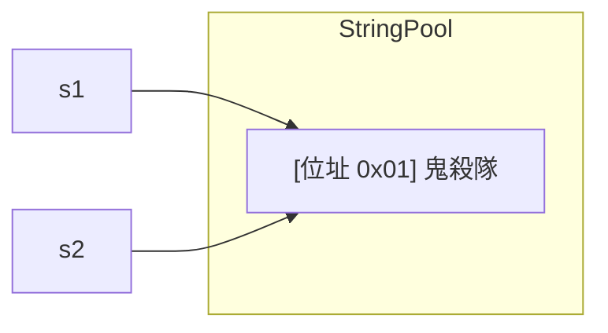
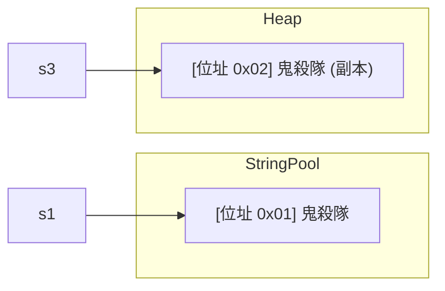
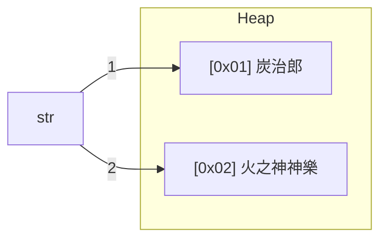
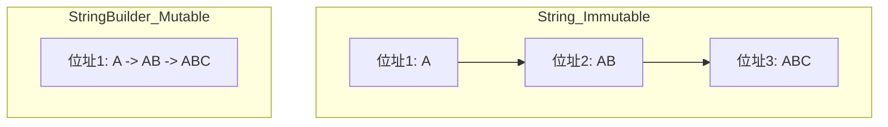

<div class="flex flex-col justify-center items-center h-full" style="background: #ffffff;">
  <p style="color: #5eada0; font-size: 1rem; font-weight: 600; letter-spacing: 0.2em; text-transform: uppercase; margin-bottom: 1.2rem;">Java Programming Masterclass</p>
  <h1 style="color: #1a5c5c; font-size: 3.8rem; font-weight: 900; line-height: 1.15; margin-bottom: 1.5rem;">字元與字串類別</h1>
  <div style="height: 4px; width: 320px; background: linear-gradient(90deg, #5eada0, #a7d9d0); border-radius: 2px; margin-bottom: 1.5rem;"></div>
  <p style="color: #4a7c7c; font-size: 1.15rem; font-style: italic;">
    「掌握 Java 呼吸法：全面解析 Character 與 String」
  </p>
  <Link to="home" style="color: #9dc4c4; font-size: 0.85rem; margin-top: 2rem; text-decoration: none; letter-spacing: 0.05em;">← 返回目錄</Link>
</div>

<!--
【開場白】
大家好，今天我們要聊的是 Java 裡面最常用到的兩個老朋友：字元（Character）和字串（String）。

【為什麼要學這個？】
不管是使用者的帳號密碼、網路文章的內容，還是你現在看到的投影片，通通都是由文字組成的。如果說寫程式是在處理數據，那文字處理就是程式開發中最重要的基本功，就像是練武功要先練呼吸一樣重要。

【今天學完你會能做什麼】
學完這章，你會知道字串在記憶體裡到底是怎麼運作的，這能幫你寫出效能更好的程式；你還會學到超多實用的文字處理技巧，像是怎麼搜尋、切割、甚至是用最快的方式拼接文字。
-->

---
layout: default
---

# Outline

- **字元 Character 類別**
- **字串的建立與記憶體觀念**
- **String 類別的方法 (搜尋、擷取、取代、比較、格式化)**
- **StringBuffer 與 StringBuilder 類別**
- **實作練習與邏輯挑戰**

<!--
【核心說明】
今天的課程我們會分成四大區塊。

【逐步帶著看】
首先，我們先從小單元「字元」開始，了解單個字是怎麼判斷的。接著進入重頭戲「字串」，我會帶大家看 Java 在背後是怎麼偷偷管理字串記憶體的，這對以後面試很有幫助。第三部分是我們會花最多時間的，就是各種字串處理的絕招，像是怎麼找字、怎麼改字。最後，我們會介紹「變形金剛版」的字串：StringBuffer 和 StringBuilder，這在處理大量資料時可是救命恩人。

💼 業界實務：
在實際開發中，90% 的 Bug 其實都跟字串處理有關，像是 null 檢查沒做好或是比較字串時用了錯誤的方法，今天我們都會一一擊破這些盲點。
-->

---
layout: section
class: flex flex-col justify-center items-center text-center
---

# 第一部分
# 字元 Character 類別

<!--
【🎯 章節標題頁】
第一部分，我們先來認識字元的處理。

【生活化比喻】
如果把字串比喻成一串珍珠項鍊，那「字元」就是那一顆顆獨立的珍珠。在 Java 裡，處理單顆珍珠有專門的工具，我們叫它 Character 類別。
-->

---
layout: default
---

# 字元類別方法 (一)
### 常用判斷方法

| 方法名稱 | 說明 |
| --- | --- |
| `isDigit(char ch)` | 是否為數字字元 (0-9) |
| `isLetter(char ch)` | 是否為字母字元 (包含中文) |
| `isLetterOrDigit(char ch)` | 是否為數字或字母字元 |
| `isLowerCase(char ch)` | 是否為小寫字母字元 |
| `isUpperCase(char ch)` | 是否為大寫字母字元 |

<!--
【核心說明】
當我們拿到一個字元，最常見的需求就是：「它是什麼？」它是數字嗎？是大寫還是小寫？

【逐步解說】
Java 的 Character 類別提供了一堆這種以 `is` 開頭的方法。就像是我們在做檢查一樣。
注意 `isDigit`，它是檢查 '0' 到 '9' 這些「文字版」的數字。
還有一個重點是 `isLetter`，在 Java 裡它非常友善，不僅英文算字母，連中文在它的認知裡也算是字母的一種喔！

⚠️ 學生常見誤解：
很多同學會忘記這些是靜態方法（Static methods），所以呼叫時要寫 `Character.isDigit('1')`，而不是用變數去點喔。
-->

---
layout: full
class: px-8
---

# 字元類別方法 (一) — 範例

```java
char c1 = '9';
char c2 = 'A';
char c3 = '炭'; // 中文字元

System.out.println(Character.isDigit(c1)); // true
System.out.println(Character.isLetter(c3)); // true (中文也算字母)
System.out.println(Character.isUpperCase(c2)); // true
System.out.println(Character.isLetterOrDigit(c1)); // true
```

<!--
【逐步解說】
我們直接來看程式碼怎麼寫。
你看第一行，`c1` 雖然存的是數字 9，但因為加了單引號，它現在是個字元。所以 `isDigit` 會回傳 true。
有趣的是第三行，我們放了一個中文字「炭」，在 `isLetter` 的判斷下，它是 true。這點跟某些只認英文的語言不太一樣，大家可以記一下。

【類比說明】
這就像是我們去遊樂園，門口有個感應器，你拿著票（字元）過去，感應器會告訴你這是「兒童票」（數字）還是「大人票」（字母）。
-->

---

# 字元類別方法補充：isAlphabetic / isWhitespace

| 方法名稱 | 說明 |
| --- | --- |
| `isAlphabetic(char ch)` | 是否為 Unicode 字母字元（比 `isLetter` 涵蓋更廣）|
| `isWhitespace(char ch)` | 是否為 Java 定義的空白（含 `\t`、`\n`、`\r` 等控制字元）|
| `isSpaceChar(char ch)` | 是否為 Unicode 空格字元（**不含** Tab、換行等控制字元）|

```java
System.out.println(Character.isAlphabetic('A'));   // true
System.out.println(Character.isAlphabetic('炭'));  // true
System.out.println(Character.isWhitespace('\t'));  // true
System.out.println(Character.isSpaceChar('\t'));   // false
```

<!--
【核心說明】
除了基本的判斷，Java 還有幾個更精細的方法。

【逐步解說】
首先是 `isAlphabetic`，它比 `isLetter` 更強大一點，能辨識更多奇怪國家的字母。
接著是初學者最容易搞混的兩個：`isWhitespace` 和 `isSpaceChar`。
`isWhitespace` 是看這是不是一個「讓畫面產生空白」的東西，所以包含 Tab 和換行。
而 `isSpaceChar` 則是看這是不是一個「Unicode 定義的空格」。
你可以看到範例最後一行，Tab 鍵 `\t` 在 `isWhitespace` 是 true，但在 `isSpaceChar` 卻是 false，因為它不是空格，它是縮排。

💼 業界實務：
在處理使用者輸入的資料時，通常我們會用 `isWhitespace` 來過濾掉那些看不見但會佔空間的控制字元。
-->

---

# 字元類別方法 (二)
### 轉換與特殊判斷

| 方法名稱 | 說明 |
| --- | --- |
| `toLowerCase(char ch)` | 將字元轉成小寫 |
| `toUpperCase(char ch)` | 將字元轉成大寫 |
| `isSpaceChar(char ch)` | 是否為 Unicode 的空白字元 |
| `isISOControl(char ch)` | 是否為 ISO 控制字元 |

```java
System.out.println(Character.toLowerCase('A'));    // 'a'
System.out.println(Character.toUpperCase('z'));    // 'Z'

char fullWidthSpace = '\u3000'; // 全型空白
System.out.println(Character.isSpaceChar(fullWidthSpace)); // true
```

<!--
【核心說明】
看完了判斷，我們來看看「轉換」。

【逐步解說】
如果你要把大寫變小寫，或是小寫變大寫，就用 `toLowerCase` 或 `toUpperCase`。
這裡有個進階的小知識，`isSpaceChar` 可以抓到連我們肉眼都很難分辨的「全型空白」（就是注音輸入法按 Shift+Space 出現的那個），這在處理中文排版時非常好用。

⚠️ 學生常見誤解：
注意！字元转换方法回傳的是「新的字元」，原本傳進去的變數是不會變的喔（因為 char 是 primitive type）。
-->

---

# 跳脫字元 (Escape Character)

控制字元（如換行、標籤）可以使用 `isISOControl()` 測試：

```java
char ch1 = '\n'; // 換行符號（Enter 鍵效果）
char ch2 = '\t'; // 水平 Tab 符號（Tab 鍵效果）

System.out.println("\\n 是控制字元：" + Character.isISOControl(ch1)); 
System.out.println("\\t 是控制字元：" + Character.isISOControl(ch2));
```

<div class="mt-4 p-3 bg-blue-50 border-l-4 border-blue-400 text-gray-700 text-sm text-left">
💡 <b>技術細節：</b> 中文字元「炭」在 Java 中屬於字母字元 (isLetter)。
</div>

<!--
【核心說明】
在字串裡，有些動作是我們打不出來的，像是「按一下 Enter」或是「退後一格」。

【生活化比喻】
這就像是劇本裡的「動作指令」，不是台詞。當演員看到 `\n`，他不是唸出「反斜線 n」，而是要做「換行」這個動作。

【逐步解說】
我們可以用 `isISOControl` 來檢查這些看不見的動作指令。這些指令在 Java 裡都以反斜線 `\` 開頭，我們叫它「跳脫字元」。
-->

---
layout: section
class: flex flex-col justify-center items-center text-center
---

# 第二部分
# 字串的建立

<!--
【🎯 章節標題頁】
接下來進入課程的核心：字串（String）。

【為什麼要學這個？】
建立字串看似簡單，但其實 Java 在背後做了很多最佳化，如果沒搞懂，你可能會不小心浪費了一堆記憶體。
-->

---
layout: default
---

# 基本字串型態宣告

只要在內容前後加上雙引號即為字串物件。

```java
String hero = "炭治郎"; // hero 是字串變數
```

<div class="mt-6">

### 常用建構方法 (Constructor)

| 建構方法 | 說明 |
| --- | --- |
| `String()` | 建立一個空字串 |
| `String(char[] data)` | 由字元陣列組成字串 |
| `String(String original)` | **建立副本 (新位址)** |
| `String(StringBuffer buf)` | 由 StringBuffer 建立 |

</div>

<!--
【核心說明】
最簡單建立字串的方法就是直接加雙引號。

【逐步解說】
但除了雙引號，`String` 類別其實提供很多「建構子」（設計圖）。
像是你可以把一堆字元組成的陣列 `char[]` 直接丟進去變成字串。
特別注意第三個 `new String(original)`，這個動作會強迫 Java 去新開一個房間存放內容，即使字串池裡已經有了。

💼 業界實務：
通常我們直接用 `""` 宣告就好，很少會用到 `new String()`。用 `new` 反而會造成記憶體多餘的負擔，等一下我們會解釋為什麼。
-->

---

# 建構方法 — 範例

```java
String s1 = new String();                      // 空字串 ""
char[] chars = {'炭', '治', '郎'};
String s2 = new String(chars);                 // "炭治郎"
String s3 = new String("炭治郎");              // 建立副本（新位址）
StringBuffer sb = new StringBuffer("炭治郎");
String s4 = new String(sb);                    // "炭治郎"
```

<!--
【逐步解說】
我們來看實際的範例。
`s1` 就是一張白紙。
`s2` 是把三顆珍珠（字元）串成一條項鍊。
`s4` 則是很常見的用法：當你在處理大量文字（用 StringBuffer）告一段落後，把它轉回一般字串。

⚠️ 學生常見誤解：
雖然 `s2`、`s3`、`s4` 的內容看起來都一樣，但它們在記憶體裡的位址可能不同喔！
-->

---

# Text Blocks（多行字串）

以三個雙引號 `"""` 開頭並**換行**，結尾加 `"""`，省去字串拼接與跳脫：

```java
// 傳統字串（需加 \n）
String msg = "Hello\n鬼殺隊\nGoodbye";

// Text Block（直覺可讀）
String tb = """
            Hello
            鬼殺隊
            Goodbye
            """;
```

<div class="mt-4 p-3 bg-blue-50 border-l-4 border-blue-400 text-gray-700 text-sm text-left">
💡 Text Blocks 的型別仍是 <code>String</code>，所有 String 方法都可使用。結尾的 <code>"""</code> 與內容對齊時，公共縮排會被自動移除。
</div>

<!--
【核心說明】
如果你要寫一段很長的文字，比如一封信或一段 SQL 語法，傳統寫法會讓你寫到崩潰，要一直加 `+` 號跟 `\n`。

【逐步解說】
Java 15 推出了「Text Blocks」，也就是用三個雙引號開頭和結尾。
這就像是你直接在畫布上寫字，你換行它就跟著換行，非常直觀。
它的型別一樣是 `String`，完全沒有任何隔閡。

💼 業界實務：
這在寫 SQL 查詢字串或是 HTML 模板時超好用，工程師終於不用再對齊那些討厭的 `\n` 了。
-->

---

# indent( )

| 方法名稱 | 說明 |
| --- | --- |
| `indent(int n)` | n > 0 每行開頭加 n 個空白；n < 0 移除每行開頭最多 \|n\| 個空白；自動補上換行 |

```java
String text = """
        炭治郎
        禰豆子
        """;
System.out.print(text.indent(4));  // n > 0：加縮排
System.out.print(text.indent(-4)); // n < 0：移除縮排
```

<!--
【核心說明】
配合剛才的多行字串，Java 還提供了一個 `indent` 方法，讓你可以一次調整整段文字的縮排。

【逐步解說】
正數就是往右推，負數就是往左縮。
這在處理從檔案讀進來、或是要輸出的格式化文字時非常方便。

⚠️ 學生常見誤解：
注意 `indent` 會自動在結尾補一個換行符號喔，印出來的時候要小心。
-->

---

# 記憶體觀念：字串池 (String Pool)

直接使用雙引號宣告時，Java 會優先檢查字串池：

```java
String s1 = "鬼殺隊";
String s2 = "鬼殺隊";
System.out.println(s1 == s2); // true
```

<div class="flex justify-center mt-4">

</div>

<!--
【核心說明】
這是本章最重要的觀念：字串池。

【生活化比喻】
想像 Java 有一個「字串公共倉庫」。當你說 `s1 = "鬼殺隊"`，Java 會去倉庫看有沒有這組字，有的話就直接給你倉庫的鑰匙（位址）。
當 `s2` 也想要「鬼殺隊」時，Java 發現倉庫已經有了，就給 `s2` 同一把鑰匙。

【逐步帶著看】
所以你看，`s1 == s2` 是 true，因為它們根本就是指向同一個物件。這就是為了節省記憶體，不要重複造輪子。
-->

---

# 記憶體觀念：使用 new 建立副本

使用 `new` 關鍵字會在 Heap 區建立一個獨立的新物件位址：

```java
String s1 = "鬼殺隊";
String s3 = new String("鬼殺隊");
System.out.println(s1 == s3); // false
System.out.println(s1.equals(s3)); // true
```

<div class="flex justify-center mt-4">

</div>

<!--
【核心說明】
如果你用 `new`，情況就不一樣了。

【生活化比喻】
用 `new` 就像是你跟 Java 說：「我不管倉庫有沒有，你給我去蓋一間一模一樣的新房子！」
所以即使內容一樣，鑰匙（位址）也不同。

【逐步帶著看】
因此，`s1 == s3` 是 false，因為它們在記憶體的不同角落。但如果你比內容（用 `equals`），那當然還是 true。

⚠️ 學生常見誤解：
這就是為什麼我們常說「比較字串內容要用 equals」，因為你永遠不知道這兩個字串是不是來自同一個「倉庫」。
-->

---

# 字串內容不可更改性

String 物件一旦建立就無法改變。修改動作會產生**新位址**。

```java
String str = "炭治郎"; // 原本指向 A
str = "火之神神樂";    // 指向新的位址 B
```

<div class="flex justify-center mt-4 bg-gray-50 p-2 rounded-xl">

</div>

<!--
【核心說明】
字串還有一個脾氣：它一旦出生，內容就死都不會變（Immutable）。

【逐步帶著看】
你看這個範例，當我把 `str` 從「炭治郎」改成「火之神神樂」時，並不是把原本「炭治郎」那塊空間改掉。
而是 Java 去蓋了一間叫「火之神神樂」的新房子，然後叫 `str` 這根手指去指向新房子。

💼 業界實務：
這就是為什麼在迴圈裡一直用 `+` 號拼字串是很可怕的事情，因為 Java 會不停地蓋新房子、丟掉舊房子，非常浪費效能。這種時候我們就要改用 StringBuilder。
-->

---
layout: section
class: flex flex-col justify-center items-center text-center
---

# 第三部分
# String 類別的方法

<!--
【🎯 章節標題頁】
現在我們已經把字串建立起來了，接下來就是要學怎麼「玩」字串。

【程式世界怎麼用】
String 類別提供了上百種方法，就像是給了你一整套文字處理的瑞士刀。我們會從最簡單的長度檢查，一直學到複雜的搜尋和擷取。
-->

---
layout: default
---

# 字串長度與空白判斷

| 方法 | 說明 |
| --- | --- |
| `int length()` | 回傳字串長度 |
| `boolean isEmpty()` | `length()` 為 0 時傳回 true |
| `boolean isBlank()` | `length()` 為 0 或**內容純空白**時傳回 true |

```java
String s1 = "炭治郎";
String s2 = "";
System.out.println(s1.length()); // 3
System.out.println(s2.length()); // 0
```

<!--
【核心說明】
首先，最常用到的就是看這個字串有多長。

【逐步解說】
`length()` 會告訴你裡面有幾個字。
接著是兩個很像的方法：`isEmpty` 和 `isBlank`。
`isEmpty` 只有在字串長度真的是 0 的時候才是 true。
而 `isBlank` 比較聰明，如果字串裡面只有空格，它也會覺得這是「空白」的。

💼 業界實務：
在檢查使用者有沒有填名字時，我們通常會用 `isBlank`，因為如果使用者只打一個空格想混過去，`isBlank` 還是能幫你抓出來。
-->

---

# isEmpty vs isBlank 實戰

```java
String s1 = " "; // 包含一個空格

// false (長度是 1)
System.out.println(s1.isEmpty()); 

// true (被判定為無效空白內容)
System.out.println(s1.isBlank()); 
```

<!--
【逐步解說】
我們直接看這個例子就很清楚了。
字串 `s1` 裡面有一個空白鍵。
對 `isEmpty` 來說，它裡面有東西啊（長度是 1），所以是 false。
但對 `isBlank` 來說，它覺得這是一堆沒有意義的空白，所以回傳 true。
這兩個差別在 Java 面試中也常常被問到喔！
-->

---

# 大小寫轉換

| 方法 | 說明 |
| --- | --- |
| `String toLowerCase()` | 將字串轉換為小寫 |
| `String toUpperCase()` | 將字串轉換為大寫 |

```java
String s = "Kamado Tanjiro";
System.out.println(s.toLowerCase()); // "kamado tanjiro"
System.out.println(s.toUpperCase()); // "KAMADO TANJIRO"
```

<!--
【核心說明】
這兩個方法很直觀，就是把英文字母變大變小。

【程式世界怎麼用】
最常在什麼時候用？就是比對使用者帳號或 Email 的時候。
因為 Email 通常不分大小寫，我們會先把使用者輸入的字串全部 `toLowerCase()`，再跟資料庫裡的資料比對，這樣最安全。
-->

---

# 安全處理：當字串為 null 時

當變數為 `null` 時，直接調用方法會觸發 `NullPointerException`。

```java
String hero = null;
// hero.isEmpty(); // ❌ 程式會崩潰！
```

<!--
【核心說明】
這頁請大家打五顆星！這是一萬個初學者都會踩的坑。

【生活化比喻】
`null` 就像是根本沒有這個抽屜。如果你試著去量一個不存在的抽屜的長度（呼叫 `isEmpty`），程式就會直接崩潰給你看。

⚠️ 學生常見誤解：
「空字串 `""`」和「`null`」是完全不同的。空字串是一個空的抽屜，`null` 是連抽屜都沒有。在呼叫任何 String 方法前，一定要確定它不是 `null`。
-->

---

# 原生 null 安全寫法

```java
String s = null;

// 手動 null 檢查（最常用）
boolean hasText = s != null && !s.isBlank();
System.out.println(hasText); // false

// Objects 工具轉換 null → 空字串
String safe = Objects.requireNonNullElse(s, "");
System.out.println(safe.isBlank()); // true
```

<div class="mt-4 p-3 bg-blue-50 border-l-4 border-blue-400 text-gray-700 text-sm text-left">
💡 使用 <code>Objects.requireNonNullElse()</code> 需要 <code>import java.util.Objects;</code>
</div>

<!--
【核心說明】
既然 `null` 這麼危險，那我們該怎麼優雅地處理它？

【逐步解說】
第一種是傳統的「防禦式寫法」，先檢查 `s != null`，再檢查內容。
第二種是 Java 9 之後提供的 `Objects.requireNonNullElse`。
它的意思就是：「如果 `s` 是 null，就給我一個空字串代替吧！」
這樣你就再也不用擔心會出現 NullPointerException 了。

💼 業界實務：
在寫大型專案時，養成「先轉成安全值再處理」的習慣，可以減少 50% 以上的 Bug。
-->

---

# 安全處理：StringUtils 類別

為了避免崩潰，開發中常使用 `StringUtils` 工具 (可同時判斷 `null`)：

| 方法 | 回傳 true 的條件 | 全空白字串 |
| --- | --- | --- |
| `StringUtils.hasLength(str)` | 不為 `null` 且長度 > 0 | `true` (空白算長度) |
| `StringUtils.hasText(str)` | 不為 `null` 且有非空白內容 | `false` |

<div class="mt-4 p-3 bg-blue-50 border-l-4 border-blue-400 text-gray-700 text-sm text-left">
💡 <b>需要 Spring 依賴：</b> <code>org.springframework.util.StringUtils</code>，非 JDK 標準函式庫
</div>

<!--
【核心說明】
如果你以後去公司上班，用到 Spring Boot 框架，那你一定要認識這個大神：`StringUtils`。

【逐步解說】
它把剛才那些繁瑣的 null 檢查都包好了。
`hasLength` 幫你檢查不是 null 且長度大於 0。
`hasText` 最強，它幫你檢查不是 null、長度大於 0，而且裡面還不能只有空白。
基本上這一個方法就抵過剛才那三、四行的邏輯。
-->

---

# StringUtils 應用範例

```java
String name = " ";

System.out.println(StringUtils.hasLength(name)); // true
System.out.println(StringUtils.hasText(name));   // false

name = "Nezuko";
System.out.println(StringUtils.hasText(name));   // true
```

<div class="mt-4 p-3 bg-blue-50 border-l-4 border-blue-400 text-gray-700 text-sm text-left">
💡 <b>需要 Spring 依賴：</b> <code>org.springframework.util.StringUtils</code>，非 JDK 標準函式庫
</div>

<!--
【逐步解說】
我們看範例。
當 `name` 只有一個空白時，`hasLength` 是 true（因為空白也佔長度）。
但 `hasText` 就是 false，因為它覺得「空白不算是有意義的文字」。
這在處理表單輸入時真的超級方便。
-->

---

# 字元的搜尋 (indexOf)

| 方法名稱 | 說明 |
| --- | --- |
| `indexOf(int ch)` | 傳回字元第一次出現的索引 |
| `indexOf(int ch, int from)` | 從指定索引開始往右找 |

- 索引 (Index) 從 **0** 開始計算。
- 若找不到目標，一律回傳 **-1**。

<!--
【核心說明】
接下來是字串的搜尋功能。

【逐步解說】
`indexOf` 就像是在整排隊伍裡找人。
記得，Java 的索引是從 0 開始數的喔！
如果它回傳 -1，代表它找遍了整條街都沒看到這個字。
你也可以給它一個起點（from），叫它從那邊開始往後找就好。
-->

---

# 字元搜尋實例

```java
String str = "Demon Slayer";

// 找 'e'
System.out.println(str.indexOf('e')); // 1

// 從 index 2 開始找 'e'
System.out.println(str.indexOf('e', 2)); // 10
```

<!--
【逐步解說】
看這個例子。
"Demon Slayer" 裡面有兩個 'e'。
直接找的話，它會吐出第一個找到的位址，也就是 1（D 是 0, e 是 1）。
如果你想找下一個，就可以從 2 開始找，它就會跳過第一個 'e'，幫你找到第 10 個位置的那個 'e'。
-->

---

# 字元的逆向搜尋 (lastIndexOf)

| 方法名稱 | 說明 |
| --- | --- |
| `lastIndexOf(int ch)` | 傳回字元**最後一次**出現的索引 |
| `lastIndexOf(int ch, int from)` | 從指定索引開始**向左**找 |

```java
String str = "Demon Slayer";

// 從右往左找 'e'，找到最後一個
System.out.println(str.lastIndexOf('e')); // 10

// 從 index 5 開始往左找 'e'
System.out.println(str.lastIndexOf('e', 5)); // 1
```

<!--
【核心說明】
`lastIndexOf` 剛好相反，它是從隊伍的最後面往前找。

【逐步解說】
它會回傳這個字最後一次出現的位置。
如果給它一個 from，它是從那個點開始「往左邊」找喔，這點初學者很容易弄錯。
-->

---

# 子字串的搜尋

與字元搜尋邏輯一致，參數改為字串：

| 方法名稱 | 說明 |
| --- | --- |
| `indexOf(String str)` | 子字串第一次出現的位置 |
| `lastIndexOf(String str)` | 子字串最後一次出現的位置 |
| `contains(CharSequence s)`| 是否包含該子字串 |

```java
String str = "炭治郎與禰豆子";
System.out.println(str.indexOf("禰豆子"));    // 4
System.out.println(str.lastIndexOf("炭"));    // 0
System.out.println(str.contains("禰豆子"));   // true
```

<!--
【核心說明】
剛才我們是找一個字，現在我們是找「一串字」。

【逐步解說】
用法跟剛才完全一樣。
另外還有一個非常直觀的方法叫 `contains`，它是問：「有沒有包含這個詞？」
回傳的是 true 或 false，不需要去算索引，非常好用。
-->

---

# startsWith( ) 與 endsWith( )

| 方法名稱 | 說明 |
| --- | --- |
| `startsWith(String prefix)` | 是否以指定字串**開頭** |
| `endsWith(String suffix)` | 是否以指定字串**結尾** |

```java
String hero = "炭治郎の日記";
System.out.println(hero.startsWith("炭治郎")); // true
System.out.println(hero.endsWith("日記"));     // true
System.out.println(hero.startsWith("禰豆子")); // false
```

<!--
【核心說明】
這兩個方法就像是在看字串的「頭」和「尾」。

【逐步解說】
`startsWith` 檢查開頭是不是某個詞。
`endsWith` 檢查結尾是不是某個詞。

💼 業界實務：
最常見的用法是檢查檔案格式。比如檢查檔名是不是 `.jpg` 或 `.pdf` 結尾，這就是用 `endsWith` 來做的。
-->

---

# matches( )

| 方法名稱 | 說明 |
| --- | --- |
| `matches(String regex)` | 字串整體是否符合正規表達式，回傳 boolean |

```java
String email = "tanjiro@kimetsu.jp";
System.out.println(email.matches(".*@.*\\..*")); // true
String code = "ABC123";
System.out.println(code.matches("[A-Z]+\\d+"));  // true
System.out.println(code.matches("\\d+"));        // false
```

<div class="mt-4 p-3 bg-blue-50 border-l-4 border-blue-400 text-gray-700 text-sm text-left">
💡 <b>注意：</b> <code>matches()</code> 要求整個字串完整符合，等同 regex 前後加上 <code>^...$</code>
</div>

<!--
【核心說明】
這是搜尋功能的終極大絕招：正規表達式（Regular Expression）。

【生活化比喻】
這就像是設定一個「篩選範本」。
比如 Email 的範本是：前面有字、中間有 @、後面有點和網域。
`matches` 會幫你檢查這整串字有沒有符合你設定的範本。

⚠️ 學生常見誤解：
`matches` 是要「整個字串」都符合喔，不能只符合其中一小段。
-->

---

# 擷取子字串 (substring)

| 方法名稱 | 說明 |
| --- | --- |
| `charAt(int index)` | 返回指定索引的 char 字元 |
| `substring(int begin)` | 從指定位置擷取到最後 |
| `substring(int begin, int end)`| 擷取範圍 [begin, end-1] |

<!--
【核心說明】
找到了位置後，接下來通常要把那一小段字「剪下來」。

【逐步解說】
`charAt` 是剪下一個字。
`substring` 是剪下一段字。
特別注意 `substring(begin, end)` 的規則：它是「包含頭、不包含尾」。
這就像是你要買一排珍珠，你說要從第 5 顆買到第 8 顆，老闆最後會給你第 5、6、7 顆，不包含第 8 顆喔。
-->

---

# 視覺化擷取圖解 (substring)
### 索引與內容對應關係

```java
String str = "鬼滅之刃是炭治郎的故事";
System.out.println(str.substring(5, 8));
```

<div class="index-table">

| 索引 (Index) | 0 | 1 | 2 | 3 | 4 | 5 | 6 | 7 | 8 | 9 | 10 |
| :--- | :---: | :---: | :---: | :---: | :---: | :---: | :---: | :---: | :---: | :---: | :---: |
| **內容 (Char)** | 鬼 | 滅 | 之 | 刃 | 是 | **炭** | **治** | **郎** | 的 | 故 | 事 |

</div>

<div class="mt-4 p-4 bg-blue-50 border border-blue-200 rounded-lg text-center">
  <span class="text-blue-600 font-bold">結果：</span> 
  <span class="text-2xl font-mono text-gray-800">"炭治郎"</span>
  <p class="text-sm text-gray-500 mt-1">注意：包含起始索引 5，但<b>不包含</b>結束索引 8</p>
</div>

<!--
【逐步帶著看】
這張圖大家一定要看清楚。
你看，索引 5 是「炭」，索引 8 是「的」。
當我下 `substring(5, 8)` 時，它會從 5 開始剪，剪到 8 的前面就停了。
所以最後結果是 5, 6, 7 三個位置，也就是「炭治郎」。
如果你想剪出「炭治郎」這三個字，記得結束索引要寫 8 喔！
-->

---

# getChars( ) 方法應用

當需要將字串內容複製到現有的字元陣列時：

```java
String str = "鬼滅之刃與禰豆子的故事";
char[] ch = new char[15];

// 參數：(字串起, 字串終, 目標陣列, 陣列起)
str.getChars(5, 8, ch, 0); 

System.out.println(ch); // 禰豆子
```

<!--
【核心說明】
如果你已經有一個現成的字元陣列，想把字串的某一段塞進去，可以用 `getChars`。

【逐步解說】
這個方法參數比較多，要告訴它從字串哪裡開始、剪到哪裡、塞到哪個陣列、從陣列的第幾個位置開始塞。
這在處理底層資料格式、或是效能極限要求的場景會用到。
-->

---
layout: default
---

# 練習一：出現次數計算
### 任務說明

宣告一段長字串：
「鬼滅之刃是炭治郎與禰豆子的故事，我不喜歡禰豆子的那田蜘蛛山，雖然禰豆子在炭治郎眼中是清新脫俗」

**請計算「禰豆子」在上述字串中出現了幾次？**

<!--
【出題前的鋪陳】
學了這麼多方法，我們來實戰演練一下。

【問題引導】
這是一段關於鬼滅之刃的文字。大家可以看到「禰豆子」出現了好幾次。
如果你是工程師，你要怎麼寫一段程式，讓電腦自動幫你算出她到底出現了幾次？
提示一下，我們會用到搜尋的方法喔。
-->

---

# 練習一：解題邏輯
### 提示說明

1. 使用 `indexOf("禰豆子")` 找到第一次出現位置。
2. 計算次數 `count++`。
3. **關鍵：** 下一次搜尋的起點為 `目前索引 + "禰豆子".length()`。
4. 重複搜尋直到回傳 `-1` 為止。

<!--
【逐步解說】
大家想一下，當你找到第一個「禰豆子」之後，下一步該怎麼做？
你不能再從頭找，不然會永遠困在第一個。
所以關鍵就在：你要把起點往後挪。挪到哪裡？挪到「剛才找到的位置」再加上「禰豆子這三個字的長度」。
一直重複這個動作，直到 `indexOf` 告訴你 `-1`（找不到）為止。

【等待與觀察】
給 30 秒讓大家消化一下這個邏輯。
-->

---
layout: default
---

# 練習二：指定取代
### 任務說明

針對同一段長字串：
「鬼滅之刃是炭治郎與禰豆子的故事... (略)」

**請將「最後一個」禰豆子，取代為「竹筒」。**

<!--
【出題前的鋪陳】
剛才是算次數，現在我們要改字。

【問題引導】
如果我只想改「最後一個」出現的禰豆子，把它變成「竹筒」，該怎麼做？
注意喔，不是全部改，是只改最後一個。
-->

---

# 練習二：解題邏輯
### 提示說明

1. 使用 `lastIndexOf("禰豆子")` 找出最後一個目標的位置。
2. 利用 `substring` 將字串切開。
3. 重新拼接：`前半段 + "竹筒" + 後半段`。

<!--
【逐步解說】
既然要找最後一個，那我們就要請出 `lastIndexOf`。
找到位置後，我們可以用 `substring` 把字串砍成兩半。
第一半是開頭到「禰豆子」之前，第二半是「禰豆子」之後到結尾。
最後，我們把「前半段」、「竹筒」、「後半段」像拼樂高一樣拼起來，就大功告成啦！
-->

---
layout: default
---

# 練習三：字母頻率統計
### 任務說明

宣告字串：「AABCBDCDACBDA」

**1. 請計算 A、B、C、D 分別出現幾次？**

**2. 挑戰：若輸入為任意字串，該如何統計次數？**

<!--
【出題前的鋪陳】
這個練習更進階了，我們要統計每個字母出現的頻率。

【問題引導】
給定一串亂碼，A 出現幾次？B 出現幾次？
如果只有 A 到 D，你可能會寫四個變數。但如果這串字有幾千個不同的字元呢？
這題會用到我們之前學過的迴圈，搭配 `charAt` 或是 `split` 來處理。
-->

---

# 字串的取代與刪除空白 (一)

| 方法 | 說明 |
| --- | --- |
| `replace(char old, char new)` | 取代全部符合的**字元** |
| `replace(String old, String new)` | 取代全部符合的**子字串** |

```java
String str = "炭治郎炭治郎";

System.out.println(str.replace('炭', '火'));        // "火治郎火治郎"
System.out.println(str.replace("炭治郎", "禰豆子")); // "禰豆子禰豆子"
```

<!--
【核心說明】
如果你想一次把字串裡的所有某個字換掉，用 `replace` 就對了。

【逐步解說】
它很方便，只要你給它舊的字和新的字，它就會幫你把整串字裡所有符合的都換掉。
不管是單一個字（char）還是整串字（String）都可以喔。

⚠️ 學生常見誤解：
再次強調，`replace` 完會產生一個「新的字串」。原本的 `str` 變數內容是不會變的，除非你把結果再存回 `str`。
-->

---

# replaceAll( ) / replaceFirst( )

| 方法名稱 | 說明 |
| --- | --- |
| `replaceAll(String regex, String rep)` | 取代全部符合正規表達式的部分 |
| `replaceFirst(String regex, String rep)` | 只取代第一個符合的部分 |

```java
String s = "炭123治郎456";
System.out.println(s.replaceAll("\\d+", "#"));   // "炭#治郎#"
System.out.println(s.replaceFirst("\\d+", "#")); // "炭#治郎456"
```

<div class="mt-4 p-3 bg-blue-50 border-l-4 border-blue-400 text-gray-700 text-sm text-left">
💡 <b>vs replace()：</b> <code>replace()</code> 接受純字串；<code>replaceAll()</code> 接受正規表達式，適合複雜條件取代
</div>

<!--
【核心說明】
這兩個方法跟 `replace` 長得很像，但它們多了一個超級強大的武器：正規表達式。

【逐步解說】
比如範例中，我想把字串裡所有的「數字」都換成「#」。
你不用一個一個數字去換，只要用 `\\d+` 這個代號代表數字，`replaceAll` 就會幫你搞定。
而 `replaceFirst` 則是很客氣，它只換第一個遇到的目標，後面的就裝作沒看到。
-->

---

# 字串的取代與刪除空白 (二)

| 方法 | 說明 |
| --- | --- |
| `trim()` | 刪除字串**前後**的空白，中間空白不受影響 |

```java
String str = "  水之呼吸  ";
System.out.println(str.trim()); // "水之呼吸"

// 中間空白 trim 無法移除
String str2 = "  水 之 呼 吸  ";
System.out.println(str2.trim()); // "水 之 呼 吸"
```

<!--
【核心說明】
當我們從資料庫或網頁拿到資料時，字串的前後常常會帶有一些沒用的空格，這時候就要用到 `trim`。

【生活化比喻】
`trim` 就像是理髮師幫你「修邊」。它只會剪掉額頭和後腦杓多出來的頭髮（前後空白），但頭髮中間的縫隙（字與字之間的空格）它是絕對不會動的。
-->

---

# strip( ) / stripLeading( ) / stripTrailing( )

| 方法名稱 | 說明 |
| --- | --- |
| `strip()` | 移除前後所有空白（含 Unicode 空白） |
| `stripLeading()` | 只移除**開頭**空白 |
| `stripTrailing()` | 只移除**結尾**空白 |

```java
String s = "  水之呼吸  ";
System.out.println(s.strip());          // "水之呼吸"
System.out.println(s.stripLeading());   // "水之呼吸  "
System.out.println(s.stripTrailing());  // "  水之呼吸"
```

<div class="mt-4 p-3 bg-blue-50 border-l-4 border-blue-400 text-gray-700 text-sm text-left">
💡 <b>trim() vs strip()：</b> <code>trim()</code> 只處理 ASCII 空白；<code>strip()</code> 能正確處理所有 Unicode 空白字元，建議優先使用 <code>strip()</code>
</div>

<!--
【核心說明】
在現代的 Java 裡，我們更推薦使用 `strip` 系列方法。

【逐步解說】
它比 `trim` 更聰明，連各國語言中奇奇怪怪的空白字元都能辨識並剪掉。
你也可以精確選擇要剪左邊（Leading）還是剪右邊（Trailing）。

💼 業界實務：
除非你還在用舊版的 Java，不然現在大家都改用 `strip()` 了，因為它對國際化（Unicode）的支援更好。
-->

---

# 刪除中間空白的技巧

如果要移除字串中間的所有空格，應使用 `replace` 方法：

```java
String skill = "水 之 呼 吸";
// 將 " " 換成 ""
String result = skill.replace(" ", "");
System.out.println(result); // "水之呼吸"
```

<!--
【核心說明】
剛剛說 `trim` 和 `strip` 都動不了中間的空格，那如果我真的想把中間空格拿掉呢？

【逐步解說】
絕招就是用 `replace`。
把「空格」換成「空字串（什麼都沒有）」，這就像是把字中間的空氣抽掉，字就會全部黏在一起了。
-->

---

# 字串的串接 (Concatenation)

除了常用的 `+` 運算子，Java 也提供 `concat()` 方法：

```java
String s1 = "無限";
String s2 = "列車";

String r1 = s1 + s2;
String r2 = s1.concat(s2);
```

<!--
【核心說明】
把兩個字串黏起來，除了我們最愛用的 `+` 號，其實還有個 `concat` 方法。

【逐步解說】
雖然效果一樣，但 `+` 號最強大的是它可以把數字、布林值通通黏到字串上。
而 `concat` 比較挑食，它只能黏字串。

⚠️ 學生常見誤解：
不管是 `+` 還是 `concat`，都要記得它們會產生「新」的字串物件喔！
-->

---

# repeat( )

| 方法名稱 | 說明 |
| --- | --- |
| `repeat(int count)` | 將字串重複 count 次，回傳新字串（count 為 0 回傳空字串）|

```java
String s = "鬼滅";
System.out.println(s.repeat(3));    // "鬼滅鬼滅鬼滅"
System.out.println("-".repeat(20)); // "--------------------"
System.out.println("Ha".repeat(0)); // ""
```

<!--
【核心說明】
如果你想重複一段文字很多次，不用辛苦地寫迴圈。

【逐步解說】
直接用 `repeat`。
比如你要印出一長條的分隔線，直接 `"-".repeat(20)` 就可以了，優雅又好讀。
-->

---

# 字串的比較：== vs equals

| 比較方式 | 比較目標 | 說明 |
| --- | --- | --- |
| `==` | 記憶體**位址** | 同一個物件才為 true |
| `equals()` | 字串**內容** | 內容相同即為 true |

```java
String s1 = "Muzan";
String s2 = new String("Muzan");

System.out.println(s1 == s2);      // false (位址不同)
System.out.println(s1.equals(s2)); // true  (內容相同)
```

<!--
【核心說明】
這是本章第二個五顆星重點：絕對不要用 `==` 比較字串內容。

【生活化比喻】
`==` 是在問：「這兩根手指是不是指向同一個抽屜？」
`equals` 是在問：「這兩個抽屜裡裝的東西是不是一模一樣？」

【逐步解說】
你看範例，`s1` 和 `s2` 的內容都是 "Muzan"。
但因為 `s2` 是 `new` 出來的，所以它住在不同的位址。
用 `==` 會得到 false，這通常不是我們要的答案。
所以記住：比字串內容，一律用 `equals()`。
-->

---

# 字典順序比較 (compareTo)

- 回傳 `0`: 兩字串內容相等。
- 回傳 `正值`: 目前字串大於參數字串。
- 回傳 `負值`: 目前字串小於參數字串。

```java
String s1 = "apple";
String s2 = "banana";
String s3 = "apple";

System.out.println(s1.compareTo(s2)); // 負值 ('a' < 'b')
System.out.println(s2.compareTo(s1)); // 正值 ('b' > 'a')
System.out.println(s1.compareTo(s3)); // 0 (內容相同)
```

<!--
【核心說明】
除了比內容一不一樣，有時候我們還想知道誰排在前面，就像是在查字典。

【逐步解說】
`compareTo` 會去算兩個字串的「距離」。
如果結果是負的，代表你在字典裡比別人前面。
如果結果是 0，代表你們兩個根本就是雙胞胎，內容完全一樣。

💼 業界實務：
這在做「排序」功能時非常有用，比如你要按字母順序排列員工清單，底層就是用這個方法。
-->

---

# equalsIgnoreCase( ) 與 compareToIgnoreCase( )

| 方法名稱 | 說明 |
| --- | --- |
| `equalsIgnoreCase(String other)` | 忽略大小寫比較內容，回傳 boolean |
| `compareToIgnoreCase(String other)` | 忽略大小寫的字典順序比較，回傳數值 |

```java
String s1 = "JAVA";
String s2 = "java";
System.out.println(s1.equals(s2));              // false
System.out.println(s1.equalsIgnoreCase(s2));    // true
System.out.println(s1.compareToIgnoreCase(s2)); // 0
```

<!--
【核心說明】
就像剛才提到的 Email 範例，有時候我們不想管它是大寫還是小寫。

【逐步解說】
這時候就用加了 `IgnoreCase` 的版本。
它會自動幫你把兩邊都看成一樣的狀況來比對，非常省心。
-->

---

# 字串的轉換 valueOf( )

`valueOf()` 可以將各種型態轉為字串：

```java
int score = 100;
String s = String.valueOf(score); // "100"
```

<!--
【核心說明】
當你想把數字、小數、甚至是一個物件轉成字串時，除了用 `+ ""` 這種偷懶寫法，正規的做法是 `String.valueOf`。

【逐步解說】
它很安全，就算你傳進去的是 `null`，它也會幫你轉成 "null" 字串，而不是讓程式崩潰。
-->

---

# String.format( )

| 格式符號 | 說明 | 對應型別 |
| --- | --- | --- |
| `%s` | 字串 | `String` |
| `%d` | 整數 | `int`、`long` |
| `%.nf` | 浮點數（n 位小數）| `double`、`float` |
| `%n` | 換行（跨平台）| — |

```java
String name = "炭治郎";
int score = 95;
double rate = 0.9876;
String s = String.format("姓名：%s 分數：%d 勝率：%.1f%%", name, score, rate * 100);
System.out.println(s); // 姓名：炭治郎 分數：95 勝率：98.8%
```

<!--
【核心說明】
這是一個非常專業的工具，讓你像在填空一樣製作字串。

【生活化比喻】
這就像是印「公文範本」。你先刻好一個模板，上面留一些空格（像是 `%s`、`%d`），最後再把資料一個一個塞進去。

【逐步解說】
你看這行 `String.format`，它讓程式碼變得很整齊。
特別是 `%.1f`，它能幫你自動四捨五入到小數點第一位，這在顯示金額或數據時超級好用。
-->

---

# formatted( )

| 方法名稱 | 說明 |
| --- | --- |
| `formatted(Object... args)` | 以當前字串為格式樣板帶入參數，等同 `String.format()` 的實例方法版本 |

```java
String name = "炭治郎";
int score = 95;
String s = "姓名：%s 分數：%d".formatted(name, score);
System.out.println(s); // 姓名：炭治郎 分數：95
```

<div class="mt-4 p-3 bg-blue-50 border-l-4 border-blue-400 text-gray-700 text-sm text-left">
💡 <b>vs String.format()：</b> <code>"樣板".formatted(參數)</code> 比 <code>String.format("樣板", 參數)</code> 更直觀，格式樣板即呼叫者
</div>

<!--
【核心說明】
這是 Java 15 之後的新寵兒，是剛才 `String.format` 的帥氣進化版。

【逐步解說】
它不再需要寫成 `String.format(模板, 參數)`，而是可以直接 `模板.formatted(參數)`。
讀起來更直覺，就像是模板自己會把自己變漂亮一樣。
-->

---

# 分割成字串陣列 split( )

`split()` 依據正規表達式分割字串：

```java
String list = "炭治郎,禰豆子,善逸";
String[] heros = list.split(","); 
// heros[0]="炭治郎", heros[1]="禰豆子"...
```

<!--
【核心說明】
這是在處理資料庫匯出檔（CSV）或是一長串清單時最常用的招數。

【生活化比喻】
`split` 就像是一把美工刀。你告訴它切在哪裡（逗號），它就會幫你把長條字串切成一塊一塊的小切片，存進陣列裡。
-->

---

# 分割空白字元：`\s` 正規表達式

使用 `"\\s"` 可以依照空白字符（空格、Tab、換行）分割：

```java
String sentence = "炭治郎 禰豆子 善逸";
String[] parts = sentence.split("\\s");
// parts[0]="炭治郎", parts[1]="禰豆子", parts[2]="善逸"
```

<div class="mt-4 p-3 bg-blue-50 border-l-4 border-blue-400 text-gray-700 text-sm text-left">
💡 <b>注意：</b> <code>\s</code> 屬於正規表達式 (Regex)客，在 Java 字串中需寫成 <code>"\\s"</code> (雙反斜線)。
</div>

<!--
【逐步解說】
如果一串字中間是用空格分開的，我們可以用 `\\s` 當作美工刀。
它可以同時處理空格、Tab 鍵，非常強大。
記得要寫兩個反斜線喔，因為一個是轉義用的。
-->

---

# 分割成單一字元技巧

使用空字串 `""` 可以將字串拆成單一字元陣列：

```java
String name = "ABCD";
String[] letters = name.split(""); 
// ["A", "B", "C", "D"]
```

<!--
【逐步解說】
這裡有個冷知識：如果你在 `split` 裡面什麼都不放（空字串），它會在哪裡切？
它會在「每個字之間」都切一刀。
最後你就得到一個裝滿每個字的字串陣列了。
-->

---

# 字串與字元陣列的互轉

```java
String str = "Tanjiro";

// 1. 轉為陣列
char[] data = str.toCharArray();

// 2. 印出陣列內容
System.out.println(Arrays.toString(data)); 
// [T, a, n, j, i, r, o]
```

<!--
【核心說明】
如果你想把字串變回一顆一顆的珍珠（字元），除了 `split`，更好的做法是 `toCharArray`。

【逐步解說】
它會直接給你一個 `char[]`。
當你要對每個字做加法運算（比如加密）時，這比處理字串方便多了。
-->

---

# 進階串接：String.join( )

在 Java 8 之後，可以使用 `join` 快速串接陣列：

```java
String[] team = {"炭", "治", "郎"};
String result = String.join("-", team);
System.out.println(result); // "炭-治-郎"
```

<!--
【核心說明】
這是 `split` 的反向操作。

【生活化比喻】
`split` 是把東西切開。`join` 則是把一堆切片用「膠水」黏回去。
你可以自己決定膠水的口味，比如減號 `-` 或是逗號 `,`。
這在把清單轉成顯示用的文字時非常方便。
-->

---

# transform( )

| 方法名稱 | 說明 |
| --- | --- |
| `transform(Function<? super String, R> f)` | 將函式套用在字串上並回傳結果，型別由函式決定 |

```java
String raw = "  hello world  ";

// 傳統寫法：鏈到一半必須斷開，用變數承接
String mid = raw.strip().replace(" ", "-");
String result1 = "[" + mid + "]";

// transform：整條鏈不中斷
String result2 = raw.strip().replace(" ", "-")
                    .transform(s -> "[" + s + "]");
System.out.println(result2); // "[hello-world]"
```

<div class="mt-4 p-3 bg-blue-50 border-l-4 border-blue-400 text-gray-700 text-sm text-left">
💡 字串拼接（<code>"[" + s + "]"</code>）沒有對應的 String 方法，傳統寫法只能斷開鏈存變數。<code>transform(s -> ...)</code> 讓你把這個步驟也接在呼叫鏈上，<code>s</code> 就是前面鏈傳來的字串。
</div>

<!--
【核心說明】
這是一個讓程式碼變得很「絲滑」的進階技巧。

【逐步解說】
以前我們要對字串做一連串處理，如果中間遇到一個 Java 沒提供的方法（比如幫它加括號），我們就得先把結果存進變數，再繼續寫下一行。
有了 `transform`，你可以自己定義一個小動作塞在中間，讓整個處理鏈「一氣呵成」，完全不用斷開。
這就是現代 Java 很推崇的「鏈式寫法」。
-->

---

# lines( )

| 方法名稱 | 說明 |
| --- | --- |
| `lines()` | 以換行符（`\n`、`\r`、`\r\n`）切割，回傳 `Stream<String>` |

```java
String text = "炭治郎\n禰豆子\n善逸";
text.lines().forEach(System.out::println);
// 炭治郎
// 禰豆子
// 善逸
System.out.println(text.lines().count()); // 3
```

<div class="mt-4 p-3 bg-blue-50 border-l-4 border-blue-400 text-gray-700 text-sm text-left">
💡 與 <code>split("\n")</code> 不同，<code>lines()</code> 同時支援三種換行符，且回傳 Stream 可直接串接後續操作
</div>

<!--
【核心說明】
處理整篇文章時，我們常要一行一行來看。

【逐步解說】
`lines()` 會自動幫你把整篇字串按換行切好。
而且它很聰明，不管是 Windows 還是 Mac 的換行符號它都認得。
最後它會給你一個「管線（Stream）」，讓你可以用 `forEach` 快速地把每一行都印出來。
-->

<div class="mt-4 p-3 bg-blue-50 border-l-4 border-blue-400 text-gray-700 text-sm text-left">
💡 與 <code>split("\n")</code> 不同，<code>lines()</code> 同時支援三種換行符，且回傳 Stream 可直接串接後續操作
</div>

---
layout: section
class: flex flex-col justify-center items-center text-center
---

# 第四部分
# StringBuffer 與 StringBuilder

<!--
【🎯 章節標題頁】
最後，我們要來認識字串界的「變形金剛」：StringBuffer 和 StringBuilder。

【為什麼要學這個？】
剛才我們提到，一般的 String 只要一改動就會蓋新房子，這在處理幾千、幾萬次改動時，效能會變得很差。這兩個類別就是為了解決這個問題而生的，它們是可變的字串緩衝區。
-->

---
layout: default
---

# 為什麼需要緩衝區類別？

`String` 是不可變的，頻繁修改會造成效能低落。

```java
// ❌ 效能差 (產生大量暫存物件)
String s = "";
for(int i=0; i<100; i++) s += i;

// ✅ 效能佳 (在同一個緩衝區操作)
StringBuilder sb = new StringBuilder();
for(int i=0; i<100; i++) sb.append(i);
```

<!--
【核心說明】
我們來直接看程式碼的對比。

【逐步解說】
左邊的寫法，每次 `s += i`，Java 都會偷偷幫你做：建立一個新的 String 物件、複製內容、再指向它。做 100 次就產生 100 個垃圾物件。
而右邊的 `StringBuilder` 就像是一個「可以伸縮的籃子」。
我們一直往籃子裡丟東西（`append`），籃子會自己變大，但自始至終都還是同一個籃子，位址完全沒變。

💼 業界實務：
在寫迴圈拼接字串時，千萬、絕對、務必要用 `StringBuilder`，這是新手跟老手的專業分水嶺。
-->

---

# 記憶體變更對比

<div class="flex justify-center mt-6">

</div>

<!--
【看圖前的引導】
這張圖很直觀地展示了剛才說的「蓋新房子」vs「同一個籃子」的概念。

【逐步帶著看】
上面那一排是 String，每加一個字就要換一個新的記憶體位址（S1 -> S2 -> S3）。
下面那一排是 StringBuilder，不管你加多少字，它都住在原本的 SB1 裡面。
這就是為什麼它跑起來快這麼多的原因！
-->

---

# 建立與容量管理

| 方法 / 建構子 | 說明 |
| --- | --- |
| `new StringBuilder()` | 預設容量 16 |
| `new StringBuilder(int capacity)` | 指定初始容量 |
| `new StringBuilder(String str)` | 以字串初始化 |
| `capacity()` | 目前緩衝區的總容量 |
| `length()` | 實際存放的字元長度 |

<!--
【核心說明】
要怎麼建立這個聰明的籃子呢？

【逐步解說】
如果你什麼都不說，Java 會先給你一個能裝 16 個字的籃子。
如果你預期會裝超多東西，你可以先給它一個大容量（capacity），這樣籃子就不用一直長大，效能會更好。
這裡要分清楚 `capacity()` 是籃子的大小，而 `length()` 是你實際裝了幾顆球。

⚠️ 學生常見誤解：
`length` 和 `capacity` 是不一樣的喔！籃子很大不代表你已經裝滿了。
-->

---

# 建立與容量管理 — 範例

```java
StringBuilder sb1 = new StringBuilder();
StringBuilder sb2 = new StringBuilder(50);
StringBuilder sb3 = new StringBuilder("炭治郎");

System.out.println(sb1.capacity()); // 16
System.out.println(sb2.capacity()); // 50
System.out.println(sb3.capacity()); // 19 (16 + 3字)
System.out.println(sb3.length());   // 3
```

<!--
【逐步解說】
我們來看實際的數值。
`sb3` 很有趣，它是用「炭治郎」三個字初始化的。
Java 很貼心地給了它原本的 16 個空格，再加上這三個字的空間，所以總容量是 19。
但實際的 `length`（長度）只有 3。
這就是緩衝區「預留空間」的智慧。
-->

---

# 內容修訂方法 (一)

| 方法名稱 | 說明 |
| --- | --- |
| `append(data)` | 將內容加在尾端 |
| `insert(pos, data)` | 在指定位置插入內容 |

```java
StringBuilder sb1 = new StringBuilder("Muzan");
sb1.append("Kibutsuji");
System.out.println(sb1); // "MuzanKibutsuji"

StringBuilder sb2 = new StringBuilder("MuzanKibutsuji");
sb2.insert(5, " "); // 在索引 5 插入空格
System.out.println(sb2); // "Muzan Kibutsuji"
```

<!--
【核心說明】
對 StringBuilder 來說，最重要的動作就是加字。

【逐步解說】
`append` 是最常用的，就是把字乖乖排在最後面。
`insert` 則是可以「插隊」。你告訴它位置，它就會把後面的字往後推，把新字塞進去。
這跟一般 String 的拼接比起來，邏輯更清晰，也不會產生多餘物件。
-->

---

# 內容修訂方法 (二)

| 方法名稱 | 說明 |
| --- | --- |
| `delete(start, end)` | 刪除 [start, end-1] 範圍的內容 |
| `reverse()` | **反轉字串內容** |

```java
StringBuilder sb1 = new StringBuilder("鬼滅之刃大戰");
sb1.delete(4, 6); // 刪除索引 4~5
System.out.println(sb1); // "鬼滅之刃"

StringBuilder sb2 = new StringBuilder("炭治郎");
sb2.reverse();
System.out.println(sb2); // "郎治炭"
```

<!--
【核心說明】
既然可以加，當然也可以刪，甚至可以玩「倒轉」。

【逐步解說】
`delete` 也是包含頭不包含尾的規則。
而我最喜歡的方法就是 `reverse`。
如果你想把字串反過來寫，以前可能要寫一個複雜的迴圈，現在只要點一下 `.reverse()`，它就幫你倒過來了。這在做某些演算法題目時超像在作弊！
-->

---

# 設定與取代方法

| 方法名稱 | 說明 |
| --- | --- |
| `setCharAt(int index, char ch)` | 修改指定位置的字元 |
| `replace(int start, int end, String str)` | 取代 [start, end-1] 範圍的內容 |

```java
StringBuilder sb1 = new StringBuilder("TANJIRO");
sb1.setCharAt(6, 'A');
System.out.println(sb1); // "TANJIRA"

StringBuilder sb2 = new StringBuilder("鬼滅之刃");
sb2.replace(2, 4, "大戰");
System.out.println(sb2); // "鬼滅大戰"
```

<!--
【核心說明】
如果你想直接改掉中間的某個字，不用先刪再加，可以直接取代。

【逐步解說】
`setCharAt` 是精確鎖定一個位置，直接把那個字換掉。
`replace` 則是劃定一個區間，把那一整塊都換成新的詞。
注意，StringBuilder 的 `replace` 方法參數是 `(start, end, 字串)`，這點跟一般的 String 有點不同喔。
-->

---

# 複製子字串 (substring)

| 方法名稱 | 說明 |
| --- | --- |
| `substring(int start)` | 從 start 擷取到結尾 (不修改原物件) |
| `substring(int start, int end)` | 擷取 [start, end-1] 範圍 |

```java
StringBuilder sb = new StringBuilder("鬼滅之刃是炭治郎");

System.out.println(sb.substring(5));    // "炭治郎"
System.out.println(sb.substring(0, 4)); // "鬼滅之刃"
// 原物件內容不變
System.out.println(sb); // "鬼滅之刃是炭治郎"
```

<!--
【核心說明】
雖然 StringBuilder 是可變的，但 `substring` 這個方法很特別。

【逐步解說】
它跟 String 的 `substring` 一樣，是剪下一段文字後，吐出一個新的、不可變的 `String`。
它並不會改變 StringBuilder 籃子裡的內容。
所以通常我們是在處理到最後，需要把其中一小塊交給別人的時候才會用這個。
-->

---

# StringBuffer vs StringBuilder

| 類別名稱 | 執行緒安全 | 執行速度 |
| --- | --- | --- |
| **StringBuffer** | **安全 (同步化)** | 較慢 |
| **StringBuilder**| **不安全** | **較快** |

<!--
【核心說明】
這是一個經典的考題：StringBuffer 和 StringBuilder 到底差在哪？

【生活化比喻】
`StringBuffer` 就像是一個「有保全看守的櫃檯」。一次只能有一個人來改東西，雖然安全，但排隊會變慢。
`StringBuilder` 則是「開放式櫃檯」。誰都可以衝過來改，效率最高，但如果同時有兩個人在改，內容可能會亂掉（這就是執行緒不安全）。

💼 業界實務：
在絕大多數的情況下，我們都是在自己的單一方法裡處理字串，不會有別人來搶，所以 99% 的時間我們都會選擇比較快的 `StringBuilder`。
-->

---
layout: default
---

# 練習四：迴文判斷
### 任務說明

撰寫一個程式，判斷使用者輸入是否為「迴文」（正讀反讀結果一致）。

- 例如：`禰豆子豆禰` $\rightarrow$ 是
- 例如：`鬼滅之刃` $\rightarrow$ 否

<!--
【出題前的鋪陳】
我們學了 `reverse` 這麼酷的方法，一定要來做一個「迴文判斷」。

【問題引導】
迴文就是倒過來唸也一樣。
大家想想看，如果你手上有 `reverse` 方法，要判斷迴文是不是變得很簡單？
-->

---

# 練習四：解題提示
### 提示說明

1. 建立 `StringBuilder` 物件。
2. 使用 `.reverse()` 方法。
3. 比對反轉後的內容與原內容是否相等。

<!--
【逐步解說】
第一步，把使用者輸入的字串塞進 `StringBuilder`。
第二步，大膽地給它 `.reverse()` 下去。
最後一步，拿反轉後的東西跟原本的東西比一比（記得要轉回 String 比對內容喔！）。
如果一樣，恭喜你，這就是迴文！
-->

---
layout: default
---

# 練習五：進位運算
### 任務說明

給予代表數字的陣列 `[1, 9]` (代表 19)。請計算 `+1` 後的結果。

- **範例 1:** `[1, 9]` $\rightarrow$ `[2, 0]`
- **範例 2:** `[9, 9, 9]` $\rightarrow$ `[1, 0, 0, 0]`

<!--
【出題前的鋪陳】
最後一個挑戰，這是一個很有趣的邏輯題。

【問題引導】
如果我們有一個陣列代表數字，我們要怎麼幫它加 1？
最難的地方在於「進位」，像是 999 加 1 變 1000，陣列長度會變多一格。
這題可以用字串處理的思維來解看看。
-->

---

# 練習五：解題提示
### 邏輯挑戰

1. 將陣列內容轉為字串拼接。
2. 轉成數字進行運算。
3. 將結果重新拆回陣列。

<!--
【逐步解說】
我們可以先把陣列裡的數字（1, 9）拼成字串 "19"。
然後用 `Integer.parseInt` 把 "19" 轉成真的數字 19，加個 1 變成 20。
接著再把 20 轉回字串 "20"，最後用剛才學過的 `split("")` 或是 `charAt` 把它拆回陣列。
這樣即使要處理進位，字串處理也會幫你把複雜的邏輯簡化很多喔！
-->

---
layout: section
class: flex flex-col justify-center items-center text-center
---

# Q & A

<!--
【開場白】
今天我們一口氣學完了字元和字串的所有核心絕招。

【等待與觀察】
大家對於記憶體字串池、或是 StringBuilder 的用法還有什麼疑問嗎？歡迎大家提出來討論！
-->
