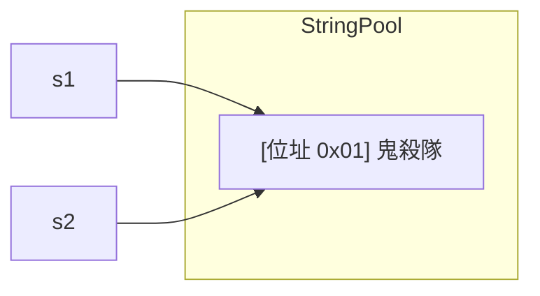
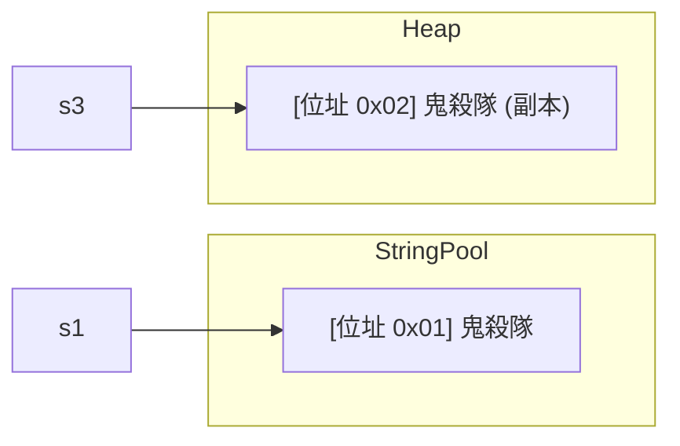
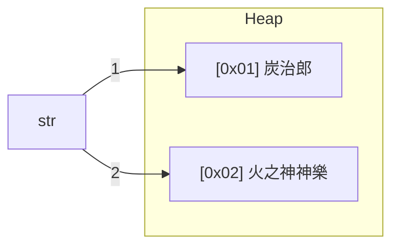
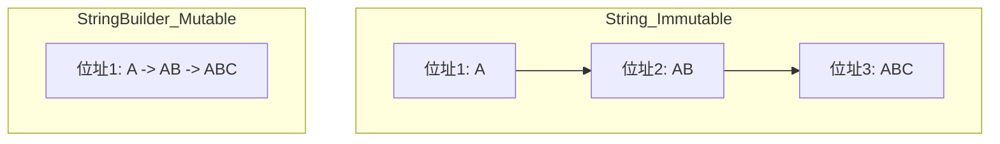

<div class="flex flex-col justify-center items-center h-full" style="background: #ffffff;">
  <p style="color: #5eada0; font-size: 1rem; font-weight: 600; letter-spacing: 0.2em; text-transform: uppercase; margin-bottom: 1.2rem;">Java Programming Masterclass</p>
  <h1 style="color: #1a5c5c; font-size: 3.8rem; font-weight: 900; line-height: 1.15; margin-bottom: 1.5rem;">字元與字串類別</h1>
  <div style="height: 4px; width: 320px; background: linear-gradient(90deg, #5eada0, #a7d9d0); border-radius: 2px; margin-bottom: 1.5rem;"></div>
  <p style="color: #4a7c7c; font-size: 1.15rem; font-style: italic;">
    「掌握 Java 呼吸法：全面解析 Character 與 String」
  </p>
  <Link to="home" style="color: #9dc4c4; font-size: 0.85rem; margin-top: 2rem; text-decoration: none; letter-spacing: 0.05em;">← 返回目錄</Link>
</div>

---
layout: default
---

# Outline

- **字元 Character 類別**
- **字串的建立與記憶體觀念**
- **String 類別的方法 (搜尋、擷取、取代、比較、格式化)**
- **StringBuffer 與 StringBuilder 類別**
- **實作練習與邏輯挑戰**

---
layout: section
class: flex flex-col justify-center items-center text-center
---

# 第一部分
# 字元 Character 類別

---

# 字元類別方法 (一)
### 常用判斷方法

| 方法名稱 | 說明 |
| --- | --- |
| `isDigit(char ch)` | 是否為數字字元 (0-9) |
| `isLetter(char ch)` | 是否為字母字元 (包含中文) |
| `isLetterOrDigit(char ch)` | 是否為數字或字母字元 |
| `isLowerCase(char ch)` | 是否為小寫字母字元 |
| `isUpperCase(char ch)` | 是否為大寫字母字元 |

---

# 字元類別方法 (一) — 範例

```java
char c1 = '9';
char c2 = 'A';
char c3 = '炭'; // 中文字元

System.out.println(Character.isDigit(c1));        // true
System.out.println(Character.isLetter(c3));        // true (中文也算字母)
System.out.println(Character.isUpperCase(c2));     // true
System.out.println(Character.isLetterOrDigit(c1)); // true
```

---

# 字元類別方法 (二)
### 轉換與特殊判斷

| 方法名稱 | 說明 |
| --- | --- |
| `toLowerCase(char ch)` | 將字元轉成小寫 |
| `toUpperCase(char ch)` | 將字元轉成大寫 |
| `isSpaceChar(char ch)` | 是否為 Unicode 的空白字元 |
| `isISOControl(char ch)` | 是否為 ISO 控制字元 |

```java
System.out.println(Character.toLowerCase('A'));    // 'a'
System.out.println(Character.toUpperCase('z'));    // 'Z'

char fullWidthSpace = '\u3000'; // 全型空白
System.out.println(Character.isSpaceChar(fullWidthSpace)); // true
```

---

# 跳脫字元 (Escape Character)

控制字元（如換行、標籤）可以使用 `isISOControl()` 測試：

```java
char ch1 = '\n'; 
char ch2 = '\t'; 

System.out.println("\\n 是控制字元：" + Character.isISOControl(ch1)); 
System.out.println("\\t 是控制字元：" + Character.isISOControl(ch2));
```

<div class="mt-4 p-3 bg-blue-50 border-l-4 border-blue-400 text-gray-700 text-sm text-left">
💡 <b>技術細節：</b> 中文字元「炭」在 Java 中屬於字母字元 (isLetter)。
</div>

---
layout: section
class: flex flex-col justify-center items-center text-center
---

# 第二部分
# 字串的建立

---

# 基本字串型態宣告

只要在內容前後加上雙引號即為字串物件。

```java
String hero = "炭治郎"; // hero 是字串變數
```

<div class="mt-6">

### 常用建構方法 (Constructor)

| 建構方法 | 說明 |
| --- | --- |
| `String()` | 建立一個空字串 |
| `String(char[] data)` | 由字元陣列組成字串 |
| `String(String original)` | **建立副本 (新位址)** |
| `String(StringBuffer buf)` | 由 StringBuffer 建立 |

</div>

---

# Text Blocks（多行字串）

以三個雙引號 `"""` 開頭並**換行**，結尾加 `"""`，省去字串拼接與跳脫：

```java
// 傳統字串（需加 \n）
String msg = "Hello\n鬼殺隊\nGoodbye";

// Text Block（直覺可讀）
String tb = """
            Hello
            鬼殺隊
            Goodbye
            """;
```

<div class="mt-4 p-3 bg-blue-50 border-l-4 border-blue-400 text-gray-700 text-sm text-left">
💡 Text Blocks 的型別仍是 <code>String</code>，所有 String 方法都可使用。結尾的 <code>"""</code> 與內容對齊時，公共縮排會被自動移除。
</div>

---

# 記憶體觀念：字串池 (String Pool)

直接使用雙引號宣告時，Java 會優先檢查字串池：

```java
String s1 = "鬼殺隊";
String s2 = "鬼殺隊";
System.out.println(s1 == s2); // true
```

<div class="flex justify-center mt-4">

</div>

---

# 記憶體觀念：使用 new 建立副本

使用 `new` 關鍵字會在 Heap 區建立一個獨立的新物件位址：

```java
String s1 = "鬼殺隊";
String s3 = new String("鬼殺隊");
System.out.println(s1 == s3); // false
System.out.println(s1.equals(s3)); // true
```

<div class="flex justify-center mt-4">

</div>

---

# 字串內容不可更改性

String 物件一旦建立就無法改變。修改動作會產生**新位址**。

```java
String str = "炭治郎"; // 原本指向 A
str = "火之神神樂";    // 指向新的位址 B
```

<div class="flex justify-center mt-4 bg-gray-50 p-2 rounded-xl">

</div>

---
layout: section
class: flex flex-col justify-center items-center text-center
---

# 第三部分
# String 類別的方法

---

# 字串長度與空白判斷

| 方法 | 說明 |
| --- | --- |
| `int length()` | 回傳字串長度 |
| `boolean isEmpty()` | `length()` 為 0 時傳回 true |
| `boolean isBlank()` | `length()` 為 0 或**內容純空白**時傳回 true |

---

# isEmpty vs isBlank 實戰

```java
String s1 = " "; // 包含一個空格

// false (長度是 1)
System.out.println(s1.isEmpty()); 

// true (被判定為無效空白內容)
System.out.println(s1.isBlank()); 
```

---

# 大小寫轉換

| 方法 | 說明 |
| --- | --- |
| `String toLowerCase()` | 將字串轉換為小寫 |
| `String toUpperCase()` | 將字串轉換為大寫 |

```java
String s = "Kamado Tanjiro";
System.out.println(s.toLowerCase()); // "kamado tanjiro"
System.out.println(s.toUpperCase()); // "KAMADO TANJIRO"
```

---

# 安全處理：當字串為 null 時

當變數為 `null` 時，直接調用方法會觸發 `NullPointerException`。

```java
String hero = null;
// hero.isEmpty(); // ❌ 程式會崩潰！
```

---

# 安全處理：StringUtils 類別

為了避免崩潰，開發中常使用 `StringUtils` 工具 (可同時判斷 `null`)：

| 方法 | 回傳 true 的條件 | 全空白字串 |
| --- | --- | --- |
| `StringUtils.hasLength(str)` | 不為 `null` 且長度 > 0 | `true` (空白算長度) |
| `StringUtils.hasText(str)` | 不為 `null` 且有非空白內容 | `false` |

---

# StringUtils 應用範例

```java
String name = " ";

System.out.println(StringUtils.hasLength(name)); // true
System.out.println(StringUtils.hasText(name));   // false

name = "Nezuko";
System.out.println(StringUtils.hasText(name));   // true
```

---

# 字元的搜尋 (indexOf)

| 方法名稱 | 說明 |
| --- | --- |
| `indexOf(int ch)` | 傳回字元第一次出現的索引 |
| `indexOf(int ch, int from)` | 從指定索引開始往右找 |

- 索引 (Index) 從 **0** 開始計算。
- 若找不到目標，一律回傳 **-1**。

---

# 字元搜尋實例

```java
String str = "Demon Slayer";

// 找 'e'
System.out.println(str.indexOf('e')); // 1

// 從 index 2 開始找 'e'
System.out.println(str.indexOf('e', 2)); // 10
```

---

# 字元的逆向搜尋 (lastIndexOf)

| 方法名稱 | 說明 |
| --- | --- |
| `lastIndexOf(int ch)` | 傳回字元**最後一次**出現的索引 |
| `lastIndexOf(int ch, int from)` | 從指定索引開始**向左**找 |

```java
String str = "Demon Slayer";

// 從右往左找 'e'，找到最後一個
System.out.println(str.lastIndexOf('e')); // 10

// 從 index 5 開始往左找 'e'
System.out.println(str.lastIndexOf('e', 5)); // 1
```

---

# 子字串的搜尋

與字元搜尋邏輯一致，參數改為字串：

| 方法名稱 | 說明 |
| --- | --- |
| `indexOf(String str)` | 子字串第一次出現的位置 |
| `lastIndexOf(String str)` | 子字串最後一次出現的位置 |
| `contains(CharSequence s)`| 是否包含該子字串 |

---

# startsWith( ) 與 endsWith( )

| 方法名稱 | 說明 |
| --- | --- |
| `startsWith(String prefix)` | 是否以指定字串**開頭** |
| `endsWith(String suffix)` | 是否以指定字串**結尾** |

```java
String hero = "炭治郎の日記";
System.out.println(hero.startsWith("炭治郎")); // true
System.out.println(hero.endsWith("日記"));     // true
System.out.println(hero.startsWith("禰豆子")); // false
```

---

# 子字串搜尋進階：lastIndexOf

從指定的 `index` 開始**向左**搜尋：

```java
String str = "炭治郎與禰豆子，還有禰豆子";
// 從 index 10 開始往左找 "禰豆子"
int pos = str.lastIndexOf("禰豆子", 10); // 4
```

---
layout: default
---

# 練習一：出現次數計算
### 任務說明

宣告一段長字串：
「鬼滅之刃是炭治郎與禰豆子的故事，我不喜歡禰豆子的那田蜘蛛山，雖然禰豆子在炭治郎眼中是清新脫俗」

**請計算「禰豆子」在上述字串中出現了幾次？**

---

# 練習一：解題邏輯
### 提示說明

1. 使用 `indexOf("禰豆子")` 找到第一次出現位置。
2. 計算次數 `count++`。
3. **關鍵：** 下一次搜尋的起點為 `目前索引 + "禰豆子".length()`。
4. 重複搜尋直到回傳 `-1` 為止。

---

# 擷取子字串 (substring)

| 方法名稱 | 說明 |
| --- | --- |
| `charAt(int index)` | 返回指定索引的 char 字元 |
| `substring(int begin)` | 從指定位置擷取到最後 |
| `substring(int begin, int end)`| 擷取範圍 [begin, end-1] |

---

# 視覺化擷取圖解 (substring)
### 索引與內容對應關係

```java
String str = "鬼滅之刃是炭治郎的故事";
// 執行：str.substring(5, 8) 擷取索引 5, 6, 7
```

<div class="index-table">

| 索引 (Index) | 0 | 1 | 2 | 3 | 4 | 5 | 6 | 7 | 8 | 9 | 10 |
| :--- | :---: | :---: | :---: | :---: | :---: | :---: | :---: | :---: | :---: | :---: | :---: |
| **內容 (Char)** | 鬼 | 滅 | 之 | 刃 | 是 | **炭** | **治** | **郎** | 的 | 故 | 事 |

</div>

<div class="mt-4 p-4 bg-blue-50 border border-blue-200 rounded-lg text-center">
  <span class="text-blue-600 font-bold">結果：</span> 
  <span class="text-2xl font-mono text-gray-800">"炭治郎"</span>
  <p class="text-sm text-gray-500 mt-1">注意：包含起始索引 5，但<b>不包含</b>結束索引 8</p>
</div>

---
layout: default
---

# 練習二：指定取代
### 任務說明

針對同一段長字串：
「鬼滅之刃是炭治郎與禰豆子的故事... (略)」

**請將「最後一個」禰豆子，取代為「竹筒」。**

---

# 練習二：解題邏輯
### 提示說明

1. 使用 `lastIndexOf("禰豆子")` 找出最後一個目標的位置。
2. 利用 `substring` 將字串切開。
3. 重新拼接：`前半段 + "竹筒" + 後半段`。

---

# getChars( ) 方法應用

當需要將字串內容複製到現有的字元陣列時：

```java
String str = "鬼滅之刃與禰豆子的故事";
char[] ch = new char[15];

// 參數：(字串起, 字串終, 目標陣列, 陣列起)
str.getChars(5, 8, ch, 0); 

System.out.println(ch); // 禰豆子
```

---

# 字串的取代與刪除空白 (一)

| 方法 | 說明 |
| --- | --- |
| `replace(char old, char new)` | 取代全部符合的**字元** |
| `replace(String old, String new)` | 取代全部符合的**子字串** |

```java
String str = "炭治郎炭治郎";

System.out.println(str.replace('炭', '火'));        // "火治郎火治郎"
System.out.println(str.replace("炭治郎", "禰豆子")); // "禰豆子禰豆子"
```

---

# 字串的取代與刪除空白 (二)

| 方法 | 說明 |
| --- | --- |
| `trim()` | 刪除字串**前後**的空白，中間空白不受影響 |

```java
String str = "  水之呼吸  ";
System.out.println(str.trim()); // "水之呼吸"

// 中間空白 trim 無法移除
String str2 = "  水 之 呼 吸  ";
System.out.println(str2.trim()); // "水 之 呼 吸"
```

---

# strip( ) / stripLeading( ) / stripTrailing( )

| 方法名稱 | 說明 |
| --- | --- |
| `strip()` | 移除前後所有空白（含 Unicode 空白） |
| `stripLeading()` | 只移除**開頭**空白 |
| `stripTrailing()` | 只移除**結尾**空白 |

```java
String s = "  水之呼吸  ";
System.out.println(s.strip());          // "水之呼吸"
System.out.println(s.stripLeading());   // "水之呼吸  "
System.out.println(s.stripTrailing());  // "  水之呼吸"
```

<div class="mt-4 p-3 bg-blue-50 border-l-4 border-blue-400 text-gray-700 text-sm text-left">
💡 <b>trim() vs strip()：</b> <code>trim()</code> 只處理 ASCII 空白；<code>strip()</code> 能正確處理所有 Unicode 空白字元，建議優先使用 <code>strip()</code>
</div>

---

# 刪除中間空白的技巧

如果要移除字串中間的所有空格，應使用 `replace` 方法：

```java
String skill = "水 之 呼 吸";
// 將 " " 換成 ""
String result = skill.replace(" ", "");
System.out.println(result); // "水之呼吸"
```

---

# 字串的串接 (Concatenation)

除了常用的 `+` 運算子，Java 也提供 `concat()` 方法：

```java
String s1 = "無限";
String s2 = "列車";

String r1 = s1 + s2;
String r2 = s1.concat(s2);
```

---

# repeat( )

| 方法名稱 | 說明 |
| --- | --- |
| `repeat(int count)` | 將字串重複 count 次，回傳新字串（count 為 0 回傳空字串）|

```java
String s = "鬼滅";
System.out.println(s.repeat(3));    // "鬼滅鬼滅鬼滅"
System.out.println("-".repeat(20)); // "--------------------"
System.out.println("Ha".repeat(0)); // ""
```

---

# 字串的比較：== vs equals

| 比較方式 | 比較目標 | 說明 |
| --- | --- | --- |
| `==` | 記憶體**位址** | 同一個物件才為 true |
| `equals()` | 字串**內容** | 內容相同即為 true |

```java
String s1 = "Muzan";
String s2 = new String("Muzan");

System.out.println(s1 == s2);      // false (位址不同)
System.out.println(s1.equals(s2)); // true  (內容相同)
```

---

# 字典順序比較 (compareTo)

- 回傳 `0`: 兩字串內容相等。
- 回傳 `正值`: 目前字串大於參數字串。
- 回傳 `負值`: 目前字串小於參數字串。

```java
String s1 = "apple";
String s2 = "banana";
String s3 = "apple";

System.out.println(s1.compareTo(s2)); // 負值 ('a' < 'b')
System.out.println(s2.compareTo(s1)); // 正值 ('b' > 'a')
System.out.println(s1.compareTo(s3)); // 0 (內容相同)
```

---

# equalsIgnoreCase( ) 與 compareToIgnoreCase( )

| 方法名稱 | 說明 |
| --- | --- |
| `equalsIgnoreCase(String other)` | 忽略大小寫比較內容，回傳 boolean |
| `compareToIgnoreCase(String other)` | 忽略大小寫的字典順序比較，回傳數值 |

```java
String s1 = "JAVA";
String s2 = "java";
System.out.println(s1.equals(s2));              // false
System.out.println(s1.equalsIgnoreCase(s2));    // true
System.out.println(s1.compareToIgnoreCase(s2)); // 0
```

---

# 字串的轉換 valueOf( )

`valueOf()` 可以將各種型態轉為字串：

```java
int score = 100;
String s = String.valueOf(score); // "100"
```

---

# String.format( )

| 格式符號 | 說明 | 對應型別 |
| --- | --- | --- |
| `%s` | 字串 | `String` |
| `%d` | 整數 | `int`、`long` |
| `%.nf` | 浮點數（n 位小數）| `double`、`float` |
| `%n` | 換行（跨平台）| — |

```java
String name = "炭治郎";
int score = 95;
double rate = 0.9876;
String s = String.format("姓名：%s 分數：%d 勝率：%.1f%%", name, score, rate * 100);
System.out.println(s); // 姓名：炭治郎 分數：95 勝率：98.8%
```

---

# 分割成字串陣列 split( )

`split()` 依據正規表達式分割字串：

```java
String list = "炭治郎,禰豆子,善逸";
String[] heros = list.split(","); 
// heros[0]="炭治郎", heros[1]="禰豆子"...
```

---

# 分割空白字元：`\s` 正規表達式

使用 `"\\s"` 可以依照空白字符（空格、Tab、換行）分割：

```java
String sentence = "炭治郎 禰豆子 善逸";
String[] parts = sentence.split("\\s");
// parts[0]="炭治郎", parts[1]="禰豆子", parts[2]="善逸"
```

<div class="mt-4 p-3 bg-blue-50 border-l-4 border-blue-400 text-gray-700 text-sm text-left">
💡 <b>注意：</b> <code>\s</code> 屬於正規表達式 (Regex)，在 Java 字串中需寫成 <code>"\\s"</code> (雙反斜線)。
</div>

---

# 分割成單一字元技巧

使用空字串 `""` 可以將字串拆成單一字元陣列：

```java
String name = "ABCD";
String[] letters = name.split(""); 
// ["A", "B", "C", "D"]
```

---

# 字串與字元陣列的互轉

```java
String str = "Tanjiro";

// 1. 轉為陣列
char[] data = str.toCharArray();

// 2. 印出陣列內容
System.out.println(Arrays.toString(data)); 
// [T, a, n, j, i, r, o]
```

---

# 進階串接：String.join( )

在 Java 8 之後，可以使用 `join` 快速串接陣列：

```java
String[] team = {"炭", "治", "郎"};
String result = String.join("-", team);
System.out.println(result); // "炭-治-郎"
```

---

# lines( )

| 方法名稱 | 說明 |
| --- | --- |
| `lines()` | 以換行符（`\n`、`\r`、`\r\n`）切割，回傳 `Stream<String>` |

```java
String text = "炭治郎\n禰豆子\n善逸";
text.lines().forEach(System.out::println);
// 炭治郎
// 禰豆子
// 善逸
System.out.println(text.lines().count()); // 3
```

<div class="mt-4 p-3 bg-blue-50 border-l-4 border-blue-400 text-gray-700 text-sm text-left">
💡 與 <code>split("\n")</code> 不同，<code>lines()</code> 同時支援三種換行符，且回傳 Stream 可直接串接後續操作
</div>

---
layout: default
---

# 練習三：字母頻率統計
### 任務說明

宣告字串：「AABCBDCDACBDA」

**1. 請計算 A、B、C、D 分別出現幾次？**
**2. 挑戰：若輸入為任意字串，該如何統計次數？**

---
layout: section
class: flex flex-col justify-center items-center text-center
---

# 第四部分
# StringBuffer 與 StringBuilder

---

# 為什麼需要緩衝區類別？

`String` 是不可變的，頻繁修改會造成效能低落。

```java
// ❌ 效能差 (產生大量暫存物件)
String s = "";
for(int i=0; i<100; i++) s += i;

// ✅ 效能佳 (在同一個緩衝區操作)
StringBuilder sb = new StringBuilder();
for(int i=0; i<100; i++) sb.append(i);
```

---

# 記憶體變更對比

<div class="flex justify-center mt-6">

</div>

---

# 建立與容量管理

| 方法 / 建構子 | 說明 |
| --- | --- |
| `new StringBuilder()` | 預設容量 16 |
| `new StringBuilder(int capacity)` | 指定初始容量 |
| `new StringBuilder(String str)` | 以字串初始化 |
| `capacity()` | 目前緩衝區的總容量 |
| `length()` | 實際存放的字元長度 |

---

# 建立與容量管理 — 範例

```java
StringBuilder sb1 = new StringBuilder();
StringBuilder sb2 = new StringBuilder(50);
StringBuilder sb3 = new StringBuilder("炭治郎");

System.out.println(sb1.capacity()); // 16
System.out.println(sb2.capacity()); // 50
System.out.println(sb3.capacity()); // 19 (16 + 3字)
System.out.println(sb3.length());   // 3
```

---

# 內容修訂方法 (一)

| 方法名稱 | 說明 |
| --- | --- |
| `append(data)` | 將內容加在尾端 |
| `insert(pos, data)` | 在指定位置插入內容 |

```java
StringBuilder sb1 = new StringBuilder("Muzan");
sb1.append("Kibutsuji");
System.out.println(sb1); // "MuzanKibutsuji"

StringBuilder sb2 = new StringBuilder("MuzanKibutsuji");
sb2.insert(5, " "); // 在索引 5 插入空格
System.out.println(sb2); // "Muzan Kibutsuji"
```

---

# 內容修訂方法 (二)

| 方法名稱 | 說明 |
| --- | --- |
| `delete(start, end)` | 刪除 [start, end-1] 範圍的內容 |
| `reverse()` | **反轉字串內容** |

```java
StringBuilder sb1 = new StringBuilder("鬼滅之刃大戰");
sb1.delete(4, 6); // 刪除索引 4~5
System.out.println(sb1); // "鬼滅之刃"

StringBuilder sb2 = new StringBuilder("炭治郎");
sb2.reverse();
System.out.println(sb2); // "郎治炭"
```

---

# 設定與取代方法

| 方法名稱 | 說明 |
| --- | --- |
| `setCharAt(int index, char ch)` | 修改指定位置的字元 |
| `replace(int start, int end, String str)` | 取代 [start, end-1] 範圍的內容 |

```java
StringBuilder sb1 = new StringBuilder("TANJIRO");
sb1.setCharAt(6, 'A');
System.out.println(sb1); // "TANJIRA"

StringBuilder sb2 = new StringBuilder("鬼滅之刃");
sb2.replace(2, 4, "大戰");
System.out.println(sb2); // "鬼滅大戰"
```

---

# 複製子字串 (substring)

| 方法名稱 | 說明 |
| --- | --- |
| `substring(int start)` | 從 start 擷取到結尾 (不修改原物件) |
| `substring(int start, int end)` | 擷取 [start, end-1] 範圍 |

```java
StringBuilder sb = new StringBuilder("鬼滅之刃是炭治郎");

System.out.println(sb.substring(5));    // "炭治郎"
System.out.println(sb.substring(0, 4)); // "鬼滅之刃"
// 原物件內容不變
System.out.println(sb); // "鬼滅之刃是炭治郎"
```

---

# StringBuffer vs StringBuilder

| 類別名稱 | 執行緒安全 | 執行速度 |
| --- | --- | --- |
| **StringBuffer** | **安全 (同步化)** | 較慢 |
| **StringBuilder**| **不安全** | **較快** |

---
layout: default
---

# 練習四：迴文判斷
### 任務說明

撰寫一個程式，判斷使用者輸入是否為「迴文」（正讀反讀結果一致）。

- 例如：`禰豆子豆禰` $\rightarrow$ 是
- 例如：`鬼滅之刃` $\rightarrow$ 否

---

# 練習四：解題提示
### 提示說明

1. 建立 `StringBuilder` 物件。
2. 使用 `.reverse()` 方法。
3. 比對反轉後的內容與原內容是否相等。

---
layout: default
---

# 練習五：進位運算
### 任務說明

給予代表數字的陣列 `[1, 9]` (代表 19)。請計算 `+1` 後的結果。

- **範例 1:** `[1, 9]` $\rightarrow$ `[2, 0]`
- **範例 2:** `[9, 9, 9]` $\rightarrow$ `[1, 0, 0, 0]`

---

# 練習五：解題提示
### 邏輯挑戰

1. 將陣列內容轉為字串拼接。
2. 轉成數字進行運算。
3. 將結果重新拆回陣列。

---
layout: section
class: flex flex-col justify-center items-center text-center
---

# Q & A

---
layout: end
---

# 課程結束
### 祝大家掌握 Java 的呼吸法！
如有課後疑問，歡迎來信討論。
