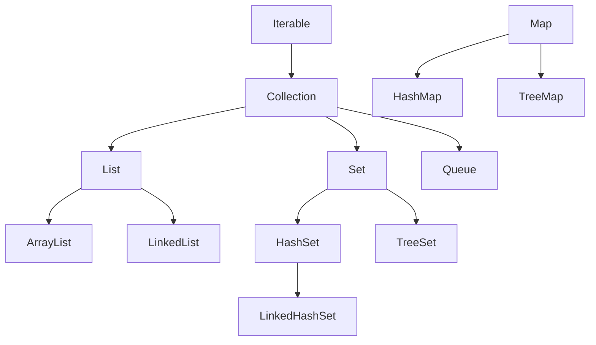

<div class="flex flex-col justify-center items-center h-full" style="background: #ffffff;">
  <p style="color: #5eada0; font-size: 1rem; font-weight: 600; letter-spacing: 0.2em; text-transform: uppercase; margin-bottom: 1.2rem;">Java Programming Masterclass</p>
  <h1 style="color: #1a5c5c; font-size: 3.8rem; font-weight: 900; line-height: 1.15; margin-bottom: 1.5rem;">集合框架</h1>
  <div style="height: 4px; width: 320px; background: linear-gradient(90deg, #5eada0, #a7d9d0); border-radius: 2px; margin-bottom: 1.5rem;"></div>
  <p style="color: #4a7c7c; font-size: 1.15rem; font-style: italic;">
    「用正確的容器，裝下所需的每一筆資料」
  </p>
  <Link to="home" style="color: #9dc4c4; font-size: 0.85rem; margin-top: 2rem; text-decoration: none; letter-spacing: 0.05em;">← 返回目錄</Link>
</div>

<!--
【開場白】
大家好，今天我們要學的是「集合框架」。這可是 Java 的重頭戲，寫程式如果不會用這個，就像是用雙手搬家卻不用紙箱一樣。

【為什麼要學這個？】
以前我們學過陣列，但陣列有個大問題：大小固定，功能有限。你買了一個 10 吋的披薩盒，結果來了 12 吋的披薩，你就傻眼了。集合框架就是 Java 為你準備好的一整組「彈性容器」，會自動長大，還附送各種神奇功能。

【今天學完你會能做什麼】
學完之後，你就能用 List 儲存一排資料、用 Set 自動過濾重複的東西（比如討厭的重複帳號）、用 Map 像查字典一樣秒找資料。這三個工具在任何 Java 專案裡幾乎每天都用得到，是你的吃飯傢伙。
-->

---
layout: default
---

# Outline

- **第一部分：集合框架概覽**
  - 什麼是集合框架、介面層次
  - Collection 介面常用方法
- **第二部分：List 介面**
  - ArrayList、LinkedList 特性與常用方法
- **第三部分：Set 介面**
  - HashSet、LinkedHashSet、TreeSet 比較
- **第四部分：Map 介面**
  - HashMap、LinkedHashMap、TreeMap 比較與遍歷
- **選用指南與 Collections 工具類別**
- **實作練習**

<!--
【課程預覽】
這堂課分成四大部分：集合框架概覽、List、Set 和 Map，最後有選用指南。

【學習建議】
不用現在就把每個方法都背起來。身為資深工程師，我也不會全背。你只要抓大方向：
什麼情況用 List？什麼情況用 Set？什麼情況用 Map？
這個判斷力比背 API 更重要。
-->

---
layout: section
class: flex flex-col justify-center items-center text-center
---

# 第一部分
# 集合框架概覽

<!--
【章節開場】
第一部分，我們先用 10 分鐘了解集合框架的全貌。這就像是先看超市的地圖，知道哪裡買菜、哪裡買肉。
-->

---
layout: default
---

# 什麼是集合框架？

集合框架 (Collection Framework) 是 Java 提供的一組**標準資料結構**，讓你不必手刻就能儲存、管理與操作一群物件。

- **自動調整大小** — 無需像陣列一樣預先指定長度
- **豐富的操作方法** — 新增、刪除、搜尋、排序一應俱全
- **多種結構選擇** — 依需求選擇 List、Set 或 Map

<div class="mt-4 p-3 bg-blue-50 border-l-4 border-blue-400 text-gray-700 text-sm text-left">
💡 <b>使用時機：</b> 當元素數量不確定、需要快速搜尋、或需要鍵值對應時，集合框架比原始陣列更有效率。
</div>

<!--
【核心說明】
集合框架（Collection Framework）就是 Java 官方幫你寫好的「各種收納盒」，你不用自己從零開始鋸木頭釘箱子。

【生活化比喻】
你去 IKEA 買收納組，不需要自己設計抽屜，直接挑現成的用就好。
集合框架也一樣：Java 已經幫你設計好了 List（排隊用的盒子）、Set（防重複的盒子）、Map（貼標籤的盒子），你直接選來用。

⚠️ 學生常見誤解：
陣列和集合不能互換。陣列是「硬殼箱」，大小死了就不能改；集合框架是「高級彈性布袋」，裝越多它就長越大。

💼 業界實務：
在業界，我們 99% 的時間都在用集合框架。如果你在專案裡還在手刻動態陣列，你的同事會覺得你是不是太閒了。
-->

---

# 集合框架的介面層次

<div class="flex justify-center mt-4">



</div>

<div class="mt-4 p-3 bg-blue-50 border-l-4 border-blue-400 text-gray-700 text-sm text-left">
💡 <code>Map</code> 不繼承 <code>Collection</code>，是獨立的介面體系，但同屬集合框架
</div>

<!--
【看圖前的引導】
這張圖是集合框架的「家族樹」。看起來很嚇人，但其實只要記住幾個大長輩。

【逐步帶著看】
最頂端是 Iterable（代表可以被一個一個數過一遍）。
Collection 繼承它，是所有集合的共同祖先。
Collection 往下分三條路：List（有序）、Set（唯一）、Queue（排隊）。
Map 是隔壁棚的表哥，它雖然不繼承 Collection，但大家還是把它當一家人。

💼 業界實務：
面試時常會問「Map 有沒有繼承 Collection？」，答案是「沒有」。記住這一點，你就贏了一半的人。
-->

---

# Collection 介面常用方法

| 方法名稱 | 說明 |
| --- | --- |
| `add(E e)` | 加入一個元素 |
| `remove(Object o)` | 移除指定元素 |
| `contains(Object o)` | 是否包含該元素 |
| `size()` | 回傳元素數量 |
| `isEmpty()` | 是否為空集合 |
| `clear()` | 清空所有元素 |
| `iterator()` | 取得迭代器，用於逐一遍歷 |

<!--
【核心說明】
這張表是所有 Collection 家族成員（List, Set）都會的「基本功」。

【生活化比喻】
這就像是所有收納盒都有的功能：放進去（add）、拿出來（remove）、數一數裡面有幾個（size）。不管你買的是哪種盒子，這些基本動作都一樣。

⚠️ 學生常見誤解：
`remove(Object o)` 是移除「內容物」，不是「第幾個」。
如果你想刪掉「第三個」，那是 List 才有的小撇步，普通 Collection 不一定知道什麼是「第三個」。

💼 業界實務：
我們常會用 `isEmpty()` 來檢查有沒有資料，而不會去寫 `size() == 0`。雖然結果一樣，但 `isEmpty()` 看起來更有高級感，而且效能有時候會好那麼一點點。
-->

---

# Collection 介面方法 — 範例

```java
import java.util.*;

List<String> fruits = new ArrayList<>();
fruits.add("蘋果");
fruits.add("橘子");
fruits.add("香蕉");

System.out.println(fruits.size());            // 3
System.out.println(fruits.contains("橘子"));  // true
fruits.remove("橘子");
System.out.println(fruits.size());            // 2
fruits.clear();
System.out.println(fruits.isEmpty());         // true
```

<!--
【帶讀程式碼前的鋪陳】
我們來玩一下這個水果攤程式。

【逐步解說】
1. 先 `new` 出一個 ArrayList，這是最受歡迎的盒子。
2. `add` 三次，現在肚子裡有三個水果。
3. `size()` 告訴你現在有 3 筆資料。
4. `remove("橘子")` 橘子就被踢出去了。
5. `clear()` 則是大掃除，全部清空。

⚠️ 學生常見誤解：
如果你在 `remove` 裡寫一個不存在的東西（比如 "榴槤"），程式不會噴錯，它只會假裝沒這回事地回傳 `false`。
-->

---

# Iterator — 迭代器遍歷

`iterator()` 回傳一個 `Iterator` 物件，可逐一取出元素，並在遍歷中安全地移除：

| 方法 | 說明 |
| --- | --- |
| `hasNext()` | 是否還有下一個元素 |
| `next()` | 取出下一個元素並前進 |
| `remove()` | 移除 `next()` 最後回傳的元素 |

```java
List<String> fruits = new ArrayList<>(List.of("蘋果", "橘子", "香蕉"));
Iterator<String> it = fruits.iterator();
while (it.hasNext()) {
    System.out.println(it.next());
}
```

<!--
【核心說明】
Iterator（迭代器）是遍歷集合的「保險寫法」。

【生活化比喻】
這就像是在迴轉壽司店。`hasNext()` 就是看輸送帶上還有沒有盤子，`next()` 就是把盤子拿過來吃掉。

【程式世界怎麼用】
如果你想在「一邊看一邊刪除」元素，**一定要用 Iterator**。如果你用普通的 for 迴圈一邊跑一邊刪，Java 會覺得你在玩它，直接噴出 `ConcurrentModificationException` 給你。

💼 業界實務：
雖然現在我們大多用 `for-each` 或 `Stream`，但如果你需要「邊走邊刪」，Iterator 依然是唯一的真理。
-->

---

# 不可變集合工廠方法 (Immutable Collections)

Java 9 引入了更簡潔的方式來建立**不可變** (Immutable) 的集合。
- 這些集合一旦建立，**不能新增、修改或刪除**元素 (會拋出 `UnsupportedOperationException`)。
- **不允許 null 元素** (會拋出 `NullPointerException`)。

| 方法名稱 | 說明 |
| --- | --- |
| `List.of(E... elements)` | 建立不可變的 List |
| `Set.of(E... elements)` | 建立不可變的 Set |
| `Map.of(K k1, V v1, ...)` | 建立不可變的 Map (最多 10 組鍵值) |

```java
List<String> fruits = List.of("蘋果", "橘子", "香蕉");
Set<Integer> numbers = Set.of(1, 2, 3);
Map<String, Integer> scores = Map.of("炭治郎", 95, "善逸", 70);

// fruits.add("葡萄"); // 執行期會拋出例外！
```

<!--
【核心說明】
這是 Java 提供的「防呆模式」。

【生活化比喻】
`List.of` 就像是「密封包裝」。你可以看裡面有什麼，但你沒辦法再塞東西進去。

⚠️ 學生常見誤解：
注意！這是不可變的。如果你試圖對 `List.of` 出來的東西 `add`，編譯時不會報錯（它是躲在介面後面的），但在跑程式時會直接炸掉。這就是所謂的「運行時驚喜」。

💼 業界實務：
當你確定這份資料永遠不會變（比如一週的天數、方向常數），就用 `List.of`。這能保護你的資料不被別的工程師手賤改掉。
-->

---

# 複製為不可變集合

Java 10 新增了 `copyOf()` 方法，可以將現有的集合**複製**成不可變集合。
- 如果來源已經是不可變集合 (例如用 `List.of` 建立)，則直接回傳原物件，不會浪費記憶體。

| 方法名稱 | 說明 |
| --- | --- |
| `List.copyOf(Collection)` | 將集合複製為不可變 List |
| `Set.copyOf(Collection)` | 將集合複製為不可變 Set |
| `Map.copyOf(Map)` | 將 Map 複製為不可變 Map |

```java
List<String> mutableList = new ArrayList<>();
mutableList.add("A");
mutableList.add("B");

// 複製一份不可變的 List
List<String> immutableList = List.copyOf(mutableList);
// immutableList.add("C"); // 拋出 UnsupportedOperationException
```

<!--
【核心說明】
這是一個「快照」的概念。

【生活化比喻】
你有一本可以隨便塗鴉的筆記本（mutableList），現在你把它「影印」了一份（copyOf），這份影印件就是不可更改的 PDF 了。

💼 業界實務：
資深開發者在寫 Method 時，如果不想讓外部的人改動我的內部資料，我會回傳一個 `List.copyOf(internalData)`。這叫「防禦性編程」，不信任任何人！
-->

---
layout: default
---

# 練習 1-1：水果攤的 Collection 操作
### 任務說明

建立 `List<String> fruits`，初始內容為「蘋果、香蕉、橘子、葡萄」，完成以下操作：

1. 印出 `size()`
2. 用 `contains()` 檢查是否有「西瓜」
3. 用 `Iterator` 遍歷整個清單，並移除「香蕉」
4. 印出移除後的清單與 `isEmpty()` 的結果

<!--
【出題前的鋪陳】
這題是把 Collection 介面的基本方法跟 Iterator 全部串在一起練習。

【問題引導】
重點在第 3 步：你可以用 for-each 邊跑邊刪嗎？試試看會發生什麼事，再改用 Iterator。
-->
---
layout: default
---

# 練習 1-1：解題提示
### 提示說明

```java
List<String> fruits = new ArrayList<>(List.of("蘋果", "香蕉", "橘子", "葡萄"));
System.out.println(fruits.size());
System.out.println(fruits.contains("西瓜"));

Iterator<String> it = fruits.iterator();
while (it.hasNext()) {
    if (it.next().equals("香蕉")) {
        it.remove();
    }
}
System.out.println(fruits);
System.out.println(fruits.isEmpty());
```

- 若改用 `for (String f : fruits) { if (f.equals("香蕉")) fruits.remove(f); }`，會拋出 `ConcurrentModificationException`
- 邊遍歷邊刪除，務必使用 `Iterator.remove()`

<!--
【帶讀解法】
先建立可修改的 ArrayList（記得包一層 `new ArrayList<>(List.of(...))`，不然 List.of 出來的東西不能改）。
重點是 `it.remove()`：它移除的是「上一次 next() 拿到的元素」，這是唯一安全的邊走邊刪寫法。
-->
---
layout: default
---

# 練習 1-2：不可變集合的應用
### 任務說明

1. 使用 `List.of()` 建立不可變清單 `weekdays`，內容為一週七天
2. 對 `weekdays` 呼叫 `add()`，用 try-catch 捕捉並印出拋出的例外名稱
3. 建立一個可變的 `ArrayList<String> mutable`，加入幾筆資料後，使用 `List.copyOf(mutable)` 建立 `copy`
4. 對 `copy` 呼叫 `add()`，驗證同樣會拋出例外；但驗證 `mutable` 仍可正常新增元素

<!--
【出題前的鋪陳】
這題在驗證「不可變」到底有多不可變，以及它跟原本的可變集合之間的關係。

【問題引導】
List.of 出來的東西是「密封包裝」，但 copyOf 出來的「影印件」跟「正本」是兩回事 —— 改正本不會影響影印件，反之亦然。
-->
---
layout: default
---

# 練習 1-2：解題提示
### 提示說明

```java
List<String> weekdays = List.of("一", "二", "三", "四", "五", "六", "日");
try {
    weekdays.add("補假");
} catch (UnsupportedOperationException e) {
    System.out.println("weekdays 不可變：" + e);
}

List<String> mutable = new ArrayList<>();
mutable.add("A");
mutable.add("B");
List<String> copy = List.copyOf(mutable);

try {
    copy.add("C");
} catch (UnsupportedOperationException e) {
    System.out.println("copy 不可變：" + e);
}

mutable.add("C"); // 正本仍可修改
System.out.println("mutable: " + mutable);
System.out.println("copy: " + copy);
```

<!--
【帶讀解法】
兩次 add() 都會拋出 `UnsupportedOperationException`，這是 immutable collection 的正字標記。
最後一步是關鍵：`mutable.add("C")` 完全沒問題，而 `copy` 仍然停留在複製當下的內容 `[A, B]`，兩者互不影響。
-->

---
layout: section
class: flex flex-col justify-center items-center text-center
---

# 第二部分
# List 介面

<!--
【章節開場】
第二部分，我們來聊聊最受歡迎的 `List`。它就像是排隊，有順序、有號碼，大家都能重複排。
-->

---
layout: default
---

# List 介面特性

`List` 是**有序**且**允許重複**元素的集合，支援透過索引 (index) 存取。

```java
List<String> list = new ArrayList<>();
list.add("A");
list.add("B");
list.add("A"); // 允許重複

System.out.println(list.get(0)); // "A"
System.out.println(list.size()); // 3
```

<div class="mt-4 p-3 bg-blue-50 border-l-4 border-blue-400 text-gray-700 text-sm text-left">
💡 索引從 <code>0</code> 開始，和陣列相同。宣告時通常用介面型態 <code>List</code>，實作類別用 <code>new ArrayList<>()</code>。
</div>

<!--
【核心說明】
List 就是「有序」且「可重複」。

【生活化比喻】
List 就像是排隊買演唱會門票。誰先來誰站前面（有序），而且同一個人可以排兩次隊（允許重複）。

⚠️ 學生常見誤解：
記住索引（Index）是從 0 開始的。如果你有 3 個元素，最大的索引是 2。如果你去存取 `get(3)`，Java 會噴出一個 `IndexOutOfBoundsException`，翻譯成人話就是：「沒這格，別亂摸」。

💼 業界實務：
宣告時用 `List`（大長輩介面），實例化用 `ArrayList`（具體實作）。這叫「向上轉型」，讓你的程式更有彈性。
-->

---

# List 常用方法

| 方法名稱 | 說明 |
| --- | --- |
| `get(int index)` | 取得指定索引的元素 |
| `set(int index, E e)` | 替換指定位置的元素，回傳舊元素 |
| `add(int index, E e)` | 在指定位置插入元素 |
| `remove(int index)` | 移除指定位置的元素 |
| `indexOf(Object o)` | 首次出現的索引（找不到回傳 -1） |
| `subList(int from, int to)` | 取得子串列，範圍 [from, to-1] |

<!--
【核心說明】
List 讓你像操作陣列一樣，用索引來指定位置。

【生活化比喻】
`set(1, "B")` 就像是把排在第二個的人趕走，換成 B 站進去。
`add(1, "C")` 則是讓 C 插入到第二個位置，後面的所有人都得乖乖往後退一步。

⚠️ 學生常見誤解：
`subList(0, 2)` 的範圍是「包含頭，不包含尾」。所以它會拿索引 0 和 1 的元素。這是 Java 的老傳統了。

💼 業界實務：
`indexOf` 很常用來找某個東西在不在、在哪裡。如果回傳 -1，代表「查無此人」。
-->

---

# List 常用方法 — 範例

```java
List<String> heroes = new ArrayList<>();
heroes.add("炭治郎");
heroes.add("禰豆子");
heroes.add("善逸");

heroes.set(1, "伊之助");         // 替換索引 1
heroes.add(0, "煉獄");           // 在開頭插入
System.out.println(heroes.get(0));       // "煉獄"
System.out.println(heroes.indexOf("善逸")); // 3
List<String> sub = heroes.subList(0, 2);
System.out.println(sub);         // [煉獄, 炭治郎]
```

<!--
【帶讀程式碼前的鋪陳】
我們來看看這段鬼殺隊的排隊邏輯。

【逐步解說】
1. 一開始是 炭治郎、禰豆子、善逸。
2. `set(1, "伊之助")`：禰豆子（索引 1）被換成了伊之助。
3. `add(0, "煉獄")`：大哥（煉獄）空降到第一位，其他人全部後移。
4. 現在善逸被擠到了第 4 位（索引 3）。

【類比說明】
這就像是捷運排隊。有人插隊（add），後面的人就要往後退；有人被警察帶走（remove），後面的人就要往前補。

💼 業界實務：
`subList` 出來的東西不是一個全新的 List，它是原 List 的「分身」。改了 subList，原來的 List 也會跟著變。想玩真的？記得 `new ArrayList<>(subList)`。
-->

---

# ArrayList vs LinkedList

| 特性 | ArrayList | LinkedList |
| --- | --- | --- |
| 底層結構 | 動態陣列 | 雙向鏈結串列 |
| 隨機存取 `get(i)` | 快 O(1) | 慢 O(n) |
| 修改元素 `set(i, e)` | 快 O(1) | 慢 O(n) |
| 中間插入 / 刪除 | 慢 O(n) | 快 O(1) |
| 記憶體用量 | 較少 | 較多（需儲存前後節點指標） |
| 適用場景 | 多讀取、少插入 | 多插入 / 刪除 |

<div class="mt-4 p-3 bg-blue-50 border-l-4 border-blue-400 text-gray-700 text-sm text-left">
💡 <b>預設選 ArrayList</b>，除非需要頻繁在中間插入或刪除元素，才考慮 LinkedList
</div>

<!--
【核心說明】
這是在面試中被問到爛掉的經典題。

【生活化比喻】
`ArrayList` 像是一排有編號的置物櫃。你要開第 100 個，眼睛一掃就知道在哪（快）。但要在中間塞一個新櫃子，你得搬動後面所有的櫃子（慢）。
`LinkedList` 像是一排牽著手的人。你要找第 100 個，你得從頭一個一個數過去（慢）。但在中間插一個人，只要兩個人把手放開再牽一個新的人就好（快）。

⚠️ 學生常見誤解：
「修改元素」聽起來像是 O(1) 的小動作，但 `LinkedList.set(i, e)` 一樣要先沿著鏈結串列走到第 i 個節點才能換值，所以還是 O(n)；只有換值本身那一步是 O(1)。`ArrayList.set(i, e)` 因為底層是陣列，可以直接用索引定位，整體是 O(1)。

雖然 LinkedList 插入快，但在真實世界中，**ArrayList 幾乎在所有情況下都贏**。因為現代 CPU 很聰明，它讀陣列這種連續的東西特別快。

💼 業界實務：
除非你在做什麼超高頻率的中間插入（比如寫個文字編輯器），否則無腦選 `ArrayList`。
-->

---

# LinkedList 的雙端操作

`LinkedList` 同時實作 `Deque` 介面，可當作**雙端佇列**使用：

| 方法名稱 | 說明 |
| --- | --- |
| `addFirst(E e)` | 加到串列開頭 |
| `addLast(E e)` | 加到串列末端 |
| `removeFirst()` | 移除並回傳開頭元素 |
| `removeLast()` | 移除並回傳末端元素 |

```java
LinkedList<String> queue = new LinkedList<>();
queue.addLast("任務A");
queue.addLast("任務B");
System.out.println(queue.removeFirst()); // "任務A"
```

<!--
【核心說明】
LinkedList 不只是 List，它還能從兩頭操作。

【生活化比喻】
它就像是一根透明的水管。你可以從左邊塞東西、右邊拿東西，或者反過來。

💼 業界實務：
當你需要一個「任務排隊系統」（FIFO，先進先出）時，用 LinkedList 實作 Deque 是個很不錯的選擇。
-->

---
layout: default
---

# 練習 2-1：管理英雄名單
### 任務說明

請宣告一個 `ArrayList<String>`，儲存以下鬼殺隊成員：
「炭治郎、禰豆子、善逸、伊之助、蜜璃」

完成以下操作：
1. 在「善逸」前面插入「甘露寺」
2. 將「禰豆子」替換為「時透無一郎」
3. 移除最後一個成員
4. 用 `Collections.sort()` 依字典順序排序後印出

<!--
【練習導引】
來，動手做做看。這題是在考你對索引（Index）的掌握。

【關鍵提示】
1. 加甘露寺時，先算一下善逸原本在第幾格。
2. 刪除最後一個，記得用 `size() - 1`，這是最安全的寫法。
3. 如果你在這題算錯索引，你的英雄名單可能會出現「伊之助消失了」這種靈異事件。
-->
---
layout: default
---

# 練習 2-1：解題提示
### 提示說明

1. 善逸在索引 2，使用 `list.add(2, "甘露寺")` 插入
2. 禰豆子在索引 1，使用 `list.set(1, "時透無一郎")` 替換
3. `list.remove(list.size() - 1)` 移除最後一個元素
4. `Collections.sort(list)` 排序

```java
List<String> m = new ArrayList<>(
    List.of("炭治郎","禰豆子","善逸","伊之助","蜜璃"));
m.add(2, "甘露寺");
m.set(1, "時透無一郎");
m.remove(m.size() - 1);
Collections.sort(m);
System.out.println(m);
```

<!--
【解說要點】
注意那個 `List.of`。如果你直接拿 `List.of` 的結果去 `add`，程式會原地爆炸。一定要 `new ArrayList<>(...)` 把資料搬進去一個可以動的盒子裡。這是我看過初學者最常犯的錯！
-->
---
layout: default
---

# 練習 2-2：待辦事項佇列
### 任務說明

使用 `LinkedList<String>` 模擬一個「待辦事項佇列」：

1. 用 `addLast()` 依序加入「買菜」、「寫作業」、「運動」
2. 用 `addFirst()` 將「澆花」加到最前面
3. 用 `removeFirst()` 取出並印出第一項待辦事項
4. 印出剩餘的待辦事項

完成後，請說明：若改用 `ArrayList` 實作 `addFirst`/`removeFirst`（即 `add(0, ...)`/`remove(0)`），時間複雜度會有什麼差異？

<!--
【出題前的鋪陳】
這題練習 LinkedList 身為 Deque 的雙端操作。

【問題引導】
想像一張待辦清單，有時候會有「插隊」的緊急任務（澆花），有時候完成的任務要從最前面劃掉。
-->
---
layout: default
---

# 練習 2-2：解題提示
### 提示說明

```java
LinkedList<String> todos = new LinkedList<>();
todos.addLast("買菜");
todos.addLast("寫作業");
todos.addLast("運動");

todos.addFirst("澆花");

System.out.println("處理：" + todos.removeFirst()); // 澆花
System.out.println("剩餘待辦：" + todos);
```

- `ArrayList` 沒有 `addFirst`/`removeFirst`，只能用 `add(0, ...)`/`remove(0)`
- 這兩個操作在 `ArrayList` 是 **O(n)**（要搬移其餘元素），在 `LinkedList` 則是 **O(1)**

<!--
【帶讀解法】
LinkedList 兩端操作都很輕鬆：addFirst/addLast 加入、removeFirst/removeLast 取出。
時間複雜度的差異就是本章「ArrayList vs LinkedList」那張表的具體應用：插隊與劃掉任務都發生在頭尾，LinkedList 完全不用搬東西。
-->

---
layout: section
class: flex flex-col justify-center items-center text-center
---

# 第三部分
# Set 介面

<!--
【章節開場】
第三部分，`Set`。它的口號只有一個：**我拒絕重複**。
-->

---
layout: default
---

# Set 介面特性

`Set` 是**不允許重複**元素的集合，加入重複元素時會被自動忽略。

```java
Set<String> names = new HashSet<>();
names.add("禰豆子");
names.add("炭治郎");
names.add("禰豆子"); // 重複，被忽略

System.out.println(names.size());             // 2
System.out.println(names.contains("炭治郎")); // true
```

<div class="mt-4 p-3 bg-blue-50 border-l-4 border-blue-400 text-gray-700 text-sm text-left">
💡 <code>Set</code> 沒有 <code>get(index)</code> 方法，通常用 for-each 或 Iterator 遍歷
</div>

<!--
【核心說明】
Set 是個有潔癖的收納盒。

【生活化比喻】
這就像是「簽到表」。一個人只能簽名一次。你第二次跑來簽名，班長會直接翻白眼無視你。

⚠️ 學生常見誤解：
Set 是「無序」的。你放進去順序是 A, B, C，拿出來可能是 C, A, B。如果你追求順序，Set 會讓你很失望。而且它沒有 `get(0)` 這種東西，因為它根本不知道誰是第一。

💼 業界實務：
Set 最好用的地方就是「去重」。如果你有一萬個使用者 ID，想知道裡面有幾個不重複的人，丟進 `HashSet` 就對了。
-->

---

# Set 常用方法

| 方法名稱 | 說明 |
| --- | --- |
| `add(E e)` | 加入元素；若元素已存在則不變，回傳 `false` |
| `remove(Object o)` | 移除指定元素，回傳是否成功移除 |
| `contains(Object o)` | 是否包含指定元素 |
| `size()` / `isEmpty()` | 元素數量 / 是否為空 |
| `addAll(Collection c)` | 聯集：加入另一個集合的所有元素 |
| `retainAll(Collection c)` | 交集：只保留兩者都有的元素 |
| `removeAll(Collection c)` | 差集：移除另一個集合中也有的元素 |
| `clear()` | 清空所有元素 |

```java
Set<String> names = new HashSet<>();
System.out.println(names.add("炭治郎")); // true，新增成功
System.out.println(names.add("炭治郎")); // false，已存在
System.out.println(names.contains("炭治郎")); // true
System.out.println(names.remove("炭治郎"));   // true
System.out.println(names.isEmpty());          // true
```

<!--
【核心說明】
Set 的方法跟 List 很像，但因為沒有索引，所以多了一些「靠值本身判斷」的方法。

【生活化比喻】
`add` 回傳的 `true`/`false` 就像簽到表上的小提醒：簽成功給你一個讚（true），如果你的名字已經在表上了，它就搖搖頭（false），但不會報錯。

⚠️ 學生常見誤解：
`add` 回傳 `boolean`，很多人以為它跟 List 的 `add` 一樣永遠回傳 `true` 而忽略回傳值。但在 Set 裡，這個回傳值正是判斷「剛剛加入的是不是新元素」的關鍵。

💼 業界實務：
`addAll` / `retainAll` / `removeAll` 就是數學課教的聯集、交集、差集，下一頁馬上會看到實際範例。`contains` 在 `HashSet` 是 O(1)，比 `List.contains` 的 O(n) 快非常多，是兩者最大的效能差異之一。
-->

---

# HashSet / LinkedHashSet / TreeSet 比較

| 類別 | 順序 | 允許 Null | 效能 |
| --- | --- | --- | --- |
| `HashSet` | 不保證順序 | 允許一個 | 最快 |
| `LinkedHashSet` | 維持**插入順序** | 允許一個 | 中 |
| `TreeSet` | 依**自然排序**（升序） | 不允許 | 較慢 |

```java
Set<Integer> hs = new HashSet<>(List.of(3, 1, 2));
Set<Integer> ts = new TreeSet<>(List.of(3, 1, 2));
System.out.println(hs); // [1, 2, 3] 或其他順序
System.out.println(ts); // [1, 2, 3]（一定升序）
```

<!--
【核心說明】
Set 家族的三兄弟。

【生活化比喻】
`HashSet`: 抽籤袋。隨便摸，沒順序。
`LinkedHashSet`: 像排隊的人。記得誰先來、誰後到，但還是不准重複。
`TreeSet`: 自動排序器。放進去是 3, 1, 2，印出來自動變成 1, 2, 3。

⚠️ 學生常見誤解：
`TreeSet` 不准放 `null`。因為它要幫大家排隊，它不知道 `null` 應該站哪裡（是第 0 個還是最後一個？），所以索性不讓你放。

💼 業界實務：
除非你需要排序，否則一律用 `HashSet`。它的效能是王者。
-->

---

# Set 實用操作：聯集與交集

```java
Set<String> setA = new HashSet<>(List.of("A", "B", "C"));
Set<String> setB = new HashSet<>(List.of("B", "C", "D"));

// 聯集：A ∪ B
Set<String> union = new HashSet<>(setA);
union.addAll(setB);
System.out.println(union); // [A, B, C, D]

// 交集：A ∩ B
Set<String> inter = new HashSet<>(setA);
inter.retainAll(setB);
System.out.println(inter); // [B, C]
```

<!--
【核心說明】
這就是國中數學學的集合運算。

【生活化比喻】
`addAll` 是「我們兩班合併」；`retainAll` 是「只有我們兩班都認識的人才能留下」。

💼 業界實務：
這在「過濾權限」或「找共同好友」時超好用。比如你想找「同時喜歡寫程式又喜歡打電動」的人，就用兩個 Set 的交集（retainAll）。
-->

---
layout: default
---

# 練習 3-1：去除重複的訪客名單
### 任務說明

給定 `String[] visitors = {"Alice","Bob","Alice","Charlie","Bob","Alice"}`：

1. 將其放入 `HashSet<String>`，印出不重複的訪客數量與內容
2. 再放入 `LinkedHashSet<String>`，印出內容並比較與 `HashSet` 的順序差異
3. 再放入 `TreeSet<String>`，印出內容（應為字母順序）

<!--
【出題前的鋪陳】
這題讓你親眼看看 Set 三兄弟（HashSet / LinkedHashSet / TreeSet）的順序差異。

【問題引導】
同一份原始資料，丟進三種不同的 Set，印出來的結果會不會一樣？先猜猜看，再動手驗證。
-->
---
layout: default
---

# 練習 3-1：解題提示
### 提示說明

```java
String[] visitors = {"Alice","Bob","Alice","Charlie","Bob","Alice"};

Set<String> hs = new HashSet<>(Arrays.asList(visitors));
System.out.println("HashSet（" + hs.size() + " 人）：" + hs);

Set<String> lhs = new LinkedHashSet<>(Arrays.asList(visitors));
System.out.println("LinkedHashSet：" + lhs);

Set<String> ts = new TreeSet<>(Arrays.asList(visitors));
System.out.println("TreeSet：" + ts);
```

- `HashSet` 不保證順序
- `LinkedHashSet` 會維持「第一次出現」的順序：Alice, Bob, Charlie
- `TreeSet` 會依字母排序：Alice, Bob, Charlie（剛好跟插入順序一樣，但原理不同）

<!--
【帶讀解法】
三個 Set 的內容都一樣（重複的元素被自動忽略），但「印出來的順序」是這題的重點。
LinkedHashSet 是「誰先來誰排前面」，TreeSet 是「不管誰先來，一律按字母排」。
-->
---
layout: default
---

# 練習 3-2：社團成員聯集、交集與差集
### 任務說明

- 籃球社成員：`{"小明","小華","小美","阿強"}`
- 桌遊社成員：`{"小華","阿強","阿傑","小芳"}`

計算並印出：

1. 兩社團成員聯集（總共有哪些人至少參加一個社團）
2. 兩社團都參加的成員（交集）
3. 只參加籃球社、沒參加桌遊社的成員（差集）

<!--
【出題前的鋪陳】
延續上一張投影片的聯集與交集，這題多加一個「差集」。

【問題引導】
差集要用哪個方法？提示：跟交集（retainAll）是反過來的概念。
-->
---
layout: default
---

# 練習 3-2：解題提示
### 提示說明

```java
Set<String> basketball = new HashSet<>(List.of("小明","小華","小美","阿強"));
Set<String> boardgame  = new HashSet<>(List.of("小華","阿強","阿傑","小芳"));

// 聯集
Set<String> union = new HashSet<>(basketball);
union.addAll(boardgame);
System.out.println("聯集：" + union);

// 交集
Set<String> inter = new HashSet<>(basketball);
inter.retainAll(boardgame);
System.out.println("交集：" + inter);

// 差集：只在籃球社、不在桌遊社
Set<String> diff = new HashSet<>(basketball);
diff.removeAll(boardgame);
System.out.println("差集：" + diff);
```

<!--
【帶讀解法】
三種集合運算都遵循同一個套路：先複製一份（`new HashSet<>(原集合)`），再對複製品呼叫 addAll / retainAll / removeAll，避免改到原始資料。
差集 `removeAll`：把「兩邊都有的人」從複製品中踢掉，剩下的就是「只有我這邊有」的人。
-->

---
layout: section
class: flex flex-col justify-center items-center text-center
---

# 第四部分
# Map 介面

<!--
【章節開場】
第四部分，大魔王 `Map` 出場。它不是一格一格的，它是一對一對的。
-->

---
layout: default
---

# Map 介面特性

`Map` 儲存**鍵值對 (Key-Value Pair)**，每個鍵唯一，對應一個值。

```java
Map<String, Integer> scores = new HashMap<>();
scores.put("炭治郎", 95);
scores.put("善逸", 70);
scores.put("炭治郎", 99); // 相同鍵 → 覆蓋舊值

System.out.println(scores.get("炭治郎")); // 99
```

<div class="mt-4 p-3 bg-blue-50 border-l-4 border-blue-400 text-gray-700 text-sm text-left">
💡 <b>鍵</b>不能重複；若用相同鍵再次 <code>put</code>，舊值會被新值覆蓋
</div>

<!--
【核心說明】
Map 就是「對應關係」。

【生活化比喻】
Map 就像是「字典」或者「置物櫃編號」。鍵（Key）是置物櫃號碼，值（Value）是裡面的東西。
號碼不能重複（一個號碼對一格），但你可以隨時把裡面的東西換掉。

⚠️ 學生常見誤解：
Key 是唯一的，但 Value 可以重複。你可以讓「炭治郎」跟「善逸」都得 99 分（不同的 Key 对应相同的 Value），但你不能有兩個「炭治郎」各自得不同的分。

💼 業界實務：
HashMap 是快取（Cache）的靈魂。想快速找到 User 物件？把 ID 當 Key 存進 HashMap 吧。
-->

---

# Map 常用方法

| 方法名稱 | 說明 |
| --- | --- |
| `put(K key, V value)` | 存入鍵值對（已存在則覆蓋） |
| `get(Object key)` | 取得鍵對應的值（找不到回傳 null） |
| `getOrDefault(K key, V def)` | 找不到鍵時回傳預設值 |
| `remove(Object key)` | 移除指定鍵的鍵值對 |
| `containsKey(Object key)` | 是否包含指定鍵 |
| `containsValue(Object value)` | 是否包含指定值 |
| `size()` | 鍵值對數量 |
| `keySet()` | 取得所有鍵（回傳 `Set`) |
| `values()` | 取得所有值（回傳 `Collection`） |
| `entrySet()` | 取得所有鍵值對（回傳 `Set<Map.Entry<K,V>>`）|

<!--
【核心說明】
Map 的方法稍微複雜一點，因為它有兩面。

【生活化比喻】
`getOrDefault` 是個非常有修養的方法。你去櫃檯找人，如果這人不在，它會給你一個預設的禮物（而不是直接讓你噴錯崩潰）。

⚠️ 學生常見誤解：
`get(key)` 如果找不到會回傳 `null`。如果你拿這個 `null` 去做運算（比如 +1），你的程式就會發生震撼全場的 `NullPointerException`。**記得一定要判斷 null 或用 `getOrDefault`**。

💼 業界實務：
`entrySet()` 是遍歷 Map 的正確姿勢。別再先拿 keySet 再一個一個 get 了，那樣慢到同事會想殺你。
-->

---

# Map 常用方法 — 範例

```java
Map<String, Integer> map = new HashMap<>();
map.put("A", 10);
map.put("B", 20);
map.put("A", 99);  // 覆蓋舊值

System.out.println(map.get("A"));              // 99
System.out.println(map.getOrDefault("C", 0));  // 0
System.out.println(map.containsKey("B"));      // true
System.out.println(map.keySet());              // [A, B]
System.out.println(map.values());              // [99, 20]
```

<!--
【帶讀程式碼前的鋪陳】
我們來看看這個 Map 是怎麼運作的。

【逐步解說】
1. 把 A 存為 10，B 存為 20。
2. 再次 `put` A，10 就被 99 擠走了。
3. `get("A")` 拿到的就是 99。
4. `getOrDefault("C", 0)`：沒有 C 耶，那就回傳 0 吧。

【老鳥筆記】
Map 的 `put` 方法如果覆蓋了舊值，其實它會回傳那個「被擠走的舊值」。有時候我們會用到這個特性來做某些判斷。
-->

---

# HashMap vs LinkedHashMap vs TreeMap

| 特性 | HashMap | LinkedHashMap | TreeMap |
| --- | --- | --- | --- |
| 鍵的順序 | 不保證 | 維持**插入順序** | 依**鍵升序排列** |
| 允許 Null 鍵 | 允許一個 | 允許一個 | 不允許 |
| 存取效能 | O(1) | O(1) | O(log n) |
| 適用場景 | 快速查詢 | 需維持插入順序 | 需依鍵排序輸出 |

<!--
【核心說明】
這也是順序三兄弟在 Map 棚的表現。

【生活化比喻】
`HashMap`: 把東西亂塞進櫃子，查起來最快。
`LinkedHashMap`: 按照你放東西的順序排好。
`TreeMap`: 按照檔名標籤（Key）自動幫你排好序。

⚠️ 學生常見誤解：
HashMap 的順序真的不可預測。如果你想把 Map 轉成 JSON 給前端看，且希望順序固定，請用 `LinkedHashMap`。

💼 業界實務：
TreeMap 的查詢速度稍微慢一點點，但如果你需要「列出所有以 A 開頭的 Key」，它可是最強的。
-->

---

# HashMap vs LinkedHashMap vs TreeMap — 範例

```java
Map<String, Integer> hm = new HashMap<>();
hm.put("banana", 2); hm.put("apple", 5);
System.out.println(hm);  // 不保證順序
Map<String, Integer> lhm = new LinkedHashMap<>();
lhm.put("banana", 2); lhm.put("apple", 5);
System.out.println(lhm); // {banana=2, apple=5}（插入順序）
Map<String, Integer> tm = new TreeMap<>();
tm.put("banana", 2); tm.put("apple", 5);
System.out.println(tm);  // {apple=5, banana=2}（鍵升序）
```

<!--
【逐步解說】
看到了嗎？這三種 Map 的輸出結果截然不同。
HashMap 可能會讓你驚訝（怎麼變 apple 在前？那是它的內部 Hash 算法決定的）。
LinkedHashMap 最老實。
TreeMap 則是最優雅的排版者（a 排在 b 前面）。

【笑話時間】
如果你想讓你的強迫症同事抓狂，就把所有的 Map 通通換成 HashMap，保證他每次重整頁面看到的資料順序都不一樣。
-->

---

# Map 的遍歷方式

```java
Map<String, Integer> scores = new HashMap<>();
scores.put("炭治郎", 95);
scores.put("善逸", 70);

// 方式一：entrySet 遍歷（最常用）
for (Map.Entry<String, Integer> entry : scores.entrySet()) {
    System.out.println(entry.getKey() + " → " + entry.getValue());
}

// 方式二：keySet 遍歷
for (String key : scores.keySet()) {
    System.out.println(key + " → " + scores.get(key));
}
```

<!--
【核心說明】
如何「巡視」你的 Map。

【老鳥筆記】
方式一（entrySet）是「一次拿一對」。
方式二（keySet）是「先拿名字，再拿著名字去櫃檯查」。
明顯方式一有效率得多，因為你不用跑櫃檯跑兩次。

⚠️ 學生常見誤解：
那個 `Map.Entry<String, Integer>` 看起來很長很討厭對吧？如果你是用 Java 10 以上，可以直接用 `var entry`，Java 就會幫你搞定。

💼 業界實務：
如果你只需要 Key，用 `keySet()`；如果你兩個都要，**請死記 `entrySet()`**。
-->

---
layout: default
---

# 練習 4-1：成績統計系統
### 任務說明

宣告一個 `HashMap<String, Integer>` 儲存以下成績：
炭治郎：95、善逸：70、伊之助：85、蜜璃：90

完成以下操作：
1. 新增「甘露寺：88」
2. 將「善逸」的成績更新為 80
3. 計算全班平均分數（整數）
4. 印出所有成績 ≥ 85 的學生姓名

<!--
【練習導引】
這次玩 Map。這題很有實戰感。

【關鍵提示】
1. 計算總分時，可以用 `for (int s : scores.values())`，不需要拿 Key。
2. 找高分名單時，你得用 `entrySet()`，因為你最後要印出名字（Key）。
3. 善逸的成績更新，就是再 `put` 一次。Map 會很無情地把舊分數覆蓋掉。
-->
---
layout: default
---

# 練習 4-1：解題提示
### 提示說明

1. `map.put("甘露寺", 88)` — 新增
2. `map.put("善逸", 80)` — 覆蓋舊值即為更新
3. 用 `values()` 取得所有分數，加總後除以 `size()`
4. 用 `entrySet()` 遍歷，判斷 `entry.getValue() >= 85`

```java
int total = 0;
for (int s : scores.values()) total += s;
System.out.println("平均：" + total / scores.size());
for (var e : scores.entrySet())
    if (e.getValue() >= 85)
        System.out.println(e.getKey());
```

<!--
【解說要點】
看到 `var e` 了嗎？這就是剛才說的偷懶小技巧。如果你不寫 `var`，你就得寫那一長串 `Map.Entry<String, Integer>`，寫完手都酸了。平均值部分，因為是整數除法，小數點會不見，如果你想要精準一點，記得轉 `double`。
-->
---
layout: default
---

# 練習 4-2：單字計數器
### 任務說明

給定字串陣列 `String[] words = {"apple","banana","apple","orange","banana","apple"}`：

1. 使用 `Map<String, Integer>` 統計每個單字出現的次數（使用 `getOrDefault`）
2. 分別用 `HashMap` 與 `TreeMap` 印出統計結果，比較兩者的輸出順序差異
3. 找出出現次數最多的單字並印出

<!--
【出題前的鋪陳】
「計數器」是 Map 最經典的應用之一，業界叫它 word count，是大數據處理的入門範例。

【問題引導】
重點是 `getOrDefault`：第一次看到某個單字時，Map 裡還沒有它，這時候該怎麼辦？
-->
---
layout: default
---

# 練習 4-2：解題提示
### 提示說明

```java
String[] words = {"apple","banana","apple","orange","banana","apple"};

Map<String, Integer> count = new TreeMap<>(); // 或 new HashMap<>()
for (String w : words) {
    count.put(w, count.getOrDefault(w, 0) + 1);
}
System.out.println(count); // TreeMap：依字母順序

String maxWord = null;
int maxCount = 0;
for (var entry : count.entrySet()) {
    if (entry.getValue() > maxCount) {
        maxCount = entry.getValue();
        maxWord = entry.getKey();
    }
}
System.out.println("出現最多次：" + maxWord + "（" + maxCount + " 次）");
```

<!--
【帶讀解法】
`count.getOrDefault(w, 0) + 1`：第一次出現時 Map 裡沒有 w，`getOrDefault` 給你 0，加 1 後變成 1；之後每次出現就在原本的次數上 +1。
換成 `HashMap` 結果內容相同，但順序會變得不可預期；`TreeMap` 永遠按字母排序輸出。
-->

---
layout: section
class: flex flex-col justify-center items-center text-center
---

# 選用指南與工具類別

<!--
【章節開場】
好了，東西教完了，我知道你們現在腦子裡一團亂。我們來做個簡單的總整理，告訴你什麼時候該翻哪張牌。
-->

---
layout: default
---

# 如何選擇集合類別

| 需求 | 選用 |
| --- | --- |
| 有序、可重複、需快速隨機存取 | `ArrayList` |
| 有序、可重複、頻繁插入 / 刪除 | `LinkedList` |
| 無重複、不在乎順序 | `HashSet` |
| 無重複、需維持插入順序 | `LinkedHashSet` |
| 無重複、需排序 | `TreeSet` |
| 鍵值對應、快速查詢 | `HashMap` |
| 鍵值對應、需維持插入順序 | `LinkedHashMap` |
| 鍵值對應、需依鍵排序 | `TreeMap` |

<!--
【核心說明】
這張是你的「生存地圖」。

【帶著讀這張表】
先問：要不要一對一（Key-Value）？
- 要：去 Map 區挑。
- 不要：去 Collection 區挑。
  - 需要順序（第 0, 1, 2）？→ List (ArrayList)。
  - 需要唯一、去重？→ Set (HashSet)。

【資深工程師的直覺】
通常我的選擇流程是：ArrayList → HashMap → HashSet。如果這三樣不能解決，我才會考慮其他的。這三種是 Java 開發者的黃金鐵三角。
-->

---

# Collections 工具類別

`java.util.Collections` 提供操作集合的靜態工具方法：

| 方法名稱 | 說明 |
| --- | --- |
| `sort(List)` | 將 List 升序排序 |
| `reverse(List)` | 反轉 List 的順序 |
| `shuffle(List)` | 隨機打亂 List |
| `max(Collection)` | 取得最大值 |
| `min(Collection)` | 取得最小值 |

<!--
【核心說明】
這就是集合的「瑞士刀」。

【生活化比喻】
`shuffle`（洗牌）是我最喜歡的功能。如果你要做一個抽獎程式，把名字丟進 List 裡跑一次 `shuffle`，第一個就是得獎者，超省事！

⚠️ 學生常見誤解：
注意結尾有沒有 `s`。`Collection` 是長輩介面，`Collections` 是帶滿工具的方法箱。別弄錯了，不然編譯器會把你當成拼錯字的菜鳥。

💼 業界實務：
想讓 List 變成「唯讀」？用 `Collections.unmodifiableList(list)`。這在老專案裡很常見。
-->

---

# Collections 工具類別 — 範例

```java
import java.util.*;

List<Integer> nums = new ArrayList<>(List.of(3, 1, 4, 1, 5));

Collections.sort(nums);
System.out.println(nums);                  // [1, 1, 3, 4, 5]

Collections.reverse(nums);
System.out.println(nums);                  // [5, 4, 3, 1, 1]

System.out.println(Collections.max(nums)); // 5
System.out.println(Collections.min(nums)); // 1
```

<!--
【逐步解說】
看到沒？不需要自己寫冒泡排序法。Java 已經幫你寫好了，而且效能比你自己寫的強一百倍。

【老鳥悄悄話】
`Collections.sort` 其實用的是一種叫 TimSort 的演算法，它非常聰明，能應對各種奇葩的資料。所以，**請相信官方工具，別自己手刻排序**，除非你想在面試中炫耀你背過排序演算法。
-->

---
layout: default
---

# 練習 5-1：樂透號碼產生器
### 任務說明

1. 建立 `List<Integer> numbers`，依序加入 1 ~ 49
2. 使用 `Collections.shuffle(numbers)` 打亂順序
3. 取出前 6 個元素（`subList(0, 6)`），複製成新的 List 並用 `Collections.sort()` 排序後印出，作為本期樂透號碼
4. 印出原始 `numbers` 的 `Collections.max()` 與 `Collections.min()`

<!--
【出題前的鋪陳】
這題是 `Collections` 工具類別的綜合應用，順便回顧一下 `subList` 的用法。

【問題引導】
洗牌、抽號、排序，三步驟做出一台簡易樂透機。
-->
---
layout: default
---

# 練習 5-1：解題提示
### 提示說明

```java
List<Integer> numbers = new ArrayList<>();
for (int i = 1; i <= 49; i++) {
    numbers.add(i);
}

Collections.shuffle(numbers);
List<Integer> result = new ArrayList<>(numbers.subList(0, 6));
Collections.sort(result);
System.out.println("本期樂透號碼：" + result);

System.out.println("最大值：" + Collections.max(numbers));
System.out.println("最小值：" + Collections.min(numbers));
```

<!--
【帶讀解法】
`subList(0, 6)` 拿到的是「分身」，所以要 `new ArrayList<>(...)` 複製一份再排序，否則會連帶影響到 `numbers`。
`Collections.max/min` 不管洗牌前後都一樣，因為 1~49 這組資料的內容沒變，只是順序變了。
-->
---
layout: default
---

# 練習 5-2：選擇合適的集合類別
### 任務說明

針對以下情境，選擇最合適的集合類別（`ArrayList`、`LinkedList`、`HashSet`、`LinkedHashSet`、`TreeSet`、`HashMap`、`LinkedHashMap`、`TreeMap`），寫出宣告該集合的程式碼，並簡述理由：

1. 儲存瀏覽器「上一頁」紀錄，需要頻繁從前後新增 / 移除
2. 儲存學生學號，且不可重複，需依學號排序輸出
3. 儲存「身分證字號 → 姓名」的對照表，需要快速查詢
4. 儲存最近瀏覽的商品名稱，不可重複，且要保留瀏覽順序

<!--
【出題前的鋪陳】
這是本章最重要的能力：不是背 API，而是「選對工具」。

【問題引導】
回頭看「如何選擇集合類別」那張表，四個情境剛好對應四種不同的需求組合。
-->
---
layout: default
---

# 練習 5-2：解題提示
### 提示說明

```java
// 1. 頻繁前後新增/移除 -> LinkedList（實作 Deque，O(1)）
Deque<String> history = new LinkedList<>();

// 2. 不可重複 + 需排序 -> TreeSet
Set<String> studentIds = new TreeSet<>();

// 3. 鍵值對應 + 快速查詢 -> HashMap
Map<String, String> idToName = new HashMap<>();

// 4. 不可重複 + 保留插入順序 -> LinkedHashSet
Set<String> recentProducts = new LinkedHashSet<>();
```

<!--
【帶讀解法】
1. LinkedList：兩端新增刪除都是 O(1)，ArrayList 在開頭操作要搬移整個陣列。
2. TreeSet：天生不重複又自動排序，省去額外呼叫 sort 的步驟。
3. HashMap：鍵值對應的標準解，查詢效率 O(1)。
4. LinkedHashSet：HashSet 的去重 + List 的順序，兩個願望一次滿足。
-->
---
layout: default
---

# 綜合練習：選課系統
### 任務說明

整合 List、Set、Map 與 Collections 工具類別，設計一個簡易選課系統：

- 使用 `Map<String, List<String>> courseEnrollment` 儲存「課程 → 已選課學生名單」
- 撰寫 `enroll(map, course, student)` 方法：將學生加入指定課程的名單；若該課程尚未開課，先建立一個新的 `ArrayList` 再加入
- 使用範例資料呼叫 `enroll`，模擬多位學生選修多門課程（部分課程重複選修）
- 統計「總共有多少不重複的學生」選了至少一門課（提示：用 `Set<String>` 收集所有學生姓名）
- 將每門課程的學生名單用 `Collections.sort()` 排序後印出
- 找出選課人數最多的課程名稱並印出

<!--
【出題前的鋪陳】
這是本章的期末總驗收：List 裝名單、Map 做對應、Set 去重、Collections 排序，一次到位。

【問題引導】
想像你在做學校的選課系統後台，每門課都是一個「名單盒子」，而所有名單盒子又被放進一個用課程名稱當標籤的大櫃子裡。
-->
---
layout: default
---

# 綜合練習：解題提示（一）
### enroll 方法 + 統計不重複學生數

```java
static void enroll(Map<String, List<String>> map, String course, String student) {
    if (!map.containsKey(course)) {
        map.put(course, new ArrayList<>());
    }
    map.get(course).add(student);
}

// 統計不重複學生數
Set<String> allStudents = new HashSet<>();
for (List<String> students : courseEnrollment.values()) {
    allStudents.addAll(students);
}
System.out.println("不重複學生數：" + allStudents.size());
```

<!--
【帶讀解法】
1. enroll：先檢查課程是否存在於 Map 中，不存在就先放一個空的 ArrayList 進去，再把學生加進該 List。
2. 不重複學生數：把所有課程的名單通通 addAll 進同一個 HashSet，重複的姓名自然會被吃掉。

【小提醒】
下一頁接著看「排序印出名單」與「找出選課人數最多的課程」這兩段。
-->

---
layout: default
---

# 綜合練習：解題提示（二）
### 排序印出名單 + 找出選課人數最多的課程

```java
String maxCourse = null;
int maxCount = -1;
for (var entry : courseEnrollment.entrySet()) {
    Collections.sort(entry.getValue());
    System.out.println(entry.getKey() + "：" + entry.getValue());
    if (entry.getValue().size() > maxCount) {
        maxCount = entry.getValue().size();
        maxCourse = entry.getKey();
    }
}
System.out.println("選課人數最多：" + maxCourse + "（" + maxCount + " 人）");
```

<!--
【帶讀解法】
3. entrySet 遍歷時直接對 `entry.getValue()`（也就是那個 List）呼叫 sort，原地排序。
4. 用兩個變數 maxCourse / maxCount 邊遍歷邊比較，是找最大值最直覺的寫法。

【最後叮嚀】
這題用到的全部都是這一章教過的東西，沒有任何魔法。如果卡關，回去翻翻對應的小節投影片，答案都在裡面。
-->

---
layout: section
class: flex flex-col justify-center items-center text-center
---

# Q & A

<!--
【總結回顧】
今天我們一口氣橫跨了 List、Set、Map，還聊了 Enum 跟分頁。

【最後叮嚀】
別被這麼多類別搞瘋了。絕大多數時候，你只需要 `ArrayList`、`HashSet` 跟 `HashMap`。
記住：
- 想排隊？找 List。
- 想唯一？找 Set。
- 想查表？找 Map。

有沒有哪種資料結構讓你覺得像是在聽外星語的？現在問，我還在線上！
-->

---
layout: end
---

# 課程結束
### 掌握集合框架，資料管理更有效率！
如有課後疑問，歡迎來信討論。
