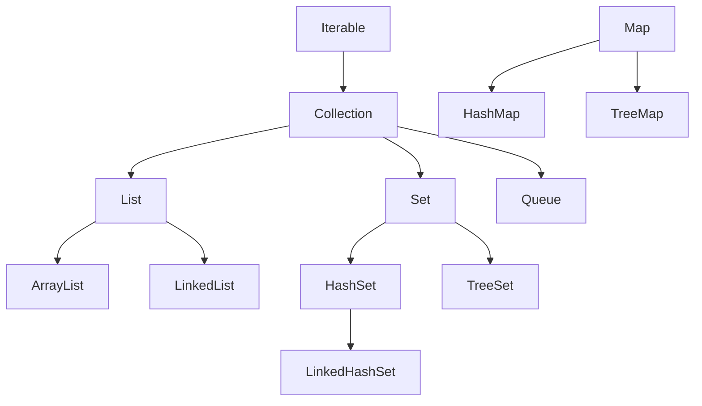

<div class="flex flex-col justify-center items-center h-full" style="background: #ffffff;">
  <p style="color: #5eada0; font-size: 1rem; font-weight: 600; letter-spacing: 0.2em; text-transform: uppercase; margin-bottom: 1.2rem;">Java Programming Masterclass</p>
  <h1 style="color: #1a5c5c; font-size: 3.8rem; font-weight: 900; line-height: 1.15; margin-bottom: 1.5rem;">集合框架</h1>
  <div style="height: 4px; width: 320px; background: linear-gradient(90deg, #5eada0, #a7d9d0); border-radius: 2px; margin-bottom: 1.5rem;"></div>
  <p style="color: #4a7c7c; font-size: 1.15rem; font-style: italic;">
    「用正確的容器，裝下所需的每一筆資料」
  </p>
  <Link to="home" style="color: #9dc4c4; font-size: 0.85rem; margin-top: 2rem; text-decoration: none; letter-spacing: 0.05em;">← 返回目錄</Link>
</div>

---
layout: default
---

# Outline

- **第一部分：集合框架概覽**
  - 什麼是集合框架、介面層次
  - Collection 介面常用方法
- **第二部分：List 介面**
  - ArrayList、LinkedList 特性與常用方法
- **第三部分：Set 介面**
  - HashSet、LinkedHashSet、TreeSet 比較
- **第四部分：Map 介面**
  - HashMap、TreeMap 方法與遍歷
- **選用指南與 Collections 工具類別**
- **實作練習**

---
layout: section
class: flex flex-col justify-center items-center text-center
---

# 第一部分
# 集合框架概覽

---

# 什麼是集合框架？

集合框架 (Collection Framework) 是 Java 提供的一組**標準資料結構**，讓你不必手刻就能儲存、管理與操作一群物件。

- **自動調整大小** — 無需像陣列一樣預先指定長度
- **豐富的操作方法** — 新增、刪除、搜尋、排序一應俱全
- **多種結構選擇** — 依需求選擇 List、Set 或 Map

<div class="mt-4 p-3 bg-blue-50 border-l-4 border-blue-400 text-gray-700 text-sm text-left">
💡 <b>使用時機：</b> 當元素數量不確定、需要快速搜尋、或需要鍵值對應時，集合框架比原始陣列更有效率。
</div>

---

# 集合框架的介面層次

<div class="flex justify-center mt-4">



</div>

<div class="mt-4 p-3 bg-blue-50 border-l-4 border-blue-400 text-gray-700 text-sm text-left">
💡 <code>Map</code> 不繼承 <code>Collection</code>，是獨立的介面體系，但同屬集合框架
</div>

---

# Collection 介面常用方法

| 方法名稱 | 說明 |
| --- | --- |
| `add(E e)` | 加入一個元素 |
| `remove(Object o)` | 移除指定元素 |
| `contains(Object o)` | 是否包含該元素 |
| `size()` | 回傳元素數量 |
| `isEmpty()` | 是否為空集合 |
| `clear()` | 清空所有元素 |
| `iterator()` | 取得迭代器，用於逐一遍歷 |

---

# Collection 介面方法 — 範例

```java
import java.util.*;

List<String> fruits = new ArrayList<>();
fruits.add("蘋果");
fruits.add("橘子");
fruits.add("香蕉");

System.out.println(fruits.size());            // 3
System.out.println(fruits.contains("橘子"));  // true
fruits.remove("橘子");
System.out.println(fruits.size());            // 2
fruits.clear();
System.out.println(fruits.isEmpty());         // true
```

---
layout: section
class: flex flex-col justify-center items-center text-center
---

# 第二部分
# List 介面

---

# List 介面特性

`List` 是**有序**且**允許重複**元素的集合，支援透過索引 (index) 存取。

```java
List<String> list = new ArrayList<>();
list.add("A");
list.add("B");
list.add("A"); // 允許重複

System.out.println(list.get(0)); // "A"
System.out.println(list.size()); // 3
```

<div class="mt-4 p-3 bg-blue-50 border-l-4 border-blue-400 text-gray-700 text-sm text-left">
💡 索引從 <code>0</code> 開始，和陣列相同。宣告時通常用介面型態 <code>List</code>，實作類別用 <code>new ArrayList<>()</code>。
</div>

---

# List 常用方法

| 方法名稱 | 說明 |
| --- | --- |
| `get(int index)` | 取得指定索引的元素 |
| `set(int index, E e)` | 替換指定位置的元素，回傳舊元素 |
| `add(int index, E e)` | 在指定位置插入元素 |
| `remove(int index)` | 移除指定位置的元素 |
| `indexOf(Object o)` | 首次出現的索引（找不到回傳 -1） |
| `subList(int from, int to)` | 取得子串列，範圍 [from, to-1] |

---

# List 常用方法 — 範例

```java
List<String> heroes = new ArrayList<>();
heroes.add("炭治郎");
heroes.add("禰豆子");
heroes.add("善逸");

heroes.set(1, "伊之助");         // 替換索引 1
heroes.add(0, "煉獄");           // 在開頭插入
System.out.println(heroes.get(0));       // "煉獄"
System.out.println(heroes.indexOf("善逸")); // 3
List<String> sub = heroes.subList(0, 2);
System.out.println(sub);         // [煉獄, 炭治郎]
```

---

# ArrayList vs LinkedList

| 特性 | ArrayList | LinkedList |
| --- | --- | --- |
| 底層結構 | 動態陣列 | 雙向鏈結串列 |
| 隨機存取 `get(i)` | 快 O(1) | 慢 O(n) |
| 中間插入 / 刪除 | 慢 O(n) | 快 O(1) |
| 記憶體用量 | 較少 | 較多（需儲存前後節點指標） |
| 適用場景 | 多讀取、少插入 | 多插入 / 刪除 |

<div class="mt-4 p-3 bg-blue-50 border-l-4 border-blue-400 text-gray-700 text-sm text-left">
💡 <b>預設選 ArrayList</b>，除非需要頻繁在中間插入或刪除元素，才考慮 LinkedList
</div>

---

# LinkedList 的雙端操作

`LinkedList` 同時實作 `Deque` 介面，可當作**雙端佇列**使用：

| 方法名稱 | 說明 |
| --- | --- |
| `addFirst(E e)` | 加到串列開頭 |
| `addLast(E e)` | 加到串列末端 |
| `removeFirst()` | 移除並回傳開頭元素 |
| `removeLast()` | 移除並回傳末端元素 |

```java
LinkedList<String> queue = new LinkedList<>();
queue.addLast("任務A");
queue.addLast("任務B");
System.out.println(queue.removeFirst()); // "任務A"
```

---
layout: section
class: flex flex-col justify-center items-center text-center
---

# 第三部分
# Set 介面

---

# Set 介面特性

`Set` 是**不允許重複**元素的集合，加入重複元素時會被自動忽略。

```java
Set<String> names = new HashSet<>();
names.add("禰豆子");
names.add("炭治郎");
names.add("禰豆子"); // 重複，被忽略

System.out.println(names.size());             // 2
System.out.println(names.contains("炭治郎")); // true
```

<div class="mt-4 p-3 bg-blue-50 border-l-4 border-blue-400 text-gray-700 text-sm text-left">
💡 <code>Set</code> 沒有 <code>get(index)</code> 方法，通常用 for-each 或 Iterator 遍歷
</div>

---

# HashSet / LinkedHashSet / TreeSet 比較

| 類別 | 順序 | 允許 Null | 效能 |
| --- | --- | --- | --- |
| `HashSet` | 不保證順序 | 允許一個 | 最快 |
| `LinkedHashSet` | 維持**插入順序** | 允許一個 | 中 |
| `TreeSet` | 依**自然排序**（升序） | 不允許 | 較慢 |

```java
Set<Integer> hs = new HashSet<>(List.of(3, 1, 2));
Set<Integer> ts = new TreeSet<>(List.of(3, 1, 2));
System.out.println(hs); // [1, 2, 3] 或其他順序
System.out.println(ts); // [1, 2, 3]（一定升序）
```

---

# Set 實用操作：聯集與交集

```java
Set<String> setA = new HashSet<>(List.of("A", "B", "C"));
Set<String> setB = new HashSet<>(List.of("B", "C", "D"));

// 聯集：A ∪ B
Set<String> union = new HashSet<>(setA);
union.addAll(setB);
System.out.println(union); // [A, B, C, D]

// 交集：A ∩ B
Set<String> inter = new HashSet<>(setA);
inter.retainAll(setB);
System.out.println(inter); // [B, C]
```

---
layout: section
class: flex flex-col justify-center items-center text-center
---

# 第四部分
# Map 介面

---

# Map 介面特性

`Map` 儲存**鍵值對 (Key-Value Pair)**，每個鍵唯一，對應一個值。

```java
Map<String, Integer> scores = new HashMap<>();
scores.put("炭治郎", 95);
scores.put("善逸", 70);
scores.put("炭治郎", 99); // 相同鍵 → 覆蓋舊值

System.out.println(scores.get("炭治郎")); // 99
```

<div class="mt-4 p-3 bg-blue-50 border-l-4 border-blue-400 text-gray-700 text-sm text-left">
💡 <b>鍵</b>不能重複；若用相同鍵再次 <code>put</code>，舊值會被新值覆蓋
</div>

---

# Map 常用方法

| 方法名稱 | 說明 |
| --- | --- |
| `put(K key, V value)` | 存入鍵值對（已存在則覆蓋） |
| `get(Object key)` | 取得鍵對應的值（找不到回傳 null） |
| `getOrDefault(K key, V def)` | 找不到鍵時回傳預設值 |
| `remove(Object key)` | 移除指定鍵的鍵值對 |
| `containsKey(Object key)` | 是否包含指定鍵 |
| `containsValue(Object value)` | 是否包含指定值 |
| `size()` | 鍵值對數量 |
| `keySet()` | 取得所有鍵（回傳 `Set`) |
| `values()` | 取得所有值（回傳 `Collection`） |

---

# Map 常用方法 — 範例

```java
Map<String, Integer> map = new HashMap<>();
map.put("A", 10);
map.put("B", 20);
map.put("A", 99);  // 覆蓋舊值

System.out.println(map.get("A"));              // 99
System.out.println(map.getOrDefault("C", 0));  // 0
System.out.println(map.containsKey("B"));      // true
System.out.println(map.keySet());              // [A, B]
System.out.println(map.values());              // [99, 20]
```

---

# HashMap vs TreeMap

| 特性 | HashMap | TreeMap |
| --- | --- | --- |
| 鍵的順序 | 不保證 | 依**鍵升序排列** |
| 允許 Null 鍵 | 允許一個 | 不允許 |
| 存取效能 | O(1) | O(log n) |
| 適用場景 | 快速查詢 | 需要按鍵排序輸出 |

```java
Map<String, Integer> tm = new TreeMap<>();
tm.put("banana", 2);
tm.put("apple", 5);
tm.put("cherry", 1);
System.out.println(tm); // {apple=5, banana=2, cherry=1}
```

---

# Map 的遍歷方式

```java
Map<String, Integer> scores = new HashMap<>();
scores.put("炭治郎", 95);
scores.put("善逸", 70);

// 方式一：entrySet 遍歷（最常用）
for (Map.Entry<String, Integer> entry : scores.entrySet()) {
    System.out.println(entry.getKey() + " → " + entry.getValue());
}

// 方式二：keySet 遍歷
for (String key : scores.keySet()) {
    System.out.println(key + " → " + scores.get(key));
}
```

---

# 如何選擇集合類別

| 需求 | 選用 |
| --- | --- |
| 有序、可重複、需快速隨機存取 | `ArrayList` |
| 有序、可重複、頻繁插入 / 刪除 | `LinkedList` |
| 無重複、不在乎順序 | `HashSet` |
| 無重複、需維持插入順序 | `LinkedHashSet` |
| 無重複、需排序 | `TreeSet` |
| 鍵值對應、快速查詢 | `HashMap` |
| 鍵值對應、需依鍵排序 | `TreeMap` |

---

# Collections 工具類別

`java.util.Collections` 提供操作集合的靜態工具方法：

| 方法名稱 | 說明 |
| --- | --- |
| `sort(List)` | 將 List 升序排序 |
| `reverse(List)` | 反轉 List 的順序 |
| `shuffle(List)` | 隨機打亂 List |
| `max(Collection)` | 取得最大值 |
| `min(Collection)` | 取得最小值 |

---

# Collections 工具類別 — 範例

```java
import java.util.*;

List<Integer> nums = new ArrayList<>(List.of(3, 1, 4, 1, 5));

Collections.sort(nums);
System.out.println(nums);                  // [1, 1, 3, 4, 5]

Collections.reverse(nums);
System.out.println(nums);                  // [5, 4, 3, 1, 1]

System.out.println(Collections.max(nums)); // 5
System.out.println(Collections.min(nums)); // 1
```

---
layout: default
---

# 練習一：管理英雄名單
### 任務說明

請宣告一個 `ArrayList<String>`，儲存以下鬼殺隊成員：
「炭治郎、禰豆子、善逸、伊之助、蜜璃」

完成以下操作：
1. 在「善逸」前面插入「甘露寺」
2. 將「禰豆子」替換為「時透無一郎」
3. 移除最後一個成員
4. 用 `Collections.sort()` 依字典順序排序後印出

---

# 練習一：解題提示
### 提示說明

1. 善逸在索引 2，使用 `list.add(2, "甘露寺")` 插入
2. 禰豆子在索引 1，使用 `list.set(1, "時透無一郎")` 替換
3. `list.remove(list.size() - 1)` 移除最後一個元素
4. `Collections.sort(list)` 排序

```java
List<String> m = new ArrayList<>(
    List.of("炭治郎","禰豆子","善逸","伊之助","蜜璃"));
m.add(2, "甘露寺");
m.set(1, "時透無一郎");
m.remove(m.size() - 1);
Collections.sort(m);
System.out.println(m);
```

---
layout: default
---

# 練習二：成績統計系統
### 任務說明

宣告一個 `HashMap<String, Integer>` 儲存以下成績：
炭治郎：95、善逸：70、伊之助：85、蜜璃：90

完成以下操作：
1. 新增「甘露寺：88」
2. 將「善逸」的成績更新為 80
3. 計算全班平均分數（整數）
4. 印出所有成績 ≥ 85 的學生姓名

---

# 練習二：解題提示
### 提示說明

1. `map.put("甘露寺", 88)` — 新增
2. `map.put("善逸", 80)` — 覆蓋舊值即為更新
3. 用 `values()` 取得所有分數，加總後除以 `size()`
4. 用 `entrySet()` 遍歷，判斷 `entry.getValue() >= 85`

```java
int total = 0;
for (int s : scores.values()) total += s;
System.out.println("平均：" + total / scores.size());
for (var e : scores.entrySet())
    if (e.getValue() >= 85)
        System.out.println(e.getKey());
```

---
layout: section
class: flex flex-col justify-center items-center text-center
---

# Q & A

---
layout: end
---

# 課程結束
### 掌握集合框架，資料管理更有效率！
如有課後疑問，歡迎來信討論。
