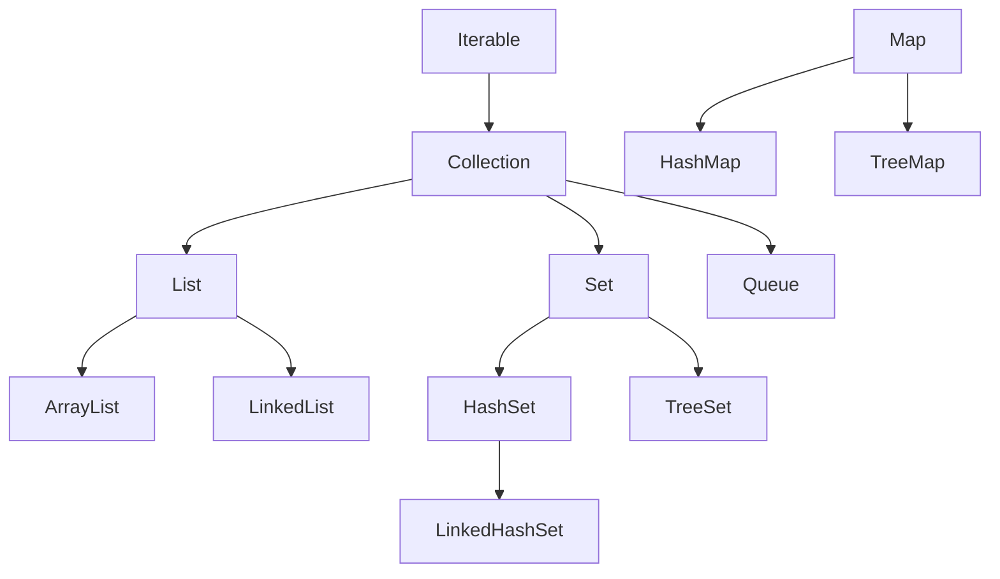

<div class="flex flex-col justify-center items-center h-full" style="background: #ffffff;">
  <p style="color: #5eada0; font-size: 1rem; font-weight: 600; letter-spacing: 0.2em; text-transform: uppercase; margin-bottom: 1.2rem;">Java Programming Masterclass</p>
  <h1 style="color: #1a5c5c; font-size: 3.8rem; font-weight: 900; line-height: 1.15; margin-bottom: 1.5rem;">集合框架</h1>
  <div style="height: 4px; width: 320px; background: linear-gradient(90deg, #5eada0, #a7d9d0); border-radius: 2px; margin-bottom: 1.5rem;"></div>
  <p style="color: #4a7c7c; font-size: 1.15rem; font-style: italic;">
    「用正確的容器，裝下所需的每一筆資料」
  </p>
  <Link to="home" style="color: #9dc4c4; font-size: 0.85rem; margin-top: 2rem; text-decoration: none; letter-spacing: 0.05em;">← 返回目錄</Link>
</div>

<!--
【開場白】
大家好，今天我們要學的是「集合框架」。

【為什麼要學這個？】
以前我們學過陣列，但陣列有個大問題：大小固定，功能有限。
集合框架就是 Java 為你準備好的一整組「彈性容器」，自動擴充大小、附送排序、搜尋等豐富功能。

【今天學完你會能做什麼】
學完之後你能用 List 儲存一排資料、用 Set 自動去重複、用 Map 做鍵值查詢。
這三個工具在任何 Java 專案裡幾乎每天都用得到，是非常核心的技能。
-->

---
layout: default
---

# Outline

- **第一部分：集合框架概覽**
  - 什麼是集合框架、介面層次
  - Collection 介面常用方法
- **第二部分：List 介面**
  - ArrayList、LinkedList 特性與常用方法
- **第三部分：Set 介面**
  - HashSet、LinkedHashSet、TreeSet 比較
- **第四部分：Map 介面**
  - HashMap、LinkedHashMap、TreeMap 比較與遍歷
- **選用指南與 Collections 工具類別**
- **實作練習**

<!--
【課程預覽】
這堂課分成四大部分：集合框架概覽、List、Set 和 Map，最後有選用指南。

【學習建議】
不用現在就把每個方法都背起來。先抓大方向：
什麼情況用 List？什麼情況用 Set？什麼情況用 Map？
這個判斷力比背 API 更重要，課程結尾的「選用指南」會幫你整理。
-->

---
layout: section
class: flex flex-col justify-center items-center text-center
---

# 第一部分
# 集合框架概覽

<!--
【章節開場】
第一部分，我們先用 10 分鐘了解集合框架的全貌，看看它包含哪些東西，再分區介紹。
-->

---
layout: default
---

# 什麼是集合框架？

集合框架 (Collection Framework) 是 Java 提供的一組**標準資料結構**，讓你不必手刻就能儲存、管理與操作一群物件。

- **自動調整大小** — 無需像陣列一樣預先指定長度
- **豐富的操作方法** — 新增、刪除、搜尋、排序一應俱全
- **多種結構選擇** — 依需求選擇 List、Set 或 Map

<div class="mt-4 p-3 bg-blue-50 border-l-4 border-blue-400 text-gray-700 text-sm text-left">
💡 <b>使用時機：</b> 當元素數量不確定、需要快速搜尋、或需要鍵值對應時，集合框架比原始陣列更有效率。
</div>

<!--
【核心說明】
集合框架（Collection Framework）是 Java 標準函式庫裡一組設計好的資料結構。
簡單說，就是 Java 官方幫你寫好的「各種收納盒」，你不用自己從零開始寫。

【生活化比喻】
你去 IKEA 買東西，不需要自己設計抽屜，直接挑現成的用就好。
集合框架也一樣：Java 已經幫你設計好了 List（有順序的盒子）、Set（不重複的盒子）、Map（貼標籤的盒子），你直接選來用。

⚠️ 學生常見誤解：
陣列和集合不能互換。陣列大小固定、功能少；集合框架功能豐富、大小彈性，是現代 Java 的主流選擇。

💼 業界實務：
業界的 Java 程式幾乎不直接用陣列（除非跟底層 API 打交道），全部都用集合框架。
-->

---

# 集合框架的介面層次

<div class="flex justify-center mt-4">



</div>

<div class="mt-4 p-3 bg-blue-50 border-l-4 border-blue-400 text-gray-700 text-sm text-left">
💡 <code>Map</code> 不繼承 <code>Collection</code>，是獨立的介面體系，但同屬集合框架
</div>

<!--
【看圖前的引導】
這張圖是集合框架的「家族樹」，看起來複雜，但只要抓住幾個關鍵節點就夠了。

【逐步帶著看】
最頂端是 Iterable（可被遍歷的東西）。Collection 繼承它，是所有集合的共同祖先。
Collection 往下分三條路：List（有序可重複）、Set（無重複）、Queue（佇列）。
Map 是獨立的體系，不繼承 Collection，但同屬集合框架。

【類比整體流程】
把這棵樹想成超市分區：Collection 是整個超市，List 是冷凍區，Set 是熟食區，Map 是倉儲區。每個區有自己的規則，但都屬於同一個「超市」體系。

💼 業界實務：
業界通常不需要記這個繼承關係，但理解它有助於看懂框架文件，以及遇到型別問題時不會傻眼。
-->

---

# Collection 介面常用方法

| 方法名稱 | 說明 |
| --- | --- |
| `add(E e)` | 加入一個元素 |
| `remove(Object o)` | 移除指定元素 |
| `contains(Object o)` | 是否包含該元素 |
| `size()` | 回傳元素數量 |
| `isEmpty()` | 是否為空集合 |
| `clear()` | 清空所有元素 |
| `iterator()` | 取得迭代器，用於逐一遍歷 |

<!--
【核心說明】
這張表列出了所有 List、Set 都有的共同方法，因為它們都繼承自 Collection 介面。
學好這些基本方法，三種集合你都能用。

【生活化比喻】
Collection 介面就像所有收納盒都有的「通用功能」：放進去（add）、拿出來（remove）、看看有沒有（contains）、數一數（size）。不管用哪種盒子，這些基本功都有。

⚠️ 學生常見誤解：
`remove(Object o)` 是移除「指定的元素值」，不是「指定索引的位置」。
List 額外有 `remove(int index)` 是按索引刪，注意不要搞混！

💼 業界實務：
`clear()` 在資源回收或重置狀態時很常用，但要小心別誤清了不該清的集合。
-->

---

# Collection 介面方法 — 範例

```java
import java.util.*;

List<String> fruits = new ArrayList<>();
fruits.add("蘋果");
fruits.add("橘子");
fruits.add("香蕉");

System.out.println(fruits.size());            // 3
System.out.println(fruits.contains("橘子"));  // true
fruits.remove("橘子");
System.out.println(fruits.size());            // 2
fruits.clear();
System.out.println(fruits.isEmpty());         // true
```

<!--
【帶讀程式碼前的鋪陳】
這段程式碼示範基本集合操作：建立水果清單，然後用各種方法操作它。

【逐步解說】
`new ArrayList<>()` 建立空串列，三次 `add` 加入三個水果。
`size()` 問「有幾個？」回傳 3。`contains("橘子")` 問「有橘子嗎？」回傳 true。
`remove("橘子")` 拿走橘子，`size()` 變 2。
`clear()` 清空，`isEmpty()` 確認空了，回傳 true。

⚠️ 學生常見誤解：
`remove` 傳的是「字串值」，不是索引。這是 `remove(Object o)` 的用法。

💼 業界實務：
這種「建立 → 操作 → 確認」的流程在寫單元測試時非常常見。
-->

---

# Iterator — 迭代器遍歷

`iterator()` 回傳一個 `Iterator` 物件，可逐一取出元素，並在遍歷中安全地移除：

| 方法 | 說明 |
| --- | --- |
| `hasNext()` | 是否還有下一個元素 |
| `next()` | 取出下一個元素並前進 |
| `remove()` | 移除 `next()` 最後回傳的元素 |

```java
List<String> fruits = new ArrayList<>(List.of("蘋果", "橘子", "香蕉"));
Iterator<String> it = fruits.iterator();
while (it.hasNext()) {
    System.out.println(it.next());
}
```

<!--
【核心說明】
Iterator（迭代器）是「逐一讀取集合元素」的工具。
你可以把它想成一個機器人，每次問它「還有沒有下一個？」（hasNext），有的話就「拿出來」（next）。

【生活化比喻】
像在等公車，一輛一輛來。問「還有車嗎？」（hasNext()），有的話就「上車」（next()），沒有就結束。

【程式世界怎麼用】
Iterator 最重要的優勢：可以在遍歷過程中**安全地刪除元素**，用 `it.remove()`。
普通 for 迴圈做不到這件事，會報 ConcurrentModificationException。

⚠️ 學生常見誤解：
不要在普通 for 迴圈裡用 `list.remove(element)` 刪元素，一定要用 Iterator 的 `remove()`。

💼 業界實務：
現代 Java 通常用 for-each 或 Stream 遍歷，但「邊遍歷邊刪除」的場景還是需要 Iterator。
-->

---

# 不可變集合工廠方法 (Immutable Collections)

Java 9 引入了更簡潔的方式來建立**不可變** (Immutable) 的集合。
- 這些集合一旦建立，**不能新增、修改或刪除**元素 (會拋出 `UnsupportedOperationException`)。
- **不允許 null 元素** (會拋出 `NullPointerException`)。

| 方法名稱 | 說明 |
| --- | --- |
| `List.of(E... elements)` | 建立不可變的 List |
| `Set.of(E... elements)` | 建立不可變的 Set |
| `Map.of(K k1, V v1, ...)` | 建立不可變的 Map (最多 10 組鍵值) |

```java
List<String> fruits = List.of("蘋果", "橘子", "香蕉");
Set<Integer> numbers = Set.of(1, 2, 3);
Map<String, Integer> scores = Map.of("炭治郎", 95, "善逸", 70);

// fruits.add("葡萄"); // 執行期會拋出例外！
```

<!--
【核心說明】
Java 9 新增了 `List.of()`、`Set.of()`、`Map.of()`，一行程式碼就能建立裝好資料的集合，而且建好之後**不能修改**。

【生活化比喻】
這就像密封包裝的禮盒：你可以看裡面有什麼，但不能打開再加東西或拿走東西。

⚠️ 學生常見誤解：
用 `List.of()` 建立的集合，呼叫 `add()` 或 `remove()` 在**執行時**才會報錯（不是編譯時），很容易忽略。
另外 `List.of()` **不允許放 null**，放了會拋 NullPointerException。

💼 業界實務：
業界常用 `List.of()` 定義常數集合（允許的類型列表、方向常數），放在 `static final` 欄位。
-->

---

# 複製為不可變集合

Java 10 新增了 `copyOf()` 方法，可以將現有的集合**複製**成不可變集合。
- 如果來源已經是不可變集合 (例如用 `List.of` 建立)，則直接回傳原物件，不會浪費記憶體。

| 方法名稱 | 說明 |
| --- | --- |
| `List.copyOf(Collection)` | 將集合複製為不可變 List |
| `Set.copyOf(Collection)` | 將集合複製為不可變 Set |
| `Map.copyOf(Map)` | 將 Map 複製為不可變 Map |

```java
List<String> mutableList = new ArrayList<>();
mutableList.add("A");
mutableList.add("B");

// 複製一份不可變的 List
List<String> immutableList = List.copyOf(mutableList);
// immutableList.add("C"); // 拋出 UnsupportedOperationException
```

<!--
【核心說明】
Java 10 的 `copyOf()` 讓你把一個可修改的集合「複製」成不可變的版本。

【生活化比喻】
像把可以塗改的筆記「影印」成唯讀 PDF，原版可以繼續改，影印版只能看。

⚠️ 學生常見誤解：
`copyOf()` 是複製資料。如果來源本身已經是不可變集合（例如 `List.of` 建立的），Java 不會再複製一份，直接回傳原物件（省記憶體）。

💼 業界實務：
API 設計中，回傳給外部的集合通常用 `List.copyOf()` 包裝，防止外部意外修改內部狀態，這叫做「防禦性複製」（Defensive Copying）。
-->

---
layout: section
class: flex flex-col justify-center items-center text-center
---

# 第二部分
# List 介面

<!--
【章節開場】
進入第二部分，我們來聚焦 List。List 是你最常用到的集合類型，幾乎在每個 Java 程式裡都會看到它。
-->

---
layout: default
---

# List 介面特性

`List` 是**有序**且**允許重複**元素的集合，支援透過索引 (index) 存取。

```java
List<String> list = new ArrayList<>();
list.add("A");
list.add("B");
list.add("A"); // 允許重複

System.out.println(list.get(0)); // "A"
System.out.println(list.size()); // 3
```

<div class="mt-4 p-3 bg-blue-50 border-l-4 border-blue-400 text-gray-700 text-sm text-left">
💡 索引從 <code>0</code> 開始，和陣列相同。宣告時通常用介面型態 <code>List</code>，實作類別用 <code>new ArrayList<>()</code>。
</div>

<!--
【核心說明】
List 最重要的兩個特性：有順序、允許重複。
有順序代表第一個放進去的永遠是第一個；允許重複代表可以放兩個一樣的值，各自算一筆資料。

【生活化比喻】
List 就像排隊的隊伍：先到的站前面，後到的站後面，同一個人可以排兩次（允許重複）。

⚠️ 學生常見誤解：
很多初學者直接寫 `ArrayList<String> list = new ArrayList<>()`。業界習慣是左邊用介面型別 `List`，右邊才是實作 `ArrayList`，方便之後換實作。

💼 業界實務：
用介面型別宣告（`List` 而非 `ArrayList`）是業界標準，讓方法簽名更靈活，也方便替換實作。
-->

---

# List 常用方法

| 方法名稱 | 說明 |
| --- | --- |
| `get(int index)` | 取得指定索引的元素 |
| `set(int index, E e)` | 替換指定位置的元素，回傳舊元素 |
| `add(int index, E e)` | 在指定位置插入元素 |
| `remove(int index)` | 移除指定位置的元素 |
| `indexOf(Object o)` | 首次出現的索引（找不到回傳 -1） |
| `subList(int from, int to)` | 取得子串列，範圍 [from, to-1] |

<!--
【核心說明】
除了 Collection 繼承來的方法，List 還有「依索引操作」的方法，這是 List 的獨特能力。

【生活化比喻】
Collection 的方法像操作一個袋子；List 的方法更像操作有格子的盒子，可以說「第三格放什麼、換什麼、拿出什麼」。

⚠️ 學生常見誤解：
`subList(from, to)` 的範圍是 `[from, to)`，from 包含、to 不包含。
例如 `subList(0, 2)` 取索引 0 和 1，不包含索引 2。

💼 業界實務：
`subList()` 回傳的是原串列的「視圖」，不是複製品！修改子串列會影響原串列。若要獨立使用，需要 `new ArrayList<>(list.subList(...))` 包一層。
-->

---

# List 常用方法 — 範例

```java
List<String> heroes = new ArrayList<>();
heroes.add("炭治郎");
heroes.add("禰豆子");
heroes.add("善逸");

heroes.set(1, "伊之助");         // 替換索引 1
heroes.add(0, "煉獄");           // 在開頭插入
System.out.println(heroes.get(0));       // "煉獄"
System.out.println(heroes.indexOf("善逸")); // 3
List<String> sub = heroes.subList(0, 2);
System.out.println(sub);         // [煉獄, 炭治郎]
```

<!--
【帶讀程式碼前的鋪陳】
這段程式碼對鬼殺隊成員清單做各種操作，跟著我一行一行看。

【逐步解說】
先加入炭治郎、禰豆子、善逸。
`set(1, "伊之助")` 把索引 1（禰豆子）換成伊之助。
`add(0, "煉獄")` 在最前面插入煉獄，其他人全部往後移一格。
現在是 [煉獄, 炭治郎, 伊之助, 善逸]。
`get(0)` 取第一個「煉獄」；`indexOf("善逸")` 回傳 3；`subList(0, 2)` 取 [煉獄, 炭治郎]。

⚠️ 學生常見誤解：
`add(index, e)` 會讓後面的元素往後移，插入後「善逸」的索引從 2 變成 3，索引會跟著變動。

💼 業界實務：
「在特定位置插入」或「動態找最後一個元素」是常用技巧，掌握好 index 的計算邏輯很重要。
-->

---

# ArrayList vs LinkedList

| 特性 | ArrayList | LinkedList |
| --- | --- | --- |
| 底層結構 | 動態陣列 | 雙向鏈結串列 |
| 隨機存取 `get(i)` | 快 O(1) | 慢 O(n) |
| 中間插入 / 刪除 | 慢 O(n) | 快 O(1) |
| 記憶體用量 | 較少 | 較多（需儲存前後節點指標） |
| 適用場景 | 多讀取、少插入 | 多插入 / 刪除 |

<div class="mt-4 p-3 bg-blue-50 border-l-4 border-blue-400 text-gray-700 text-sm text-left">
💡 <b>預設選 ArrayList</b>，除非需要頻繁在中間插入或刪除元素，才考慮 LinkedList
</div>

<!--
【核心說明】
List 有兩種主要實作：ArrayList 和 LinkedList。功能一樣，但底層結構不同，效能特性差異很大。

【生活化比喻】
ArrayList 像有編號的停車格：你知道「第 5 格」在哪，馬上就能開過去（隨機存取快）。
但中間加一格，後面所有車都要往後挪（插入慢）。

LinkedList 像人鏈：每個人只知道前後兩個人。要找「第 5 個」，必須從頭一個一個數（隨機存取慢），
但在中間插人只要改一下前後的手（插入快）。

⚠️ 學生常見誤解：
很多人以為 LinkedList「插入快」所以更好，但實際上隨機存取的場景多太多了，ArrayList 綜合效能往往更佳。

💼 業界實務：
業界 99% 的情況用 ArrayList。LinkedList 主要作為 Deque（雙端佇列）使用，不作為一般 List。
-->

---

# LinkedList 的雙端操作

`LinkedList` 同時實作 `Deque` 介面，可當作**雙端佇列**使用：

| 方法名稱 | 說明 |
| --- | --- |
| `addFirst(E e)` | 加到串列開頭 |
| `addLast(E e)` | 加到串列末端 |
| `removeFirst()` | 移除並回傳開頭元素 |
| `removeLast()` | 移除並回傳末端元素 |

```java
LinkedList<String> queue = new LinkedList<>();
queue.addLast("任務A");
queue.addLast("任務B");
System.out.println(queue.removeFirst()); // "任務A"
```

<!--
【核心說明】
LinkedList 除了是 List，它同時也實作了 Deque（雙端佇列）介面，可以從「頭」或「尾」兩個方向操作元素。

【生活化比喻】
就像雙向排隊系統：從後門排進去，從前門取出，先進先出（FIFO）；也可以從後門取出，後進先出（LIFO）。

【程式世界怎麼用】
`addLast("任務A")` — 加到尾端；`removeFirst()` — 從頭取出。
這個組合就能實作簡單的「任務佇列」。

⚠️ 學生常見誤解：
`removeFirst()` 如果串列是空的會拋出 NoSuchElementException，
要先呼叫 `isEmpty()` 確認，或用 `pollFirst()`（空的時候回傳 null，不拋例外）。

💼 業界實務：
簡單的任務佇列、事件佇列，可以用 LinkedList 當 Deque 來實作。
-->

---
layout: section
class: flex flex-col justify-center items-center text-center
---

# 第三部分
# Set 介面

<!--
【章節開場】
第三部分，Set。Set 只有一個核心特性，但非常有用：**裡面的元素不會重複**。
-->

---
layout: default
---

# Set 介面特性

`Set` 是**不允許重複**元素的集合，加入重複元素時會被自動忽略。

```java
Set<String> names = new HashSet<>();
names.add("禰豆子");
names.add("炭治郎");
names.add("禰豆子"); // 重複，被忽略

System.out.println(names.size());             // 2
System.out.println(names.contains("炭治郎")); // true
```

<div class="mt-4 p-3 bg-blue-50 border-l-4 border-blue-400 text-gray-700 text-sm text-left">
💡 <code>Set</code> 沒有 <code>get(index)</code> 方法，通常用 for-each 或 Iterator 遍歷
</div>

<!--
【核心說明】
Set 最大特點就是「無重複」——加入相同的元素，會被自動忽略，不會報錯。

【生活化比喻】
Set 就像名冊：同一個人的名字不能出現兩次。
你說「加入禰豆子」，如果已經在名冊上了，就直接略過，不做任何事。

【程式世界怎麼用】
注意：Set 沒有 `get(index)` 方法！不能說「給我第三個元素」，
因為 HashSet 不保證順序，「第幾個」這個概念對它沒意義。遍歷用 for-each 或 Iterator。

⚠️ 學生常見誤解：
`add()` 回傳 `boolean`：加入成功回傳 true，已存在（被忽略）回傳 false。
這個回傳值常被忽略，但可以用來確認是否真的加入。

💼 業界實務：
Set 最常見用途：去除重複資料（例如去重 userId 清單），以及「快速判斷某值是否存在」（O(1) 比 List 的 O(n) 快得多）。
-->

---

# HashSet / LinkedHashSet / TreeSet 比較

| 類別 | 順序 | 允許 Null | 效能 |
| --- | --- | --- | --- |
| `HashSet` | 不保證順序 | 允許一個 | 最快 |
| `LinkedHashSet` | 維持**插入順序** | 允許一個 | 中 |
| `TreeSet` | 依**自然排序**（升序） | 不允許 | 較慢 |

```java
Set<Integer> hs = new HashSet<>(List.of(3, 1, 2));
Set<Integer> ts = new TreeSet<>(List.of(3, 1, 2));
System.out.println(hs); // [1, 2, 3] 或其他順序
System.out.println(ts); // [1, 2, 3]（一定升序）
```

<!--
【核心說明】
Set 有三種常用實作，差別在於「元素的排列順序」。

【生活化比喻】
HashSet 像無序的抽籤袋：放進去之後不知道拿出來的順序。
LinkedHashSet 像按照進場順序排列的座位區：先進來的永遠坐前面。
TreeSet 像按字母順序排列的書架：不管什麼時候放進去，自動幫你排好序。

⚠️ 學生常見誤解：
TreeSet **不允許放 null**！放了會拋出 NullPointerException，
因為 TreeSet 需要比較元素大小，null 沒有大小可比。

💼 業界實務：
HashSet 是最常用的 Set。TreeSet 用在需要「輸出有順序」的場景，例如報表、排行榜。
-->

---

# Set 實用操作：聯集與交集

```java
Set<String> setA = new HashSet<>(List.of("A", "B", "C"));
Set<String> setB = new HashSet<>(List.of("B", "C", "D"));

// 聯集：A ∪ B
Set<String> union = new HashSet<>(setA);
union.addAll(setB);
System.out.println(union); // [A, B, C, D]

// 交集：A ∩ B
Set<String> inter = new HashSet<>(setA);
inter.retainAll(setB);
System.out.println(inter); // [B, C]
```

<!--
【核心說明】
Set 支援集合的數學操作：聯集（合在一起）和交集（共有的元素）。

【生活化比喻】
你有「選修課 A 的學生名單」和「選修課 B 的學生名單」。
聯集：把兩份名單合在一起（去重複）。交集：找同時選修兩門課的學生。

【程式世界怎麼用】
- `addAll()` — 聯集（把另一個集合的元素全加進來）
- `retainAll()` — 交集（只保留兩個集合都有的元素）

⚠️ 學生常見誤解：
`addAll()` 和 `retainAll()` 會**修改原來的集合**，不是建立新的。
要先 `new HashSet<>(setA)` 複製一份，再對複製品操作，才不會動到原始資料。

💼 業界實務：
「標籤篩選」（找同時有兩個標籤的文章）或「權限比對」，Set 的交集操作非常實用。
-->

---
layout: section
class: flex flex-col justify-center items-center text-center
---

# 第四部分
# Map 介面

<!--
【章節開場】
第四部分，Map。Map 跟 List 和 Set 很不一樣，它儲存的不是「一個值」，
而是「一對資料」——一個「鍵」對應一個「值」，就像一本字典。
-->

---
layout: default
---

# Map 介面特性

`Map` 儲存**鍵值對 (Key-Value Pair)**，每個鍵唯一，對應一個值。

```java
Map<String, Integer> scores = new HashMap<>();
scores.put("炭治郎", 95);
scores.put("善逸", 70);
scores.put("炭治郎", 99); // 相同鍵 → 覆蓋舊值

System.out.println(scores.get("炭治郎")); // 99
```

<div class="mt-4 p-3 bg-blue-50 border-l-4 border-blue-400 text-gray-700 text-sm text-left">
💡 <b>鍵</b>不能重複；若用相同鍵再次 <code>put</code>，舊值會被新值覆蓋
</div>

<!--
【核心說明】
Map 儲存「鍵值對」（Key-Value Pair）。每個 Key 是唯一的，對應一個 Value。
你用 Key 查詢，就能找到對應的 Value。

【生活化比喻】
Map 就像字典：每個詞（Key）對應一個解釋（Value）。
同一個詞不能出現兩次（Key 唯一），但你可以用任何詞快速查詢（快速存取）。

⚠️ 學生常見誤解：
很多初學者以為用相同 Key 再 `put()` 一次會讓 Map 有兩筆資料，
其實是**直接覆蓋**舊值。如果想「只有不存在才新增」，要用 `putIfAbsent()`。

💼 業界實務：
Map 在業界非常常見：快取（Cache）、設定檔讀取、統計計票……幾乎到處都是 Map 的應用。
-->

---

# Map 常用方法

| 方法名稱 | 說明 |
| --- | --- |
| `put(K key, V value)` | 存入鍵值對（已存在則覆蓋） |
| `get(Object key)` | 取得鍵對應的值（找不到回傳 null） |
| `getOrDefault(K key, V def)` | 找不到鍵時回傳預設值 |
| `remove(Object key)` | 移除指定鍵的鍵值對 |
| `containsKey(Object key)` | 是否包含指定鍵 |
| `containsValue(Object value)` | 是否包含指定值 |
| `size()` | 鍵值對數量 |
| `keySet()` | 取得所有鍵（回傳 `Set`) |
| `values()` | 取得所有值（回傳 `Collection`） |
| `entrySet()` | 取得所有鍵值對（回傳 `Set<Map.Entry<K,V>>`）|

<!--
【核心說明】
Map 的方法比 Collection 多一些，因為它是鍵值對的結構。
最重要的幾個：`put`、`get`、`getOrDefault`、`containsKey`、`entrySet`。

【生活化比喻】
Map 的方法就像管理通訊錄：
put — 新增或更新聯絡人；get — 查電話；getOrDefault — 查不到給預設值；
remove — 刪聯絡人；keySet — 列出所有人名；entrySet — 列出所有「名字+電話」配對。

⚠️ 學生常見誤解：
`get(key)` 找不到時回傳 `null`，如果沒有處理 null 就繼續操作，會發生 NullPointerException。
**習慣用 `getOrDefault(key, 預設值)` 來避免 NPE。**

💼 業界實務：
`containsKey()` 用在「先確認 key 存在再操作」的防禦性寫法，但更現代的做法是直接用 `getOrDefault()` 或 `computeIfAbsent()`。
-->

---

# Map 常用方法 — 範例

```java
Map<String, Integer> map = new HashMap<>();
map.put("A", 10);
map.put("B", 20);
map.put("A", 99);  // 覆蓋舊值

System.out.println(map.get("A"));              // 99
System.out.println(map.getOrDefault("C", 0));  // 0
System.out.println(map.containsKey("B"));      // true
System.out.println(map.keySet());              // [A, B]
System.out.println(map.values());              // [99, 20]
```

<!--
【帶讀程式碼前的鋪陳】
這段程式碼示範 Map 的基本操作，我們一行一行來看。

【逐步解說】
先 `put("A", 10)` 和 `put("B", 20)` 加入兩筆資料。
`put("A", 99)` — Key "A" 已存在，這是「覆蓋」，不是新增。
`get("A")` 現在回傳 99（已被覆蓋）。
`getOrDefault("C", 0)` — "C" 不在 Map，回傳預設值 0，不會 NPE。
`containsKey("B")` — "B" 存在，回傳 true。
`keySet()` 取得所有 Key；`values()` 取得所有 Value。

💼 業界實務：
用 `getOrDefault()` 取代 `get()` 加 null 判斷是現代 Java 的好習慣。
-->

---

# HashMap vs LinkedHashMap vs TreeMap

| 特性 | HashMap | LinkedHashMap | TreeMap |
| --- | --- | --- | --- |
| 鍵的順序 | 不保證 | 維持**插入順序** | 依**鍵升序排列** |
| 允許 Null 鍵 | 允許一個 | 允許一個 | 不允許 |
| 存取效能 | O(1) | O(1) | O(log n) |
| 適用場景 | 快速查詢 | 需維持插入順序 | 需依鍵排序輸出 |

<!--
【核心說明】
和 Set 一樣，Map 也有三種常用實作，差別在於 Key 的排列順序。

【生活化比喻】
HashMap 像無固定格位的停車場：停進去後下次位置可能不一樣。
LinkedHashMap 像記錄進場順序的停車場：按照進來的順序排列。
TreeMap 像按車牌號碼排序的停車場：永遠都是字母順序排好的。

⚠️ 學生常見誤解：
HashMap 的順序是不保證的，每次程式執行可能都不一樣。
如果你的程式依賴 Map 的順序，一定要用 LinkedHashMap 或 TreeMap。

💼 業界實務：
LinkedHashMap 可以用來實作 LRU Cache（最近最少使用快取），是業界面試常考題目。
-->

---

# HashMap vs LinkedHashMap vs TreeMap — 範例

```java
Map<String, Integer> hm = new HashMap<>();
hm.put("banana", 2); hm.put("apple", 5);
System.out.println(hm);  // 不保證順序
Map<String, Integer> lhm = new LinkedHashMap<>();
lhm.put("banana", 2); lhm.put("apple", 5);
System.out.println(lhm); // {banana=2, apple=5}（插入順序）
Map<String, Integer> tm = new TreeMap<>();
tm.put("banana", 2); tm.put("apple", 5);
System.out.println(tm);  // {apple=5, banana=2}（鍵升序）
```

<!--
【帶讀程式碼前的鋪陳】
這段程式碼直接比較三種 Map 的輸出差異，是最直觀的理解方式。

【逐步解說】
三個 Map 都放入相同的資料：banana 和 apple。
HashMap 輸出順序不保證，每次可能不同。
LinkedHashMap 輸出 `{banana=2, apple=5}`，維持插入順序（banana 先放）。
TreeMap 輸出 `{apple=5, banana=2}`，依鍵的字母升序（a 在 b 前面）。

⚠️ 學生常見誤解：
HashMap 的輸出可能看起來「剛好有序」，但那只是巧合，絕對不能依賴 HashMap 的順序！

💼 業界實務：
API 回應的 JSON 希望有固定順序時（方便閱讀和測試），用 LinkedHashMap 或 TreeMap 序列化比較好。
-->

---

# Map 的遍歷方式

```java
Map<String, Integer> scores = new HashMap<>();
scores.put("炭治郎", 95);
scores.put("善逸", 70);

// 方式一：entrySet 遍歷（最常用）
for (Map.Entry<String, Integer> entry : scores.entrySet()) {
    System.out.println(entry.getKey() + " → " + entry.getValue());
}

// 方式二：keySet 遍歷
for (String key : scores.keySet()) {
    System.out.println(key + " → " + scores.get(key));
}
```

<!--
【帶讀程式碼前的鋪陳】
遍歷 Map 有幾種方式，這裡介紹最常用的兩種，兩種都要學會。

【逐步解說】
方式一：`entrySet()` 遍歷 — 取出每一個「鍵值對」（Entry），同時拿到 Key 和 Value，業界最常用。

方式二：`keySet()` 遍歷 — 先取所有 Key，再用 Key 查 Value。
寫法直觀，但多做了一次 `get` 查詢，效能略遜。

⚠️ 學生常見誤解：
有同學用 `values()` 遍歷，但這樣只能拿到值，拿不到對應的 Key。
如果兩個都需要，一定要用 `entrySet()`。

💼 業界實務：
`entrySet()` 遍歷是業界標準寫法，也是 Stream API 處理 Map 的基礎。
-->

---
layout: section
class: flex flex-col justify-center items-center text-center
---

# 選用指南與工具類別

<!--
【章節開場】
學了這麼多集合類型，現在來整理：到底什麼情況用什麼容器？
-->

---
layout: default
---

# 如何選擇集合類別

| 需求 | 選用 |
| --- | --- |
| 有序、可重複、需快速隨機存取 | `ArrayList` |
| 有序、可重複、頻繁插入 / 刪除 | `LinkedList` |
| 無重複、不在乎順序 | `HashSet` |
| 無重複、需維持插入順序 | `LinkedHashSet` |
| 無重複、需排序 | `TreeSet` |
| 鍵值對應、快速查詢 | `HashMap` |
| 鍵值對應、需維持插入順序 | `LinkedHashMap` |
| 鍵值對應、需依鍵排序 | `TreeMap` |

<!--
【核心說明】
這張表是你的「集合選用地圖」。面對一個需求，對照表格就能快速決定。

【帶著讀這張表】
先問：你需要「鍵值對應」嗎？→ 是 → 選 Map；否 → 你需要允許重複嗎？→ 是 → 選 List；否 → 選 Set。
選好大類後再看第二層：需不需要特定順序？需要排序嗎？需要快速隨機存取嗎？

⚠️ 學生常見誤解：
很多初學者什麼都用 ArrayList，不管需不需要重複、需不需要順序。
花時間理解這張表，程式效能會明顯提升。

💼 業界實務：
遇到「要做什麼 → 選什麼集合」的問題，業界開發者先考慮使用場景，再選資料結構。這個思維很重要。
-->

---

# Collections 工具類別

`java.util.Collections` 提供操作集合的靜態工具方法：

| 方法名稱 | 說明 |
| --- | --- |
| `sort(List)` | 將 List 升序排序 |
| `reverse(List)` | 反轉 List 的順序 |
| `shuffle(List)` | 隨機打亂 List |
| `max(Collection)` | 取得最大值 |
| `min(Collection)` | 取得最小值 |

<!--
【核心說明】
`java.util.Collections`（注意有 s！）是一個工具類別，裡面全是靜態方法，
讓你對集合做各種常用操作：排序、反轉、打亂、找最大最小值。

【生活化比喻】
Collections 就像集合的「瑞士刀」：各種常用功能都有，而且全部是現成的，不用自己寫。

⚠️ 學生常見誤解：
注意 `Collections`（複數，工具類別）和 `Collection`（單數，介面）是**完全不同的東西**。
初學者非常容易搞混，多注意那個 s。

💼 業界實務：
`Collections.sort()` 在 Java 8 之後可以用 List 的 `sort()` 方法取代，或用 Stream 的 `sorted()`。
但 `shuffle()` 和 `reverse()` 至今還是用 Collections 類別最直觀。
-->

---

# Collections 工具類別 — 範例

```java
import java.util.*;

List<Integer> nums = new ArrayList<>(List.of(3, 1, 4, 1, 5));

Collections.sort(nums);
System.out.println(nums);                  // [1, 1, 3, 4, 5]

Collections.reverse(nums);
System.out.println(nums);                  // [5, 4, 3, 1, 1]

System.out.println(Collections.max(nums)); // 5
System.out.println(Collections.min(nums)); // 1
```

<!--
【帶讀程式碼前的鋪陳】
我們來跑一遍 Collections 工具類別的主要操作，每行做了什麼事。

【逐步解說】
建立 `[3, 1, 4, 1, 5]` 的串列（用 `new ArrayList<>()` 包住才能修改）。
`Collections.sort(nums)` — 升序排序，結果 `[1, 1, 3, 4, 5]`。
`Collections.reverse(nums)` — 反轉，結果 `[5, 4, 3, 1, 1]`。
`Collections.max(nums)` 找最大值 5；`Collections.min(nums)` 找最小值 1。

⚠️ 學生常見誤解：
`List.of()` 建立的串列是不可變的，傳給 `Collections.sort()` 會拋例外。
要用 `new ArrayList<>(List.of(...))` 建立可修改的串列。

💼 業界實務：
排序底層是 TimSort（結合 merge sort 和 insertion sort），效能非常好，不需要自己實作。
-->

---
layout: default
---

# 練習一：管理英雄名單
### 任務說明

請宣告一個 `ArrayList<String>`，儲存以下鬼殺隊成員：
「炭治郎、禰豆子、善逸、伊之助、蜜璃」

完成以下操作：
1. 在「善逸」前面插入「甘露寺」
2. 將「禰豆子」替換為「時透無一郎」
3. 移除最後一個成員
4. 用 `Collections.sort()` 依字典順序排序後印出

<!--
【出題前的鋪陳】
第一個練習，綜合運用剛才學到的 ArrayList 操作方法。
這題會用到 add、set、remove 和 Collections.sort，都是剛才講過的。

【問題引導】
「在善逸前面插入甘露寺」，你們覺得要用 `add(index, e)` 的哪個 index？
先看看善逸現在在第幾格。

【等待與觀察】
給大家 1-2 分鐘試試看，寫在紙上或腦中跑過一遍。

【解說要點】
關鍵是每次操作後 index 會變化。插入甘露寺後，後面的元素都往後移了一格，
所以要注意替換禰豆子時她的 index 有沒有變。
-->

---

# 練習一：解題提示
### 提示說明

1. 善逸在索引 2，使用 `list.add(2, "甘露寺")` 插入
2. 禰豆子在索引 1，使用 `list.set(1, "時透無一郎")` 替換
3. `list.remove(list.size() - 1)` 移除最後一個元素
4. `Collections.sort(list)` 排序

```java
List<String> m = new ArrayList<>(
    List.of("炭治郎","禰豆子","善逸","伊之助","蜜璃"));
m.add(2, "甘露寺");
m.set(1, "時透無一郎");
m.remove(m.size() - 1);
Collections.sort(m);
System.out.println(m);
```

<!--
【帶讀程式碼前的鋪陳】
來一起看解法，每一行對應題目的一個步驟。

【逐步解說】
`List.of()` 建立初始清單，用 `new ArrayList<>()` 包住才能修改。
`m.add(2, "甘露寺")` — 善逸原本在索引 2，插入後善逸變成索引 3。
`m.set(1, "時透無一郎")` — 禰豆子在索引 1，`set` 直接替換。
`m.remove(m.size() - 1)` — `size() - 1` 永遠是最後一個元素的索引，不管清單多長都能用。
`Collections.sort(m)` — 依字典順序排序。

⚠️ 學生常見誤解：
`m.remove("蜜璃")` 也可以（按值刪除），但用 `m.size() - 1` 更通用，適用於不確定最後一個元素是什麼的情況。

💼 業界實務：
「動態找最後一個元素的索引」是很實用的技巧，寫業務邏輯時很常用。
-->

---
layout: default
---

# 練習二：成績統計系統
### 任務說明

宣告一個 `HashMap<String, Integer>` 儲存以下成績：
炭治郎：95、善逸：70、伊之助：85、蜜璃：90

完成以下操作：
1. 新增「甘露寺：88」
2. 將「善逸」的成績更新為 80
3. 計算全班平均分數（整數）
4. 印出所有成績 ≥ 85 的學生姓名

<!--
【出題前的鋪陳】
第二題操作 Map。這題模擬真實的成績系統情境，用到 put、values()、entrySet()。

【問題引導】
計算平均分數時，你覺得要先做什麼？
怎麼取得所有分數？取得後怎麼加總？

【等待與觀察】
先用自然語言說說步驟：取得所有分數 → 加總 → 除以人數。

【解說要點】
第四步「找出成績 ≥ 85 的學生」，要遍歷 Map 的 entrySet，
判斷每個 entry 的 Value 是否 ≥ 85，是的話印出 Key（姓名）。
-->

---

# 練習二：解題提示
### 提示說明

1. `map.put("甘露寺", 88)` — 新增
2. `map.put("善逸", 80)` — 覆蓋舊值即為更新
3. 用 `values()` 取得所有分數，加總後除以 `size()`
4. 用 `entrySet()` 遍歷，判斷 `entry.getValue() >= 85`

```java
int total = 0;
for (int s : scores.values()) total += s;
System.out.println("平均：" + total / scores.size());
for (var e : scores.entrySet())
    if (e.getValue() >= 85)
        System.out.println(e.getKey());
```

<!--
【帶讀程式碼前的鋪陳】
解法分兩段：計算平均 和 找出高分學生。

【逐步解說】
計算平均：`for` 遍歷 `scores.values()`（所有分數），累加到 `total`，最後除以 `scores.size()`。
找高分學生：`var e` 遍歷 `entrySet()`，`e.getKey()` 取姓名，`e.getValue()` 取分數，≥ 85 就印出。

⚠️ 學生常見誤解：
整數除法 `total / scores.size()` 會捨去小數。如果想要浮點數平均，要用 `(double) total / scores.size()`。

💼 業界實務：
`var` 是 Java 10 的型別推斷語法，`var e` 等同於 `Map.Entry<String, Integer> e`，讓程式碼更簡潔。
-->

---
layout: section
class: flex flex-col justify-center items-center text-center
---

# 實戰加料
# 為期中作業暖身 🔥

<!--
【章節開場】
最後這個部分，我們來連結期中作業。
剛才學的集合框架，在問卷系統的前後台都有直接的應用，我來示範幾個真實的例子。
-->

---
layout: default
---

# 實戰：用 Enum 管理問卷狀態

問卷有三種狀態，用字串容易打錯字；用 `enum` 讓編譯器幫你把關：

```java
enum QuizStatus {
    NOT_STARTED("尚未開始"),
    ACTIVE("進行中"),
    ENDED("已結束");

    private final String label;
    QuizStatus(String label) { this.label = label; }
    public String getLabel() { return label; }
}
```

```java
QuizStatus status = QuizStatus.ACTIVE;
System.out.println(status.getLabel()); // 進行中

// 搭配 switch 更清晰
switch (status) {
    case NOT_STARTED -> System.out.println("問卷連結停用");
    case ACTIVE      -> System.out.println("可以填寫問卷！");
    case ENDED       -> System.out.println("問卷已截止，可查看統計");
}
```

<div class="mt-2 p-3 bg-blue-50 border-l-4 border-blue-400 text-gray-700 text-sm text-left">
💡 <b>動態問卷連結：</b>前台列表頁的「連結是否啟用」、「能否查看統計」都由這個狀態決定。
</div>

<!--
【帶讀程式碼前的鋪陳】
這個例子示範用 Enum（列舉）管理問卷狀態，搭配 switch 做不同處理。
Enum 不是集合，但在這裡作為集合操作的配套知識一起介紹。

【逐步解說】
`enum QuizStatus` 定義三種狀態：NOT_STARTED、ACTIVE、ENDED。
每個狀態帶一個中文標籤（`label`），透過建構子存起來，用 `getLabel()` 取得。
下半部的 `switch` 根據狀態做不同的事：未開始停用連結、進行中啟用、結束後只能看統計。

⚠️ 學生常見誤解：
如果用 String 管理狀態（例如 "active"），打錯字就出 bug，而且 IDE 不會提示你。
用 Enum，IDE 自動補全，不可能拼錯。

💼 業界實務：
問卷狀態、訂單狀態、審核狀態……有限選項一定用 Enum 而不是魔法字串（Magic String）。
-->

---

# 實戰：List 分頁查詢

前台列表「每頁 10 筆」的分頁邏輯，`subList()` 一行搞定：

```java
List<String> allQuizzes = new ArrayList<>(
    List.of("問卷A","問卷B","問卷C","問卷D","問卷E",
            "問卷F","問卷G","問卷H","問卷I","問卷J","問卷K"));

int pageSize = 10;
int page = 1;  // 目前第幾頁（從 1 開始）

int from = (page - 1) * pageSize;
int to   = Math.min(from + pageSize, allQuizzes.size());

if (from >= allQuizzes.size()) {
    System.out.println("此頁無資料");
} else {
    List<String> pageData = allQuizzes.subList(from, to);
    System.out.println("第 " + page + " 頁：" + pageData);
}
// 第 1 頁：[問卷A, 問卷B, ..., 問卷J]
```

<div class="mt-2 p-3 bg-blue-50 border-l-4 border-blue-400 text-gray-700 text-sm text-left">
💡 <b>關鍵：</b><code>Math.min()</code> 防止最後一頁筆數不足時發生 <code>IndexOutOfBoundsException</code>。
</div>

<!--
【帶讀程式碼前的鋪陳】
前台列表「每頁 10 筆」是非常常見的需求。這段示範用 `subList()` 實作分頁邏輯。

【逐步解說】
`pageSize = 10`，`page = 1`（第一頁）。
`from = (page - 1) * pageSize` → 第一頁 from = 0。
`to = Math.min(from + pageSize, allQuizzes.size())` — 防止最後一頁資料不足時發生越界。
`subList(from, to)` 取出這一頁的資料。

【類比說明】
像翻書：page 是第幾頁，pageSize 是每頁幾行，from 是從第幾行開始，to 是到第幾行結束。

⚠️ 學生常見誤解：
不加 `Math.min()` 的話，最後一頁如果不足 10 筆，`to` 會超過 `size()`，拋出 IndexOutOfBoundsException。

💼 業界實務：
真實後端分頁通常用 Spring Data 的 `Pageable`，但底層原理就是這個邏輯，理解後你就懂分頁的本質了。
-->

---

# 實戰：Map 統計選項票數

問卷統計頁要顯示每個選項的得票數，`Map + getOrDefault()` 是最直覺的解法：

```java
// 模擬從資料庫撈出的所有作答（單選題）
List<String> answers = List.of("A", "B", "A", "C", "A", "B", "C", "C");

// Step 1：計票
Map<String, Integer> tally = new HashMap<>();
for (String ans : answers) {
    tally.put(ans, tally.getOrDefault(ans, 0) + 1);
}
System.out.println(tally); // {A=3, B=2, C=3}

// Step 2：依票數降序輸出（統計頁面排列用）
tally.entrySet().stream()
    .sorted(Map.Entry.<String, Integer>comparingByValue().reversed())
    .forEach(e ->
        System.out.printf("選項 %s：%d 票 (%.1f%%)%n",
            e.getKey(), e.getValue(),
            e.getValue() * 100.0 / answers.size()));
```

<div class="mt-2 p-3 bg-blue-50 border-l-4 border-blue-400 text-gray-700 text-sm text-left">
💡 <b>動態問卷連結：</b>後台統計頁面的長條圖 / 圓餅圖就是根據這份票數 Map 的資料來繪製的。
</div>

<!--
【帶讀程式碼前的鋪陳】
問卷統計頁要算每個選項幾票，這段是核心邏輯，分兩步：計票、排序輸出。

【逐步解說】
Step 1 計票：對每個答案 `ans`，用 `getOrDefault(ans, 0) + 1` 累加。
「如果 ans 還沒出現過，預設是 0；有的話把現有數字 +1 後放回去。」這是計票的經典寫法，要記住。

Step 2 排序輸出：用 Stream API（下堂課詳細講），依票數降序排列，格式化輸出。

⚠️ 學生常見誤解：
`getOrDefault(ans, 0) + 1` 只是計算新值，還需要 `put(ans, ...)` 才會真的更新 Map。
不要忘記把結果 put 回去！

💼 業界實務：
「用 Map 計票」的模式在業界超常見：統計 Log 錯誤類型、分析用戶行為等，都是這個邏輯。
-->

---

# 實戰：多選題的拆解與統計

多選題答案用分號 `;` 串接存入資料庫，統計時要先拆開再計票：

```java
// 從資料庫撈出的多選答案（每筆是一個受訪者的作答）
List<String> rawAnswers = List.of("A;B", "B;C", "A;C", "A;B;C", "B");

Map<String, Integer> tally = new HashMap<>();
for (String raw : rawAnswers) {
    String[] options = raw.split(";"); // ← 依分號拆解
    for (String opt : options) {
        tally.put(opt, tally.getOrDefault(opt, 0) + 1);
    }
}
System.out.println(tally); // {A=3, B=4, C=3}
```

<div class="mt-4 p-3 bg-yellow-50 border-l-4 border-yellow-400 text-gray-700 text-sm text-left">
⚠️ <b>注意：</b>存入時用 <code>String.join(";", selectedOptions)</code> 串接；讀出時用 <code>split(";")</code> 還原。<br>
記得兩端統一格式，不然 <code>" A;B"</code> 和 <code>"A;B"</code> 會被視為不同選項！
</div>

<!--
【帶讀程式碼前的鋪陳】
多選題比單選題多一個步驟：先把答案字串拆開，再計票。

【逐步解說】
原始資料是像 `"A;B"` 這樣的字串，多個選項用分號串接。
對每筆答案 `raw`，用 `split(";")` 拆成陣列 `options`。
然後對每個選項 `opt` 做和上一張投影片一樣的計票操作。
外層迴圈是「每個受訪者」，內層迴圈是「這個受訪者的每個選項」，雙層迴圈。

⚠️ 學生常見誤解：
存入時和讀出時的格式要一致。如果存入是 `"A; B"`（分號後有空格），
拆出來的 " B" 和 "B" 會被視為不同選項，計票就錯了。記得用 `trim()` 或確保格式一致。

💼 業界實務：
多選題答案的儲存方式有很多種（JSON 陣列、逗號分隔等），分號分隔是常見的簡單方案。
-->

---
layout: section
class: flex flex-col justify-center items-center text-center
---

# Q & A

<!--
【開放問題】
好，今天我們把 Collection Framework 的主要內容都講完了。

有沒有對哪個部分還有疑問？
List、Set、Map 這三個，有沒有哪個概念還不太清楚的？
-->

---
layout: end
---

# 課程結束
### 掌握集合框架，資料管理更有效率！
如有課後疑問，歡迎來信討論。

<!--
【收尾說明】
今天的課程到這裡結束。我們學了 Java 的核心資料結構工具——集合框架。

記住一個原則：先想「我要儲存什麼樣的資料」，再選對應的集合類型。
有序可重複 → List；無重複 → Set；鍵值對應 → Map。

課後如有任何問題，歡迎來信討論。
-->
