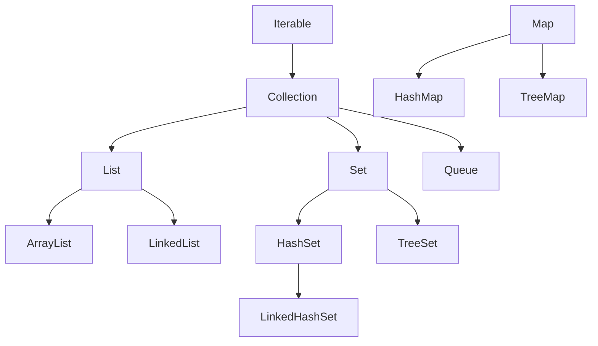

<div class="flex flex-col justify-center items-center h-full" style="background: #ffffff;">
  <p style="color: #5eada0; font-size: 1rem; font-weight: 600; letter-spacing: 0.2em; text-transform: uppercase; margin-bottom: 1.2rem;">Java Programming Masterclass</p>
  <h1 style="color: #1a5c5c; font-size: 3.8rem; font-weight: 900; line-height: 1.15; margin-bottom: 1.5rem;">集合框架</h1>
  <div style="height: 4px; width: 320px; background: linear-gradient(90deg, #5eada0, #a7d9d0); border-radius: 2px; margin-bottom: 1.5rem;"></div>
  <p style="color: #4a7c7c; font-size: 1.15rem; font-style: italic;">
    「用正確的容器，裝下所需的每一筆資料」
  </p>
  <Link to="home" style="color: #9dc4c4; font-size: 0.85rem; margin-top: 2rem; text-decoration: none; letter-spacing: 0.05em;">← 返回目錄</Link>
</div>

<!--
【開場白】
大家好，今天我們要學「集合框架」，這是 Java 的重頭戲。寫程式如果不會用集合框架，就像搬家只能用雙手抱東西，沒有紙箱可以裝。

【為什麼要學這個？】
我們之前學過陣列，但陣列有個大問題：大小一開始就要固定。你準備了一個裝 10 顆蘋果的箱子，結果朋友又送來 5 顆，箱子裝不下也不能變大。集合框架就是 Java 幫我們準備好的「彈性收納盒」，會自動長大，還附帶很多好用的功能。

【今天學完你會能做什麼】
學完之後，你就能用 List 把資料排成一排、用 Set 自動擋掉重複的東西（比如重複的帳號）、用 Map 像查字典一樣快速找到資料。這三個工具幾乎每天寫程式都會用到，是我們最基本的吃飯工具。
-->

---
layout: default
---

# Outline

- **集合框架概覽**
  - 什麼是集合框架、介面層次
  - Collection 介面常用方法、Iterator
- **List 介面**
  - ArrayList 的特性與常用方法
- **Set 介面**
  - HashSet 的特性與常用方法
- **Map 介面**
  - HashMap 的特性、常用方法與遍歷
- **選用指南與 Collections 工具類別**
- **實作練習**

<!--
【課程預覽】
這堂課分成四大部分：集合框架概覽、List、Set 和 Map，最後再看一個選用指南。

【學習建議】
不用現在就把每個方法都背起來，連我這個工作多年的工程師也沒有全背。我們只要先抓住大方向：
什麼情況用 List？什麼情況用 Set？什麼情況用 Map？
這個判斷力，比死記 API 更重要。
-->

---
layout: section
class: flex flex-col justify-center items-center text-center
---

# 集合框架概覽

<!--
【章節開場】
第一部分，我們先用 10 分鐘認識集合框架的全貌，就像逛超市前先看一下店內地圖，知道哪裡買菜、哪裡買肉。
-->

---
layout: default
---

# 什麼是集合框架？

集合框架 (Collection Framework) 是 Java 提供的一組**標準資料結構**，讓你不必手刻就能儲存、管理與操作一群物件。

- **自動調整大小** — 無需像陣列一樣預先指定長度
- **豐富的操作方法** — 新增、刪除、搜尋、排序一應俱全
- **多種結構選擇** — 依需求選擇 List、Set 或 Map

<div class="mt-4 p-3 bg-blue-50 border-l-4 border-blue-400 text-gray-700 text-sm text-left">
💡 <b>使用時機：</b> 當元素數量不確定、需要快速搜尋、或需要鍵值對應時，集合框架比原始陣列更有效率。
</div>

<!--
【情境切入】
想像我們要記錄一群朋友的名字，但一開始不知道會有幾個人。如果用陣列，就得先猜一個大小；猜小了裝不下，猜大了浪費空間。

【概念定義】
集合框架（Collection Framework）就是 Java 官方幫我們寫好的「各種收納盒」，不用自己從零開始鋸木頭釘箱子。

【生活化比喻】
這就像去 IKEA 買收納組，不需要自己設計抽屜，直接挑現成的用就好。Java 已經幫我們設計好 List（排隊用的盒子）、Set（防重複的盒子）、Map（貼標籤的盒子），直接選來用即可。

⚠️ 易錯點：
陣列跟集合不能互換。陣列是「硬殼箱」，大小固定就不能改；集合框架是「彈性布袋」，裝得越多，它就自動長越大。

💼 業界實務：
業界 99% 的時間都在用集合框架。如果在專案裡還在手刻動態陣列，同事可能會覺得這人是不是太閒了。
-->

---

# 集合框架的介面層次

<div class="flex justify-center mt-4">



</div>

<div class="mt-4 p-3 bg-blue-50 border-l-4 border-blue-400 text-gray-700 text-sm text-left">
💡 <code>Map</code> 不繼承 <code>Collection</code>，是獨立的介面體系，但同屬集合框架
</div>

<!--
【核心說明】
這張圖是集合框架的「家族樹」，看起來有點嚇人，但只要先記住幾個大長輩就好。

【逐步帶著看】
最頂端是 `Iterable`，代表「可以被一個一個數過一遍」；`Collection` 繼承它，是所有集合的共同祖先。`Collection` 往下分三條路：List（有序）、Set（唯一）、Queue（排隊）。今天我們會先聚焦在 List 和 Set，Map 則是隔壁棚的表哥，雖然沒有繼承 Collection，但大家還是把它當一家人。

💼 業界實務：
面試常會問「Map 有沒有繼承 Collection？」，答案是「沒有」，記住這一點就贏了一半的人。
-->

---

# Collection 介面常用方法

| 方法名稱 | 說明 |
| --- | --- |
| `add(E e)` | 加入一個元素 |
| `remove(Object o)` | 移除指定元素 |
| `contains(Object o)` | 是否包含該元素 |
| `size()` | 回傳元素數量 |
| `isEmpty()` | 是否為空集合 |
| `clear()` | 清空所有元素 |
| `iterator()` | 取得迭代器，用於逐一遍歷 |

<!--
【概念定義】
這張表是所有 Collection 家族成員（List、Set）都會的「基本功」。

【生活化比喻】
這就像所有收納盒都有的功能：放進去（`add`）、拿出來（`remove`）、數一數裡面有幾個（`size`）。不管是哪種盒子，這些基本動作都一樣。

⚠️ 易錯點：
`remove(Object o)` 移除的是「內容物」，不是「第幾個」。如果想刪掉「第三個」，那是 List 才有的小撇步，普通 Collection 不一定知道什麼是「第三個」。

💼 業界實務：
我們常用 `isEmpty()` 來檢查有沒有資料，而不寫 `size() == 0`。雖然結果一樣，但 `isEmpty()` 看起來更清楚，效能有時也會好一點點。
-->

---

# Collection 介面方法 — 範例

```java
import java.util.*;

List<String> fruits = new ArrayList<>();
fruits.add("蘋果");
fruits.add("橘子");
fruits.add("香蕉");

System.out.println(fruits.size());            // 3
System.out.println(fruits.contains("橘子"));  // true
fruits.remove("橘子");
System.out.println(fruits.size());            // 2
fruits.clear();
System.out.println(fruits.isEmpty());         // true
```

<!--
【帶讀導覽】
我們來看一個水果攤的小範例，把剛剛的方法全部用一次。

【逐步解說】
先 `new` 出一個 `ArrayList`，這是最受歡迎的收納盒；`add` 三次，肚子裡就有三個水果。`size()` 告訴我們現在有 3 筆資料；`remove("橘子")` 把橘子踢出去；最後 `clear()` 是大掃除，全部清空。

⚠️ 易錯點：
如果在 `remove` 裡寫一個不存在的東西（比如「榴槤」），程式不會報錯，只會回傳 `false`，假裝沒這回事。

【預期結果】
依序印出 `3`、`true`、`2`、`true`。
-->

---

# Iterator — 迭代器遍歷

`iterator()` 回傳一個 `Iterator` 物件，可逐一取出元素，並在遍歷中安全地移除：

| 方法 | 說明 |
| --- | --- |
| `hasNext()` | 是否還有下一個元素 |
| `next()` | 取出下一個元素並前進 |
| `remove()` | 移除 `next()` 最後回傳的元素 |

```java
List<String> fruits = new ArrayList<>(List.of("蘋果", "橘子", "香蕉"));
Iterator<String> it = fruits.iterator();
while (it.hasNext()) {
    System.out.println(it.next());
}
```

<!--
【情境切入】
如果我們想「一邊遍歷一邊刪除」集合裡的元素，直接用 `for-each` 邊跑邊刪會出問題——Java 會以為集合被偷改了，直接拋出 `ConcurrentModificationException`。

【概念定義】
`Iterator`（迭代器）就是遍歷集合的「保險寫法」。

【生活化比喻】
這就像在迴轉壽司店：`hasNext()` 是看輸送帶上還有沒有盤子，`next()` 是把盤子拿過來吃掉。

【實作範例】
上面的程式碼會依序印出「蘋果」「橘子」「香蕉」三行。

💼 業界實務：
現在我們大多用 `for-each` 或 Stream 來遍歷，但只要需要「邊走邊刪」，Iterator 依然是唯一的正確寫法。
-->

---
layout: default
---

# 練習 1：水果攤的 Collection 操作
### 任務說明

建立 `List<String> fruits`，初始內容為「蘋果、香蕉、橘子、葡萄」，完成以下操作：

1. 印出 `size()`
2. 用 `contains()` 檢查是否有「西瓜」
3. 用 `Iterator` 遍歷整個清單，並移除「香蕉」
4. 印出移除後的清單與 `isEmpty()` 的結果

<!--
【任務鋪陳】
這題把 Collection 介面的基本方法跟 Iterator 全部串在一起練習，是這一節的小測驗。

【引導思考】
重點在第 3 步：可以用 for-each 邊跑邊刪嗎？先試試看會發生什麼事，再改用 Iterator 解決。
-->

---
layout: default
---

# 練習 1：解題提示
### 提示說明

```java
List<String> fruits = new ArrayList<>(List.of("蘋果", "香蕉", "橘子", "葡萄"));
System.out.println(fruits.size());
System.out.println(fruits.contains("西瓜"));

Iterator<String> it = fruits.iterator();
while (it.hasNext()) {
    if (it.next().equals("香蕉")) {
        it.remove();
    }
}
System.out.println(fruits);
System.out.println(fruits.isEmpty());
```

- 若改用 `for (String f : fruits) { if (f.equals("香蕉")) fruits.remove(f); }`，會拋出 `ConcurrentModificationException`
- 邊遍歷邊刪除，務必使用 `Iterator.remove()`

<!--
【帶讀解法】
先用 `new ArrayList<>(List.of(...))` 建立一個可修改的清單——這一步別漏掉，否則之後的 `remove` 會直接出錯。

【重點提醒】
真正的關鍵是 `it.remove()`：它移除的是「上一次 `next()` 拿到的元素」，這是唯一安全的邊走邊刪寫法，記起來下次就不會踩到 `ConcurrentModificationException` 這個坑。
-->

---
layout: section
class: flex flex-col justify-center items-center text-center
---

# List 介面

<!--
【章節開場】
第二部分，來聊聊最常用的 `List`。它就像排隊，有順序、有號碼，而且大家都能重複排。
-->

---
layout: default
---

# List 介面特性

`List` 是**有序**且**允許重複**元素的集合，支援透過索引 (index) 存取。

```java
List<String> list = new ArrayList<>();
list.add("A");
list.add("B");
list.add("A"); // 允許重複

System.out.println(list.get(0)); // "A"
System.out.println(list.size()); // 3
```

<div class="mt-4 p-3 bg-blue-50 border-l-4 border-blue-400 text-gray-700 text-sm text-left">
💡 索引從 <code>0</code> 開始，和陣列相同。宣告時通常用介面型態 <code>List</code>，實作類別用 <code>new ArrayList<>()</code>。
</div>

<!--
【概念定義】
`List` 的兩個關鍵字是「有序」跟「可重複」。

【生活化比喻】
List 就像排隊買演唱會門票：誰先來誰站前面（有序），而且同一個人可以排兩次隊（允許重複）。

⚠️ 易錯點：
索引（index）從 0 開始。如果清單裡有 3 個元素，最大索引是 2；如果存取 `get(3)`，Java 會拋出 `IndexOutOfBoundsException`，翻成人話就是「沒這格，別亂摸」。

💼 業界實務：
宣告時用 `List`（介面），實例化用 `ArrayList`（實作類別），這叫「向上轉型」，讓程式更有彈性，之後要換別的實作也比較方便。
-->

---

# List 常用方法

| 方法名稱 | 說明 |
| --- | --- |
| `get(int index)` | 取得指定索引的元素 |
| `set(int index, E e)` | 替換指定位置的元素，回傳舊元素 |
| `add(int index, E e)` | 在指定位置插入元素 |
| `remove(int index)` | 移除指定位置的元素 |
| `indexOf(Object o)` | 首次出現的索引（找不到回傳 -1） |
| `subList(int from, int to)` | 取得子串列，範圍 [from, to-1] |

<!--
【核心說明】
List 讓我們像操作陣列一樣，用索引指定位置。

【生活化比喻】
`set(1, "B")` 就像把排在第二個的人趕走，換成 B 站進去；`add(1, "C")` 則是讓 C 插隊到第二個位置，後面所有人都得往後退一步。

⚠️ 易錯點：
`subList(0, 2)` 的範圍是「包含頭、不包含尾」，所以拿到的是索引 0 和 1 的元素，這是 Java 的老傳統。

💼 業界實務：
`indexOf` 常用來確認某個東西在不在、在哪裡，回傳 -1 就代表「查無此人」。
-->

---

# List 常用方法 — 範例

```java
List<String> heroes = new ArrayList<>();
heroes.add("炭治郎");
heroes.add("禰豆子");
heroes.add("善逸");

heroes.set(1, "伊之助");         // 替換索引 1
heroes.add(0, "煉獄");           // 在開頭插入
System.out.println(heroes.get(0));       // "煉獄"
System.out.println(heroes.indexOf("善逸")); // 3
List<String> sub = heroes.subList(0, 2);
System.out.println(sub);         // [煉獄, 炭治郎]
```

<!--
【帶讀導覽】
我們來看看這段鬼殺隊排隊邏輯。

【逐步解說】
一開始是炭治郎、禰豆子、善逸三人；`set(1, "伊之助")` 把禰豆子（索引 1）換成伊之助；`add(0, "煉獄")` 讓煉獄空降到第一位，其他人全部後移，善逸因此被擠到索引 3。

【生活化比喻】
這就像捷運排隊：有人插隊（`add`），後面的人就要往後退；有人被帶走（`remove`），後面的人就往前補。

⚠️ 易錯點：
`subList` 出來的不是全新的 List，而是原 List 的「分身」——改了 `sub`，原來的 `heroes` 也會跟著變。想要獨立一份，記得用 `new ArrayList<>(sub)`。
-->

---
layout: default
---

# 🎬 AI 協作時刻：ArrayList 內部到底怎麼存資料？

面試最愛問「ArrayList 跟 LinkedList 差在哪」，與其死背答案，不如請 AI 用畫面講給你聽：

**要用的 Prompt：**

> 請用「書架」跟「藏寶圖尋寶」兩種比喻，
> 分別解釋 ArrayList 跟 LinkedList 的內部儲存方式，
> 並說明為什麼 `get(index)` 在 ArrayList 比較快、
> 在中間 `add`/`remove` 卻是 LinkedList 比較快。

<div class="mt-4 p-3 bg-blue-50 border-l-4 border-blue-400 text-gray-700 text-sm text-left">
💡 <b>面試常考：</b> 答不出「為什麼快」只答得出「哪個快」，在面試官眼裡差很多——這個 prompt 幫你把「為什麼」補齊。
</div>

<!--
【操作提示】
現場貼給 AI，讓學生看它怎麼用「書架連續格子」vs「藏寶圖一張接一張」比喻兩種資料結構的差異。

【收斂一句話】
選哪個 List 不是背答案，而是看「你比較常做什麼操作」——這正是面試官想聽到的思考過程。
-->

---
layout: default
---

# 練習 2：管理英雄名單
### 任務說明

請宣告一個 `ArrayList<String>`，儲存以下鬼殺隊成員：
「炭治郎、禰豆子、善逸、伊之助、蜜璃」

完成以下操作：
1. 在「善逸」前面插入「甘露寺」
2. 將「禰豆子」替換為「時透無一郎」
3. 移除最後一個成員
4. 用 `Collections.sort()` 依字典順序排序後印出

<!--
【任務鋪陳】
這題是在考我們對索引（index）的掌握，把 `add`、`set`、`remove` 跟 `Collections.sort` 串在一起。

【引導思考】
1. 加甘露寺前，先算一下善逸原本在第幾格。
2. 刪除最後一個，記得用 `size() - 1`，這是最安全的寫法。
3. 如果索引算錯，名單可能出現「伊之助消失了」這種靈異事件，務必小心。
-->

---
layout: default
---

# 練習 2：解題提示
### 提示說明

1. 善逸在索引 2，使用 `list.add(2, "甘露寺")` 插入
2. 禰豆子在索引 1，使用 `list.set(1, "時透無一郎")` 替換
3. `list.remove(list.size() - 1)` 移除最後一個元素
4. `Collections.sort(list)` 排序

```java
List<String> m = new ArrayList<>(
    List.of("炭治郎","禰豆子","善逸","伊之助","蜜璃"));
m.add(2, "甘露寺");
m.set(1, "時透無一郎");
m.remove(m.size() - 1);
Collections.sort(m);
System.out.println(m);
```

<!--
【帶讀解法】
注意那個 `List.of`：如果直接拿 `List.of` 的結果去 `add`，程式會直接出錯。一定要用 `new ArrayList<>(...)` 把資料搬進一個「可以動」的盒子裡，這是初學者最常犯的錯，要特別小心。

【重點提醒】
四個步驟依序執行：插入、替換、移除、排序，每一步都會改動清單，最後印出的結果才會是排序後的樣子。
-->

---
layout: section
class: flex flex-col justify-center items-center text-center
---

# Set 介面

<!--
【章節開場】
第三部分，介紹 `Set`。它的口號只有一個：**我拒絕重複**。
-->

---
layout: default
---

# Set 介面特性

`Set` 是**不允許重複**元素的集合，加入重複元素時會被自動忽略。

```java
Set<String> names = new HashSet<>();
names.add("禰豆子");
names.add("炭治郎");
names.add("禰豆子"); // 重複，被忽略

System.out.println(names.size());             // 2
System.out.println(names.contains("炭治郎")); // true
```

<div class="mt-4 p-3 bg-blue-50 border-l-4 border-blue-400 text-gray-700 text-sm text-left">
💡 <code>Set</code> 沒有 <code>get(index)</code> 方法，通常用 for-each 或 Iterator 遍歷
</div>

<!--
【情境切入】
想像我們要記錄報名活動的人名，但同一個人可能不小心填了兩次表單。如果用 List，名單裡會有重複的名字；這時候就需要一個「自動防重複」的盒子。

【概念定義】
`Set` 就是「不允許重複」的集合，這就是它存在的意義。

【生活化比喻】
這就像簽到表：一個人只能簽名一次，第二次跑來簽名，名字不會被重複記錄。

⚠️ 易錯點：
`Set` 是「無序」的——放進去的順序是 A、B、C，拿出來可能是 C、A、B。如果追求順序，`Set` 會讓人失望，而且它沒有 `get(0)` 這種東西，因為它根本不知道誰是第一個。

💼 業界實務：
`Set` 最好用的地方就是「去重」。如果有一萬筆使用者 ID，想知道裡面有幾個不重複的人，丟進 `HashSet` 就對了。
-->

---

# Set 常用方法

| 方法名稱 | 說明 |
| --- | --- |
| `add(E e)` | 加入元素；若元素已存在則不變，回傳 `false` |
| `remove(Object o)` | 移除指定元素，回傳是否成功移除 |
| `contains(Object o)` | 是否包含指定元素 |
| `size()` / `isEmpty()` | 元素數量 / 是否為空 |
| `clear()` | 清空所有元素 |

```java
Set<String> names = new HashSet<>();
System.out.println(names.add("炭治郎")); // true，新增成功
System.out.println(names.add("炭治郎")); // false，已存在
System.out.println(names.contains("炭治郎")); // true
System.out.println(names.remove("炭治郎"));   // true
System.out.println(names.isEmpty());          // true
```

<!--
【核心說明】
`Set` 的方法跟 `List` 很像，但因為沒有索引，多了一些「靠值本身判斷」的方法。

【生活化比喻】
`add` 回傳的 `true`/`false` 就像簽到表上的小提示：簽成功會給一個讚（`true`），如果名字已經在表上了，就搖搖頭（`false`），但不會報錯。

⚠️ 易錯點：
`add` 回傳 `boolean`，很多人以為它跟 `List` 的 `add` 一樣永遠回傳 `true` 而忽略回傳值。但在 `Set` 裡，這個回傳值正是判斷「剛剛加入的是不是新元素」的關鍵。

💼 業界實務：
`contains` 在 `HashSet` 是 O(1)，比 `List.contains` 的 O(n) 快非常多，這是兩者效能上最大的差異之一。
-->

---
layout: default
---

# 練習 3：清點訪客名單
### 任務說明

給定 `String[] visitors = {"Alice","Bob","Alice","Charlie","Bob","Alice"}`：

1. 將其放入 `HashSet<String> uniqueVisitors`
2. 印出 `uniqueVisitors.size()`，確認重複的姓名已被自動去除
3. 用 `contains()` 檢查「Alice」與「David」是否在名單中
4. 用 `remove()` 移除「Bob」，並印出移除後的 `uniqueVisitors`

<!--
【任務鋪陳】
這題練習 `Set` 最核心的能力：自動去重，把上一頁學到的方法全部用一次。

【引導思考】
原始陣列有 6 筆資料，但其中有重複的名字。丟進 `HashSet` 之後，`size()` 還會是 6 嗎？先猜猜看，再動手驗證。
-->

---
layout: default
---

# 練習 3：解題提示
### 提示說明

```java
String[] visitors = {"Alice","Bob","Alice","Charlie","Bob","Alice"};

Set<String> uniqueVisitors = new HashSet<>(Arrays.asList(visitors));
System.out.println("不重複訪客數：" + uniqueVisitors.size()); // 3

System.out.println(uniqueVisitors.contains("Alice")); // true
System.out.println(uniqueVisitors.contains("David")); // false

uniqueVisitors.remove("Bob");
System.out.println(uniqueVisitors);
```

<!--
【帶讀解法】
原始陣列有 6 筆資料，但「Alice」出現 3 次、「Bob」出現 2 次，丟進 `HashSet` 之後重複的會被自動忽略，`size()` 只剩 3。

【重點提醒】
`contains` 跟 `remove` 都是「靠值判斷」，不是靠索引；`uniqueVisitors` 印出來的順序不保證跟原始陣列一樣，這是 `HashSet` 的正常行為，不是程式有 bug。
-->

---
layout: section
class: flex flex-col justify-center items-center text-center
---

# Map 介面

<!--
【章節開場】
第四部分，`Map` 出場。它跟前面的不一樣，不是一格一格排隊，而是一對一對地對應。
-->

---
layout: default
---

# Map 介面特性

`Map` 儲存**鍵值對 (Key-Value Pair)**，每個鍵唯一，對應一個值。

```java
Map<String, Integer> scores = new HashMap<>();
scores.put("炭治郎", 95);
scores.put("善逸", 70);
scores.put("炭治郎", 99); // 相同鍵 → 覆蓋舊值

System.out.println(scores.get("炭治郎")); // 99
```

<div class="mt-4 p-3 bg-blue-50 border-l-4 border-blue-400 text-gray-700 text-sm text-left">
💡 <b>鍵</b>不能重複；若用相同鍵再次 <code>put</code>，舊值會被新值覆蓋
</div>

<!--
【情境切入】
想像我們要記錄每個學生的成績，每個人只能有一個分數。如果用兩個並排的 List（一個放名字、一個放分數），對應關係很容易對錯；這時候就需要一個「一對一對」綁在一起的容器。

【概念定義】
`Map` 儲存的就是「鍵值對」（Key-Value Pair），每個鍵唯一，對應一個值。

【生活化比喻】
`Map` 就像字典，或者置物櫃編號：鍵（Key）是置物櫃號碼，值（Value）是裡面的東西。號碼不能重複（一個號碼對一格），但可以隨時把裡面的東西換掉。

⚠️ 易錯點：
Key 是唯一的，但 Value 可以重複——可以讓「炭治郎」跟「善逸」都對應 99 分（不同 Key 對應相同 Value），但不能有兩個「炭治郎」各自對應不同的分數。

💼 業界實務：
`HashMap` 是快取（cache）的靈魂。想快速找到某個使用者的資料？把 ID 當 Key 存進 `HashMap` 就對了。
-->

---

# Map 常用方法

| 方法名稱 | 說明 |
| --- | --- |
| `put(K key, V value)` | 存入鍵值對（已存在則覆蓋） |
| `get(Object key)` | 取得鍵對應的值（找不到回傳 null） |
| `getOrDefault(K key, V def)` | 找不到鍵時回傳預設值 |
| `remove(Object key)` | 移除指定鍵的鍵值對 |
| `containsKey(Object key)` | 是否包含指定鍵 |
| `containsValue(Object value)` | 是否包含指定值 |
| `size()` | 鍵值對數量 |
| `keySet()` | 取得所有鍵（回傳 `Set`) |
| `values()` | 取得所有值（回傳 `Collection`） |
| `entrySet()` | 取得所有鍵值對（回傳 `Set<Map.Entry<K,V>>`）|

<!--
【核心說明】
`Map` 的方法稍微多一點，因為它有「鍵」跟「值」兩面。

【生活化比喻】
`getOrDefault` 是個很有修養的方法：去櫃檯找人，如果這人不在，它會給一個預設的禮物，而不是讓我們直接噴錯崩潰。

⚠️ 易錯點：
`get(key)` 如果找不到會回傳 `null`。如果拿這個 `null` 去做運算（例如 +1），程式就會發生 `NullPointerException`。記得一定要先判斷 `null`，或直接用 `getOrDefault`。

💼 業界實務：
`entrySet()` 是遍歷 `Map` 的正確姿勢。別先拿 `keySet()` 再一個一個 `get`，那樣效率差很多。
-->

---

# Map 常用方法 — 範例

```java
Map<String, Integer> map = new HashMap<>();
map.put("A", 10);
map.put("B", 20);
map.put("A", 99);  // 覆蓋舊值

System.out.println(map.get("A"));              // 99
System.out.println(map.getOrDefault("C", 0));  // 0
System.out.println(map.containsKey("B"));      // true
System.out.println(map.keySet());              // [A, B]
System.out.println(map.values());              // [99, 20]
```

<!--
【帶讀導覽】
我們來看看這個 Map 的運作過程。

【逐步解說】
先把 A 存為 10、B 存為 20；再次 `put` A，10 就被 99 覆蓋掉；`get("A")` 拿到的就是 99；`getOrDefault("C", 0)` 因為沒有 C，所以回傳預設值 0。

【補充】
`put` 方法如果覆蓋了舊值，其實會回傳那個「被覆蓋的舊值」，有時候我們會利用這個特性做一些判斷。
-->

---

# Map 的遍歷方式

```java
Map<String, Integer> scores = new HashMap<>();
scores.put("炭治郎", 95);
scores.put("善逸", 70);

// 方式一：entrySet 遍歷（最常用）
for (Map.Entry<String, Integer> entry : scores.entrySet()) {
    System.out.println(entry.getKey() + " → " + entry.getValue());
}

// 方式二：keySet 遍歷
for (String key : scores.keySet()) {
    System.out.println(key + " → " + scores.get(key));
}
```

<!--
【核心說明】
這頁介紹兩種「巡視」Map 的方式。

【逐步解說】
方式一（`entrySet`）是「一次拿一對」；方式二（`keySet`）是「先拿名字，再拿著名字去查一次」。明顯方式一更有效率，因為不用查兩次。

⚠️ 易錯點：
`Map.Entry<String, Integer>` 看起來又長又麻煩，如果使用 Java 10 以上，可以直接用 `var entry`，讓 Java 自動推斷型態。

💼 業界實務：
如果只需要 Key，用 `keySet()`；如果兩個都要，**請記住優先用 `entrySet()`**。
-->

---
layout: default
---

# 🎬 AI 協作時刻：HashMap 到底有沒有順序？

把資料 `put` 進 `HashMap`，`keySet()` 印出來的順序常常跟你 `put` 的順序不一樣，這是不是 bug？問問 AI：

**要用的 Prompt：**

> 我用 HashMap 依序 put 了 A、B、C，
> 但印出來的順序卻不是 A、B、C。這是正常的嗎？
> 請解釋 HashMap 為什麼不保證順序，
> 並告訴我如果我需要「保持插入順序」或「自動排序」，
> 應該分別改用哪個 Map？

<div class="mt-4 p-3 bg-blue-50 border-l-4 border-blue-400 text-gray-700 text-sm text-left">
💡 <b>面試常考：</b> 「HashMap 有沒有順序」是junior面試經典送分題，答錯很可惜，答對能立刻加分。
</div>

<!--
【操作提示】
可以現場把某位同學寫的 HashMap 範例貼給 AI，讓它指出「你以為的順序」跟「實際的順序」不一定一樣。

【收斂一句話】
HashMap 不保證順序是設計上的取捨，不是 bug；真的需要順序，換 LinkedHashMap 或 TreeMap 就好。
-->

---
layout: default
---

# 練習 4：成績統計系統
### 任務說明

宣告一個 `HashMap<String, Integer>` 儲存以下成績：
炭治郎：95、善逸：70、伊之助：85、蜜璃：90

完成以下操作：
1. 新增「甘露寺：88」
2. 將「善逸」的成績更新為 80
3. 計算全班平均分數（整數）
4. 印出所有成績 ≥ 85 的學生姓名

<!--
【任務鋪陳】
這次來練習 `Map`，這題很有實戰感，把 `put`、`values()`、`entrySet()` 一次用上。

【引導思考】
1. 計算總分時，可以用 `for (int s : scores.values())`，不需要拿 Key。
2. 找高分名單時，要用 `entrySet()`，因為最後要印出名字（Key）。
3. 善逸的成績更新，就是再 `put` 一次——Map 會直接把舊分數覆蓋掉。
-->

---
layout: default
---

# 練習 4：解題提示
### 提示說明

1. `map.put("甘露寺", 88)` — 新增
2. `map.put("善逸", 80)` — 覆蓋舊值即為更新
3. 用 `values()` 取得所有分數，加總後除以 `size()`
4. 用 `entrySet()` 遍歷，判斷 `entry.getValue() >= 85`

```java
int total = 0;
for (int s : scores.values()) total += s;
System.out.println("平均：" + total / scores.size());
for (var e : scores.entrySet())
    if (e.getValue() >= 85)
        System.out.println(e.getKey());
```

<!--
【帶讀解法】
看到 `var e` 了嗎？這就是上一頁提過的偷懶小技巧——不寫 `var` 就得寫一長串 `Map.Entry<String, Integer>`。

【重點提醒】
平均值這裡是整數除法，小數點會被捨去；如果想要更精準的結果，記得把其中一個運算元轉成 `double`。
-->

---
layout: default
---

# 練習 5：單字計數器
### 任務說明

給定字串陣列 `String[] words = {"apple","banana","apple","orange","banana","apple"}`：

1. 使用 `HashMap<String, Integer>` 統計每個單字出現的次數（使用 `getOrDefault`）
2. 找出出現次數最多的單字並印出
3. 印出整個統計結果 `Map`

<!--
【任務鋪陳】
「計數器」是 `Map` 最經典的應用之一，業界叫它 word count，是處理大量資料的入門範例。

【引導思考】
重點是 `getOrDefault`：第一次看到某個單字時，`Map` 裡還沒有它，這時候該怎麼辦？
-->

---
layout: default
---

# 練習 5：解題提示
### 提示說明

```java
String[] words = {"apple","banana","apple","orange","banana","apple"};

Map<String, Integer> count = new HashMap<>();
for (String w : words) {
    count.put(w, count.getOrDefault(w, 0) + 1);
}

String maxWord = null;
int maxCount = 0;
for (var entry : count.entrySet()) {
    if (entry.getValue() > maxCount) {
        maxCount = entry.getValue();
        maxWord = entry.getKey();
    }
}
System.out.println("統計結果：" + count);
System.out.println("出現最多次：" + maxWord + "（" + maxCount + " 次）");
```

<!--
【帶讀解法】
`count.getOrDefault(w, 0) + 1`：第一次出現時 `Map` 裡沒有 `w`，`getOrDefault` 給 0，加 1 後變成 1；之後每次出現就在原本次數上 +1。

【重點提醒】
找最大值的寫法跟練習 4-1 的「找高分名單」很類似：用兩個變數邊遍歷邊比較，這是找最大值最直覺的寫法，之後在很多地方都會用到。
-->

---
layout: section
class: flex flex-col justify-center items-center text-center
---

# 選用指南與工具類別

<!--
【章節開場】
東西教完了，腦子裡可能有點亂。我們來做個簡單的總整理，告訴大家什麼情況該翻哪張牌。
-->

---
layout: default
---

# 如何選擇集合類別

| 需求 | 選用 |
| --- | --- |
| 有序、可重複、需快速隨機存取 | `ArrayList` |
| 無重複、不在乎順序 | `HashSet` |
| 鍵值對應、快速查詢 | `HashMap` |

<div class="mt-4 p-3 bg-blue-50 border-l-4 border-blue-400 text-gray-700 text-sm text-left">
💡 除了以上三種主力選手，Java 還提供 <code>LinkedList</code>、<code>LinkedHashSet</code>、<code>TreeSet</code>、<code>LinkedHashMap</code>、<code>TreeMap</code> 等變化型，會在進階自學內容中比較它們的差異與適用情境。
</div>

<!--
【核心說明】
這張是今天的「生存地圖」。

【帶著讀這張表】
先問：要不要一對一（Key-Value）對應？要的話去 `Map` 區挑；不要的話再問：需要順序（第 0、1、2 個）嗎？需要就選 `List`（`ArrayList`）；需要唯一、去重就選 `Set`（`HashSet`）。

【補充】
資深工程師的選擇流程通常是：`ArrayList` → `HashMap` → `HashSet`。如果這三樣不能解決問題，才會考慮其他變化型，那部分留給進階自學內容。
-->

---
layout: default
---

# 🎬 AI 協作時刻：拿到題目，該選哪個集合？

面試常出一個情境題，考你會不會選對集合。試著把情境丟給 AI，看你的答案對不對：

**要用的 Prompt：**

> 情境：我要記錄「今天進場的所有訪客名字」，
> 訪客可能重複進出好幾次、順序不重要，
> 但我需要能快速查詢「某個人今天有沒有來過」。
> 請問我該用 List、Set 還是 Map？為什麼？
> 換個情境：如果我改成要記錄「每個訪客進場了幾次」呢？

<div class="mt-4 p-3 bg-blue-50 border-l-4 border-blue-400 text-gray-700 text-sm text-left">
💡 <b>帶回家用：</b> 遇到任何新情境，都可以套這個 prompt 讓 AI 陪你練習「選集合」的判斷邏輯。
</div>

<!--
【操作提示】
先讓學生自己猜答案（Set / Map），再貼給 AI 核對，順便問第二個情境（Map<String, Integer> 計數），練習「同一群資料，需求變了、選擇也要跟著變」。

【收斂一句話】
選集合沒有標準答案，關鍵是看「你要對這批資料做什麼操作」，這正是這張選用指南表格背後的邏輯。
-->

---

# Collections 工具類別

`java.util.Collections` 提供操作集合的靜態工具方法：

| 方法名稱 | 說明 |
| --- | --- |
| `sort(List)` | 將 List 升序排序 |
| `reverse(List)` | 反轉 List 的順序 |
| `shuffle(List)` | 隨機打亂 List |
| `max(Collection)` | 取得最大值 |
| `min(Collection)` | 取得最小值 |

<!--
【核心說明】
這就是集合的「瑞士刀」——`java.util.Collections` 提供一堆好用的靜態方法。

【生活化比喻】
`shuffle`（洗牌）是很實用的功能。如果要做一個抽獎程式，把名字丟進 `List` 跑一次 `shuffle`，第一個就是得獎者，超省事。

⚠️ 易錯點：
注意結尾有沒有 `s`！`Collection` 是介面，`Collections` 是裝滿工具的方法箱，別搞混了。
-->

---

# Collections 工具類別 — 範例

```java
import java.util.*;

List<Integer> nums = new ArrayList<>(List.of(3, 1, 4, 1, 5));

Collections.sort(nums);
System.out.println(nums);                  // [1, 1, 3, 4, 5]

Collections.reverse(nums);
System.out.println(nums);                  // [5, 4, 3, 1, 1]

System.out.println(Collections.max(nums)); // 5
System.out.println(Collections.min(nums)); // 1
```

<!--
【逐步解說】
不需要自己寫排序演算法，Java 已經幫我們寫好了，而且效能比自己手刻的好很多。

【補充】
`Collections.sort` 用的是一種叫 TimSort 的演算法，非常聰明，能應對各種奇怪的資料分布。請相信官方工具，不需要自己手刻排序。
-->

---
layout: default
---

# 練習 6：樂透號碼產生器
### 任務說明

1. 建立 `List<Integer> numbers`，依序加入 1 ~ 49
2. 使用 `Collections.shuffle(numbers)` 打亂順序
3. 取出前 6 個元素（`subList(0, 6)`），複製成新的 List 並用 `Collections.sort()` 排序後印出，作為本期樂透號碼
4. 印出原始 `numbers` 的 `Collections.max()` 與 `Collections.min()`

<!--
【任務鋪陳】
這題是 `Collections` 工具類別的綜合應用，順便回顧一下 `subList` 的用法。

【引導思考】
洗牌、抽號、排序，三個步驟就能做出一台簡易樂透機。
-->

---
layout: default
---

# 練習 6：解題提示
### 提示說明

```java
List<Integer> numbers = new ArrayList<>();
for (int i = 1; i <= 49; i++) {
    numbers.add(i);
}

Collections.shuffle(numbers);
List<Integer> result = new ArrayList<>(numbers.subList(0, 6));
Collections.sort(result);
System.out.println("本期樂透號碼：" + result);

System.out.println("最大值：" + Collections.max(numbers));
System.out.println("最小值：" + Collections.min(numbers));
```

<!--
【帶讀解法】
`subList(0, 6)` 拿到的是「分身」，所以要用 `new ArrayList<>(...)` 複製一份再排序，否則會連帶影響到 `numbers` 本身。

【重點提醒】
`Collections.max/min` 不管洗牌前後都一樣，因為 1~49 這組資料的內容沒變，只是順序變了——這也順便驗證了 `shuffle` 只改變順序，不會增減元素。
-->

---
layout: default
---

# 練習 7 (綜合)：選課系統
### 任務說明

整合 List、Set、Map 與 Collections 工具類別，設計一個簡易選課系統：

- 使用 `Map<String, List<String>> courseEnrollment` 儲存「課程 → 已選課學生名單」
- 撰寫 `enroll(map, course, student)` 方法：將學生加入指定課程的名單；若該課程尚未開課，先建立一個新的 `ArrayList` 再加入
- 使用範例資料呼叫 `enroll`，模擬多位學生選修多門課程（部分課程重複選修）
- 統計「總共有多少不重複的學生」選了至少一門課（提示：用 `Set<String>` 收集所有學生姓名）
- 將每門課程的學生名單用 `Collections.sort()` 排序後印出
- 找出選課人數最多的課程名稱並印出

<!--
【任務鋪陳】
這是本章的期末總驗收：List 裝名單、Map 做對應、Set 去重、Collections 排序，一次到位，把今天四個部分的內容全部串起來。

【引導思考】
想像我們在做學校選課系統的後台，每門課都是一個「名單盒子」，而所有名單盒子又被放進一個用課程名稱當標籤的大櫃子裡。
-->

---
layout: default
---

# 練習 7 (綜合)：解題提示
### enroll 方法 + 統計不重複學生數

```java
static void enroll(Map<String, List<String>> map, String course, String student) {
    if (!map.containsKey(course)) {
        map.put(course, new ArrayList<>());
    }
    map.get(course).add(student);
}

// 統計不重複學生數
Set<String> allStudents = new HashSet<>();
for (List<String> students : courseEnrollment.values()) {
    allStudents.addAll(students);
}
System.out.println("不重複學生數：" + allStudents.size());
```

<!--
【帶讀解法】
`enroll`：先檢查課程是否存在於 `Map` 中，不存在就先放一個空的 `ArrayList` 進去，再把學生加進該 `List`。

【重點提醒】
不重複學生數的算法：把所有課程的名單通通 `addAll` 進同一個 `HashSet`，重複的姓名自然會被吃掉——這正是 `Set` 去重特性的實際應用。下一頁接著看排序印出名單與找出選課人數最多的課程。
-->

---
layout: default
---

# 練習 7 (綜合)：解題提示
### 排序印出名單 + 找出選課人數最多的課程

```java
String maxCourse = null;
int maxCount = -1;
for (var entry : courseEnrollment.entrySet()) {
    Collections.sort(entry.getValue());
    System.out.println(entry.getKey() + "：" + entry.getValue());
    if (entry.getValue().size() > maxCount) {
        maxCount = entry.getValue().size();
        maxCourse = entry.getKey();
    }
}
System.out.println("選課人數最多：" + maxCourse + "（" + maxCount + " 人）");
```

<!--
【帶讀解法】
`entrySet` 遍歷時直接對 `entry.getValue()`（也就是那個 `List`）呼叫 `sort`，原地排序，不需要額外建立新的清單。

【最後叮嚀】
用兩個變數 `maxCourse`／`maxCount` 邊遍歷邊比較，是找最大值最直覺的寫法。這題用到的全部都是今天教過的東西，如果卡關，回去翻翻對應的小節投影片，答案都在裡面。
-->

---
layout: section
class: flex flex-col justify-center items-center text-center
---

# Q & A

<!--
【總結回顧】
今天我們一口氣學了 List、Set、Map 三大集合，還有 Collections 工具類別跟選用指南。

【最後叮嚀】
別被這麼多類別搞亂了，絕大多數時候，只需要 `ArrayList`、`HashSet` 跟 `HashMap`。記住：
- 想排隊？找 List。
- 想唯一？找 Set。
- 想查表？找 Map。

如果有興趣，課後可以看看進階自學內容，裡面有更多集合類別的細節比較跟集合運算技巧。現在有沒有哪個地方覺得卡卡的？現在問，我還在線上！
-->

---
layout: end
---

# 課程結束
### 掌握集合框架，資料管理更有效率！
如有課後疑問，歡迎來信討論。
