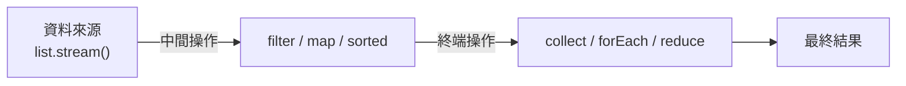

<div class="flex flex-col justify-center items-center h-full" style="background: #ffffff;">
  <p style="color: #5eada0; font-size: 1rem; font-weight: 600; letter-spacing: 0.2em; text-transform: uppercase; margin-bottom: 1.2rem;">Java Programming Masterclass</p>
  <h1 style="color: #1a5c5c; font-size: 3.2rem; font-weight: 900; line-height: 1.15; margin-bottom: 1.5rem;">Stream 與 Lambda</h1>
  <div style="height: 4px; width: 320px; background: linear-gradient(90deg, #5eada0, #a7d9d0); border-radius: 2px; margin-bottom: 1.5rem;"></div>
  <p style="color: #4a7c7c; font-size: 1.15rem; font-style: italic;">
    「用更少的程式碼，做更多的事」
  </p>
  <Link to="home" style="color: #9dc4c4; font-size: 0.85rem; margin-top: 2rem; text-decoration: none; letter-spacing: 0.05em;">← 返回目錄</Link>
</div>

<!--
【開場白】
大家好！今天要來聊聊 Java 8 之後最重要的兩個工具：Lambda 跟 Stream。

【為什麼要學這個？】
想像一下，我們要從一堆資料裡「挑出符合條件的、轉換成另一種格式、再整理成清單」——如果用傳統的 `for` 迴圈，光是寫迴圈、判斷、暫存變數，就要一大段程式碼。Lambda 跟 Stream 讓我們可以用「描述要做什麼」的方式，把這整段邏輯壓縮成幾行，而且讀起來更接近我們講話的邏輯。

【今天學完你會能做什麼】
學完今天這堂課，我們會學會用 Lambda 寫出簡短的「行為」，並用 Stream 把「篩選 → 轉換 → 收集」這條生產線串起來，處理清單資料會變得又快又清楚。
-->

---
layout: default
---

# Outline

- **Lambda 運算式**：語法、函數式介面（`Predicate`、`Function`、`Consumer`、`Supplier`）
- **方法參考**：`::` 運算子的基本形式
- **Stream API**
  - 中間操作：`filter`、`map`、`sorted`、`distinct`、`limit`、`skip`
  - 終端操作：`forEach`、`collect`、`count`、`reduce`、`toList()`...
  - Collectors 工具與 `Optional` 簡介
- **實作練習**

<!--
【課程預覽】
這堂課我們會分成三個部分：Lambda 語法、方法參考，還有最重要的 Stream API。

【學習建議】
第一次看到 Lambda 跟 `::` 這些符號，可能會覺得有點像在看密語。沒關係，我們會從最簡單的例子開始，一步一步把這些符號跟「原本熟悉的寫法」對應起來，看久了就會發現它們其實很直覺。
-->

---
layout: section
class: flex flex-col justify-center items-center text-center
---

# 第一部分
# Lambda 運算式

<!--
【章節開場】
第一部分，Lambda。這是一種簡化程式碼的語法，讓我們不需要寫完整的類別或方法，
直接把「一個動作」包成一個東西，傳給別的方法去使用。
-->

---
layout: default
---

# 什麼是 Lambda？

Lambda 是 Java 8 引入的**匿名函式**語法，讓你不需要宣告完整的類別或方法，直接將「行為」當作參數傳遞。

- **精簡程式碼** — 取代冗長的匿名類別寫法
- **搭配集合框架** — 與 `List.forEach()`、`Stream` 等方法無縫整合
- **核心概念** — 讓 Java 支援函數式（functional）程式設計風格

<div class="mt-4 p-3 bg-blue-50 border-l-4 border-blue-400 text-gray-700 text-sm text-left">
💡 <b>基本語法：</b> <code>(參數列) -> 運算式 或 { 程式碼區塊 }</code>
</div>

<!--
【核心說明】
Lambda 其實就是「匿名函式」。白話來說，就是「一個不用取名字的動作」。

【生活化比喻】
想像我們要請工廠幫忙做一件事，傳統做法是要先寫一份完整的「委託合約」——定義一個類別、實作一個方法，才能把這個「動作」傳出去（這就是匿名類別的寫法）。
有了 Lambda，我們只要說一句話：「把這個數字乘以二」（`x -> x * 2`），工廠看到就直接照做，不需要簽合約、不需要正式文件。

💼 業界實務：
現在的 Java 專案幾乎都會用到 Lambda，尤其是搭配集合框架操作資料的時候。這已經是現代 Java 開發的基本功了。
-->

---

# Lambda 語法形式

| 語法形式 | 範例 | 說明 |
| --- | --- | --- |
| 無參數 | `() -> "Hello"` | 小括號不可省略 |
| 單一參數 | `x -> x * 2` | 括號可省略 |
| 多個參數 | `(a, b) -> a + b` | 多參數需加括號 |
| 多行程式碼 | `(x) -> { ...; return x; }` | 需大括號與 `return` |

<div class="mt-4 p-3 bg-blue-50 border-l-4 border-blue-400 text-gray-700 text-sm text-left">
💡 只要你用了大括號 <code>{ }</code>，就必須明確寫 <code>return</code>，否則編譯不過。
</div>

<!--
【核心說明】
Lambda 的語法可以想成「箭頭左邊是輸入，箭頭右邊是要做的事」。

【帶著讀這張表】
無參數：`() -> ...`，小括號代表「沒有輸入」，但不能省略。
單一參數：`x -> ...`，只有一個輸入的時候，括號可以省，最簡潔。
多個參數：`(a, b) -> ...`，超過一個輸入就一定要加括號。
多行程式碼：如果動作不只一行，就要加 `{}`，而且要自己寫 `return` 把結果丟回去。

⚠️ 學生常見誤解：
單一參數可以省略括號，但多行程式碼一定要加大括號，這兩個規則不要搞混。
-->

---

# Lambda 語法形式 — 與傳統寫法比較

```java
// ❌ 傳統匿名類別（需實作介面、覆寫方法）
Runnable r1 = new Runnable() {
    @Override
    public void run() {
        System.out.println("Hello!");
    }
};

// ✅ Lambda 寫法（只寫「做什麼」，其餘省略）
Runnable r2 = () -> System.out.println("Hello!");
```

<div class="mt-4 p-3 bg-green-50 border-l-4 border-green-400 text-gray-700 text-sm text-left">
✅ Lambda 省略了介面名稱、方法名稱與 <code>@Override</code>，編譯器能從上下文自動推斷。兩段程式碼的執行結果完全相同。
</div>

<!--
【帶讀程式碼前的鋪陳】
我們來比較一下，同一件事，傳統寫法跟 Lambda 寫法差多少。

【逐步解說】
左邊的傳統寫法，為了表達「執行時要印出 Hello」，得先 `new Runnable()`、再 `@Override public void run()`，一堆樣板程式碼。
右邊的 Lambda，直接 `() -> System.out.println("Hello!")`，意思一樣，但只剩下「真正重要」的那一句。

⚠️ 學生常見誤解：
Lambda 不是什麼魔法新發明，它背後其實就是一個匿名類別的簡化寫法，編譯器會自動幫我們把「省略的部分」補回去。
-->

---

# Lambda 語法 — 比較傳統寫法

```java
List<String> heroes = new ArrayList<>(
    List.of("炭治郎", "禰豆子", "善逸", "伊之助"));

// ❌ 傳統匿名類別寫法（冗長）
Collections.sort(heroes, new Comparator<String>() {
    public int compare(String a, String b) {
        return a.compareTo(b);
    }
});

// ✅ Lambda 寫法（簡潔）
Collections.sort(heroes, (a, b) -> a.compareTo(b));
```

<!--
【帶讀程式碼前的鋪陳】
這次我們用「排序」來看 Lambda 的威力。

【逐步解說】
傳統寫法為了排序，得寫一整段 `new Comparator<String>() { public int compare(...) {...} }`，光看就眼花。
Lambda 寫法直接一句 `(a, b) -> a.compareTo(b)`，意思是「a 跟 b 怎麼比，就回傳比較結果」，一行就講完了。

💼 業界實務：
這種簡潔不只是少打字，更重要的是「邏輯一目了然」。一看就知道是依照字母順序排序，不會被一堆樣板程式碼擋住視線。
-->

---

# Lambda 需要型別：函數式介面

`s -> s.toLowerCase()` 本身沒有型別。Java 是強型別語言，**lambda 必須指派給某個介面**，Java 才知道它「是什麼」。

```java
// ❌ 無法編譯：Java 不知道這是什麼型別
var f = s -> s.toLowerCase();

// ✅ 告訴 Java：這是「吃 String、吐 String」的函數
Function<String, String> f = s -> s.toLowerCase();
```

只要介面**只有一個抽象方法**，lambda 就能直接實作它，這種介面就叫**函數式介面**。

想像你去便利商店打工，老闆說：「你今天只有**一個任務**——幫客人結帳。」因為任務只有一個，所以當客人走過來，你就知道要做什麼，不會搞錯。這就是函數式介面——只有一個「任務定義」，lambda 塞進去就知道自己要做什麼。

<div class="mt-4 p-3 bg-blue-50 border-l-4 border-blue-400 text-gray-700 text-sm text-left">
💡 你不需要每次都自己定義介面 — Java 已經幫你把最常見的幾種形狀都定義好了，下一頁就是這些現成介面。
</div>

<!--
【核心說明】
很多人會以為 Lambda 是一種「隨便寫寫就能用」的語法糖，但其實不是——Java 是強型別語言，每個 Lambda 都必須對應到一個介面型別，編譯器才知道它要扮演什麼角色。

【生活化比喻】
`s -> s.toLowerCase()` 單看這一句，它是「判斷條件」？還是「轉換函數」？還是「執行動作」？光看這句話不知道，要靠左邊宣告的型別（`Function<String, String>`）來確定它的「身份」。

⚠️ 學生常見誤解：
Lambda 不能單獨存在，它一定要搭配函數式介面才能使用，這跟一般物件可以直接用 `var` 宣告不一樣。
-->

---

# Java 內建函數式介面：四大天王

Java 幫你預先定義了最常用的四種「lambda 形狀」，直接用就好：

| 介面 | Lambda 形狀 | 用途 |
| --- | --- | --- |
| `Predicate<T>` | `T -> boolean` | 判斷條件（裁判：只回 Yes/No）|
| `Function<T, R>` | `T -> R` | 輸入轉輸出（加工機：蘋果進、果汁出）|
| `Consumer<T>` | `T -> void` | 只執行不回傳（大胃王：吃了沒有下文）|
| `Supplier<T>` | `() -> T` | 不輸入只產出（自動販賣機：按一下自己吐東西）|

這四個也正是 **Stream API 每個方法背後要求的 lambda 形狀**：`filter` 要 `Predicate`、`map` 要 `Function`、`forEach` 要 `Consumer`。

<!--
【核心說明】
Java 把最常見的四種 lambda 形狀，事先取好名字、定義成介面，我們直接拿來用就好，不用自己寫 `@FunctionalInterface`。

【帶著讀這張表】
`Predicate`：就像是「裁判」，問它對不對，它只會回答 Yes 或 No。
`Function`：就像是「加工機」，丟一個蘋果進去，吐出一杯果汁。
`Consumer`：就像是「大胃王」，丟東西給它吃，它就吃了，不回傳任何東西。
`Supplier`：就像是「自動販賣機」，不需要丟東西進去，按一下它就自己吐東西出來。

【連接 Stream 的橋梁】
最後一行很重要——等我們學到 Stream 的 `filter`、`map`、`forEach`，就會發現它們後面接的 lambda 長相，剛好對應這四種形狀。因為這些方法的參數型別就是 `Predicate`、`Function`、`Consumer`。

💼 業界實務：
這四個一定要記熟，Stream 裡面幾乎所有操作都是繞著這四個介面在轉。
-->

---

# 常用內建函數式介面 — 呼叫方法

| 介面 | 呼叫方法 | 說明 |
| --- | --- | --- |
| `Predicate<T>` | `.test(值)` | 回傳 `boolean` |
| `Function<T,R>` | `.apply(值)` | 回傳轉換後的值 |
| `Consumer<T>` | `.accept(值)` | 無回傳值 |
| `Supplier<T>` | `.get()` | 不傳入值，產出結果 |

<!--
【核心說明】
每台機器都有自己的「啟動按鈕」，按鈕名字不一樣，別按錯了。

【帶著讀這張表】
`Predicate` 用 `.test(...)`——測試一下，回我 true 或 false。
`Function` 用 `.apply(...)`——套用轉換，回我結果。
`Consumer` 用 `.accept(...)`——接收這個東西去處理，不用回傳。
`Supplier` 用 `.get()`——不用給它任何東西，它自己生一個出來。
-->

---

# 常用內建函數式介面 — 範例

```java
Predicate<Integer> isAdult = age -> age >= 18;
System.out.println(isAdult.test(20));     // true

Function<String, Integer> len = s -> s.length();
System.out.println(len.apply("炭治郎")); // 3

Consumer<String> print = s -> System.out.println("★ " + s);
print.accept("鬼殺隊");                  // ★ 鬼殺隊

Supplier<String> title = () -> "無限列車";
System.out.println(title.get());         // 無限列車
```

<!--
【帶讀程式碼前的鋪陳】
我們來實際操作一下這四台機器。

【逐步解說】
`isAdult.test(20)`：裁判判定「20 歲是成年」，回傳 `true`。
`len.apply("炭治郎")`：加工機把「炭治郎」這個字串轉成長度數字 `3`。
`print.accept("鬼殺隊")`：大胃王把「鬼殺隊」這個字串吃掉，順手印出來。
`title.get()`：自動販賣機不需要任何輸入，按一下就吐出「無限列車」。

每一台機器的「啟動按鈕」剛好對應上一頁學到的 `.test()`、`.apply()`、`.accept()`、`.get()`。
-->

---

# Lambda 中的 var 參數 (JDK 11)

自 Java 11 起，Lambda 參數可以使用 `var` 關鍵字，這讓語法更一致：

| 範例 | 說明 |
| --- | --- |
| `(var x, var y) -> x + y` | 所有參數都必須使用 `var` |
| `(@SuppressWarnings("unused") var x) -> ...` | **主要用途：** 方便在參數上加上註解（Annotation） |

```java
// 傳統寫法
Function<String, String> f1 = (String s) -> s.toLowerCase();

// JDK 11 使用 var
Function<String, String> f2 = (var s) -> s.toLowerCase();

// 搭配註解（必須使用類型或 var，不能直接省略）
Function<String, String> f3 = (@SuppressWarnings("unused") var s) -> s.toLowerCase();
```

<div class="mt-4 p-3 bg-blue-50 border-l-4 border-blue-400 text-gray-700 text-sm text-left">
💡 <b>規則：</b> 不能混用，例如 <code>(var x, y) -> ...</code> 是不允許的。
</div>

<!--
【核心說明】
JDK 11 之後，Lambda 的參數也可以用 `var` 來宣告，主要是為了讓語法看起來更一致。

【程式世界怎麼用】
大部分情況我們還是會直接省略型別（像 `s -> s.toLowerCase()`）。會用到 `var`，通常是因為要在參數上加一些「標籤」（註解），例如 `@SuppressWarnings` 或框架提供的 `@Nullable`。

💼 業界實務：
如果不需要加註解，就不必特地寫 `var`，直接省略型別才是真正簡潔的寫法。
-->

---
layout: default
---

# 🎬 AI 協作時刻：四大天王，我該用哪一個？

`Predicate`、`Function`、`Consumer`、`Supplier` 剛學完很容易搞混，讓 AI 幫你做一個決策流程：

**要用的 Prompt：**

> 請幫我用「這個 lambda 有沒有輸入？有沒有回傳值？」
> 這兩個問題，設計一個簡單的決策流程，
> 幫我判斷該用 Predicate、Function、Consumer 還是 Supplier。
> 最後用 3 個生活化的例子（不是程式碼）驗證這個流程對不對。

<div class="mt-4 p-3 bg-blue-50 border-l-4 border-blue-400 text-gray-700 text-sm text-left">
💡 <b>帶回家用：</b> 之後寫 Stream 卡住不知道該傳哪種 lambda 時，用同一套「有沒有輸入/回傳」的問法自己判斷就好。
</div>

<!--
【操作提示】
現場示範用 AI 給的流程，反過來考自己：「篩選及格分數」該用哪個？「印出名字」呢？「產生隨機亂數」呢？

【收斂一句話】
四大天王不用死背，看「有沒有輸入、有沒有回傳」兩個問題就能自己推導出答案。
-->

---
layout: default
---

# 練習 1：用函數式介面整理鬼殺隊名單
### 任務說明

宣告一個 `List<String> heroes`，內容為「炭治郎、禰豆子、善逸、伊之助、蜜璃」，完成以下操作：

1. 用 `Predicate<String>` 寫一個 lambda，判斷名字長度是否 **≥ 3**
2. 用 `Function<String, Integer>` 寫一個 lambda，將名字轉成它的長度
3. 用 `Consumer<String>` 寫一個 lambda，印出「隊員：」+ 名字
4. 對 `heroes` 中的每個名字，先用 `Predicate.test()` 判斷，若成立就用 `Consumer.accept()` 印出該名字；最後用 `Function.apply()` 印出「禰豆子」的名字長度

<!--
【任務鋪陳】
這一節學了 Lambda 語法，還有 `Predicate`、`Function`、`Consumer`、`Supplier` 四大天王。這個練習就是要把「裁判」「加工機」「大胃王」三個角色實際組裝起來用一次。

【引導思考】
想一想：`Predicate<String>` 的 lambda 要怎麼寫才能判斷「長度 >= 3」？`heroes` 要用什麼方式逐一走過去？每一步呼叫的「啟動按鈕」分別是 `.test()`、`.apply()`、`.accept()`，別搞混了。
-->

---
layout: default
---

# 練習 1：用函數式介面整理鬼殺隊名單
### 解題提示

1. `Predicate<String> isLongName = name -> name.length() >= 3;`
2. `Function<String, Integer> nameLength = name -> name.length();`
3. `Consumer<String> printHero = name -> System.out.println("隊員：" + name);`
4. 用 for-each 走過 `heroes`，配合 `isLongName.test(name)` 與 `printHero.accept(name)`

```java
List<String> heroes = List.of("炭治郎", "禰豆子", "善逸", "伊之助", "蜜璃");

Predicate<String> isLongName = name -> name.length() >= 3;
Function<String, Integer> nameLength = name -> name.length();
Consumer<String> printHero = name -> System.out.println("隊員：" + name);

for (String name : heroes) {
    if (isLongName.test(name)) {
        printHero.accept(name);
    }
}
System.out.println("禰豆子的名字長度：" + nameLength.apply("禰豆子"));
```

<!--
【帶讀解法】
三個 lambda 對應三種「形狀」：`isLongName` 是「問是非」的 `Predicate`，呼叫用 `.test()`；`nameLength` 是「轉換」的 `Function`，呼叫用 `.apply()`；`printHero` 是「做事不回傳」的 `Consumer`，呼叫用 `.accept()`。

💼 業界實務：
這種把「條件」「轉換」「動作」分別宣告成獨立的 lambda 變數，可以讓程式碼讀起來像是在「組裝積木」——之後我們會看到 Stream 的 `filter`、`map`、`forEach` 其實就是直接吃這幾種 lambda。
-->

---
layout: section
class: flex flex-col justify-center items-center text-center
---

# 第二部分
# 方法參考
# Method Reference

<!--
【章節開場】
第二部分，方法參考。當我們的 Lambda 只是「呼叫某個現有的方法」時，
可以用 `::` 運算子直接引用那個方法，比寫 Lambda 還更簡潔。
-->

---
layout: default
---

# 方法參考語法

`::` 運算子讓你直接引用現有的方法，讓程式碼更簡潔：

| 語法 | 說明 | 等同 Lambda |
| --- | --- | --- |
| `ClassName::staticMethod` | 靜態方法 | `x -> ClassName.method(x)` |
| `obj::instanceMethod` | 特定物件的方法 | `x -> obj.method(x)` |
| `ClassName::instanceMethod` | 任意物件的方法 | `x -> x.method()` |
| `ClassName::new` | 建構子 | `x -> new ClassName(x)` |

```java
List<String> heroes = List.of("炭治郎", "善逸", "伊之助");
heroes.forEach(System.out::println);      // obj::instanceMethod
heroes.stream().map(String::length);      // ClassName::instanceMethod
```

<!--
【核心說明】
「方法參考」可以看成是 Lambda 的精簡升級版。當 Lambda 裡面只是在「轉達」另一個方法的呼叫時，連箭頭 `->` 都可以省了。

【生活化比喻】
Lambda 寫法是：「請你去叫那位廚師煮飯」（`chef -> chef.cook()`）。
方法參考則是直接說：「那位廚師，煮飯！」（`Chef::cook`）。少了一層轉達，更直接。

💼 業界實務：
在 Code Review 的時候，如果能把單純轉達呼叫的 Lambda 改成方法參考，程式碼會更精簡，這是許多團隊偏好的寫法。
-->

---
layout: default
---

# 練習 2：把 Lambda 改寫成方法參考
### 任務說明

下面這段程式碼裡的三個 lambda，分別可以改寫成哪一種方法參考（`ClassName::staticMethod`、`obj::instanceMethod`、`ClassName::instanceMethod`、`ClassName::new`）？請逐一改寫：

```java
List<String> heroes = List.of("炭治郎", "禰豆子", "善逸");

// (A)
heroes.forEach(name -> System.out.println(name));

// (B)
heroes.stream().map(name -> name.length());

// (C)
heroes.stream().map(name -> Integer.valueOf(name.hashCode()));
```

<!--
【任務鋪陳】
上一頁的表格列出了四種方法參考形式，這個練習就是要把眼前這三段 Lambda，對照表格找出它們各自對應的形式並改寫。

【引導思考】
想一想：(A) 的 `System.out` 是不是已經是一個現成的物件？(B) 的 `name.length()` 是 `name` 自己呼叫自己的方法嗎？(C) 的 `Integer.valueOf(...)` 又是哪一種方法？
-->

---
layout: default
---

# 練習 2：把 Lambda 改寫成方法參考
### 解題提示

1. (A) `System.out` 是現成物件 → `obj::instanceMethod` → `heroes.forEach(System.out::println)`
2. (B) `name` 自己呼叫 `length()` → `ClassName::instanceMethod` → `heroes.stream().map(String::length)`
3. (C) `Integer.valueOf(...)` 是靜態方法 → `ClassName::staticMethod` → `heroes.stream().map(name -> Integer.valueOf(name.hashCode()))` 中的 `Integer.valueOf` 部分可寫成 `Integer::valueOf`，但因為還要先呼叫 `name.hashCode()`，整體仍需保留 lambda：`name -> Integer.valueOf(name.hashCode())`

```java
List<String> heroes = List.of("炭治郎", "禰豆子", "善逸");

heroes.forEach(System.out::println);          // (A) obj::instanceMethod
heroes.stream().map(String::length);          // (B) ClassName::instanceMethod
heroes.stream()
      .map(String::hashCode)                  // (C) 先取得 hashCode（int）
      .map(Integer::valueOf);                 // 再用 ClassName::staticMethod 包成 Integer
```

<!--
【帶讀解法】
(A) 跟 (B) 都能整行直接替換成方法參考，因為 lambda 裡「只是轉達」一個方法呼叫。
(C) 比較特別：原本一行 lambda 其實做了兩件事（先 `hashCode()` 再 `Integer.valueOf()`），方法參考一次只能轉達「一件事」，所以拆成兩個 `map`，分別對應 `ClassName::instanceMethod` 跟 `ClassName::staticMethod`。

⚠️ 學生常見誤解：
不是所有 lambda 都「一定」能改寫成方法參考——如果 lambda 裡面做了多個步驟、或有額外的運算（例如 `x -> x * 2`），就沒有對應的方法可以參考，只能繼續用 lambda。
-->

---
layout: section
class: flex flex-col justify-center items-center text-center
---

# 第三部分
# Stream API

<!--
【章節開場】
第三部分，Stream API。有了 Lambda 的基礎，現在來看 Stream——
它讓我們用「管道」的方式，對集合資料做一連串的操作。
-->

---
layout: default
---

# 什麼是 Stream？

`Stream` 是 Java 8 引入的**資料流處理管道**，讓集合操作可以宣告式地串接。

<div class="flex justify-center mt-4">



</div>

<div class="mt-4 p-3 bg-blue-50 border-l-4 border-blue-400 text-gray-700 text-sm text-left">
💡 <b>延遲執行：</b>中間操作不會立即執行，直到遇到終端操作才統一觸發。Stream 也<b>不修改</b>原始集合。
</div>

<!--
【核心說明】
Stream 可以想成是資料的「流水線」——資料一筆一筆從輸送帶的一端送進去，經過幾個加工站，最後從另一端收成果。

【看圖前的引導】
這張圖就是我們程式碼的「工廠生產線」示意圖。

【逐步帶著看】
第一站：把資料（List）放上輸送帶，也就是呼叫 `stream()`。
第二站：中間操作。我們可以篩選（`filter`）、轉換（`map`）、排序（`sorted`），可以放很多個加工站串接在一起。
第三站：終端操作。這是生產線的最後一關，這時候才會真的「出貨」（例如 `collect`）。

⚠️ 學生常見誤解：
Stream 是「懶惰」的——如果沒有最後的終端操作，前面那些加工站根本不會啟動。這就是「延遲執行」。另外 Stream 不會改動原始的 List，它只是「借用」資料來加工。
-->

---

# Stream 的建立方式

| 方式 | 語法 | 說明 |
| --- | --- | --- |
| 從 Collection 建立 | `list.stream()` | 最常見的方式 |
| 從陣列建立 | `Arrays.stream(arr)` | 適用於基本型態陣列 |
| 直接建立 | `Stream.of(a, b, c)` | 直接指定元素 |

```java
List<String> list = List.of("A", "B", "C");
Stream<String> s1 = list.stream();

int[] arr = {1, 2, 3};
IntStream s2 = Arrays.stream(arr);
```

<!--
【核心說明】
要啟動生產線，第一步是把材料放上輸送帶。

【帶著讀這張表】
最常用的就是 `list.stream()`——手邊有一個 List，直接呼叫就能變成 Stream。
如果資料是陣列 `int[]`，就要用 `Arrays.stream(arr)`，陣列本身沒有 `.stream()` 方法可以直接呼叫。
如果是手邊已經知道的幾個值，可以用 `Stream.of(a, b, c)` 直接生成。

💼 業界實務：
日常開發中，絕大多數情況都是 `list.stream()`。先記住這個最常用的入口就足夠應付大部分情境。
-->

---

# 中間操作 (Intermediate Operations)

中間操作回傳新的 `Stream`，可以**串接多個**：

| 方法 | 說明 |
| --- | --- |
| `filter(Predicate)` | 篩選符合條件的元素 |
| `map(Function)` | 將每個元素轉換為另一種型態 |
| `sorted()` | 依自然順序排序 |
| `sorted(Comparator)` | 依自訂比較器排序 |
| `distinct()` | 移除重複元素（依 `equals`）|
| `limit(long n)` | 取前 n 個元素 |
| `skip(long n)` | 跳過前 n 個元素 |

<!--
【核心說明】
中間操作就像是站在輸送帶旁邊的工人，資料經過時，他們各自做自己的工作。

【帶著讀這張表】
`filter`：像是在挑壞掉的水果，不符合條件的直接從輸送帶上拿掉。
`map`：像是包裝站，把原本的東西換成另一種形式。
`sorted`：把輸送帶上的東西排好順序。
`distinct`：把重複出現的東西去掉，只留一個。
`limit`：生產線只要做到「夠數量」就停機，後面的不再處理。
`skip`：前面幾個直接跳過不處理。

💼 業界實務：
把 `filter` 放在管道最前面是常見的好習慣——先篩掉不需要的資料，後面的工人工作量就變少，整條生產線的效能也會比較好。
-->

---

# 中間操作 — 範例

```java
List<Integer> nums = List.of(5, 3, 1, 4, 2, 3, 5);

nums.stream()
    .filter(n -> n > 2)   // [5, 3, 4, 3, 5]
    .distinct()            // [5, 3, 4]
    .sorted()              // [3, 4, 5]
    .limit(2)              // [3, 4]
    .forEach(System.out::println);
// 輸出：3
//       4
```

<!--
【帶讀程式碼前的鋪陳】
我們來看看這條生產線實際是怎麼跑的。

【逐步解說】
一堆數字進入輸送帶。
先過濾掉 2 以下的數字。
再把重複的數字踢掉（`distinct`）。
然後排好順序（`sorted`）。
最後只留前兩個（`limit(2)`）。
原本亂七八糟的一堆數字，經過這四道工序，最後變成乖乖排好的 `3` 跟 `4`。

⚠️ 學生常見誤解：
這幾個中間操作的順序會影響結果跟效能，例如先 `sorted` 再 `limit`，跟先 `limit` 再 `sorted`，結果可能不一樣，要依照需求安排順序。
-->

---
layout: default
---

# 🎬 AI 協作時刻：換個順序，效能差多少？

Stream 管道的操作順序會影響效能，這個直覺很重要，但光看文字很難有感，讓 AI 幫你具體算給你看：

**要用的 Prompt：**

> 假設有 100 萬筆資料的 Stream，
> 我要先 filter 篩選出 1000 筆，再 sorted 排序、limit(10) 取前 10 筆。
> 請比較「先 filter 再 sorted」跟「先 sorted 再 filter」
> 這兩種寫法，哪一種要處理的資料量比較少？為什麼？

<div class="mt-4 p-3 bg-blue-50 border-l-4 border-blue-400 text-gray-700 text-sm text-left">
💡 <b>面試常考：</b> 「Stream 操作順序會不會影響效能」是常見的追問題，能講出「篩選越早做越省」就是加分答案。
</div>

<!--
【操作提示】
可以請 AI 舉一個誇張的資料量（例如百萬筆）讓效能差異更明顯，幫助學生建立「順序影響效能」的直覺。

【收斂一句話】
把 filter 放前面、把耗資源的操作往後放，這條經驗法則背後的原因就是「越早篩掉越少資料要處理」。
-->

---
layout: default
---

# 練習 3：篩選與串接英雄名單
### 任務說明

宣告一個 `List<String>` 包含以下名字：
「炭治郎、禰豆子、善逸、伊之助、蜜璃、甘露寺、時透無一郎」

用 Stream 完成以下操作：
1. 篩選出名字長度 **≥ 3** 個字的人
2. 依字典順序排序
3. 用 `Collectors.joining("、")` 串接後印出一行字串

<!--
【出題前的鋪陳】
聽了這麼多關於 Lambda 跟 Stream 中間操作的說明，現在來動手寫一題，把今天前半段學到的東西串起來。

【問題引導】
想像我們是鬼殺隊的人事，要從這份名單裡挑出「名字夠長」的人。名字長度怎麼算？怎麼讓他們依字母順序排好？最後要怎麼把這些名字用一個符號串成一行？

【等待與觀察】
給大家 3 分鐘練習。如果中間某一步卡住，可以先把 Stream 拆開、一步一步印出中間結果來檢查。
-->

---

# 練習 3：解題提示
### 提示說明

1. `filter(name -> name.length() >= 3)` 篩選
2. `sorted()` 依字典排序
3. `.collect(Collectors.joining("、"))` 串接為一行

```java
List<String> heroes = List.of(
    "炭治郎","禰豆子","善逸","伊之助","蜜璃","甘露寺","時透無一郎");
String result = heroes.stream()
    .filter(n -> n.length() >= 3)
    .sorted()
    .collect(Collectors.joining("、"));
System.out.println(result);
```

<!--
【逐步解說】
第一步：`filter` 篩出名字長度 3 個字以上的人。
第二步：`sorted` 讓他們依照字典順序排好。
第三步：`collect(Collectors.joining("、"))` 把排好的名字用「、」串成一行字串。

這三步串起來，就是一條完整的「篩選 → 排序 → 收集」生產線，比寫 `for` 迴圈搭配 `StringBuilder` 簡潔很多。
-->

---
layout: section
class: flex flex-col justify-center items-center text-center
---

# 第四部分
# 終端操作與 Collectors

<!--
【章節開場】
第四部分，終端操作與 Collectors。我們已經知道怎麼「加工」資料，
接下來要學怎麼「收成」——把加工完的資料變成最終想要的結果。
-->

---
layout: default
---

# 終端操作 (Terminal Operations)

終端操作**結束 Stream 管道**，產生最終結果：

| 方法 | 說明 |
| --- | --- |
| `forEach(Consumer)` | 對每個元素執行操作（無回傳值）|
| `collect(Collector)` | 收集結果到集合中 |
| `reduce(identity, BinaryOperator)` | 將元素合併為單一值 |
| `count()` | 回傳元素數量 |
| `min(Comparator)` | 找最小值（回傳 `Optional`）|
| `max(Comparator)` | 找最大值（回傳 `Optional`）|
| `findFirst()` | 取得第一個元素（回傳 `Optional`）|

<!--
【核心說明】
終端操作就是生產線的「收成站」。沒有這一站，前面所有的加工都只是白工，因為 Stream 是「懶惰」的，不會自動執行。

【帶著讀這張表】
`collect`：把加工完的成果裝進籃子（List、Map 等）。
`forEach`：拿到結果直接拿去用，例如印出來。
`count`：算一算總共有幾個。
`reduce`：把所有元素「合併」成一個值，例如全部加總。
`findFirst`：只要排在最前面的那一個。

💼 業界實務：
日常開發中，最常用的終端操作就是 `collect(Collectors.toList())`，幾乎九成情況都是把結果收集成一個新的清單。
-->

---

# 終端操作 — 範例

```java
List<Integer> scores = List.of(85, 72, 91, 60, 88, 95);

// count：計算 >= 80 的人數
long cnt = scores.stream().filter(s -> s >= 80).count(); // 4

// reduce：加總所有分數
int sum = scores.stream().reduce(0, Integer::sum);       // 491

// collect：篩選後收集
List<Integer> top = scores.stream()
    .filter(s -> s >= 80)
    .sorted()
    .collect(Collectors.toList());
System.out.println(top); // [85, 88, 91, 95]
```

<!--
【帶讀程式碼前的鋪陳】
我們來看看三種不同的「收成方式」。

【逐步解說】
第一種用 `count()` 算出有幾個人 80 分以上，最直接。
第二種用 `reduce` 把所有分數加總——可以想成是「滾雪球」，從 0 開始，把每個分數一個一個滾進去。
第三種是最常見的「篩選、排序、裝進清單」三部曲。

⚠️ 學生常見誤解：
`reduce` 的第一個參數 `0` 是「初始值」。如果 Stream 是空的，最後結果就會是這個初始值，不會報錯，但結果可能不是你預期的。
-->

---

# Optional — 安全的可能空值

`min()`、`max()`、`findFirst()` 回傳 `Optional<T>`，代表「可能有值、也可能沒有」：

| 方法 | 說明 |
| --- | --- |
| `isPresent()` | 有值時回傳 `true` |
| `get()` | 取得值（無值時拋出異常）|
| `orElse(T default)` | 無值時回傳預設值 |
| `orElseGet(Supplier)` | 無值時呼叫 Supplier |

```java
Optional<Integer> max = List.of(3, 1, 5).stream()
    .max(Comparator.naturalOrder());
System.out.println(max.isPresent()); // true
System.out.println(max.orElse(-1));  // 5
```

<!--
【核心說明】
`Optional` 是為了避免程式界最常見的錯誤之一：對著「不存在的東西」呼叫方法，導致 `NullPointerException`（空指標例外）。

【生活化比喻】
可以把 `Optional` 想成一個「禮物盒」，裡面可能裝著東西（值），也可能是空的。
我們不能直接伸手進去拿，要先問：「裡面有東西嗎？」（`isPresent()`），或者直接說：「如果是空的，就給我這個替代品」（`orElse(-1)`）。

💼 業界實務：
直接呼叫 `.get()` 而不先確認有沒有值，是常見的地雷——如果盒子是空的，會直接拋出例外。用 `.orElse()` 給一個合理的預設值，是比較穩妥的寫法。
-->

---

# Stream 轉 List 的捷徑 (JDK 16)

以往將 Stream 轉回 List 需要寫一段冗長的語法，JDK 16 提供了優雅的捷徑：

| 版本 | 語法 | 備註 |
| --- | --- | --- |
| Java 8+ | `.collect(Collectors.toList())` | 回傳的可變性視實作而定 |
| **Java 16+** | **`.toList()`** | 回傳一個**不可變** (Unmodifiable) 的 List |

```java
List<String> list = Stream.of("A", "B", "C").toList();
// 等同於舊版的 .collect(Collectors.toList()) 但更簡潔！
```

<!--
【核心說明】
JDK 16 把「Stream 轉 List」這個超常用的動作，從一長串語法簡化成一個短短的方法。

【程式世界怎麼用】
以前要寫 `.collect(Collectors.toList())`，現在只要 `.toList()`，省下不少打字。

⚠️ 學生常見誤解：
要注意，`.toList()` 回傳的是「不可變」的清單——拿到的清單只能讀取，不能再往裡面新增或移除元素。如果之後還要修改清單內容，請改用 `.collect(Collectors.toList())`。
-->

---

# 技巧：快速反轉條件 (JDK 11)

使用 `Predicate.not()` 讓過濾邏輯讀起來更像英文，提升程式碼可讀性：

```java
List<String> lines = List.of("A", " ", "B", "");

// 傳統寫法：過濾掉空白（邏輯較不明確）
lines.stream().filter(s -> !s.isBlank());

// JDK 11 寫法：過濾「不是空白」的字串
lines.stream().filter(Predicate.not(String::isBlank));
```

<div class="mt-4 p-3 bg-blue-50 border-l-4 border-blue-400 text-gray-700 text-sm text-left">
💡 <b>搭配方法參考：</b> 這種寫法特別適合與 <code>ClassName::methodName</code> 結合使用。
</div>

<!--
【核心說明】
這個小技巧的目的是讓條件判斷讀起來更接近自然語言。

【程式世界怎麼用】
與其寫 `!s.isBlank()`（驚嘆號很容易被忽略，容易看錯邏輯），不如寫 `Predicate.not(String::isBlank)`，讀起來就是「過濾掉『不是』空白的」，意思更清楚。
-->

---

# Collectors 常用工具

| 方法 | 說明 |
| --- | --- |
| `Collectors.toList()` | 收集為 `List` |
| `Collectors.joining(delimiter)` | 字串串接，可指定分隔符 |
| `Collectors.groupingBy(Function)` | 依條件分組，回傳 `Map` |

```java
List<String> names = List.of("炭治郎", "善逸", "伊之助");
String joined = names.stream()
    .collect(Collectors.joining("、"));
System.out.println(joined); // 炭治郎、善逸、伊之助
Map<Integer, List<String>> byLen = names.stream()
    .collect(Collectors.groupingBy(String::length));
```

<!--
【核心說明】
`Collectors` 可以想成是我們的「收成工具組」，提供各種「把 Stream 結果包裝成什麼形式」的選項。

【帶著讀這張表】
`joining`：把字串用指定符號串起來，做報表時很好用。
`groupingBy`：依條件分組，就像是把不同類別的東西分別放進不同的抽屜——同年級、同分數區間的人各自歸到一個分類。

💼 業界實務：
`groupingBy` 是後台統計常用的工具，例如「每個長度的名字各有幾個」，一條 Stream 就能算出來。
-->

---

# Stream 完整應用範例

```java
import java.util.*;
import java.util.stream.*;

List<Integer> scores = List.of(85, 72, 91, 60, 88, 95, 45);
// 取得所有及格（≥60）且高分（≥80）的成績，排序後輸出
List<Integer> result = scores.stream()
    .filter(s -> s >= 60)
    .filter(s -> s >= 80)
    .sorted()
    .collect(Collectors.toList());
System.out.println(result); // [85, 88, 91, 95]
int sum = scores.stream().reduce(0, Integer::sum);
System.out.println("總分：" + sum); // 536
```

<!--
【帶讀程式碼前的鋪陳】
我們把今天學到的內容組合成一個完整的範例。

【逐步解說】
先篩選出及格的成績，再篩選出高分的成績，接著排序，最後裝進清單。
這一整套流程，就像是層層選拔，每經過一道關卡就會篩掉一些人，最後留下來的就是精英。

💼 業界實務：
實際專案裡，我們通常會把每個步驟分行寫，這樣同事在看程式碼時，一眼就能看出每個步驟在做什麼，而不需要把整行邏輯一次性解讀完。
-->

---
layout: default
---

# 🎬 AI 協作時刻：把傳統迴圈改寫成 Stream

Stream 是現在 Java 職缺很常要求的能力，練習把自己以前寫過的 for 迴圈丟給 AI，改成 Stream 版本：

**要用的 Prompt：**

> 這是我以前用 for 迴圈寫的程式碼（貼上一段 for 迴圈，
> 例如篩選、加總或分組的邏輯）。
> 請幫我改寫成 Stream 寫法，
> 並逐行對照說明「原本的 for 迴圈邏輯」對應到「Stream 的哪個方法」。

<div class="mt-4 p-3 bg-blue-50 border-l-4 border-blue-400 text-gray-700 text-sm text-left">
💡 <b>帶回家用：</b> 把自己以前的作業或專案程式碼拿出來練習改寫，是熟悉 Stream 最快的方式，比硬背 API 有效。
</div>

<!--
【操作提示】
如果學生手邊沒有現成程式碼，可以用今天練習過的成績統計例子（ch24 的 for 迴圈版本）當範例，讓 AI 示範對照。

【收斂一句話】
Stream 不是新知識，而是把「你早就會寫的迴圈邏輯」換一種更精簡的表達方式，這也是它成為履歷加分項的原因。
-->

---
layout: default
---

# 練習 4 (綜合)：成績處理綜合練習
### 任務說明

宣告 `List<Integer>` 成績：`{45, 78, 90, 62, 55, 85, 91, 73}`

用 Stream 完成以下操作：
1. 篩選出及格（≥ 60）的成績，依照分數**由高到低**排序
2. 用 `Collectors.joining("、")` 將排序後的成績轉成字串並印出（提示：先用 `map` 把 `Integer` 轉成 `String`）
3. 計算所有及格成績的總和（使用 `reduce`）

<!--
【出題前的鋪陳】
這是今天的綜合練習，把 Lambda、方法參考、Stream 的中間操作、終端操作跟 Collectors 全部串在一起用一次。

【問題引導】
想想看：怎麼篩選及格的成績？由高到低排序要怎麼寫比較器？`Integer` 要怎麼變成 `String` 才能用 `joining`？加總要用哪個終端操作？

【等待與觀察】
給大家 5 分鐘。如果卡在某一步，可以先把前面幾步寫完、印出中間結果，再接著往下寫。
-->

---

# 練習 4：解題提示
### 提示說明

1. `filter(s -> s >= 60)` 篩選，`sorted(Comparator.reverseOrder())` 由高到低排序
2. `map(String::valueOf)` 把 `Integer` 轉成 `String`，再 `collect(Collectors.joining("、"))`
3. `reduce(0, Integer::sum)` 加總

```java
List<Integer> scores = List.of(45, 78, 90, 62, 55, 85, 91, 73);

List<Integer> passed = scores.stream()
    .filter(s -> s >= 60)
    .sorted(Comparator.reverseOrder())
    .toList();

String joined = passed.stream()
    .map(String::valueOf)
    .collect(Collectors.joining("、"));
System.out.println(joined); // 91、90、85、78、73、62

int total = passed.stream().reduce(0, Integer::sum);
System.out.println("及格總分：" + total); // 479
```

<!--
【逐步解說】
第一步：`filter` 篩出及格成績，`sorted(Comparator.reverseOrder())` 由高到低排序——這是基礎版學過的「自訂比較器」用法。
第二步：用 `map(String::valueOf)` 把每個整數轉成字串（這裡也是方法參考的應用），再用 `joining` 串成一行。
第三步：`reduce(0, Integer::sum)` 把及格成績通通加總。

這一題把 Lambda、方法參考、filter/sorted/map、reduce、Collectors.joining 全部用上了，是今天內容的總複習。
-->

---
layout: section
class: flex flex-col justify-center items-center text-center
---

# Q & A

<!--
【結語】
今天我們從 Lambda 講到方法參考，再到 Stream API 的中間操作、終端操作和 Collectors。

如果有任何問題，現在就是最好的發問時機。沒問題的話，建議大家找一份自己手邊現成的清單資料，試著用今天學的這幾個方法重新寫一次，會更有感覺。
-->

---
layout: end
---

# 課程結束
### 掌握 Lambda 與 Stream，寫出更現代的 Java！
如有課後疑問，歡迎來信討論。

<!--
【收尾說明】
今天的課程到這裡結束。我們學了 Java 的現代化 API——Lambda 和 Stream。

記住一個核心概念：Stream 就是「描述你要做什麼」，讓 Java 去決定「怎麼做」。
`filter`（篩選）加上 `map`（轉換）再加上 `collect`（收集），這個組合幾乎能解決大部分集合操作的需求。

如果之後想進一步學習 flatMap、Primitive Stream、teeing 收集器跟 Optional 的進階用法，可以參考本章的進階自學內容。

課後如有任何問題，歡迎來信討論。
-->
