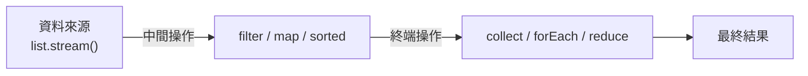

<div class="flex flex-col justify-center items-center h-full" style="background: #ffffff;">
  <p style="color: #5eada0; font-size: 1rem; font-weight: 600; letter-spacing: 0.2em; text-transform: uppercase; margin-bottom: 1.2rem;">Java Programming Masterclass</p>
  <h1 style="color: #1a5c5c; font-size: 3.2rem; font-weight: 900; line-height: 1.15; margin-bottom: 1.5rem;">Stream 與 Lambda</h1>
  <div style="height: 4px; width: 320px; background: linear-gradient(90deg, #5eada0, #a7d9d0); border-radius: 2px; margin-bottom: 1.5rem;"></div>
  <p style="color: #4a7c7c; font-size: 1.15rem; font-style: italic;">
    「用更少的程式碼，做更多的事」
  </p>
  <Link to="home" style="color: #9dc4c4; font-size: 0.85rem; margin-top: 2rem; text-decoration: none; letter-spacing: 0.05em;">← 返回目錄</Link>
</div>

<!--
【開場白】
各位熬夜寫 Code 的英雄們，大家好！今天要來聊聊 Java 8 之後最偉大的發明：Stream 與 Lambda。

【為什麼要學這個？】
如果你還在用那種老掉牙的 `for` 迴圈去過濾資料，那你真的該更新一下了。這就像是在 5G 時代還在用撥接上網一樣。Lambda 讓你的程式碼從「滿臉鬍渣的老頭」變成「清爽的型男」。

【今天學完你會能做什麼】
學完今天這堂課，你寫程式的速度會快到老闆以為你請了代打。原本要寫 20 行的邏輯，現在一行就能搞定。這就是現代 Java 的黑科技！
-->

---
layout: default
---

# Outline

- **Lambda 運算式**：語法、函數式介面（`Predicate`、`Function`、`Consumer`、`Supplier`）
- **方法參考**：`::` 運算子的四種形式
- **Stream API**
  - 中間操作：`filter`、`map`、`flatMap`、`sorted`、`takeWhile`、`dropWhile`...
  - 終端操作：`forEach`、`collect`、`count`、`toList()`...
  - Collectors 工具與 `teeing` 收集器
- **實作練習**

<!--
【課程預覽】
這堂課我們會分成 Lambda 語法、方法參考，還有最重要的 Stream API。

【學習建議】
剛開始看 Lambda 你可能會覺得：「這是什麼火星文？」別擔心，這很正常。等你用熟了，你就會發現：以前沒有它的日子到底是怎麼活過來的？
-->

---
layout: section
class: flex flex-col justify-center items-center text-center
---

# 第一部分
# Lambda 運算式

<!--
【章節開場】
第一部分，Lambda。Lambda 是一種簡化程式碼的語法，讓你不需要寫完整的類別或方法，
直接把「行為」包成一個東西傳給別人用。
-->

---
layout: default
---

# 什麼是 Lambda？

Lambda 是 Java 8 引入的**匿名函式**語法，讓你不需要宣告完整的類別或方法，直接將「行為」當作參數傳遞。

- **精簡程式碼** — 取代冗長的匿名類別寫法
- **搭配集合框架** — 與 `List.forEach()`、`Stream` 等方法無縫整合
- **核心概念** — let Java support functional programming style

<div class="mt-4 p-3 bg-blue-50 border-l-4 border-blue-400 text-gray-700 text-sm text-left">
💡 <b>基本語法：</b> <code>(參數列) -> 運算式 或 { 程式碼區塊 }</code>
</div>

<!--
【核心說明】
Lambda 其實就是「匿名函式」。白話說，就是「不用給名字的動作」。

【生活化比喻】
以前你要叫工廠做事，要寫一份完整的「勞動合約」（匿名類別）。
現在有了 Lambda，你只要說：「欸，把這個乘二」（`x -> x * 2`），工廠就開工了。不用簽名，不用蓋章，直接來！

💼 業界實務：
如果你現在去面試 Java 工程師，說你不會 Lambda，面試官可能會以為你是從 2010 年穿越過來的。這是現在的標配，一定要學會。
-->

---

# Lambda 語法形式

| 語法形式 | 範例 | 說明 |
| --- | --- | --- |
| 無參數 | `() -> "Hello"` | 小括號不可省略 |
| 單一參數 | `x -> x * 2` | 括號可省略 |
| 多個參數 | `(a, b) -> a + b` | 多參數需加括號 |
| 多行程式碼 | `(x) -> { ...; return x; }` | 需大括號與 `return` |

<div class="mt-4 p-3 bg-blue-50 border-l-4 border-blue-400 text-gray-700 text-sm text-left">
💡 只要你用了大括號 <code>{ }</code>，就必須明確寫 <code>return</code>，否則編譯不過。
</div>

<!--
【核心說明】
Lambda 的語法就像在寫簡訊。

【帶著讀這張表】
無參數：`() ->`。像在說「預備，跑！」。
單一參數：`x ->`。最簡潔，括號都省了。
多行程式碼：記得要加 `{}` 跟 `return`，就像你寫封信一定要有結尾一樣。
-->

---

# Lambda 語法形式 — 與傳統寫法比較

```java
// ❌ 傳統匿名類別（需實作介面、覆寫方法）
Runnable r1 = new Runnable() {
    @Override
    public void run() {
        System.out.println("Hello!");
    }
};

// ✅ Lambda 寫法（只寫「做什麼」，其餘省略）
Runnable r2 = () -> System.out.println("Hello!");
```

<div class="mt-4 p-3 bg-green-50 border-l-4 border-green-400 text-gray-700 text-sm text-left">
✅ Lambda 省略了介面名稱、方法名稱與 <code>@Override</code>，編譯器能從上下文自動推斷。兩段程式碼的執行結果完全相同。
</div>

<!--
⚠️ 學生常見誤解：
很多人以為 Lambda 是新的東西，其實它背後就是一個匿名類別的簡化。Java 編譯器看到 Lambda，會自動幫你補回「欠缺的部分」。
-->

---

# Lambda 語法 — 比較傳統寫法

```java
List<String> heroes = new ArrayList<>(
    List.of("炭治郎", "禰豆子", "善逸", "伊之助"));

// ❌ 傳統匿名類別寫法（冗長）
Collections.sort(heroes, new Comparator<String>() {
    public int compare(String a, String b) {
        return a.compareTo(b);
    }
});

// ✅ Lambda 寫法（簡潔）
Collections.sort(heroes, (a, b) -> a.compareTo(b));
```

<!--
【帶讀程式碼前的鋪陳】
我們來看看「大叔寫法」跟「型男寫法」的差別。

【逐步解說】
左邊那個傳統寫法，光是為了排序，就寫了一堆 `new Comparator`、`compare` 之類的廢話。
右邊的 Lambda，直接一句 `(a, b) -> a.compareTo(b)`。
你看，這省下來的時間，拿去喝咖啡不香嗎？

💼 業界實務：
這種簡潔不只是為了好看，更重要的是讓邏輯一目了然。你一眼就能看出它是要依照字母順序排，而不是被淹沒在括號海裡。
-->

---

# 函數式介面 (Functional Interface)

Lambda 實際上是**函數式介面的匿名實作**。函數式介面只含一個抽象方法。

```java
@FunctionalInterface
interface Greeting {
    String greet(String name);
}

// Lambda 直接實作介面
Greeting g = name -> "哈囉，" + name;
System.out.println(g.greet("炭治郎")); // 哈囉，炭治郎
```

<div class="mt-4 p-3 bg-blue-50 border-l-4 border-blue-400 text-gray-700 text-sm text-left">
💡 <code>@FunctionalInterface</code> 是可選的注解，但加上後若介面超過一個抽象方法，編譯器會立即報錯
</div>

<!--
【核心說明】
Lambda 雖然厲害，但它不是隨便哪裡都能插的。它必須插在「只有一個洞」的插座上，這個插座就叫「函數式介面」。

【生活化比喻】
這就像是那種「一人座」的電梯。因為只有一個位子，所以電梯知道進來的那個人（Lambda）就是要去做那個唯一的任務。

⚠️ 學生常見誤解：
如果介面有兩個以上的抽象方法，Lambda 就會直接罷工，因為它不知道自己該扮演哪個角色。
-->

---

# 常用內建函數式介面

| 介面 | 方法簽名 | 說明 |
| --- | --- | --- |
| `Predicate<T>` | `T -> boolean` | 判斷條件，回傳 true/false |
| `Function<T, R>` | `T -> R` | 輸入一個值，轉換後回傳 |
| `Consumer<T>` | `T -> void` | 接受一個值，執行操作（無回傳）|
| `Supplier<T>` | `() -> T` | 不接受參數，提供一個值 |
| `Comparator<T>` | `(T, T) -> int` | 比較兩個物件的大小 |
| `BiFunction<T,U,R>` | `(T, U) -> R` | 接受兩個參數，回傳結果 |

<!--
【核心說明】
Java 很貼心，幫我們準備了一堆常用的「標準插座」。

【帶著讀這張表】
`Predicate`：就是「裁判」。問它對不對，它只會回你 Yes 或 No。
`Function`：就是「加工機」。丟個蘋果進去，吐個蘋果汁出來。
`Consumer`：就是「大胃王」。丟東西給它吃，它就吃了，不回傳任何東西。
`Supplier`：就是「自動販賣機」。你不用丟東西給它，它自己就吐東西出來。

💼 業界實務：
這四個是四大天王，一定要記住。Stream 裡面幾乎所有的操作都是圍繞著這四個轉的。
-->

---

# 常用內建函數式介面 — 範例

```java
Predicate<Integer> isAdult = age -> age >= 18;
System.out.println(isAdult.test(20));  // true
System.out.println(isAdult.test(15));  // false

Function<String, Integer> len = s -> s.length();
System.out.println(len.apply("炭治郎")); // 3

Consumer<String> print = s -> System.out.println("★ " + s);
print.accept("鬼殺隊");                  // ★ 鬼殺隊

Supplier<String> title = () -> "無限列車";
System.out.println(title.get());        // 無限列車
```

<!--
【帶讀程式碼前的鋪陳】
我們來實際玩一下這幾台機器。

【逐步解說】
`isAdult`：裁判判定 20 歲是成年，回傳 `true`。
`len`：加工機把「炭治郎」轉成長度數字 3。
`print`：大胃王把字串吃掉，然後印出來。

⚠️ 學生常見誤解：
注意呼叫的方法名都不一樣！Predicate 用 `test`，Function 用 `apply`。這像每台機器的啟動按鈕長得不一樣，別按錯了。
-->

---

# Lambda 中的 var 參數 (JDK 11)

自 Java 11 起，Lambda 參數可以使用 `var` 關鍵字，這讓語法更一致：

| 範例 | 說明 |
| --- | --- |
| `(var x, var y) -> x + y` | 所有參數都必須使用 `var` |
| `(@SuppressWarnings("unused") var x) -> ...` | **主要用途：** 方便在參數上加上註解（Annotation） |

```java
// 傳統寫法
(String s) -> s.toLowerCase()

// JDK 11 使用 var
(var s) -> s.toLowerCase()

// 搭配註解（必須使用類型或 var，不能直接省略）
(@SuppressWarnings("unused") var s) -> s.toLowerCase()
```

<div class="mt-4 p-3 bg-blue-50 border-l-4 border-blue-400 text-gray-700 text-sm text-left">
💡 <b>規則：</b> 不能混用，例如 <code>(var x, y) -> ...</code> 是不允許的。
</div>

<!--
【核心說明】
JDK 11 之後，Lambda 也可以用 `var` 了。這純粹是為了讓語法看起來更統一。

【程式世界怎麼用】
其實大部分時候我們都直接省略型別。會用到 `var`，通常是因為你需要在參數上面加一些「標籤」（註解），像是 `@SuppressWarnings` 或 Spring 的 `@Nullable`。

💼 業界實務：
如果你沒打算加註解，就別裝忙寫 `var` 了，直接 `s ->` 才是真正的簡潔大師。
-->

---
layout: section
class: flex flex-col justify-center items-center text-center
---

# 第二部分
# 方法參考
# Method Reference

<!--
【章節開場】
第二部分，方法參考。這是 Lambda 的「進階語法糖」：
當你的 Lambda 只是「呼叫某個現有方法」，可以用 `::` 運算子直接引用那個方法，更簡潔。
-->

---
layout: default
---

# 方法參考語法

`::` 運算子讓你直接引用現有的方法，讓程式碼更簡潔：

| 語法 | 說明 | 等同 Lambda |
| --- | --- | --- |
| `ClassName::staticMethod` | 靜態方法 | `x -> ClassName.method(x)` |
| `obj::instanceMethod` | 特定物件的方法 | `x -> obj.method(x)` |
| `ClassName::instanceMethod` | 任意物件的方法 | `x -> x.method()` |
| `ClassName::new` | 建構子 | `x -> new ClassName(x)` |

```java
List<String> heroes = List.of("炭治郎", "善逸", "伊之助");
heroes.forEach(System.out::println);      // obj::instanceMethod
heroes.stream().map(String::length);      // ClassName::instanceMethod
```

<!--
【核心說明】
「方法參考」是 Lambda 的終極進化版。當你的 Lambda 只是在搬運別人的方法時，連箭頭 `->` 都可以省了。

【生活化比喻】
Lambda 是：「你去叫那個廚師煮飯」。
方法參考是：「那個廚師，煮飯！」（`Chef::cook`）。
直接指名道姓，更有氣勢。

💼 業界實務：
在 Code Review 時，如果你能把 Lambda 改成方法參考，你的同事會覺得你是一個有品味的開發者。
-->

---

# 方法參考 — 四種形式範例

```java
// 1. ClassName::staticMethod
List.of("1","2").stream().map(Integer::parseInt);
// 2. obj::instanceMethod
List.of("炭治郎","善逸").forEach(System.out::println);
// 3. ClassName::instanceMethod
List.of("炭","治郎").stream().map(String::length);
// 4. ClassName::new
Stream.of(1,2,3).collect(Collectors.toCollection(ArrayList::new));
```

<!--
【帶讀程式碼前的鋪陳】
我們來看看這四種「指名道姓」的方式。

【逐步解說】
`Integer::parseInt`：直接呼叫 Integer 類別的靜態功能。
`System.out::println`：叫 `System.out` 這個物件去噴字。
`String::length`：這是最特別的，叫每個字串「自己量自己多長」。

⚠️ 學生常見誤解：
很多人分不清楚第一種跟第三種。第一種是「叫類別做」，第三種是「叫每個物件自己做」。這邏輯雖然有點繞，但多看兩次就懂了。
-->

---
layout: section
class: flex flex-col justify-center items-center text-center
---

# 第三部分
# Stream API

<!--
【章節開場】
第三部分，Stream API。有了 Lambda 的基礎，現在來學 Stream——
它讓你用「管道」的方式，對集合做一連串操作。
-->

---
layout: default
---

# 什麼是 Stream？

`Stream` 是 Java 8 引入的**資料流處理管道**，讓集合操作可以宣告式地串接。

<div class="flex justify-center mt-4">



</div>

<div class="mt-4 p-3 bg-blue-50 border-l-4 border-blue-400 text-gray-700 text-sm text-left">
💡 <b>延遲執行：</b>中間操作不會立即執行，直到遇到終端操作才統一觸發。Stream 也<b>不修改</b>原始集合。
</div>

<!--
【核心說明】
Stream 就是資料的「流水線」。

【看圖前的引導】
這張圖就是我們程式碼的「工廠生產線」。

【逐步帶著看】
第一站：把資料（List）放上傳送帶（`stream()`）。
第二站：中間操作。你可以篩選（`filter`）、轉換（`map`）、排序（`sorted`）。你可以放一百個中間站都沒關係。
第三站：終端操作。這是生產線的最後一關，這時候才會真的出貨（`collect`）。

⚠️ 學生常見誤解：
記住，Stream 是「懶惰」的。如果你沒放最後一站（終端操作），前面那些傳送帶連動都不會動。這叫延遲執行。
-->

---

# Stream 的建立方式

| 方式 | 語法 | 說明 |
| --- | --- | --- |
| 從 Collection 建立 | `list.stream()` | 最常見的方式 |
| 從陣列建立 | `Arrays.stream(arr)` | 適用於基本型態陣列 |
| 直接建立 | `Stream.of(a, b, c)` | 直接指定元素 |

```java
List<String> list = List.of("A", "B", "C");
Stream<String> s1 = list.stream();

int[] arr = {1, 2, 3};
IntStream s2 = Arrays.stream(arr);
```

<!--
【核心說明】
要啟動流水線，首先要把材料放上去。

【帶著讀這張表】
最常用的是 `list.stream()`。
如果你是用陣列 `int[]`，記得要找 `Arrays.stream(arr)`，不然陣列是沒辦法直接變出流水線的。

💼 業界實務：
絕大多數時候你都在用 `list.stream()`。如果你的資料來源是檔案或資料庫，也有對應的工具可以直接變出 Stream，非常方便。
-->

---

# 中間操作 (Intermediate Operations)

中間操作回傳新的 `Stream`，可以**串接多個**：

| 方法 | 說明 |
| --- | --- |
| `filter(Predicate)` | 篩選符合條件的元素 |
| `map(Function)` | 將每個元素轉換為另一種型態 |
| `sorted()` | 依自然順序排序 |
| `sorted(Comparator)` | 依自訂比較器排序 |
| `distinct()` | 移除重複元素（依 `equals`）|
| `limit(long n)` | 取前 n 個元素 |
| `skip(long n)` | 跳過前 n 個元素 |
| `flatMap(Function)` | 將每個元素展開為 Stream 再合併（攤平巢狀結構）|

<!--
【核心說明】
中間操作就像是在傳送帶旁邊站著的工人。

【帶著讀這張表】
`filter`：像是在挑壞掉的蘋果，不符合條件的直接扔掉。
`map`：像是在幫產品包裝，把 A 變成 B。
`limit`：像是生產線達到目標數量就停機。

💼 業界實務：
把 `filter` 放在最前面是工程師的職業道德。先篩掉不要的東西，後面的工人工作量就會變小，效能才會好。
-->

---

# 中間操作 — 範例

```java
List<Integer> nums = List.of(5, 3, 1, 4, 2, 3, 5);

nums.stream()
    .filter(n -> n > 2)   // [5, 3, 4, 3, 5]
    .distinct()            // [5, 3, 4]
    .sorted()              // [3, 4, 5]
    .limit(2)              // [3, 4]
    .forEach(System.out::println);
// 輸出：3
//       4
```

<!--
【帶讀程式碼前的鋪陳】
我們來看這條生產線是怎麼跑的。

【逐步解說】
一堆數字進來。
先過濾掉小於 2 的。
再把重複的給踢掉（`distinct`）。
然後排個隊（`sorted`）。
最後只要前兩個。
你看，原本亂七八糟的一堆數字，現在變成了乖乖聽話的 3 和 4。
-->

---

# flatMap — 攤平巢狀結構

將「集合中的集合」攤平為單一串流：

```java
List<List<String>> nested = List.of(
    List.of("水柱", "炭治郎"),
    List.of("雷柱", "善逸")
);
List<String> flat = nested.stream()
    .flatMap(List::stream)
    .toList();
System.out.println(flat); // [水柱, 炭治郎, 雷柱, 善逸]
```

<!--
【核心說明】
`flatMap` 是用來對付「箱子裡面還有箱子」的情況。

【生活化比喻】
你有五個包裹（List），每個包裹裡面有三件衣服。如果你用 `map`，你會得到五個「打開的包裹」。如果你用 `flatMap`，你會得到十五件「平鋪的衣服」。這就是「攤平」的意思。

💼 業界實務：
當你從資料庫撈出「訂單」，每個訂單有很多「商品」，你想一次看所有訂單的所有商品時，`flatMap` 就是你的救星。
-->

---

# Primitive Stream (基本型態串流)

`map()` 回傳 `Stream<T>`；若需統計數值，改用 `mapToInt`、`mapToDouble`：

| 方法 | 回傳型態 | 常用終端操作 |
| --- | --- | --- |
| `mapToInt(ToIntFunction)` | `IntStream` | `sum()`、`average()`、`min()`、`max()` |
| `mapToDouble(ToDoubleFunction)` | `DoubleStream` | 同上（回傳 double）|

```java
List<String> names = List.of("炭治郎", "禰豆子", "善逸");
double avg = names.stream()
    .mapToInt(String::length).average().getAsDouble();
System.out.println(avg); // 2.333...
```

<!--
【核心說明】
如果你在算錢或算分數，請用 `mapToInt` 或 `mapToDouble`。

【生活化比喻】
一般的 Stream 像是在搬「箱子」，你要算重量很麻煩。
`mapToInt` 就像是把箱子裡的內容物直接換成「數字」，這時候你就能直接按計算機（`sum()`、`average()`）了。

⚠️ 學生常見誤解：
算平均值 `average()` 回傳的是 `OptionalDouble`，因為如果傳送帶上沒東西，平均值就是「不存在」，Java 很嚴謹，不會隨便給你一個 0。
-->

---

# 有序串流的斷句處理 (JDK 9)

JDK 9 新增了兩個處理有序（Sorted）串流的強大工具：

| 方法 | 說明 |
| --- | --- |
| `takeWhile(Predicate)` | 從頭開始取，直到條件**不成立**就停止 |
| `dropWhile(Predicate)` | 從頭開始丟，直到條件**不成立**才開始取 |

```java
List<Integer> nums = List.of(1, 2, 3, 4, 5, 4, 3, 2, 1);

// takeWhile: 取出 < 4 的元素（遇到 4 即停止）
nums.stream().takeWhile(n -> n < 4); // [1, 2, 3]

// dropWhile: 丟掉 < 4 的元素（遇到 4 才開始取）
nums.stream().dropWhile(n -> n < 4); // [4, 5, 4, 3, 2, 1]
```

<div class="mt-4 p-3 bg-blue-50 border-l-4 border-blue-400 text-gray-700 text-sm text-left">
💡 <b>與 filter 的不同：</b> filter 會檢查「所有」元素；takeWhile 只要條件一失敗就立刻收工。
</div>

<!--
【核心說明】
JDK 9 新出的 `takeWhile` 是個「沒耐心的工頭」。

【生活化比喻】
`filter` 像是一個盡責的警衛，他會檢查每一個人。
`takeWhile` 像是一個偷懶的門房，只要看到第一個不符合的人，他就不管後面的人，直接關門睡覺了。
所以如果你的資料已經排好序，`takeWhile` 快到讓你飛起來。
-->

---

# 終端操作 (Terminal Operations)

終端操作**結束 Stream 管道**，產生最終結果：

| 方法 | 說明 |
| --- | --- |
| `forEach(Consumer)` | 對每個元素執行操作（無回傳值）|
| `collect(Collector)` | 收集結果到集合中 |
| `reduce(identity, BinaryOperator)` | 將元素合併為單一值 |
| `count()` | 回傳元素數量 |
| `min(Comparator)` | 找最小值（回傳 `Optional`）|
| `max(Comparator)` | 找最大值（回傳 `Optional`）|
| `findFirst()` | 取得第一個元素（回傳 `Optional`）|

<!--
【核心說明】
終端操作就是「收割」。沒有這一步，你前面做的所有事都是做白工。

【帶著讀這張表】
`collect`：把結果裝進籃子（List/Map）。
`forEach`：拿到結果直接拿去噴（印出來）。
`findFirst`：只要第一個，其他的我不在乎。

💼 業界實務：
百分之九十的情況你都會用 `collect(Collectors.toList())`。
-->

---

# 終端操作 — 範例

```java
List<Integer> scores = List.of(85, 72, 91, 60, 88, 95);

// count：計算 >= 80 的人數
long cnt = scores.stream().filter(s -> s >= 80).count(); // 4

// reduce：加總所有分數
int sum = scores.stream().reduce(0, Integer::sum);       // 491

// collect：篩選後收集
List<Integer> top = scores.stream()
    .filter(s -> s >= 80)
    .sorted()
    .collect(Collectors.toList());
System.out.println(top); // [85, 88, 91, 95]
```

<!--
【帶讀程式碼前的鋪陳】
我們來看看三種收割方式。

【逐步解說】
第一個是用 `count()` 算及格人數，簡單明瞭。
第二個是用 `reduce` 加總。這語法有點像是在滾雪球，把大家通通加在一起。
第三個是最標準的「篩選、排序、裝箱」三部曲。

⚠️ 學生常見誤解：
`reduce` 的那個 `0` 是初始值。如果你的 Stream 是空的，結果就會是 0。別忘了這一點。
-->

---

# Optional — 安全的可能空值

`min()`、`max()`、`findFirst()` 回傳 `Optional<T>`，代表「可能有值、也可能沒有」：

| 方法 | 說明 |
| --- | --- |
| `isPresent()` | 有值時回傳 `true` |
| `get()` | 取得值（無值時拋出異常）|
| `orElse(T default)` | 無值時回傳預設值 |
| `orElseGet(Supplier)` | 無值時呼叫 Supplier |

```java
Optional<Integer> max = List.of(3, 1, 5).stream()
    .max(Comparator.naturalOrder());
System.out.println(max.isPresent()); // true
System.out.println(max.orElse(-1));  // 5
```

<!--
【核心說明】
`Optional` 是為了消滅程式界最大的惡魔：`NullPointerException`（空指標異常）。

【生活化比喻】
它就像是一個「盲盒」。裡面可能有獎品（值），也可能是空的。
你不能直接伸手去拿，你要先問：「裡面有東西嗎？」（`isPresent()`），或者是說：「如果是空的，就給我安慰獎吧」（`orElse(-1)`）。

💼 業界實務：
在公司裡，如果你直接呼叫 `.get()` 而不先判斷有沒有值，Code Review 的時候你的前輩可能會想把你掐死。用 `.orElse()` 才是專業的寫法。
-->

---

# Stream 轉 List 的捷徑 (JDK 16)

以往將 Stream 轉回 List 需要寫一段冗長的語法，JDK 16 提供了優雅的捷徑：

| 版本 | 語法 | 備註 |
| --- | --- | --- |
| Java 8+ | `.collect(Collectors.toList())` | 回傳的可變性視實作而定 |
| **Java 16+** | **`.toList()`** | 回傳一個**不可變** (Unmodifiable) 的 List |

```java
List<String> list = Stream.of("A", "B", "C").toList();
// 等同於舊版的 .collect(Collectors.toList()) 但更簡潔！
```

<!--
【核心說明】
JDK 16 終於聽到了工程師的哀嚎，把裝箱語法簡化了。

【程式世界怎麼用】
以前要寫長長的 `collect(Collectors.toList())`，現在只要 `.toList()`。
省下來的字，可以讓你少得兩次肌腱炎。

⚠️ 學生常見誤解：
注意！`.toList()` 回傳的是「不可變」的清單。你拿到的清單只能看，不能再往裡面塞東西。如果你還想加資料，請用回舊版的寫法。
-->

---

# 技巧：快速反轉條件 (JDK 11)

使用 `Predicate.not()` 讓過濾邏輯讀起來更像英文，提升程式碼可讀性：

```java
List<String> lines = List.of("A", " ", "B", "");

// 傳統寫法：過濾掉空白（邏輯較不明確）
lines.stream().filter(s -> !s.isBlank());

// JDK 11 寫法：過濾「不是空白」的字串
lines.stream().filter(Predicate.not(String::isBlank));
```

<div class="mt-4 p-3 bg-blue-50 border-l-4 border-blue-400 text-gray-700 text-sm text-left">
💡 <b>搭配方法參考：</b> 這種寫法特別適合與 <code>ClassName::methodName</code> 結合使用。
</div>

<!--
【核心說明】
這是為了讓你的程式碼讀起來更像英文。

【程式世界怎麼用】
與其寫 `!s.isBlank()`，不如寫 `Predicate.not(String::isBlank)`。
讀起來就是「過濾掉那些『不是』空白的」。這對那些英文很好的外國主管來說，簡直是福音。
-->

---

# Collectors 常用工具

| 方法 | 說明 |
| --- | --- |
| `Collectors.toList()` | 收集為 `List` |
| `Collectors.joining(delimiter)` | 字串串接，可指定分隔符 |
| `Collectors.groupingBy(Function)` | 依條件分組，回傳 `Map` |

```java
List<String> names = List.of("炭治郎", "善逸", "伊之助");
String joined = names.stream()
    .collect(Collectors.joining("、"));
System.out.println(joined); // 炭治郎、善逸、伊之助
Map<Integer, List<String>> byLen = names.stream()
    .collect(Collectors.groupingBy(String::length));
```

<!--
【核心說明】
`Collectors` 是你的「包裝工具組」。

【帶著讀這張表】
`joining`：把字串用逗號串起來，做報表超好用。
`groupingBy`：就像是在做分類。把同年級、同性別、或同長度的人分在不同的抽屜裡。

💼 業界實務：
`groupingBy` 是後台統計的神器。想知道每個地區的銷售額？一條 Stream 搞定。
-->

---

# 雙向收集器：teeing (JDK 12)

`Collectors.teeing` 允許你將同一個串流分流給兩個收集器，最後再將結果合併：

```java
// 範例：同時計算「及格人數」與「平均分數」
var result = Stream.of(85, 45, 90, 62)
    .collect(Collectors.teeing(
        Collectors.filtering(s -> s >= 60, Collectors.counting()), // 收集器 1
        Collectors.averagingInt(s -> s),                         // 收集器 2
        (count, avg) -> "及格人數：" + count + "，平均：" + avg   // 合併邏輯
    ));
System.out.println(result); // 及格人數：3，平均：70.5
```

<div class="mt-4 p-3 bg-blue-50 border-l-4 border-blue-400 text-gray-700 text-sm text-left">
💡 <b>設計目的：</b> 避免為了得到多個統計結果而對同一個集合進行多次 Stream 操作。
</div>

<!--
【核心說明】
`teeing` 就像是生產線上的「分叉路」。

【生活化比喻】
資料進來，一邊拿去算總數，一邊拿去算平均，最後再把這兩個結果結合成一個大包裹。
這樣你只需要跑一次 Stream，就能拿到兩份報告。這就是「有效率的加班」。
-->

---

# Stream 完整應用範例

```java
import java.util.*;
import java.util.stream.*;

List<Integer> scores = List.of(85, 72, 91, 60, 88, 95, 45);
// 取得所有及格（≥60）且高分（≥80）的成績，排序後輸出
List<Integer> result = scores.stream()
    .filter(s -> s >= 60)
    .filter(s -> s >= 80)
    .sorted()
    .collect(Collectors.toList());
System.out.println(result); // [85, 88, 91, 95]
int sum = scores.stream().reduce(0, Integer::sum);
System.out.println("總分：" + sum); // 536
```

<!--
【帶讀程式碼前的鋪陳】
我們把剛才學的所有黑科技合成一個「終極大絕招」。

【逐步解說】
先篩選及格，再篩選高分，然後排個序，最後裝箱。
這整套流程就像是在選拔特種部隊一樣，層層過濾，最後留下來的都是精銳。

💼 業界實務：
在實際專案中，我們會把這些操作分行寫，這樣你的同事在看你程式碼的時候，才不會覺得自己在看咒語。
-->

---
layout: default
---

# 練習一：篩選與串接英雄名單
### 任務說明

宣告一個 `List<String>` 包含以下名字：
「炭治郎、禰豆子、善逸、伊之助、蜜璃、甘露寺、時透無一郎」

用 Stream 完成以下操作：
1. 篩選出名字長度 **≥ 3** 個字的人
2. 依字典順序排序
3. 用 `Collectors.joining("、")` 串接後印出一行字串

<!--
【出題前的鋪陳】
好啦，聽我講了這麼多笑話，換你們動動手了。

【問題引導】
想像你是鬼殺隊的 HR，現在要從這堆名單裡挑出名字夠長的人。
想想看，長度怎麼算？排序怎麼做？最後怎麼用一根繩子把他們串起來？

【等待與觀察】
給大家 2 分鐘。如果寫不出來，別擔心，我不會把你拿去餵鬼的。
-->

---

# 練習一：解題提示
### 提示說明

1. `filter(name -> name.length() >= 3)` 篩選
2. `sorted()` 依字典排序
3. `.collect(Collectors.joining("、"))` 串接為一行

```java
List<String> heroes = List.of(
    "炭治郎","禰豆子","善逸","伊之助","蜜璃","甘露寺","時透無一郎");
String result = heroes.stream()
    .filter(n -> n.length() >= 3)
    .sorted()
    .collect(Collectors.joining("、"));
System.out.println(result);
```

<!--
【逐步解說】
第一步：`filter` 篩出 3 個字以上的（短命的直接淘汰）。
第二步：`sorted` 讓他們排排站。
第三步：`joining` 用「、」把他們串起來。
你看，是不是比寫 `for` 迴圈優雅多了？
-->

---
layout: default
---

# 練習二：成績串流統計
### 任務說明

宣告 `List<Integer>` 成績：`{45, 78, 90, 62, 55, 85, 91, 73}`

用 Stream 完成以下操作：
1. 計算及格（≥ 60）的人數
2. 找出所有成績中的最高分
3. 計算及格學生的平均分（提示：使用 `mapToInt().average()`）

<!--
【出題前的鋪陳】
第二關，難度提升一點點。我們要來處理數字。

【問題引導】
及格人數、最高分、及格者的平均。
記得喔，平均值要先把 Stream 轉成「數字模式」（IntStream），不然你會算到崩潰。
-->

---

# 練習二：解題提示
### 提示說明

1. `filter(...).count()` 計算數量
2. `max(Comparator.naturalOrder()).getAsInt()` 取最大值
3. 先 filter 再 `mapToInt(Integer::intValue).average()`

```java
List<Integer> s = List.of(45, 78, 90, 62, 55, 85, 91, 73);
long cnt = s.stream().filter(x -> x >= 60).count();
int max = s.stream().max(Comparator.naturalOrder()).get();
double avg = s.stream().filter(x -> x >= 60)
    .mapToInt(Integer::intValue).average().getAsDouble();
System.out.printf("及格：%d 人，最高：%d，平均：%.1f%n", cnt, max, avg);
```

<!--
【逐步解說】
及格人數：`filter + count`。
最高分：`max`。
平均分：先 `filter`（不及格的別來拉低平均！），然後 `mapToInt` 轉成數字，最後 `average`。
這三行寫完，你就是辦公室的統計之神了。
-->

---
layout: section
class: flex flex-col justify-center items-center text-center
---

# Q & A

<!--
【結語】
好啦，今天這堂課的含金量高到會讓你懷疑人生。
我們從 Lambda 講到 Stream，最後還偷跑了期中作業的邏輯。

如果有任何問題，不管是關於 Stream 還是關於你的期中作業，現在就是最好的發問時機。沒問題的話，就趕快去練習吧，不然剛學的魔法很快就會忘光光喔！
-->

---
layout: end
---

# 課程結束
### 掌握 Lambda 與 Stream，寫出更現代的 Java！
如有課後疑問，歡迎來信討論。

<!--
【收尾說明】
今天的課程到這裡結束。我們學了 Java 的現代化 API——Lambda 和 Stream。

記住一個核心概念：Stream 就是「描述你要做什麼」，讓 Java 去決定「怎麼做」。
`filter`（篩選） + `map`（轉換） + `collect`（收集），這個組合幾乎能解決所有集合操作的需求。

課後如有任何問題，歡迎來信討論。
-->
