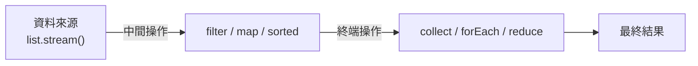

<div class="flex flex-col justify-center items-center h-full" style="background: #ffffff;">
  <p style="color: #5eada0; font-size: 1rem; font-weight: 600; letter-spacing: 0.2em; text-transform: uppercase; margin-bottom: 1.2rem;">Java Programming Masterclass</p>
  <h1 style="color: #1a5c5c; font-size: 3.2rem; font-weight: 900; line-height: 1.15; margin-bottom: 1.5rem;">Stream 與 Lambda</h1>
  <div style="height: 4px; width: 320px; background: linear-gradient(90deg, #5eada0, #a7d9d0); border-radius: 2px; margin-bottom: 1.5rem;"></div>
  <p style="color: #4a7c7c; font-size: 1.15rem; font-style: italic;">
    「用更少的程式碼，做更多的事」
  </p>
  <Link to="home" style="color: #9dc4c4; font-size: 0.85rem; margin-top: 2rem; text-decoration: none; letter-spacing: 0.05em;">← 返回目錄</Link>
</div>

---
layout: default
---

# Outline

- **第一部分：Lambda 運算式**
  - 語法形式、函數式介面
  - 常用內建介面：`Predicate`、`Function`、`Consumer`、`Supplier`
- **第二部分：方法參考 (Method Reference)**
  - `::` 運算子的四種形式
- **第三部分：Stream API**
  - 中間操作：`filter`、`map`、`sorted`、`distinct`...
  - 終端操作：`forEach`、`collect`、`reduce`、`count`...
  - `Collectors` 工具
- **實作練習**

---
layout: section
class: flex flex-col justify-center items-center text-center
---

# 第一部分
# Lambda 運算式

---

# 什麼是 Lambda？

Lambda 是 Java 8 引入的**匿名函式**語法，讓你不需要宣告完整的類別或方法，直接將「行為」當作參數傳遞。

- **精簡程式碼** — 取代冗長的匿名類別寫法
- **搭配集合框架** — 與 `List.forEach()`、`Stream` 等方法無縫整合
- **核心概念** — 讓 Java 支援函數式程式設計風格

<div class="mt-4 p-3 bg-blue-50 border-l-4 border-blue-400 text-gray-700 text-sm text-left">
💡 <b>基本語法：</b> <code>(參數列) -> 運算式 或 { 程式碼區塊 }</code>
</div>

---

# Lambda 語法形式

| 語法形式 | 範例 | 說明 |
| --- | --- | --- |
| 無參數 | `() -> "Hello"` | 小括號不可省略 |
| 單一參數 | `x -> x * 2` | 括號可省略 |
| 多個參數 | `(a, b) -> a + b` | 多參數需加括號 |
| 多行程式碼 | `(x) -> { ...; return x; }` | 需大括號與 `return` |

```java
Runnable r = () -> System.out.println("Hello!");
Consumer<Integer> dbl = x -> System.out.println(x * 2);
Comparator<Integer> cmp = (a, b) -> a - b;
```

---

# Lambda 語法 — 比較傳統寫法

```java
List<String> heroes = new ArrayList<>(
    List.of("炭治郎", "禰豆子", "善逸", "伊之助"));

// ❌ 傳統匿名類別寫法（冗長）
Collections.sort(heroes, new Comparator<String>() {
    public int compare(String a, String b) {
        return a.compareTo(b);
    }
});

// ✅ Lambda 寫法（簡潔）
Collections.sort(heroes, (a, b) -> a.compareTo(b));
```

---

# 函數式介面 (Functional Interface)

Lambda 實際上是**函數式介面的匿名實作**。函數式介面只含一個抽象方法。

```java
@FunctionalInterface
interface Greeting {
    String greet(String name);
}

// Lambda 直接實作介面
Greeting g = name -> "哈囉，" + name;
System.out.println(g.greet("炭治郎")); // 哈囉，炭治郎
```

<div class="mt-4 p-3 bg-blue-50 border-l-4 border-blue-400 text-gray-700 text-sm text-left">
💡 <code>@FunctionalInterface</code> 是可選的注解，但加上後若介面超過一個抽象方法，編譯器會立即報錯
</div>

---

# 常用內建函數式介面

| 介面 | 方法簽名 | 說明 |
| --- | --- | --- |
| `Predicate<T>` | `T -> boolean` | 判斷條件，回傳 true/false |
| `Function<T, R>` | `T -> R` | 輸入一個值，轉換後回傳 |
| `Consumer<T>` | `T -> void` | 接受一個值，執行操作（無回傳）|
| `Supplier<T>` | `() -> T` | 不接受參數，提供一個值 |
| `Comparator<T>` | `(T, T) -> int` | 比較兩個物件的大小 |
| `BiFunction<T,U,R>` | `(T, U) -> R` | 接受兩個參數，回傳結果 |

---

# 常用內建函數式介面 — 範例

```java
Predicate<Integer> isAdult = age -> age >= 18;
System.out.println(isAdult.test(20));  // true
System.out.println(isAdult.test(15));  // false

Function<String, Integer> len = s -> s.length();
System.out.println(len.apply("炭治郎")); // 3

Consumer<String> print = s -> System.out.println("★ " + s);
print.accept("鬼殺隊");                  // ★ 鬼殺隊

Supplier<String> title = () -> "無限列車";
System.out.println(title.get());        // 無限列車
```

---
layout: section
class: flex flex-col justify-center items-center text-center
---

# 第二部分
# 方法參考
# Method Reference

---

# 方法參考語法

`::` 運算子讓你直接引用現有的方法，讓程式碼更簡潔：

| 語法 | 說明 | 等同 Lambda |
| --- | --- | --- |
| `ClassName::staticMethod` | 靜態方法 | `x -> ClassName.method(x)` |
| `obj::instanceMethod` | 特定物件的方法 | `x -> obj.method(x)` |
| `ClassName::instanceMethod` | 任意物件的方法 | `x -> x.method()` |
| `ClassName::new` | 建構子 | `x -> new ClassName(x)` |

```java
List<String> heroes = List.of("炭治郎", "善逸", "伊之助");
heroes.forEach(System.out::println);      // obj::instanceMethod
heroes.stream().map(String::length);      // ClassName::instanceMethod
```

---
layout: section
class: flex flex-col justify-center items-center text-center
---

# 第三部分
# Stream API

---

# 什麼是 Stream？

`Stream` 是 Java 8 引入的**資料流處理管道**，讓集合操作可以宣告式地串接。

<div class="flex justify-center mt-4">



</div>

<div class="mt-4 p-3 bg-blue-50 border-l-4 border-blue-400 text-gray-700 text-sm text-left">
💡 <b>延遲執行：</b>中間操作不會立即執行，直到遇到終端操作才統一觸發。Stream 也<b>不修改</b>原始集合。
</div>

---

# Stream 的建立方式

| 方式 | 語法 | 說明 |
| --- | --- | --- |
| 從 Collection 建立 | `list.stream()` | 最常見的方式 |
| 從陣列建立 | `Arrays.stream(arr)` | 適用於基本型態陣列 |
| 直接建立 | `Stream.of(a, b, c)` | 直接指定元素 |

```java
List<String> list = List.of("A", "B", "C");
Stream<String> s1 = list.stream();

int[] arr = {1, 2, 3};
IntStream s2 = Arrays.stream(arr);
```

---

# 中間操作 (Intermediate Operations)

中間操作回傳新的 `Stream`，可以**串接多個**：

| 方法 | 說明 |
| --- | --- |
| `filter(Predicate)` | 篩選符合條件的元素 |
| `map(Function)` | 將每個元素轉換為另一種型態 |
| `sorted()` | 依自然順序排序 |
| `sorted(Comparator)` | 依自訂比較器排序 |
| `distinct()` | 移除重複元素（依 `equals`）|
| `limit(long n)` | 取前 n 個元素 |
| `skip(long n)` | 跳過前 n 個元素 |

---

# 中間操作 — 範例

```java
List<Integer> nums = List.of(5, 3, 1, 4, 2, 3, 5);

nums.stream()
    .filter(n -> n > 2)   // [5, 3, 4, 3, 5]
    .distinct()            // [5, 3, 4]
    .sorted()              // [3, 4, 5]
    .limit(2)              // [3, 4]
    .forEach(System.out::println);
// 輸出：3
//       4
```

---

# 終端操作 (Terminal Operations)

終端操作**結束 Stream 管道**，產生最終結果：

| 方法 | 說明 |
| --- | --- |
| `forEach(Consumer)` | 對每個元素執行操作（無回傳值）|
| `collect(Collector)` | 收集結果到集合中 |
| `reduce(identity, BinaryOperator)` | 將元素合併為單一值 |
| `count()` | 回傳元素數量 |
| `min(Comparator)` | 找最小值（回傳 `Optional`）|
| `max(Comparator)` | 找最大值（回傳 `Optional`）|
| `findFirst()` | 取得第一個元素（回傳 `Optional`）|

---

# 終端操作 — 範例

```java
List<Integer> scores = List.of(85, 72, 91, 60, 88, 95);

// count：計算 >= 80 的人數
long cnt = scores.stream().filter(s -> s >= 80).count(); // 4

// reduce：加總所有分數
int sum = scores.stream().reduce(0, Integer::sum);       // 491

// collect：篩選後收集
List<Integer> top = scores.stream()
    .filter(s -> s >= 80)
    .sorted()
    .collect(Collectors.toList());
System.out.println(top); // [85, 88, 91, 95]
```

---

# Collectors 常用工具

| 方法 | 說明 |
| --- | --- |
| `Collectors.toList()` | 收集為 `List` |
| `Collectors.joining(delimiter)` | 字串串接，可指定分隔符 |
| `Collectors.groupingBy(Function)` | 依條件分組，回傳 `Map` |

```java
List<String> names = List.of("炭治郎", "善逸", "伊之助");
String joined = names.stream()
    .collect(Collectors.joining("、"));
System.out.println(joined); // 炭治郎、善逸、伊之助
Map<Integer, List<String>> byLen = names.stream()
    .collect(Collectors.groupingBy(String::length));
```

---

# Stream 完整應用範例

```java
import java.util.*;
import java.util.stream.*;

List<Integer> scores = List.of(85, 72, 91, 60, 88, 95, 45);
// 取得所有及格（≥60）且高分（≥80）的成績，排序後輸出
List<Integer> result = scores.stream()
    .filter(s -> s >= 60)
    .filter(s -> s >= 80)
    .sorted()
    .collect(Collectors.toList());
System.out.println(result); // [85, 88, 91, 95]
int sum = scores.stream().reduce(0, Integer::sum);
System.out.println("總分：" + sum); // 536
```

---
layout: default
---

# 練習一：篩選與串接英雄名單
### 任務說明

宣告一個 `List<String>` 包含以下名字：
「炭治郎、禰豆子、善逸、伊之助、蜜璃、甘露寺、時透無一郎」

用 Stream 完成以下操作：
1. 篩選出名字長度 **≥ 3** 個字的人
2. 依字典順序排序
3. 用 `Collectors.joining("、")` 串接後印出一行字串

---

# 練習一：解題提示
### 提示說明

1. `filter(name -> name.length() >= 3)` 篩選
2. `sorted()` 依字典排序
3. `.collect(Collectors.joining("、"))` 串接為一行

```java
List<String> heroes = List.of(
    "炭治郎","禰豆子","善逸","伊之助","蜜璃","甘露寺","時透無一郎");
String result = heroes.stream()
    .filter(n -> n.length() >= 3)
    .sorted()
    .collect(Collectors.joining("、"));
System.out.println(result);
```

---
layout: default
---

# 練習二：成績串流統計
### 任務說明

宣告 `List<Integer>` 成績：`{45, 78, 90, 62, 55, 85, 91, 73}`

用 Stream 完成以下操作：
1. 計算及格（≥ 60）的人數
2. 找出所有成績中的最高分
3. 計算及格學生的平均分（提示：使用 `mapToInt().average()`）

---

# 練習二：解題提示
### 提示說明

1. `filter(...).count()` 計算數量
2. `max(Comparator.naturalOrder()).getAsInt()` 取最大值
3. 先 filter 再 `mapToInt(Integer::intValue).average()`

```java
List<Integer> s = List.of(45, 78, 90, 62, 55, 85, 91, 73);
long cnt = s.stream().filter(x -> x >= 60).count();
int max = s.stream().max(Comparator.naturalOrder()).get();
double avg = s.stream().filter(x -> x >= 60)
    .mapToInt(Integer::intValue).average().getAsDouble();
System.out.printf("及格：%d 人，最高：%d，平均：%.1f%n", cnt, max, avg);
```

---
layout: section
class: flex flex-col justify-center items-center text-center
---

# Q & A

---
layout: end
---

# 課程結束
### 掌握 Lambda 與 Stream，寫出更現代的 Java！
如有課後疑問，歡迎來信討論。
