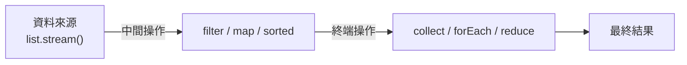

<div class="flex flex-col justify-center items-center h-full" style="background: #ffffff;">
  <p style="color: #5eada0; font-size: 1rem; font-weight: 600; letter-spacing: 0.2em; text-transform: uppercase; margin-bottom: 1.2rem;">Java Programming Masterclass</p>
  <h1 style="color: #1a5c5c; font-size: 3.2rem; font-weight: 900; line-height: 1.15; margin-bottom: 1.5rem;">Stream 與 Lambda</h1>
  <div style="height: 4px; width: 320px; background: linear-gradient(90deg, #5eada0, #a7d9d0); border-radius: 2px; margin-bottom: 1.5rem;"></div>
  <p style="color: #4a7c7c; font-size: 1.15rem; font-style: italic;">
    「用更少的程式碼，做更多的事」
  </p>
  <Link to="home" style="color: #9dc4c4; font-size: 0.85rem; margin-top: 2rem; text-decoration: none; letter-spacing: 0.05em;">← 返回目錄</Link>
</div>

<!--
【開場白】
大家好，今天我們要學的是「Stream 與 Lambda」，這是 Java 8 引入的現代化 API。

【為什麼要學這個？】
以前要對一個清單做「篩選、轉換、排序、統計」，要寫好幾個 for 迴圈。
Lambda 和 Stream 讓你用一行程式碼就能做到同樣的事，而且更易讀。

【今天學完你會能做什麼】
學完之後你能用 Lambda 把「行為」當參數傳遞，用 Stream 一行搞定複雜的集合操作。
這是現代 Java 開發的基礎能力，面試和實務都非常重要。
-->

---
layout: default
---

# Outline

- **第一部分：Lambda 運算式**
  - 語法形式、函數式介面
  - 常用內建介面：`Predicate`、`Function`、`Consumer`、`Supplier`
  - **JDK 11 新增**：Lambda 中的 `var` 參數
- **第二部分：方法參考 (Method Reference)**
  - `::` 運算子的四種形式
- **第三部分：Stream API**
  - 中間操作：`filter`、`map`、`flatMap`、`sorted`...
  - Primitive Stream：`mapToInt`、`mapToDouble`
  - **JDK 9 新增**：`takeWhile`、`dropWhile`
  - 終端操作：`forEach`、`collect`、`count`...
  - **JDK 16 新增**：簡潔的 `.toList()`
  - **JDK 12 新增**：`teeing` 收集器
  - `Collectors` 工具
- **實作練習**

<!--
【課程預覽】
這堂課分三大部分：Lambda 語法、方法參考（::），以及 Stream API。
最後有實戰練習和 LocalDate 的搭配應用。

【學習建議】
Lambda 和 Stream 是 Java 裡比較抽象的概念，第一次看可能覺得語法奇怪。
不要急，先跟著範例跑，熟悉之後你會覺得：「以前怎麼能沒有這個？」
-->

---
layout: section
class: flex flex-col justify-center items-center text-center
---

# 第一部分
# Lambda 運算式

<!--
【章節開場】
第一部分，Lambda。Lambda 是一種簡化程式碼的語法，讓你不需要寫完整的類別或方法，
直接把「行為」包成一個東西傳給別人用。
-->

---
layout: default
---

# 什麼是 Lambda？

Lambda 是 Java 8 引入的**匿名函式**語法，讓你不需要宣告完整的類別或方法，直接將「行為」當作參數傳遞。

- **精簡程式碼** — 取代冗長的匿名類別寫法
- **搭配集合框架** — 與 `List.forEach()`、`Stream` 等方法無縫整合
- **核心概念** — 讓 Java 支援函數式程式設計風格

<div class="mt-4 p-3 bg-blue-50 border-l-4 border-blue-400 text-gray-700 text-sm text-left">
💡 <b>基本語法：</b> <code>(參數列) -> 運算式 或 { 程式碼區塊 }</code>
</div>

<!--
【核心說明】
Lambda 是 Java 8 引入的「匿名函式」語法。
以前如果要把「一段行為」傳給方法，需要寫一個完整的匿名類別，非常冗長。Lambda 讓你用幾個字就寫完。

【生活化比喻】
以前你要告訴工廠「排序規則」，需要遞交一份完整的合約（匿名類別）。
Lambda 就像直接說：「比大小就用 (a, b) -> a - b 這個規則」，免去所有繁文縟節。

⚠️ 學生常見誤解：
Lambda 不是新的資料型別，它是「函數式介面的實作」的語法糖，底層還是一個物件。

💼 業界實務：
Lambda 和 Stream 結合是現代 Java 程式碼的標誌，看懂業界的 Java 程式碼，Lambda 是必備知識。
-->

---

# Lambda 語法形式

| 語法形式 | 範例 | 說明 |
| --- | --- | --- |
| 無參數 | `() -> "Hello"` | 小括號不可省略 |
| 單一參數 | `x -> x * 2` | 括號可省略 |
| 多個參數 | `(a, b) -> a + b` | 多參數需加括號 |
| 多行程式碼 | `(x) -> { ...; return x; }` | 需大括號與 `return` |

```java
Runnable r = () -> System.out.println("Hello!");
Consumer<Integer> dbl = x -> System.out.println(x * 2);
Comparator<Integer> cmp = (a, b) -> a - b;
```

<!--
【核心說明】
Lambda 的語法有幾種形式，依照參數數量和程式碼行數而不同。

【帶著讀這張表】
無參數：`() -> "Hello"` — 括號不能省略，因為要告訴 Java「這裡沒有參數」。
單一參數：`x -> x * 2` — 括號可以省略，最簡潔的形式。
多個參數：`(a, b) -> a + b` — 多個參數必須加括號。
多行程式碼：需要大括號和 `return`，就像普通方法一樣。

⚠️ 學生常見誤解：
多行 Lambda 忘記加 `return` 是很常見的錯誤。只要有大括號，就必須明確寫 `return`。

💼 業界實務：
業界偏好讓 Lambda 保持簡短（1-2 行），如果邏輯複雜，通常會抽成獨立方法再用方法參考引用。
-->

---

# Lambda 語法 — 比較傳統寫法

```java
List<String> heroes = new ArrayList<>(
    List.of("炭治郎", "禰豆子", "善逸", "伊之助"));

// ❌ 傳統匿名類別寫法（冗長）
Collections.sort(heroes, new Comparator<String>() {
    public int compare(String a, String b) {
        return a.compareTo(b);
    }
});

// ✅ Lambda 寫法（簡潔）
Collections.sort(heroes, (a, b) -> a.compareTo(b));
```

<!--
【帶讀程式碼前的鋪陳】
這段程式碼直接比較「傳統匿名類別」和「Lambda」兩種寫法，讓你一眼看出差異。

【逐步解說】
傳統寫法：`new Comparator<String>() { public int compare(...) { ... } }`
光是要傳入一個排序規則，就要寫這麼多行，而且大半都是「樣版程式碼」（不是你真正想說的話）。

Lambda 寫法：`(a, b) -> a.compareTo(b)`
同樣的規則，一行搞定。你只需要說「比較方式是什麼」，不需要說「我是哪個介面的實作」。

⚠️ 學生常見誤解：
兩段程式碼做的是完全相同的事，只是寫法不同。Lambda 是語法糖，不是新功能。

💼 業界實務：
現代 Java 程式碼裡幾乎看不到匿名類別，全部都用 Lambda 取代了。
-->

---

# 函數式介面 (Functional Interface)

Lambda 實際上是**函數式介面的匿名實作**。函數式介面只含一個抽象方法。

```java
@FunctionalInterface
interface Greeting {
    String greet(String name);
}

// Lambda 直接實作介面
Greeting g = name -> "哈囉，" + name;
System.out.println(g.greet("炭治郎")); // 哈囉，炭治郎
```

<div class="mt-4 p-3 bg-blue-50 border-l-4 border-blue-400 text-gray-700 text-sm text-left">
💡 <code>@FunctionalInterface</code> 是可選的注解，但加上後若介面超過一個抽象方法，編譯器會立即報錯
</div>

<!--
【核心說明】
Lambda 能用是因為它實作了「函數式介面」（Functional Interface）——只有一個抽象方法的介面。

【生活化比喻】
函數式介面就像一個只有一個空格的合約：`______`（填入你的行為）。
Lambda 就是你填入的那段內容。因為只有一個空格，Java 知道 Lambda 要填哪裡。

【程式世界怎麼用】
`@FunctionalInterface` 是可選的注解，但加上後如果介面有超過一個抽象方法，編譯器會立即報錯，
可以防止你不小心破壞它的「函數式」本質。

⚠️ 學生常見誤解：
如果介面有兩個以上的抽象方法，Lambda 就不能用了，因為 Java 不知道你要實作哪一個。

💼 業界實務：
Java 標準庫裡有大量內建的函數式介面（下一張），你通常不需要自己寫。
-->

---

# 常用內建函數式介面

| 介面 | 方法簽名 | 說明 |
| --- | --- | --- |
| `Predicate<T>` | `T -> boolean` | 判斷條件，回傳 true/false |
| `Function<T, R>` | `T -> R` | 輸入一個值，轉換後回傳 |
| `Consumer<T>` | `T -> void` | 接受一個值，執行操作（無回傳）|
| `Supplier<T>` | `() -> T` | 不接受參數，提供一個值 |
| `Comparator<T>` | `(T, T) -> int` | 比較兩個物件的大小 |
| `BiFunction<T,U,R>` | `(T, U) -> R` | 接受兩個參數，回傳結果 |

<!--
【核心說明】
Java 在 `java.util.function` 套件裡提供了幾個常用的函數式介面，幾乎涵蓋了所有「Lambda 的使用場景」。

【帶著讀這張表】
Predicate — 「判斷用」，輸入一個值，輸出 true/false（例如：`age -> age >= 18`）
Function — 「轉換用」，輸入一個值，輸出另一個值（例如：`s -> s.length()`）
Consumer — 「消費用」，輸入一個值，執行操作但沒有回傳值（例如：印出來）
Supplier — 「供應用」，不接受參數，提供一個值（例如：`() -> "預設值"`）

⚠️ 學生常見誤解：
很多初學者背這些介面名稱，但更重要的是理解「什麼時候需要哪種介面」。
遇到需要 Lambda 的地方，看方法簽名要求的是哪個介面，再決定怎麼寫。

💼 業界實務：
Stream API 的方法大量使用這些介面：`filter` 用 `Predicate`，`map` 用 `Function`，`forEach` 用 `Consumer`。
-->

---

# 常用內建函數式介面 — 範例

```java
Predicate<Integer> isAdult = age -> age >= 18;
System.out.println(isAdult.test(20));  // true
System.out.println(isAdult.test(15));  // false

Function<String, Integer> len = s -> s.length();
System.out.println(len.apply("炭治郎")); // 3

Consumer<String> print = s -> System.out.println("★ " + s);
print.accept("鬼殺隊");                  // ★ 鬼殺隊

Supplier<String> title = () -> "無限列車";
System.out.println(title.get());        // 無限列車
```

<!--
【帶讀程式碼前的鋪陳】
來看每種函數式介面的實際用法，用 Lambda 實作各種不同的行為。

【逐步解說】
`Predicate<Integer> isAdult` — 判斷是否成年，`test(20)` 傳入值，回傳 true/false。
`Function<String, Integer> len` — 把字串轉換成長度（整數），`apply("炭治郎")` 回傳 3。
`Consumer<String> print` — 接收字串，印出帶 ★ 的版本，`accept("鬼殺隊")` 不回傳值。
`Supplier<String> title` — 不接受參數，直接提供一個字串值，`get()` 回傳 "無限列車"。

⚠️ 學生常見誤解：
每個介面呼叫的方法名稱不一樣：Predicate 用 `test()`，Function 用 `apply()`，Consumer 用 `accept()`，Supplier 用 `get()`。

💼 業界實務：
這些介面在 Stream API 裡會大量出現，熟悉它們讓你看懂 Stream 程式碼事半功倍。
-->

---

# Lambda 中的 var 參數 (JDK 11)

自 Java 11 起，Lambda 參數可以使用 `var` 關鍵字，這讓語法更一致：

| 範例 | 說明 |
| --- | --- |
| `(var x, var y) -> x + y` | 所有參數都必須使用 `var` |
| `(@NonNull var x) -> ...` | **主要用途：** 方便在參數上加上註解（Annotation） |

```java
// 傳統寫法
(String s) -> s.toLowerCase()

// JDK 11 使用 var
(var s) -> s.toLowerCase()

// 搭配註解（必須使用類型或 var）
(@Nonnull var s) -> s.toLowerCase()
```

<div class="mt-4 p-3 bg-blue-50 border-l-4 border-blue-400 text-gray-700 text-sm text-left">
💡 <b>規則：</b> 不能混用，例如 <code>(var x, y) -> ...</code> 是不允許的。
</div>

<!--
【核心說明】
Java 11 讓 Lambda 參數可以用 `var` 關鍵字，讓語法更統一。

【程式世界怎麼用】
主要用途是讓你在 Lambda 參數上加注解（Annotation），例如 `@Nonnull`。
不加注解的話，直接省略型別（`s -> s.toLowerCase()`）反而更簡潔。

⚠️ 學生常見誤解：
不能混用！`(var x, y) -> ...` 是不允許的，要嘛全部用 `var`，要嘛全部省略型別。

💼 業界實務：
這個語法在業界不常見，主要是工具鏈（例如 null 安全分析工具）需要在 Lambda 參數上加注解時才會用到。
-->

---
layout: section
class: flex flex-col justify-center items-center text-center
---

# 第二部分
# 方法參考
# Method Reference

<!--
【章節開場】
第二部分，方法參考。這是 Lambda 的「進階語法糖」：
當你的 Lambda 只是「呼叫某個現有方法」，可以用 `::` 運算子直接引用那個方法，更簡潔。
-->

---
layout: default
---

# 方法參考語法

`::` 運算子讓你直接引用現有的方法，讓程式碼更簡潔：

| 語法 | 說明 | 等同 Lambda |
| --- | --- | --- |
| `ClassName::staticMethod` | 靜態方法 | `x -> ClassName.method(x)` |
| `obj::instanceMethod` | 特定物件的方法 | `x -> obj.method(x)` |
| `ClassName::instanceMethod` | 任意物件的方法 | `x -> x.method()` |
| `ClassName::new` | 建構子 | `x -> new ClassName(x)` |

```java
List<String> heroes = List.of("炭治郎", "善逸", "伊之助");
heroes.forEach(System.out::println);      // obj::instanceMethod
heroes.stream().map(String::length);      // ClassName::instanceMethod
```

<!--
【核心說明】
`::` 運算子讓你直接引用現有方法，有四種形式。

【帶著讀這張表】
`ClassName::staticMethod` — 引用靜態方法，等於 `x -> ClassName.method(x)`
`obj::instanceMethod` — 引用特定物件的方法，等於 `x -> obj.method(x)`
`ClassName::instanceMethod` — 引用任意物件自己的方法，等於 `x -> x.method()`
`ClassName::new` — 引用建構子，等於 `x -> new ClassName(x)`

【生活化比喻】
Lambda 是你直接描述動作：「把每個元素印出來」。
方法參考是你引用一個已經存在的動作：「用那個叫做 println 的方法來做」。

⚠️ 學生常見誤解：
`System.out::println` 是第二種形式（引用特定物件 `System.out` 的方法），不是第一種靜態方法。

💼 業界實務：
`forEach(System.out::println)` 是最常見的示範，但業界更常見的是 `map(String::length)` 這類資料轉換。
-->

---

# 方法參考 — 四種形式範例

```java
// 1. ClassName::staticMethod
List.of("1","2").stream().map(Integer::parseInt);
// 2. obj::instanceMethod
List.of("炭治郎","善逸").forEach(System.out::println);
// 3. ClassName::instanceMethod
List.of("炭","治郎").stream().map(String::length);
// 4. ClassName::new
Stream.of(1,2,3).collect(Collectors.toCollection(ArrayList::new));
```

<!--
【帶讀程式碼前的鋪陳】
四種方法參考的形式，每一行都有對應的例子，跟著看。

【逐步解說】
1. `Integer::parseInt` — 靜態方法，等於 `s -> Integer.parseInt(s)`
2. `System.out::println` — 特定物件的方法（System.out 這個物件的 println）
3. `String::length` — 任意 String 物件自己的 `length()` 方法，等於 `s -> s.length()`
4. `ArrayList::new` — 建構子參考，等於 `() -> new ArrayList()`

⚠️ 學生常見誤解：
第三種（`ClassName::instanceMethod`）是「任意那個型別的物件自己呼叫方法」，
Stream 裡的元素就是那個「物件」，`map(String::length)` 等於對每個字串呼叫 `.length()`。

💼 業界實務：
方法參考的主要好處是提升可讀性，讓程式碼更像「在描述做什麼」而不是「怎麼做」。
-->

---
layout: section
class: flex flex-col justify-center items-center text-center
---

# 第三部分
# Stream API

<!--
【章節開場】
第三部分，Stream API。有了 Lambda 的基礎，現在來學 Stream——
它讓你用「管道」的方式，對集合做一連串操作。
-->

---
layout: default
---

# 什麼是 Stream？

`Stream` 是 Java 8 引入的**資料流處理管道**，讓集合操作可以宣告式地串接。

<div class="flex justify-center mt-4">



</div>

<div class="mt-4 p-3 bg-blue-50 border-l-4 border-blue-400 text-gray-700 text-sm text-left">
💡 <b>延遲執行：</b>中間操作不會立即執行，直到遇到終端操作才統一觸發。Stream 也<b>不修改</b>原始集合。
</div>

<!--
【核心說明】
Stream 是 Java 8 引入的「資料流處理管道」，讓集合操作可以宣告式地串接。

【看圖前的引導】
這張圖顯示 Stream 的三個組成部分：資料來源 → 中間操作（可串接多個）→ 終端操作。

【逐步帶著看】
資料來源：`list.stream()` 把集合轉成 Stream。
中間操作：`filter`、`map`、`sorted` 等，每個都回傳新的 Stream，可以一直串。
終端操作：`collect`、`forEach`、`count` 等，會觸發真正的計算並輸出結果。

⚠️ 學生常見誤解：
Stream 是**延遲執行**的！中間操作不會立刻跑，直到遇到終端操作才一起執行。
Stream 也**不修改原始集合**，每個操作都回傳新的 Stream。

💼 業界實務：
Stream 的延遲執行特性讓它在處理大量資料時很有效率，可以提早短路（例如 `findFirst()`）。
-->

---

# Stream 的建立方式

| 方式 | 語法 | 說明 |
| --- | --- | --- |
| 從 Collection 建立 | `list.stream()` | 最常見的方式 |
| 從陣列建立 | `Arrays.stream(arr)` | 適用於基本型態陣列 |
| 直接建立 | `Stream.of(a, b, c)` | 直接指定元素 |

```java
List<String> list = List.of("A", "B", "C");
Stream<String> s1 = list.stream();

int[] arr = {1, 2, 3};
IntStream s2 = Arrays.stream(arr);
```

<!--
【核心說明】
建立 Stream 有三種常見方式，最常用的是從 Collection 建立。

【帶著讀這張表】
從 Collection：`list.stream()` — 最常見，把現有集合轉成 Stream。
從陣列：`Arrays.stream(arr)` — 處理基本型態陣列時用（`int[]`、`double[]`）。
直接建立：`Stream.of(a, b, c)` — 快速建立一個有固定元素的 Stream。

⚠️ 學生常見誤解：
`int[]` 陣列不能用 `stream()` 方法（陣列沒有這個方法），要用 `Arrays.stream(arr)` 才能取得 `IntStream`。

💼 業界實務：
業界最常見的是 `list.stream()`。直接用 `Stream.of()` 通常只在測試或示範程式碼中出現。
-->

---

# 中間操作 (Intermediate Operations)

中間操作回傳新的 `Stream`，可以**串接多個**：

| 方法 | 說明 |
| --- | --- |
| `filter(Predicate)` | 篩選符合條件的元素 |
| `map(Function)` | 將每個元素轉換為另一種型態 |
| `sorted()` | 依自然順序排序 |
| `sorted(Comparator)` | 依自訂比較器排序 |
| `distinct()` | 移除重複元素（依 `equals`）|
| `limit(long n)` | 取前 n 個元素 |
| `skip(long n)` | 跳過前 n 個元素 |
| `flatMap(Function)` | 將每個元素展開為 Stream 再合併（攤平巢狀結構）|

<!--
【核心說明】
中間操作回傳新的 Stream，可以無限串接，這是 Stream 最強大的特性。

【帶著讀這張表】
`filter` — 篩選，保留符合條件的元素（像 SQL 的 WHERE）
`map` — 轉換，把每個元素變成另一種型態（像 SQL 的 SELECT）
`sorted` — 排序
`distinct` — 去重複（像 SQL 的 DISTINCT）
`limit(n)` — 只取前 n 個
`skip(n)` — 跳過前 n 個
`flatMap` — 攤平巢狀結構（下一張詳細講）

⚠️ 學生常見誤解：
中間操作是「描述性的」——你只是在說「要怎麼處理」，不是真的在處理。
真正的執行要等到終端操作出現才會發生。

💼 業界實務：
`filter + map + collect` 這個組合是業界最常見的 Stream 使用模式，例如「篩選活躍用戶，取出 ID 清單」。
-->

---

# 中間操作 — 範例

```java
List<Integer> nums = List.of(5, 3, 1, 4, 2, 3, 5);

nums.stream()
    .filter(n -> n > 2)   // [5, 3, 4, 3, 5]
    .distinct()            // [5, 3, 4]
    .sorted()              // [3, 4, 5]
    .limit(2)              // [3, 4]
    .forEach(System.out::println);
// 輸出：3
//       4
```

<!--
【帶讀程式碼前的鋪陳】
這段程式碼示範多個中間操作串接，跟著我一步一步看每個操作做了什麼事。

【逐步解說】
起始：`[5, 3, 1, 4, 2, 3, 5]`
`filter(n -> n > 2)` — 篩掉 ≤ 2 的，剩 `[5, 3, 4, 3, 5]`
`distinct()` — 去重複，剩 `[5, 3, 4]`
`sorted()` — 升序排序，得 `[3, 4, 5]`
`limit(2)` — 只取前兩個，得 `[3, 4]`
`forEach(System.out::println)` — 終端操作，印出 3 和 4。

⚠️ 學生常見誤解：
操作是有順序的！先 filter 再 distinct 和先 distinct 再 filter，結果可能不同，效能也不同。

💼 業界實務：
把 `filter` 放在最前面（先過濾再轉換），可以減少後面操作的工作量，是效能最佳化的基本技巧。
-->

---

# flatMap — 攤平巢狀結構

將「集合中的集合」攤平為單一串流：

```java
List<List<String>> nested = List.of(
    List.of("水柱", "炭治郎"),
    List.of("雷柱", "善逸")
);
List<String> flat = nested.stream()
    .flatMap(List::stream)
    .toList();
System.out.println(flat); // [水柱, 炭治郎, 雷柱, 善逸]
```

<!--
【核心說明】
`flatMap` 用來「攤平」巢狀結構——把「裡面裝著集合的集合」，展開成單一層。

【生活化比喻】
你有幾個班級（List），每個班級有幾個學生（List）。
`map` 會讓你得到「班級的 Stream（裡面還是班級）」。
`flatMap` 讓你直接得到「所有學生的 Stream」，把兩層合成一層。

【程式世界怎麼用】
`nested.stream().flatMap(List::stream).toList()` — 把 `List<List<String>>` 攤平成 `List<String>`。

⚠️ 學生常見誤解：
`map` 會保留結構，`flatMap` 會攤平結構。如果用 `map(List::stream)` 會得到 `Stream<Stream<String>>`，不是你要的。

💼 業界實務：
處理「多對多關係」（例如用戶有多個訂單，訂單有多個商品，要取得所有商品）就需要 `flatMap`。
-->

---

# Primitive Stream (基本型態串流)

`map()` 回傳 `Stream<T>`；若需統計數值，改用 `mapToInt`、`mapToDouble`：

| 方法 | 回傳型態 | 常用終端操作 |
| --- | --- | --- |
| `mapToInt(ToIntFunction)` | `IntStream` | `sum()`、`average()`、`min()`、`max()` |
| `mapToDouble(ToDoubleFunction)` | `DoubleStream` | 同上（回傳 double）|

```java
List<String> names = List.of("炭治郎", "禰豆子", "善逸");
double avg = names.stream()
    .mapToInt(String::length).average().getAsDouble();
System.out.println(avg); // 2.333...
```

<!--
【核心說明】
`mapToInt`、`mapToDouble` 把 Stream 轉換成「基本型態 Stream」，可以直接呼叫 `sum()`、`average()` 等統計方法。

【生活化比喻】
一般的 `map` 像把蘋果換成橘子（物件換物件）。
`mapToInt` 像把蘋果換成數字（物件換整數），換了之後才能做加總、平均這類數學運算。

【程式世界怎麼用】
`names.stream().mapToInt(String::length).average()` — 把每個名字換成長度（整數），然後算平均值。

⚠️ 學生常見誤解：
`average()` 回傳的是 `OptionalDouble`（因為空 Stream 沒有平均值），要用 `.getAsDouble()` 取出值，或用 `.orElse(0)` 給預設值。

💼 業界實務：
在做成績統計、財務計算時，`mapToInt().sum()` 和 `.average()` 是最直接的方式。
-->

---

# 有序串流的斷句處理 (JDK 9)

JDK 9 新增了兩個處理有序（Sorted）串流的強大工具：

| 方法 | 說明 |
| --- | --- |
| `takeWhile(Predicate)` | 從頭開始取，直到條件**不成立**就停止 |
| `dropWhile(Predicate)` | 從頭開始丟，直到條件**不成立**才開始取 |

```java
List<Integer> nums = List.of(1, 2, 3, 4, 5, 4, 3, 2, 1);

// takeWhile: 取出 < 4 的元素（遇到 4 即停止）
nums.stream().takeWhile(n -> n < 4); // [1, 2, 3]

// dropWhile: 丟掉 < 4 的元素（遇到 4 才開始取）
nums.stream().dropWhile(n -> n < 4); // [4, 5, 4, 3, 2, 1]
```

<div class="mt-4 p-3 bg-blue-50 border-l-4 border-blue-400 text-gray-700 text-sm text-left">
💡 <b>與 filter 的不同：</b> filter 會檢查「所有」元素；takeWhile 只要條件一失敗就立刻收工。
</div>

<!--
【核心說明】
JDK 9 新增了兩個用於有序 Stream 的「早停工具」：`takeWhile` 和 `dropWhile`。

【生活化比喻】
你在讀一本按分數排序的排行榜，只想看 80 分以上的：
`takeWhile(n -> n >= 80)` — 從第一名開始看，一遇到低於 80 分的就停下來（不繼續往下看）。
`dropWhile(n -> n < 80)` — 跳過所有低於 80 分的，從第一個 80 分開始取。

⚠️ 學生常見誤解：
`takeWhile` 和 `filter` 的差別：`filter` 會檢查**所有**元素；`takeWhile` 一旦條件不成立就立刻停止，不再看後面的元素。
所以 `takeWhile` 對於有序的 Stream 效率更高。

💼 業界實務：
處理「已排序的日誌」或「分頁資料」時，`takeWhile` 可以讓你不需要讀取全部資料就提早結束。
-->

---

# 終端操作 (Terminal Operations)

終端操作**結束 Stream 管道**，產生最終結果：

| 方法 | 說明 |
| --- | --- |
| `forEach(Consumer)` | 對每個元素執行操作（無回傳值）|
| `collect(Collector)` | 收集結果到集合中 |
| `reduce(identity, BinaryOperator)` | 將元素合併為單一值 |
| `count()` | 回傳元素數量 |
| `min(Comparator)` | 找最小值（回傳 `Optional`）|
| `max(Comparator)` | 找最大值（回傳 `Optional`）|
| `findFirst()` | 取得第一個元素（回傳 `Optional`）|

<!--
【核心說明】
終端操作結束 Stream 管道，產生最終結果。這是 Stream「真正做事」的一步。

【帶著讀這張表】
`forEach` — 對每個元素執行操作，常用於「印出來」或「儲存到資料庫」
`collect` — 把 Stream 結果收集到集合（List、Map 等），最常用
`reduce` — 把所有元素合併成一個值（例如加總）
`count` — 計算元素數量
`min`/`max` — 找最小/最大值，回傳 Optional
`findFirst` — 取第一個元素，回傳 Optional

⚠️ 學生常見誤解：
`forEach` 後面不能再串其他操作了，因為它是**終端操作**，Stream 已經結束。

💼 業界實務：
`collect(Collectors.toList())` 是最常見的終端操作（JDK 16 可以用更簡潔的 `.toList()`）。
-->

---

# 終端操作 — 範例

```java
List<Integer> scores = List.of(85, 72, 91, 60, 88, 95);

// count：計算 >= 80 的人數
long cnt = scores.stream().filter(s -> s >= 80).count(); // 4

// reduce：加總所有分數
int sum = scores.stream().reduce(0, Integer::sum);       // 491

// collect：篩選後收集
List<Integer> top = scores.stream()
    .filter(s -> s >= 80)
    .sorted()
    .collect(Collectors.toList());
System.out.println(top); // [85, 88, 91, 95]
```

<!--
【帶讀程式碼前的鋪陳】
這段程式碼示範終端操作的三種常見用法：計數、加總、篩選後收集。

【逐步解說】
`filter(s -> s >= 80).count()` — 篩選及格後計數，回傳 4（85, 91, 88, 95 共四個）。
`reduce(0, Integer::sum)` — 從 0 開始，每次把目前值和下一個元素相加，最終結果是總分 491。
`filter(s -> s >= 80).sorted().collect(Collectors.toList())` — 篩選 ≥ 80 的、排序、收集成 List。

⚠️ 學生常見誤解：
`reduce(0, Integer::sum)` 的第一個參數 `0` 是「初始值」，不是「從第幾個開始」。
就算 Stream 是空的，也會回傳 0。

💼 業界實務：
`filter + sorted + collect` 這個組合在業界幾乎無處不在，是 Stream 最常見的使用模式之一。
-->

---

# Optional — 安全的可能空值

`min()`、`max()`、`findFirst()` 回傳 `Optional<T>`，代表「可能有值、也可能沒有」：

| 方法 | 說明 |
| --- | --- |
| `isPresent()` | 有值時回傳 `true` |
| `get()` | 取得值（無值時拋出異常）|
| `orElse(T default)` | 無值時回傳預設值 |
| `orElseGet(Supplier)` | 無值時呼叫 Supplier |

```java
Optional<Integer> max = List.of(3, 1, 5).stream()
    .max(Comparator.naturalOrder());
System.out.println(max.isPresent()); // true
System.out.println(max.orElse(-1));  // 5
```

<!--
【核心說明】
`min()`、`max()`、`findFirst()` 都回傳 `Optional<T>`——一個「可能有值、也可能是空的」容器。

【生活化比喻】
Optional 就像一個快遞包裹：快遞員告訴你「有包裹」（isPresent）。
你可以打開拿取（get），或是說「沒有的話給我預設值」（orElse）。

【程式世界怎麼用】
- `isPresent()` — 確認有沒有值
- `get()` — 取得值（沒有值時拋出例外，危險！）
- `orElse(default)` — 沒有值時回傳預設值（安全）
- `orElseGet(Supplier)` — 沒有值時呼叫 Supplier 計算預設值

⚠️ 學生常見誤解：
不要直接呼叫 `get()` 而不先確認 `isPresent()`，空 Optional 呼叫 `get()` 會拋出 NoSuchElementException。
**習慣用 `orElse()` 或 `orElseGet()`。**

💼 業界實務：
Optional 在業界也用來作為方法回傳型別，表示「這個方法可能找不到結果」，比直接回傳 null 更安全。
-->

---

# Stream 轉 List 的捷徑 (JDK 16)

以往將 Stream 轉回 List 需要寫一段冗長的語法，JDK 16 提供了優雅的捷徑：

| 版本 | 語法 | 備註 |
| --- | --- | --- |
| Java 8+ | `.collect(Collectors.toList())` | 回傳的可變性視實作而定 |
| **Java 16+** | **`.toList()`** | 回傳一個**不可變** (Unmodifiable) 的 List |

```java
List<String> list = Stream.of("A", "B", "C").toList();
// 等同於舊版的 .collect(Collectors.toList()) 但更簡潔！
```

<!--
【核心說明】
JDK 16 新增了超級簡潔的 `.toList()` 方法，取代原本冗長的 `collect(Collectors.toList())`。

【生活化比喻】
就像以前要說「把這些東西裝進袋子，用標準的收納方式」，現在可以直接說「收起來」。

⚠️ 學生常見誤解：
`.toList()` 回傳的是**不可變**的 List（不能 add/remove）。
如果你需要可修改的 List，還是要用 `collect(Collectors.toList())`。

💼 業界實務：
新專案（Java 16+）都用 `.toList()`，舊專案還是用 `collect(Collectors.toList())`。
面試或工作中遇到這兩種都要看得懂。
-->

---

# 技巧：快速反轉條件 (JDK 11)

使用 `Predicate.not()` 讓過濾邏輯讀起來更像英文，提升程式碼可讀性：

```java
List<String> lines = List.of("A", " ", "B", "");

// 傳統寫法：過濾掉空白（邏輯較不明確）
lines.stream().filter(s -> !s.isBlank());

// JDK 11 寫法：過濾「不是空白」的字串
lines.stream().filter(Predicate.not(String::isBlank));
```

<div class="mt-4 p-3 bg-blue-50 border-l-4 border-blue-400 text-gray-700 text-sm text-left">
💡 <b>搭配方法參考：</b> 這種寫法特別適合與 <code>ClassName::methodName</code> 結合使用。
</div>

<!--
【核心說明】
JDK 11 的 `Predicate.not()` 讓你用更易讀的方式表達「不是 X 的元素」。

【生活化比喻】
以前你說：「給我不是空的那些」（`!s.isBlank()`）— 邏輯有點繞。
現在你說：「給我不是空白的」（`Predicate.not(String::isBlank)`）— 直接表達你想要什麼。

⚠️ 學生常見誤解：
`s -> !s.isBlank()` 和 `Predicate.not(String::isBlank)` 功能完全相同，
`Predicate.not()` 的優勢在於搭配方法參考時更易讀。

💼 業界實務：
程式碼的可讀性很重要，`Predicate.not()` 讓程式碼更接近自然語言，在 Code Review 時更容易理解。
-->

---

# Collectors 常用工具

| 方法 | 說明 |
| --- | --- |
| `Collectors.toList()` | 收集為 `List` |
| `Collectors.joining(delimiter)` | 字串串接，可指定分隔符 |
| `Collectors.groupingBy(Function)` | 依條件分組，回傳 `Map` |

```java
List<String> names = List.of("炭治郎", "善逸", "伊之助");
String joined = names.stream()
    .collect(Collectors.joining("、"));
System.out.println(joined); // 炭治郎、善逸、伊之助
Map<Integer, List<String>> byLen = names.stream()
    .collect(Collectors.groupingBy(String::length));
```

<!--
【核心說明】
`Collectors` 類別提供各種「收集器」，決定 Stream 的結果要放進什麼容器或做什麼彙整。

【帶著讀這張表】
`toList()` — 收集成 List（最常用）
`joining(delimiter)` — 把字串串接成一個長字串，可指定分隔符
`groupingBy(Function)` — 按條件分組，回傳 `Map<K, List<V>>`

【程式世界怎麼用】
`Collectors.joining("、")` — 把 `["炭治郎", "善逸", "伊之助"]` 串成 `"炭治郎、善逸、伊之助"`。
`Collectors.groupingBy(String::length)` — 按字串長度分組，相同長度的名字放在同一個 List 裡。

💼 業界實務：
`groupingBy` 是業界做「分類統計」最常用的工具，例如「按部門分組員工」或「按分數段分組學生」。
-->

---

# 雙向收集器：teeing (JDK 12)

`Collectors.teeing` 允許你將同一個串流分流給兩個收集器，最後再將結果合併：

```java
// 範例：同時計算「及格人數」與「平均分數」
var result = Stream.of(85, 45, 90, 62)
    .collect(Collectors.teeing(
        Collectors.filtering(s -> s >= 60, Collectors.count()), // 收集器 1
        Collectors.averagingInt(s -> s),                         // 收集器 2
        (count, avg) -> "及格人數：" + count + "，平均：" + avg   // 合併邏輯
    ));
System.out.println(result); // 及格人數：3，平均：70.5
```

<div class="mt-4 p-3 bg-blue-50 border-l-4 border-blue-400 text-gray-700 text-sm text-left">
💡 <b>設計目的：</b> 避免為了得到多個統計結果而對同一個集合進行多次 Stream 操作。
</div>

<!--
【帶讀程式碼前的鋪陳】
`Collectors.teeing` 是 JDK 12 的新工具，讓你同時做兩種收集，再合併結果。

【逐步解說】
這段程式碼同時計算「及格人數」和「平均分數」，不需要對同一個集合做兩次 Stream 操作。
`Collectors.filtering(s -> s >= 60, Collectors.count())` — 收集器 1：過濾及格的，計數。
`Collectors.averagingInt(s -> s)` — 收集器 2：計算所有分數的平均（包含不及格）。
`(count, avg) -> "及格人數：" + count + "，平均：" + avg` — 把兩個結果合併成一個字串。

⚠️ 學生常見誤解：
注意第二個收集器算的是**所有**分數的平均（不是只算及格的），因為 Stream 資料在兩個收集器之間是共享的。

💼 業界實務：
`teeing` 在需要同時計算多個統計數字時非常有用，可以避免重複掃描同一個資料集。
-->

---

# Stream 完整應用範例

```java
import java.util.*;
import java.util.stream.*;

List<Integer> scores = List.of(85, 72, 91, 60, 88, 95, 45);
// 取得所有及格（≥60）且高分（≥80）的成績，排序後輸出
List<Integer> result = scores.stream()
    .filter(s -> s >= 60)
    .filter(s -> s >= 80)
    .sorted()
    .collect(Collectors.toList());
System.out.println(result); // [85, 88, 91, 95]
int sum = scores.stream().reduce(0, Integer::sum);
System.out.println("總分：" + sum); // 536
```

<!--
【帶讀程式碼前的鋪陳】
這段是完整的 Stream 應用範例，把我們學過的所有操作串在一起，看看實際效果。

【逐步解說】
`filter(s -> s >= 60)` — 篩掉不及格的（45 被移除）。
`.filter(s -> s >= 80)` — 再篩一次，只留高分的。
`.sorted()` — 升序排序。
`.collect(Collectors.toList())` — 收集結果。
最後 `reduce(0, Integer::sum)` 計算所有分數的總和。

⚠️ 學生常見誤解：
兩個 `filter` 可以合併成一個：`.filter(s -> s >= 60 && s >= 80)` 等於直接 `.filter(s -> s >= 80)`。
但分開寫更清楚，各有優劣。

💼 業界實務：
真實業務邏輯的 Stream 鏈可能很長，通常會換行讓每個操作單獨一行，方便閱讀和維護。
-->

---
layout: default
---

# 練習一：篩選與串接英雄名單
### 任務說明

宣告一個 `List<String>` 包含以下名字：
「炭治郎、禰豆子、善逸、伊之助、蜜璃、甘露寺、時透無一郎」

用 Stream 完成以下操作：
1. 篩選出名字長度 **≥ 3** 個字的人
2. 依字典順序排序
3. 用 `Collectors.joining("、")` 串接後印出一行字串

<!--
【出題前的鋪陳】
第一個練習，綜合運用 Stream 的篩選、排序和串接功能。
這題用到 `filter`、`sorted`、`Collectors.joining`，都是剛才講過的。

【問題引導】
篩選「長度 ≥ 3 個字」的名字，你覺得 `filter` 裡的 Lambda 要怎麼寫？
注意中文字元計算方式：「炭治郎」是 3 個字，`"炭治郎".length()` 回傳 3。

【等待與觀察】
給大家 2 分鐘試試看，可以先寫出三行（filter、sorted、joining），再串起來。

【解說要點】
串接的語法是 `.collect(Collectors.joining("、"))`，注意要 import `java.util.stream.Collectors`。
-->

---

# 練習一：解題提示
### 提示說明

1. `filter(name -> name.length() >= 3)` 篩選
2. `sorted()` 依字典排序
3. `.collect(Collectors.joining("、"))` 串接為一行

```java
List<String> heroes = List.of(
    "炭治郎","禰豆子","善逸","伊之助","蜜璃","甘露寺","時透無一郎");
String result = heroes.stream()
    .filter(n -> n.length() >= 3)
    .sorted()
    .collect(Collectors.joining("、"));
System.out.println(result);
```

<!--
【帶讀程式碼前的鋪陳】
解法的三個步驟正好對應三個 Stream 操作，非常直觀。

【逐步解說】
`filter(n -> n.length() >= 3)` — 篩選 3 個字以上：炭治郎、伊之助、甘露寺、時透無一郎都符合。
`sorted()` — 依字典順序排序。
`collect(Collectors.joining("、"))` — 把結果串成一行，用「、」分隔。

⚠️ 學生常見誤解：
`sorted()` 對中文的「字典順序」是依照 Unicode 碼點排序，不是按注音或拼音排序。
如果需要特定排序方式，要傳入自訂 `Comparator`。

💼 業界實務：
`Collectors.joining()` 常用來生成 CSV 格式、SQL 的 IN 條件（`"WHERE id IN (" + ids.stream().collect(joining(",")) + ")"`）等。
-->

---
layout: default
---

# 練習二：成績串流統計
### 任務說明

宣告 `List<Integer>` 成績：`{45, 78, 90, 62, 55, 85, 91, 73}`

用 Stream 完成以下操作：
1. 計算及格（≥ 60）的人數
2. 找出所有成績中的最高分
3. 計算及格學生的平均分（提示：使用 `mapToInt().average()`）

<!--
【出題前的鋪陳】
第二題用 Stream 做成績統計，綜合 `filter`、`count`、`max`、`mapToInt`、`average`。

【問題引導】
「計算及格人數」和「找最高分」的思路很直接，試試看。
最難的是第三題：「計算及格學生的平均分」，要用 `filter` 先過濾再 `mapToInt().average()`，你能串出來嗎？

【等待與觀察】
先把三個操作各自寫出來，再組合。

【解說要點】
`mapToInt(Integer::intValue)` — 把 `Stream<Integer>` 轉換成 `IntStream`，才能呼叫 `.average()`。
如果直接用 `.average()` 在 `Stream<Integer>` 上會編譯錯誤。
-->

---

# 練習二：解題提示
### 提示說明

1. `filter(...).count()` 計算數量
2. `max(Comparator.naturalOrder()).getAsInt()` 取最大值
3. 先 filter 再 `mapToInt(Integer::intValue).average()`

```java
List<Integer> s = List.of(45, 78, 90, 62, 55, 85, 91, 73);
long cnt = s.stream().filter(x -> x >= 60).count();
int max = s.stream().max(Comparator.naturalOrder()).get();
double avg = s.stream().filter(x -> x >= 60)
    .mapToInt(Integer::intValue).average().getAsDouble();
System.out.printf("及格：%d 人，最高：%d，平均：%.1f%n", cnt, max, avg);
```

<!--
【帶讀程式碼前的鋪陳】
解法把三個統計分三行 Stream，清楚易讀。

【逐步解說】
`filter(x -> x >= 60).count()` — 篩選及格後計數，回傳 long 型別的數量。
`max(Comparator.naturalOrder()).get()` — 找最大值。注意 `max()` 回傳 `Optional<Integer>`，要 `.get()` 取出。
`filter + mapToInt + average + getAsDouble` — 篩選及格的，轉成 IntStream，算平均，取出 double 值。

⚠️ 學生常見誤解：
直接對 `Stream<Integer>` 呼叫 `.average()` 是不行的（這個方法不存在）。
要先 `mapToInt()` 轉成 `IntStream`，才有 `.average()` 方法。

💼 業界實務：
`printf` 的格式字串：`%d` 是整數，`%.1f` 是保留一位小數的浮點數，`%n` 是換行。這個格式化語法在印出統計報表時非常常用。
-->

---
layout: section
class: flex flex-col justify-center items-center text-center
---

# 實戰加料
# 為期中作業暖身 🔥

<!--
【章節開場】
最後這個部分，我們來結合期中作業。
Stream 和 LocalDate 加在一起，是問卷系統最實用的工具組合。
-->

---
layout: default
---

# LocalDate — 日期的最佳拍檔

`java.time.LocalDate` 是 Java 8 引入的**不可變日期物件**，不含時區，用來處理「年月日」正好夠用：

| 方法 | 說明 |
| --- | --- |
| `LocalDate.now()` | 取得今天的日期 |
| `LocalDate.of(year, month, day)` | 建立指定日期 |
| `date.isBefore(other)` | 是否早於 other |
| `date.isAfter(other)` | 是否晚於 other |
| `date.isEqual(other)` | 是否同一天 |
| `date.plusDays(n)` | 加 n 天後的日期 |

```java
import java.time.LocalDate;

LocalDate today = LocalDate.now();
LocalDate future = LocalDate.of(2025, 12, 31);

System.out.println(today);               // 2025-05-12
System.out.println(today.isBefore(future)); // true
System.out.println(today.plusDays(7));   // 一週後的日期
```

<!--
【核心說明】
`LocalDate` 是 Java 8 引入的不可變日期物件，專門處理「年月日」，不含時區。

【帶著讀這張表】
`LocalDate.now()` — 取今天日期。
`LocalDate.of(year, month, day)` — 建立指定日期。
`isBefore`、`isAfter`、`isEqual` — 比較兩個日期。
`plusDays(n)` — 加 n 天（物件不可變，回傳新的 LocalDate）。

【生活化比喻】
LocalDate 就像一個不能修改的日期標籤，每次「加天數」都會給你一個新的標籤，而不是修改原來的。

⚠️ 學生常見誤解：
`LocalDate` 不含時間（時、分、秒），如果需要含時間的，用 `LocalDateTime`。
不含時區的日期在絕大多數業務邏輯（例如問卷開始/結束日期）中就夠用了。

💼 業界實務：
Java 8 之前用 `Date` 和 `Calendar`，設計非常複雜且容易出錯。現代 Java 統一用 `LocalDate`/`LocalDateTime`。
-->

---

# 實戰：LocalDate 判斷問卷狀態

問卷的「尚未開始 / 進行中 / 已結束」完全取決於今天與開始/結束日期的關係：

```java
import java.time.LocalDate;

LocalDate today = LocalDate.now();
LocalDate startDate = LocalDate.of(2025, 6,  1);
LocalDate endDate   = LocalDate.of(2025, 6, 30);

String status;
if (today.isBefore(startDate)) {
    status = "尚未開始";  // 停用問卷連結
} else if (today.isAfter(endDate)) {
    status = "已結束";    // 停用問卷連結，但可看統計
} else {
    status = "進行中";    // 啟用問卷連結
}
System.out.println("問卷狀態：" + status);
```

<div class="mt-2 p-3 bg-blue-50 border-l-4 border-blue-400 text-gray-700 text-sm text-left">
💡 <b>動態問卷連結：</b>前台列表頁「名稱的連結是否啟用」、後台列表頁的「可修改/可刪除/可觀看結果」條件，都是這個邏輯的延伸。
</div>

<!--
【帶讀程式碼前的鋪陳】
這段程式碼示範如何用 LocalDate 判斷問卷的三種狀態，這是期中作業的核心邏輯之一。

【逐步解說】
`today.isBefore(startDate)` — 今天在開始日之前 → 尚未開始。
`today.isAfter(endDate)` — 今天在結束日之後 → 已結束。
兩個條件都不成立 → 表示今天在開始日和結束日之間 → 進行中。

⚠️ 學生常見誤解：
`isBefore` 和 `isAfter` 是「嚴格」比較，不包含「等於」。
如果今天就是開始日，`isBefore(startDate)` 是 false，所以會進入「進行中」，這是正確的行為。

💼 業界實務：
這個三段式判斷在業界極為常見：優惠期、會員期、考試期……都是同樣的邏輯。
-->

---

# 實戰：Stream + LocalDate 篩選問卷

學完 Stream 與 LocalDate，把兩者合體——一行篩出所有「進行中」的問卷：

```java
import java.time.LocalDate;
import java.util.*;
import java.util.stream.*;

record Quiz(String name, LocalDate start, LocalDate end) {}

List<Quiz> quizzes = List.of(
    new Quiz("滿意度調查", LocalDate.of(2025, 5,  1), LocalDate.of(2025, 5, 31)),
    new Quiz("課程意見回饋", LocalDate.of(2025, 6,  1), LocalDate.of(2025, 6, 30)),
    new Quiz("年度健康問卷", LocalDate.of(2025, 4,  1), LocalDate.of(2025, 4, 30))
);

LocalDate today = LocalDate.now();

List<Quiz> active = quizzes.stream()
    .filter(q -> !today.isBefore(q.start()) && !today.isAfter(q.end()))
    .toList();

active.forEach(q -> System.out.println("進行中：" + q.name()));
```

<div class="mt-2 p-3 bg-blue-50 border-l-4 border-blue-400 text-gray-700 text-sm text-left">
💡 <code>record Quiz(...)</code> 是 Java 16 引入的簡潔資料類別，自動產生 constructor、getter、equals、toString。
</div>

<!--
【帶讀程式碼前的鋪陳】
學完 Stream 和 LocalDate，我們來把兩個工具組合起來——
一行程式碼篩選出所有「目前進行中」的問卷。

【逐步解說】
`record Quiz(name, start, end)` — Java 16 的簡潔資料類別，自動產生 constructor、getter、toString。
`quizzes.stream()` — 把問卷清單轉成 Stream。
`.filter(q -> !today.isBefore(q.start()) && !today.isAfter(q.end()))` — 判斷今天在問卷期間內。
`.toList()` — 收集結果成不可變 List。

⚠️ 學生常見誤解：
`!today.isBefore(q.start())` 等於「today >= start」——不是「今天嚴格大於」，而是「今天在開始日之後或等於開始日」。
這個寫法包含了「今天就是開始日」的情況。

💼 業界實務：
`record` 類別在業界越來越常見，特別用於 DTO（資料傳輸物件）、簡單的資料容器。
-->

---

# 實戰：Stream groupingBy 統計問卷選項

後台統計頁需要知道每個選項各有幾票，`Collectors.groupingBy` + `Collectors.counting()` 一步到位：

```java
import java.util.stream.*;

// 所有作答（單選題，從資料庫撈出後合併）
List<String> answers = List.of("A","B","A","C","A","B","C","C","B","A");

// 一行計票，回傳 Map<選項, 票數>
Map<String, Long> tally = answers.stream()
    .collect(Collectors.groupingBy(ans -> ans, Collectors.counting()));

System.out.println(tally); // {A=4, B=3, C=3}

// 依票數降序排列輸出（搭配長條圖 / 圓餅圖的資料準備）
tally.entrySet().stream()
    .sorted(Map.Entry.<String, Long>comparingByValue().reversed())
    .forEach(e -> System.out.printf("選項 %s：%d 票%n", e.getKey(), e.getValue()));
```

<div class="mt-2 p-3 bg-blue-50 border-l-4 border-blue-400 text-gray-700 text-sm text-left">
💡 <b>vs ch24 的 for 迴圈版：</b>兩者結果相同，Stream 版更適合後續串接排序、取 Top N 等操作。
</div>

<!--
【帶讀程式碼前的鋪陳】
這是期中作業統計頁的核心：用 Stream 的 `groupingBy` 一次把所有票數算出來。

【逐步解說】
`collect(Collectors.groupingBy(ans -> ans, Collectors.counting()))` —
— `groupingBy(ans -> ans)` 按照答案本身分組（"A" 一組、"B" 一組、"C" 一組）
— `Collectors.counting()` 計算每組有幾個
— 結果：`Map<選項, 票數>`

第二段依票數降序排列輸出：用 `entrySet().stream()` 把 Map 轉回 Stream，再 `sorted().forEach()` 輸出。

⚠️ 學生常見誤解：
`groupingBy(ans -> ans)` 和 `groupingBy(Function.identity())` 是等價的，都是「按元素本身分組」。
業界習慣用後者（`Function.identity()`），但兩者結果一模一樣。

💼 業界實務：
這個 Stream 版比 ch24 的 for 迴圈版更強大，因為後面可以直接串接排序、取 Top N 等操作。
-->

---
layout: section
class: flex flex-col justify-center items-center text-center
---

# Q & A

<!--
【開放問題】
好，今天我們把 Lambda 和 Stream API 的主要內容都講完了。

有沒有對哪個部分還有疑問？
Lambda 的語法、方法參考、Stream 的中間/終端操作——哪個最讓你困惑？

【等待與觀察】
如果大家現在沒有問題，課後如果寫練習遇到困難，也可以來信討論。
-->

---
layout: end
---

# 課程結束
### 掌握 Lambda 與 Stream，寫出更現代的 Java！
如有課後疑問，歡迎來信討論。

<!--
【收尾說明】
今天的課程到這裡結束。我們學了 Java 的現代化 API——Lambda 和 Stream。

記住一個核心概念：Stream 就是「描述你要做什麼」，讓 Java 去決定「怎麼做」。
`filter`（篩選） + `map`（轉換） + `collect`（收集），這個組合幾乎能解決所有集合操作的需求。

課後如有任何問題，歡迎來信討論。
-->
